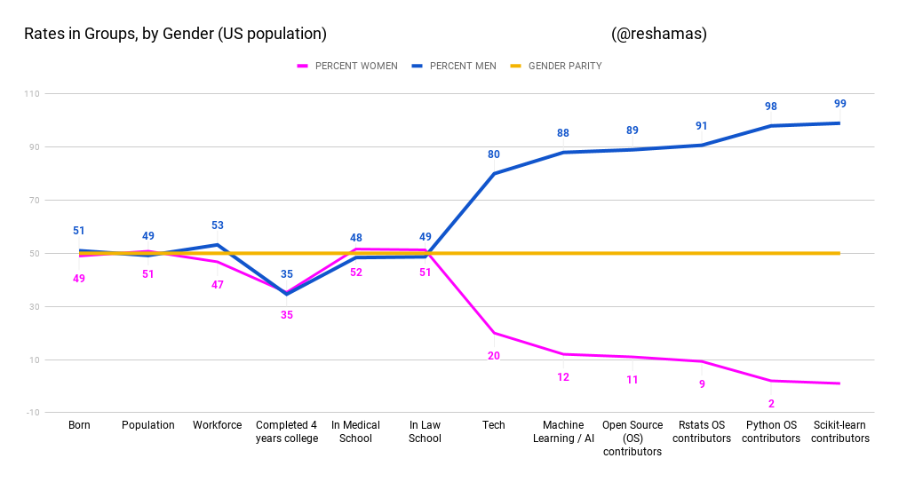
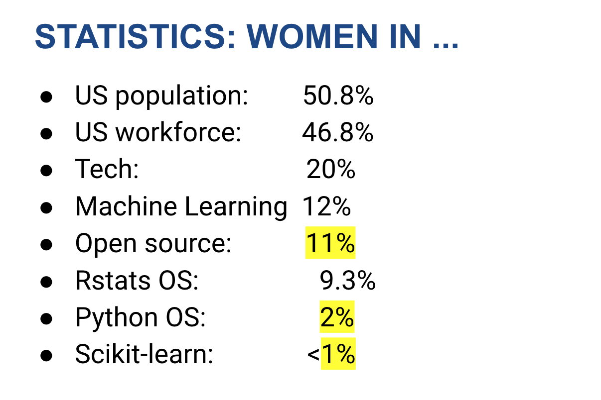

# The Gender Imbalance in Tech

## Background

The above visualization was inspired by a table that I had presented to a company to obtain sponsorship for supporting open source sprints for scikit-learn for the Women in Machine Learning & Data Science meetup chapters in May 2019.  I was unsucessful in obtaining that sponsorship, and considered that a visualization may convey the message more poignantly than numbers in a table.  

## References

- [Ratio of Male/Female births, 1983 to 2008, in the United States](https://www.infoplease.com/us/births/births-sex-and-sex-ratio)
  - for year 2008: ratio is 1.05 for Male/Female
  - Source:  Infoplease
- [Population Distribution by Gender in the United States](https://www.kff.org/other/state-indicator/distribution-by-gender/?currentTimeframe=0&sortModel=%7B%22colId%22:%22Location%22,%22sort%22:%22asc%22%7D)
  - for year 2017: 49% male, 51% female
  - Source:  Kaiser Family Foundation
- [Women in the US Labor Force in 2010](https://www.dol.gov/wb/factsheets/qf-laborforce-10.htm)
  - for year 2010:  Women comprised 47 percent of the total U.S. labor force
    - Source:  US Department of Labor
  - for year 2018: 46.9% 
    - >In 2018, there were 75,978,000 women aged 16 and over in the labor force, representing 46.9% of the total labor force
    - >In 1999, Women’s labor force participation rate peaked at 60.0%
    - >2024 to 2060:  It is projected to be 55.4% in 2024 and 51.9% in 2060
    - >Men’s labor force participation rate has decreased since the 1940s. It is projected to be 66.1% in 2024 and 62.3% in 2060
    - Source:  [Catalyst](https://www.catalyst.org/research/women-in-the-workforce-united-states/) and BLS (Bureau of Labor Statistics)

- [Completion Rates for College](https://www.catalyst.org/research/women-in-the-workforce-united-states/)
  - for year 2017:  women earned 57.3% of bachelor's degrees
    - Source:  [Catalyst](https://www.catalyst.org/research/women-in-the-workforce-united-states/) and BLS (Bureau of Labor Statistics)
- [Percentage of the U.S. population who have completed four years of college or more from 1940 to 2018, by gender](https://www.statista.com/statistics/184272/educational-attainment-of-college-diploma-or-higher-by-gender/)
  - 2018 Female vs Male:  35.3% vs 34.6%
  - Source:  Statistica via US Census Bureau
- [Women Were Majority of U.S. Medical School Applicants in 2018](https://news.aamc.org/press-releases/article/applicant-data-2018/)
  - 2018:  women matriculants were 51.6%; men matriculants 48.4%
  - Source:  AAMC (Association of American Medical Colleges)
- [Women Now Outnumber Men in Law Schools](https://www.bestlawyers.com/article/women-now-outnumber-men-in-law-school/2029)
  - 2018:  51.3% women enrolled in law school
  - Source:  ABA (American Bar Association)
- [Women in Tech](https://www.evia.events/info-women-in-technology)
  - 2015:  25%  ( [NCWIT](https://www.ncwit.org/sites/default/files/resources/womenintech_facts_fullreport_05132016.pdf))
  - 2016-2017 (?):  20%  (Source:  Evia)
- [AI is the Future But Where are the Women?](https://www.wired.com/story/artificial-intelligence-researchers-gender-imbalance/)
  - 2017:  12% women
  - Source:  Wired worked with Montreal startup Element AI
  - category is ML (machine learning) and AI (artificial intelligence)
- Open Source
  - 2017:  5% (Source:  [GitHub](https://www.wired.com/2017/06/diversity-open-source-even-worse-tech-overall/))
  - Source:  [Is Open Source Open to Women?](https://www.toptal.com/open-source/is-open-source-open-to-women)
  
  

## Contact
My email is reshama at wimlds dot org.

