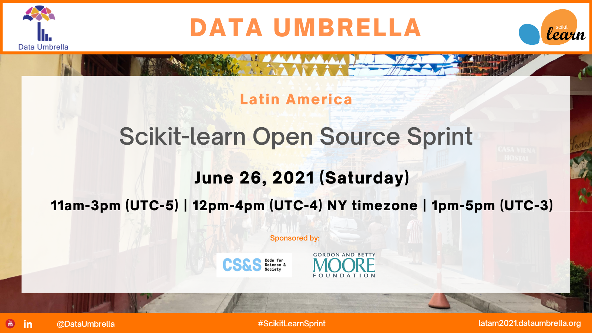
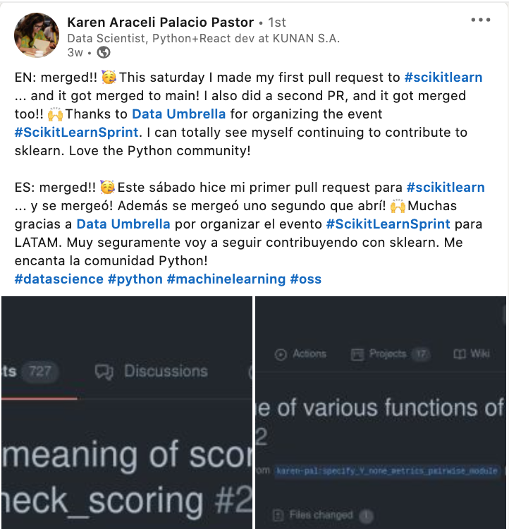

   

   

## Sprint Background
This "sprint" is a hands-on hackathon where participants learn to contribute to scikit-learn, a widely-used Python open source, machine learning library.

This sprint was organized by [Data Umbrella](https://www.dataumbrella.org) to increase the participation of underrepresented persons in data science, with a focus on the geographic region of Latin America (LATAM).  

This report focuses on the summary, impact and lessons learned of the Data Umbrella LATAM scikit-learn sprint.  

## Event Sponsor
This event was funded in part by a grant from Code for Science & Society, made possible by grant number [GBMF8449](https://www.moore.org/grant-detail?grantId=GBMF8449) from the Gordon and Betty Moore Foundation.

  
   

## Continued Contribution to Open Source
This sprint was a 4-hour block of time with pre- and post-sprint work required.

Participants were encouraged to keep contributing to scikit-learn or other Python libraries, using the skills learned in this event.

## Sprint Agenda
- 19-Jun-2021:  Pre-sprint Kickoff (11am - 1pm) (UTC-5)
- 26-Jun-2021:  Sprint  (11pm to 1pm) (UTC-5) 
- 10-Jul-2021:  Sprint Follow-up Office Hours (11am to 12pm) (UTC-5)

[a] UTC-5 = São Paulo, Brazil Time  

### Sprint Day
The sprint officially ran 4 hours, which is limited time to submit a PR.  The participants continued to work on their sprint PRs throughout the weekend.

### Follow-up Office Hours
Office hours were set up 2 weeks after the sprint where some of the scikit-learn core contributors were available to answer questions on open PRs.  

## Demographics

 

A total of 31 contributors attended the sprint. 12 of 31 (39%) identified at female or non-binary.  18 of 31 (58%) identified as male.  

Contributors joined from 14 different countries.  Country information was provided based on where participants were joining from. Saudi Arabia, Kenya and Nigeria had the most participants, for a total of 16 of 31, almost 55%.

 Other countries represented include Morocco, South Africa, Ghana, Iran, Congo, Malawi, as well as Sweden and France.

Given the migration in the region, these other countries were also represented in terms of contributor background:  Sudan, Turkey, Syria. 

There were two invited contributors, joining from India and Germany.  Invited contributors were those who participated in a prior sprint and have continued contributing to scikit-learn.  They were paired with a new contributor.  

### Applications Received
The countries in the Latin America region with the most applicants are:  
- Brasil: 36
- Argentina: 26
- Colombia: 11
- Venezuela:  9
- Mexico:  5
- Peru: 3
- Ecuador: 3
- Chile: 2
- Bolivia: 1
- Costa Rica: 1
- Guatemala: 1

Applications from regions outside of Latin America include: 
- United States: 10 
- India: 7 
- Canada: 2 
- Germany: 2 
- Spain: 2 

Other countries with 1 application each: Australia, Greece, Poland, Romania, Saudi Arabia, United Kingdom.

### Spoken Languages
All communication was in English. All participants felt comfortable conversing in English. Languages spoken by participants included:  English, Arabic, French, Kishwahli, Persian, Hindi, Urdu, Turkish and German.

### Open Source Background
Two-thirds of participants identified as having "none" or "beginner" level experience in contributing to open source.

### Number of Participants
- Pre-sprint event:  ~ 29
- Sprint:  ~ 40
- Post-sprint event:  12

## Impact Report for Data Umbrella Scikit-learn Sprint

|                                       | Sprint 2021    |
|---------------------------------------|----------------|
| Report date                           | 19-Jul-2021    |
| Report author                          | Reshama Shaikh   |
| Sprint date                           | 26-Jun-2021    |
| Location                              | Online; Latin America (LATAM)         |
| Sprint website | [latam2021.dataumbrella.org](https://latam2021.dataumbrella.org) |
| Twitter | [Moment](https://twitter.com/i/moment_maker/preview/1409666048144596996) |
| Open source library                   | [scikit-learn](https://github.com/scikit-learn/scikit-learn) |  
| GitHub repository link                | [data-umbrella/data-umbrella-scikit-learn-sprint](https://github.com/data-umbrella/data-umbrella-scikit-learn-sprint)| |
| Organizers      | [Reshama Shaikh](https://twitter.com/reshamas) & [Mariam Haji](https://www.linkedin.com/in/mariamhaji/)    |
| Helpers      | Cristina Mulas Lopez, Sara El-Ateif   |
| Lead Facilitator    | [Andreas Mueller](https://twitter.com/amuellerml) |
| Mentors / Translations | Melissa Mendonca Weber, Cristian Ferreira, Michael Eickenberg  |  
| Scikit-learn core contributors    | Thomas Fan, Adrin Jalali, Guillaume LeMaitre  |  
| Invited Contributors | Maren Westerman |
| Teaching Assistants  | None |
| Platforms            | Discord & Zoom |
| Sponsor: | Grant [GBMF8449](https://www.moore.org/grant-detail?grantId=GBMF8449) from [Gordon and Betty Moore Foundation](https://www.moore.org) & [Code for Science and Society](https://eventfund.codeforscience.org)   |
|            |                |
| PULL REQUESTS **(PRs)**                 |          |
| PRs [MRG] at sprint            | 7             |
| PRs [MRG] post-sprint            | 3             |
| PRs open                    | 9        |
|                                    |          |
| Attendees:  Initial Registrations  | 45       |
| Attendees:  Participated           | ~ 31     |
| Attendee List                      | [Sprint Contributors](https://afme2021.dataumbrella.org/contributors)   |
|                                    |          |
| Post-sprint Survey                 | [survey form] (closed) 
| Blog: by Fortune Uwha               | [First Time Contributor to Open Source — Data Umbrella Scikit-learn Virtual Sprint February 2021](https://fortune-uwha.medium.com/first-time-contributor-to-open-source-data-umbrella-scikit-learn-virtual-sprint-february-2021-362208ba0710) |

## Resources for Contributing to scikit-learn 
Because this was a virtual event and there is a limited capacity for being online for a full 8-hour day, a checklist was provided so folks could do preparation work at their own pace prior to the sprint.  

### Videos
Here are some videos in a [playlist](https://www.youtube.com/playlist?list=PLBKcU7Ik-ir-b1fwjNabO3b8ebs9ez5ga) that provide useful information on contributing to scikit-learn.

   

### Checklist
Here is a [Checklist](https://docs.google.com/document/d/1uOnNUVs7Y-c3-CC4IEf42j8TSlP-UNFb53_lQZBvXEg/edit?usp=sharing) to begin contributing to scikit-learn.  Interested contributors can organize their own sprint, work with a pair programming partner or work on their own.  Click on the image and it will link to a document that can be copied and edited for individual use.

   

## Impact

### Non-measurable Impact
Aside from the number of PRs that were merged, there is non-quantifiable impact of the open source sprint. Some examples include:
- learning to set up virtual environment
- using Git (fork, clone, branch, fetching another's PR)
- introduction to tests such as:  flake8 (linting, formatting), pytest, "continuous integration"
- navigating through the codebase structure of scikit-learn
- digging into functions, learning about errors
- learning about unit tests
- interacting with contributors on GitHub
- learning, in general
- networking
- building confidence (making a dent in "imposter syndrome")
- having fun

### Documentation Impact
These are the statistics for the videos that are considered documentation:    
1.  Andreas Mueller: [Crash Course in Contributing to scikit-learn](https://youtu.be/5OL8XoMMOfA) 
  - Jan 1, 2021: 1100   
  - Mar 1, 2021: 1600  (+500 views)
1.  Reshama Shaikh:  [Example of scikit-learn Pull Request](https://youtu.be/PU1WyDPGePI) 
  - Jan 1, 2021: 545 
  - Mar 1, 2021: 745   (+200 views)
1.  Andreas Mueller: [Sprint FAQs](https://youtu.be/p_2Uw2BxdhA) 
  - Mar 7, 2021: 398
3.  Reshama Shaikh: [Intro to Discord](https://youtu.be/w2A8SknM-68) 
  - Mar 7, 2021: 99 

Sprint outreach can be considered an impact.  Even if folks do not attend or apply, the sprint outreach brings more visibility and interest to the project.

## Contributing to Other Libraries Post-Sprint
One sprint participant used his open source skills to contribute to another Python library.

   

## Event Outreach

This [LATAM sprint tweet](https://twitter.com/DataUmbrella/status/1394661734275821573)
 had 80K+ impressions and 160+ link clicks:

  
      </a>

This [LATAM LinkedIn post](https://www.linkedin.com/feed/update/urn:li:activity:6800434144624070656/)
 had 3200 impressions and 50 reshares:

  
      </a>

Google Analytics shows the reach of our marketing efforts:  

  

  

  

## Challenges

### Videos
The videos that were created can be quickly outdated compared to static print. Videos are more accessible, but also take more effort to create.

Some of the video content created is outdated.  A few of the following items need to be updated:  
- branch on GitHub repo changed from `master` to `main` in January 2021
- instructions for setting up virtual environment has been updated in the past year
- 

## Adjustments for Next Sprint

### Reviewing Pull Requests
Reviewing PRs will also be added on the list of issues that the sprint participants can work on. 

For sprint attendees who have submitted a PR, then can review other contributor's PRs and provide feedback.  

### Video: Reviewing PRs
Create a video that shows how contributors can review PRs with tips.  

### scikit-learn branch: "master" to "main"
Include a note that scikit-learn has changed their default branch name from "master" to "main".  Currently all the videos and documentation refer to "master."

### Applicant Attrition
We typically observe 10% no-show rates for this type of online event.  For this event it was much higher.  For future sprints, we will do more outreach, aim for more applications so that overall turnout is about 40 attendees.

### #DataUmbrella Hashtag 
Reminder to sprint participants to include this hashtag #DataUmbrella on their pull requests so we can track them.

### Post any questions on #help_queue channel on Discord
A number of sprint participants were waiting alone at their virtual table.  They did not proactively join the #help_queue channel to let us know their pair programming partner was not present.  We should include a reminder for this in our email communications and intro presentation.

### Time of Event
Due to availability of the lead organizer and scikit-learn core contributor, the sprint began at 8am WET (Western European Time), which was 8am Nigeria / West Africa time.  That is likely too early for a Saturday event.  Schedule event so focused participants begin at 9am or 10am at the earliest.

## Sprint Feedback

Feedback has been shared a number of ways:  
- Twitter [Moment](https://twitter.com/i/events/1358408128753238017)
- Blogs
- Sprint survey
- Social media (LinkedIn)
- Casually, in conversation during the sprint, pre-sprint and post-sprint events

## Data Umbrella Feedback Survey
Data Umbrella received 21 responses to our internal sprint survey. (21/31 = 68% response rate).

Respondents rated their overall sprint experience highly favorably and had a positive experience working with their pair programming partner.  

In response to the question "*What are your favorite parts about the sprint?*"  
>- Pair programming
>- Getting to directly interact with sklearn's core contributors.
>- Working on issues and collaborating with my partner.
>- The amazing feeling of being part of a large community that cares.
>- Meeting people from different countries
>- Overall good arrangement + the presence of core-contributors to support through the whole process from setting the development environment to submitting and merging a PR
>- Meeting new people and getting to know core team 
>- Getting to meet the core contributors to sckit-learn. So helpful and friendly!
>- Pair programming, an Excellent sprint strategy
>- The communication with my pair programming partner
>- The community is great and friendly 
>- The pair programming and the feedback session with the core developers
>- There was ample knowledge to start working on things. It was very easy to get going with the shared information.
>- Working on an issue with a partner alongside a contributor. I got a better perspective on working on issues.
>- Getting help from the core contributors/developers and learning from my programming partner
>- discussing details of technical problems and solutions in small groups on discord / github

Some general feedback in the survey:  

>- I had a very good pair programming partner from a different country and profession. The sprint was planned very well. I definitely would love to participate in more of such sprints.
>- The experience was amazing and worth it I really learnt a lot and hopefully to keep up on working on more OS. Love the diversity and networking that comes along with am proud to have collaborated with my pair and contribution on the OS thank you for the great platform.

One suggestion for improvement:  
>- *Have single comprehensive source of information for preparing the environment.*

### Social Media

## Sprint:  Social Media

<blockquote class="twitter-tweet">
The <a href="https://twitter.com/DataUmbrella?ref_src=twsrc%5Etfw">@DataUmbrella</a> Latin America (LATAM) <a href="https://twitter.com/hashtag/ScikitLearnSprint?src=hash&amp;ref_src=twsrc%5Etfw">#ScikitLearnSprint</a> has kicked off!<a href="https://twitter.com/hashtag/python?src=hash&amp;ref_src=twsrc%5Etfw">#python</a> <a href="https://twitter.com/hashtag/datascience?src=hash&amp;ref_src=twsrc%5Etfw">#datascience</a> <a href="https://twitter.com/hashtag/oss?src=hash&amp;ref_src=twsrc%5Etfw">#oss</a> <a href="https://twitter.com/hashtag/machinelearning?src=hash&amp;ref_src=twsrc%5Etfw">#machinelearning</a>  With a great turnout.  First PR (#20367) has been submitted! <a href="https://t.co/opJdHtLXT7">pic.twitter.com/opJdHtLXT7</a>
&mdash; Reshama Shaikh (@reshamas) <a href="https://twitter.com/reshamas/status/1408841488482590721?ref_src=twsrc%5Etfw">June 26, 2021</a></blockquote> 

### Sofi 
<blockquote class="twitter-tweet">
Yeey tengo commits en el repo de sklearn!! ❤️  Acaban de mergear el PR que hicimos con <a href="https://twitter.com/DrGleeks?ref_src=twsrc%5Etfw">@DrGleeks</a> en el <a href="https://twitter.com/hashtag/ScikitLearnSprint?src=hash&amp;ref_src=twsrc%5Etfw">#ScikitLearnSprint</a>  🙌🏼   Mil gracias <a href="https://twitter.com/DataUmbrella?ref_src=twsrc%5Etfw">@DataUmbrella</a> por organizar el evento, estuvo muy bueno! <a href="https://t.co/WM7hvnMkqE">pic.twitter.com/WM7hvnMkqE</a>
&mdash; Sofi Denner (@sofide_) <a href="https://twitter.com/sofide_/status/1409594659429662720?ref_src=twsrc%5Etfw">June 28, 2021</a></blockquote> 

### Anavelyz
<blockquote class="twitter-tweet">
Alguien: Y... ¿qué es el open source?  Yo: Es la posibilidad de sumar y convertir pequeñas líneas de código en un proyecto fuerte que cambia constantemente para mejor...  ¡Gracias <a href="https://twitter.com/DataUmbrella?ref_src=twsrc%5Etfw">@DataUmbrella</a> y <a href="https://twitter.com/scikit_learn?ref_src=twsrc%5Etfw">@scikit_learn</a> por hacer posible nuestro primer Pull requests!<a href="https://twitter.com/hashtag/ScikitLearnSprint?src=hash&amp;ref_src=twsrc%5Etfw">#ScikitLearnSprint</a> <a href="https://t.co/mf8XDURzP5">pic.twitter.com/mf8XDURzP5</a>
&mdash; Anavelyz Perez (@AnavelyzJPR) <a href="https://twitter.com/AnavelyzJPR/status/1408969933149585408?ref_src=twsrc%5Etfw">June 27, 2021</a></blockquote> 

### Cristina 
<blockquote class="twitter-tweet">
Second <a href="https://twitter.com/hashtag/ScikitLearnSprint?src=hash&amp;ref_src=twsrc%5Etfw">#ScikitLearnSprint</a> done. Happy to be part of this family! <a href="https://twitter.com/hashtag/dataumbrella?src=hash&amp;ref_src=twsrc%5Etfw">#dataumbrella</a> <a href="https://twitter.com/hashtag/opensource?src=hash&amp;ref_src=twsrc%5Etfw">#opensource</a> <a href="https://t.co/rePO07cSSK">https://t.co/rePO07cSSK</a>
&mdash; CristinaMulas (@MulasCristina) <a href="https://twitter.com/MulasCristina/status/1408925138448535557?ref_src=twsrc%5Etfw">June 26, 2021</a></blockquote> 

### Jenn
<blockquote class="twitter-tweet">
Learning with <a href="https://twitter.com/DataUmbrella?ref_src=twsrc%5Etfw">@DataUmbrella</a> and <a href="https://twitter.com/hashtag/ScikitLearn?src=hash&amp;ref_src=twsrc%5Etfw">#ScikitLearn</a> about <a href="https://twitter.com/hashtag/machine?src=hash&amp;ref_src=twsrc%5Etfw">#machine</a> <a href="https://twitter.com/hashtag/learning?src=hash&amp;ref_src=twsrc%5Etfw">#learning</a> <a href="https://twitter.com/hashtag/OpenSource?src=hash&amp;ref_src=twsrc%5Etfw">#OpenSource</a> was a great experience! <a href="https://t.co/98wdS2ykgN">https://t.co/98wdS2ykgN</a>
&mdash; Jenn (@j3nnn1) <a href="https://twitter.com/j3nnn1/status/1408903045870665730?ref_src=twsrc%5Etfw">June 26, 2021</a></blockquote> 

### Maren
<blockquote class="twitter-tweet">
So happy to be part of another scikit-learn sprint. I&#39;m having a great time and am learning lots. 🙂👩🏼‍🎓 <a href="https://t.co/581dGmG7jk">https://t.co/581dGmG7jk</a>
&mdash; Maren Westermann (@MarenWestermann) <a href="https://twitter.com/MarenWestermann/status/1408884511195140096?ref_src=twsrc%5Etfw">June 26, 2021</a></blockquote> 

### Kardaver
<blockquote class="twitter-tweet">
yay! 🥳 my first PR merged to <a href="https://twitter.com/scikit_learn?ref_src=twsrc%5Etfw">@scikit_learn</a> , all thanks to <a href="https://twitter.com/hashtag/ScikitLearnSprint?src=hash&amp;ref_src=twsrc%5Etfw">#ScikitLearnSprint</a> organized by <a href="https://twitter.com/DataUmbrella?ref_src=twsrc%5Etfw">@DataUmbrella</a>  Go team LATAM!!!<a href="https://twitter.com/hashtag/python?src=hash&amp;ref_src=twsrc%5Etfw">#python</a> <a href="https://twitter.com/hashtag/datascience?src=hash&amp;ref_src=twsrc%5Etfw">#datascience</a> <a href="https://twitter.com/hashtag/oss?src=hash&amp;ref_src=twsrc%5Etfw">#oss</a> <a href="https://twitter.com/hashtag/machinelearning?src=hash&amp;ref_src=twsrc%5Etfw">#machinelearning</a> <a href="https://t.co/HV9JrA5C6B">pic.twitter.com/HV9JrA5C6B</a>
&mdash; kardaver (@kardaver2) <a href="https://twitter.com/kardaver2/status/1408849671959744514?ref_src=twsrc%5Etfw">June 26, 2021</a></blockquote> 

<blockquote class="twitter-tweet">
and a second PR merged! congrats for such a great event <a href="https://twitter.com/DataUmbrella?ref_src=twsrc%5Etfw">@DataUmbrella</a> Everyone was really helpful and welcoming at <a href="https://twitter.com/hashtag/ScikitLearnSprint?src=hash&amp;ref_src=twsrc%5Etfw">#ScikitLearnSprint</a>. I can totally see myself continuing to contribute to sklearn 🤩 love the community!<a href="https://twitter.com/hashtag/python?src=hash&amp;ref_src=twsrc%5Etfw">#python</a> <a href="https://twitter.com/hashtag/datascience?src=hash&amp;ref_src=twsrc%5Etfw">#datascience</a> <a href="https://twitter.com/hashtag/oss?src=hash&amp;ref_src=twsrc%5Etfw">#oss</a> <a href="https://twitter.com/hashtag/machinelearning?src=hash&amp;ref_src=twsrc%5Etfw">#machinelearning</a> <a href="https://t.co/xWpgReJT2T">pic.twitter.com/xWpgReJT2T</a>
&mdash; kardaver (@kardaver2) <a href="https://twitter.com/kardaver2/status/1408878315675525124?ref_src=twsrc%5Etfw">June 26, 2021</a></blockquote> 

### Andres
<blockquote class="twitter-tweet">
Learning how to <a href="https://twitter.com/hashtag/GivingBack?src=hash&amp;ref_src=twsrc%5Etfw">#GivingBack</a> to <a href="https://twitter.com/hashtag/opensource?src=hash&amp;ref_src=twsrc%5Etfw">#opensource</a> in <a href="https://twitter.com/hashtag/latam?src=hash&amp;ref_src=twsrc%5Etfw">#latam</a> whit <a href="https://twitter.com/DataUmbrella?ref_src=twsrc%5Etfw">@DataUmbrella</a> and <a href="https://twitter.com/scikit_learn?ref_src=twsrc%5Etfw">@scikit_learn</a>  🤓🐍❤<a href="https://twitter.com/hashtag/python?src=hash&amp;ref_src=twsrc%5Etfw">#python</a> <a href="https://twitter.com/hashtag/datascience?src=hash&amp;ref_src=twsrc%5Etfw">#datascience</a> <a href="https://twitter.com/hashtag/oss?src=hash&amp;ref_src=twsrc%5Etfw">#oss</a> <a href="https://twitter.com/hashtag/machinelearning?src=hash&amp;ref_src=twsrc%5Etfw">#machinelearning</a> <a href="https://t.co/FQFORF5zog">https://t.co/FQFORF5zog</a>
&mdash; Andres Rios (@ariosramirez) <a href="https://twitter.com/ariosramirez/status/1408875364701589504?ref_src=twsrc%5Etfw">June 26, 2021</a></blockquote> 

### Sebastian

<blockquote class="twitter-tweet">
¡Llegó el día! Comienza el <a href="https://twitter.com/hashtag/ScikitLearnSprint?src=hash&amp;ref_src=twsrc%5Etfw">#ScikitLearnSprint</a> de <a href="https://twitter.com/DataUmbrella?ref_src=twsrc%5Etfw">@DataUmbrella</a> con foco en Latinoamérica.
&mdash; Sebastian Flores (@sebastiandres) <a href="https://twitter.com/sebastiandres/status/1408817665137905667?ref_src=twsrc%5Etfw">June 26, 2021</a></blockquote> 

<blockquote class="twitter-tweet">
My first PR submitted to <a href="https://twitter.com/scikit_learn?ref_src=twsrc%5Etfw">@scikit_learn</a> during <a href="https://twitter.com/hashtag/ScikitLearnSprint?src=hash&amp;ref_src=twsrc%5Etfw">#ScikitLearnSprint</a> <a href="https://twitter.com/DataUmbrella?ref_src=twsrc%5Etfw">@DataUmbrella</a> :<a href="https://t.co/jdsTRUmCgI">https://t.co/jdsTRUmCgI</a>
&mdash; Sebastian Flores (@sebastiandres) <a href="https://twitter.com/sebastiandres/status/1408860077319196678?ref_src=twsrc%5Etfw">June 26, 2021</a></blockquote> 

### Pablo
<blockquote class="twitter-tweet">
First time at the <a href="https://twitter.com/DataUmbrella?ref_src=twsrc%5Etfw">@DataUmbrella</a> LatAm <a href="https://twitter.com/hashtag/ScikitLearnSprint?src=hash&amp;ref_src=twsrc%5Etfw">#ScikitLearnSprint</a>. <a href="https://t.co/S3hh8uH51B">https://t.co/S3hh8uH51B</a>
&mdash; Pablo Ibieta (@pabloibieta) <a href="https://twitter.com/pabloibieta/status/1408859492058603521?ref_src=twsrc%5Etfw">June 26, 2021</a></blockquote> 

### Mariela

<blockquote class="twitter-tweet">
Empezando el Latin America (LATAM) <a href="https://twitter.com/hashtag/ScikitLearnSprint?src=hash&amp;ref_src=twsrc%5Etfw">#ScikitLearnSprint</a> !!!!  🤓🥳🤓<a href="https://twitter.com/hashtag/Python?src=hash&amp;ref_src=twsrc%5Etfw">#Python</a> <a href="https://twitter.com/hashtag/MachineLearning?src=hash&amp;ref_src=twsrc%5Etfw">#MachineLearning</a> <a href="https://t.co/ZWQgaNyYXm">https://t.co/ZWQgaNyYXm</a>
&mdash; )*.*( (@mariela_rajng) <a href="https://twitter.com/mariela_rajng/status/1408842643736600585?ref_src=twsrc%5Etfw">June 26, 2021</a></blockquote> 

### Ludimila

<blockquote class="twitter-tweet">
Today is my first time contributing to open-source projects and starting contributing to sklearn makes me so happy cause it&#39;s a lib that changed everything in ML, thanks <a href="https://twitter.com/DataUmbrella?ref_src=twsrc%5Etfw">@DataUmbrella</a> for the opportunity <a href="https://twitter.com/hashtag/ScikitLearnSprint?src=hash&amp;ref_src=twsrc%5Etfw">#ScikitLearnSprint</a>
&mdash; Ludimila Carvalho (@ludigoncalves) <a href="https://twitter.com/ludigoncalves/status/1408815690111492099?ref_src=twsrc%5Etfw">June 26, 2021</a></blockquote> 

### JM

<blockquote class="twitter-tweet">
Last time I had some issues with my laptop during the The <a href="https://twitter.com/DataUmbrella?ref_src=twsrc%5Etfw">@DataUmbrella</a> Latin America (LATAM) <a href="https://twitter.com/hashtag/ScikitLearnSprint?src=hash&amp;ref_src=twsrc%5Etfw">#ScikitLearnSprint</a>, but today I&#39;m on about to do my first PR to <a href="https://twitter.com/scikit_learn?ref_src=twsrc%5Etfw">@scikit_learn</a> 🤞but first I&#39;ve to fix all the failing test :P <a href="https://t.co/LE6kpJKqFu">pic.twitter.com/LE6kpJKqFu</a>
&mdash; J. M. N√°poles (@napoles3D) <a href="https://twitter.com/napoles3D/status/1413933539750412288?ref_src=twsrc%5Etfw">July 10, 2021</a></blockquote> 

### Gloria

<iframe src="https://www.linkedin.com/embed/feed/update/urn:li:share:6819656217850347520" height="775" width="504" frameborder="0" allowfullscreen="" title="Embedded post"></iframe>

### Karen

   

#### note

[EN: merged!! 🥳 This saturday I made my first pull request to #scikitlearn ... and it got merged to main!](https://www.linkedin.com/posts/karen-pal_scikitlearn-scikitlearnsprint-datascience-activity-6815275979380940801-t5b0)
---

## Social Media Promotion

### Twitter (English)

<blockquote class="twitter-tweet">
🧵 📣Join us for our <a href="https://twitter.com/hashtag/ScikitLearnSprint?src=hash&amp;ref_src=twsrc%5Etfw">#ScikitLearnSprint</a>  👉🏽with a focus on Latin America (LATAM) 🗓️26-Jun-2021 🕙11am-3pm UTC-5 (CDMX) 12-4pm EDT (NYC) 1-5pm UTC-3 (Sao Paolo) 🏢 Online  Thank you to our sponsors: <a href="https://twitter.com/codeforsociety?ref_src=twsrc%5Etfw">@codeforsociety</a> &amp; <a href="https://twitter.com/MooreFound?ref_src=twsrc%5Etfw">@MooreFound</a>   Details on application: <a href="https://t.co/XkO2ytLKcH">https://t.co/XkO2ytLKcH</a> <a href="https://t.co/M1AWgXupPr">pic.twitter.com/M1AWgXupPr</a>
&mdash; Data Umbrella (@DataUmbrella) <a href="https://twitter.com/DataUmbrella/status/1394661734275821573?ref_src=twsrc%5Etfw">May 18, 2021</a></blockquote> 

### Twitter (Spanish)

<blockquote class="twitter-tweet">
en español <a href="https://t.co/UWvMD4Lrq2">https://t.co/UWvMD4Lrq2</a>
&mdash; Data Umbrella (@DataUmbrella) <a href="https://twitter.com/DataUmbrella/status/1398631578088116231?ref_src=twsrc%5Etfw">May 29, 2021</a></blockquote> 

### Twitter (Portuguese)

<blockquote class="twitter-tweet">
en pt_br (Brazilian Portuguese) 🇧🇷<a href="https://t.co/TMk1PL8EnA">https://t.co/TMk1PL8EnA</a>
&mdash; Data Umbrella (@DataUmbrella) <a href="https://twitter.com/DataUmbrella/status/1400168384722051076?ref_src=twsrc%5Etfw">June 2, 2021</a></blockquote> 

### LinkedIn (English)

<iframe src="https://www.linkedin.com/embed/feed/update/urn:li:share:6800434143978156032" height="670" width="504" frameborder="0" allowfullscreen="" title="Embedded post"></iframe>

### LinkedIn (Spanish)
<iframe src="https://www.linkedin.com/embed/feed/update/urn:li:share:6804481435530002432" height="857" width="504" frameborder="0" allowfullscreen="" title="Embedded post"></iframe>

### LinkedIn (Portuguese)

<iframe src="https://www.linkedin.com/embed/feed/update/urn:li:share:6808768331861118976" height="854" width="504" frameborder="0" allowfullscreen="" title="Embedded post"></iframe>

---

## Acknowledgments
- All the [scikit-learn core contributors](https://scikit-learn.org/stable/about.html) who mentored at the sprint and those who were online during the weekend afterwards to promptly review the submitted pull requests.

## Pull Request Statistics
- [PRs merged on sprint day](https://github.com/scikit-learn/scikit-learn/pulls?q=is%3Apr+is%3Amerged+pr%3Amerged%3A>%3D2021-02-06+pr%3Acreated%3A<%3D2021-02-07+%23DataUmbrella+): 7 (from AFME sprint)
    -  Query:  `is:pr is:merged pr:merged:>=2021-02-06 pr:created:<=2021-02-07 #DataUmbrella `
- [Open PRs](https://github.com/scikit-learn/scikit-learn/pulls?q=is%3Apr+is%3Aopen+pr%3Acreated%3A>%3D2021-02-06+pr%3Acreated%3A<%3D2021-03-01+%23DataUmbrella+): 9 (from AFME sprint)
    -  Query:  `is:pr is:open pr:created:>=2021-02-06 pr:created:<=2021-03-01 #DataUmbrella `
- [Open](https://github.com/scikit-learn/scikit-learn/pulls?q=is%3Apr+is%3Aopen++%23DataUmbrella+) (w/o date range): 10
    - Query: `is:pr is:open  #DataUmbrella`
- [Merged PRs](https://github.com/scikit-learn/scikit-learn/pulls?q=is%3Apr+is%3Amerged+created%3A>%3D2021-02-06+%23DataUmbrella+): 19 (>= 2021-02-06)
    - Query: `is:pr is:merged created:>=2021-02-06 #DataUmbrella`
- [Merged](https://github.com/scikit-learn/scikit-learn/pulls?q=is%3Apr+is%3Amerged+created%3A>%3D2021-02-06+%23DataUmbrella) (w/o date range): 79
    - Query: `is:pr is:merged #DataUmbrella`

---

## References
### Upcoming Sprints
- [List of Upcoming scikit-learn Sprints](https://github.com/scikit-learn/scikit-learn/wiki/Upcoming-events)

### Past Sprints
- [List of Past scikit-learn Sprints](https://github.com/scikit-learn/scikit-learn/wiki/Past-sprints) (scikit-learn wiki)
- [List of scikit-learn Sprints](https://reshamas.github.io/resources/scikit_learn_sprints/) (compiled by Reshama Shaikh)
- [scikit-learn Sprints Organized by Reshama Shaikh](https://www.dataumbrella.org/open-source/sprints)

---
## Addendum
- [no addendums or updates at the time of publication]