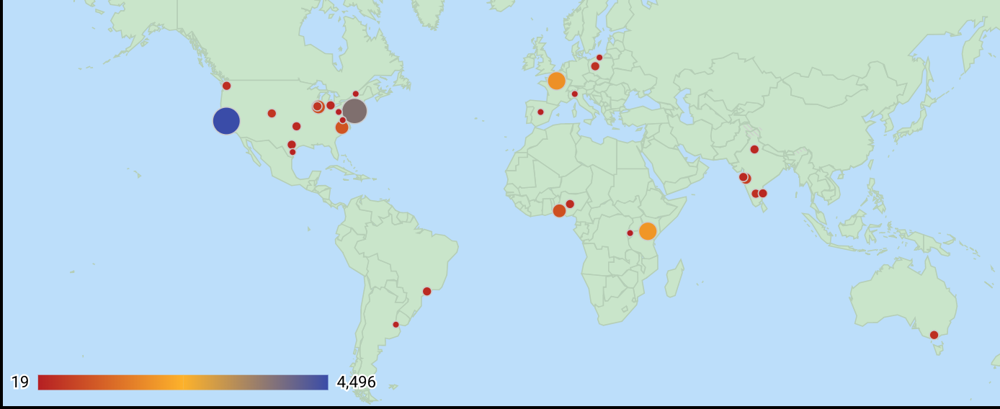

## Background

[WiMLDS](http://wimlds.org) is the acronym for "Women in Machine Learning & Data Science".  It was founded in 2013 by [Erin LeDell](https://twitter.com/ledell).  The first chapter of WiMLDS was in the [Bay Area](https://www.meetup.com/Bay-Area-Women-in-Machine-Learning-and-Data-Science/).

## Map of WiMLDS Chapters

<iframe width="800" height="600" src="https://datastudio.google.com/embed/reporting/1jwcw5flFvjGaTY-Lxh5ZLQg7H4dbV1xs/page/3hia" frameborder="0" style="border:0" allowfullscreen></iframe>

## WiMLDS Chapters:  USA & Canada

<iframe width="800" height="600" src="https://datastudio.google.com/embed/reporting/1jwcw5flFvjGaTY-Lxh5ZLQg7H4dbV1xs/page/Sjja" frameborder="0" style="border:0" allowfullscreen></iframe>

## WiMLDS Chapters:  Outside of North America

<iframe width="800" height="600" src="https://datastudio.google.com/embed/reporting/1jwcw5flFvjGaTY-Lxh5ZLQg7H4dbV1xs/page/shja" frameborder="0" style="border:0" allowfullscreen></iframe>

## Summary by Country

<iframe width="800" height="600" src="https://datastudio.google.com/embed/reporting/1jwcw5flFvjGaTY-Lxh5ZLQg7H4dbV1xs/page/rpja" frameborder="0" style="border:0" allowfullscreen></iframe>

## Data & Tools

### Data
- The statistics represented were updated October 2018.

### Tools
- Google spreadsheets were utilized to store the data.
- Google [Data Studio](https://datastudio.google.com/u/0/navigation/reporting) to produce the visualizations.

### Acknowledgments
- Special thanks to Elena Bakhtina for updating the statistics. 
