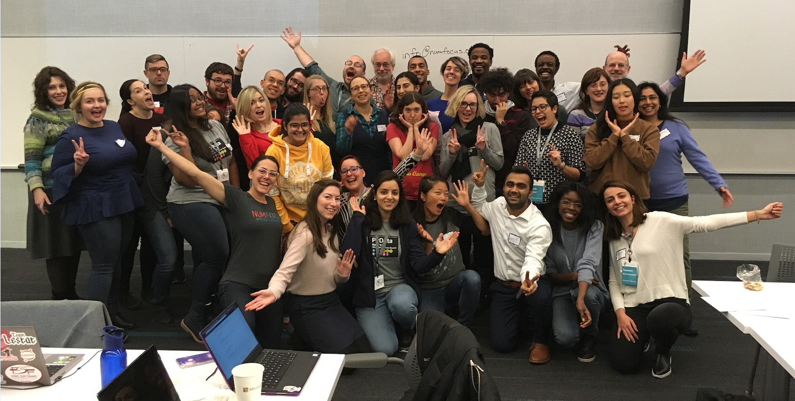
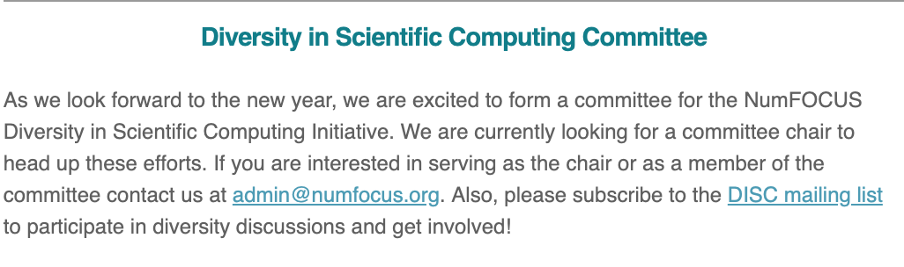
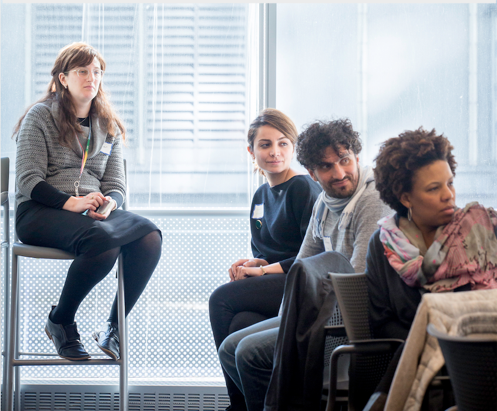
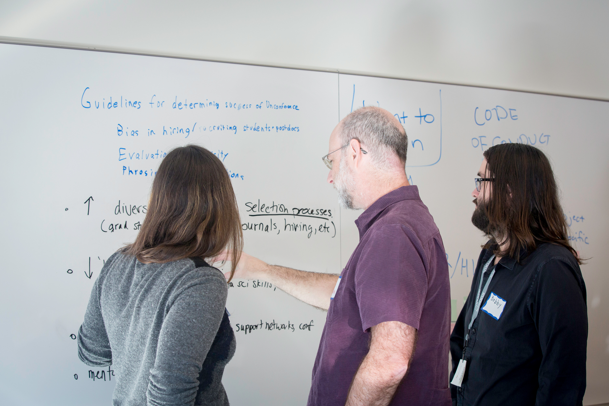
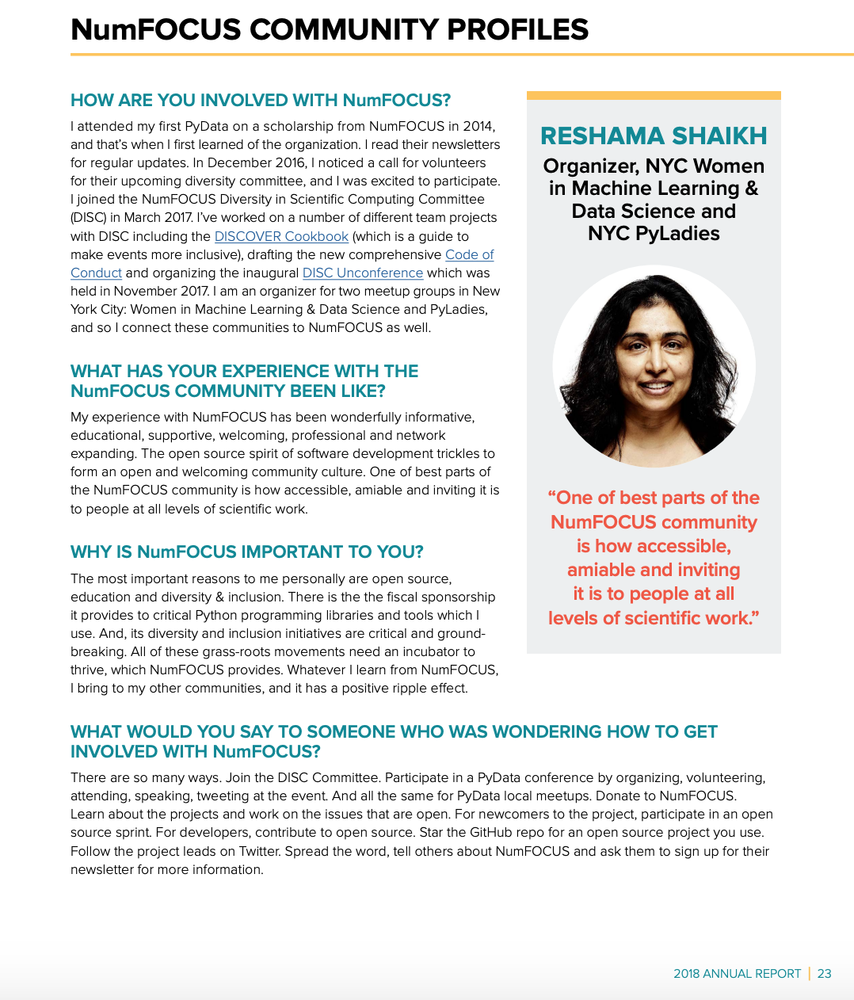

I served on the DISC Committee for a 2-year term from Spring 2017 to Spring 2019.  In this article I reflects on the past two years and what I have learned.  

## What is DISC?

[NumFOCUS](https://numfocus.org) is a 501(c)(3) based in Austin, Texas, and it supports open source software known as *projects*.  Some of those widely used open source projects include numpy, pandas, matplotlib, Jupyter, Stan and Julia. There is also a vibrant international [community of PyData meetup groups](https://www.meetup.com/pro/pydata/) with **120K members in 138 groups in 52 countries**.  They host meetup events as well as annual conferences in [various cities](https://pydata.org/events/).  

The NumFOCUS [2018 Annual Report](https://numfocus.org/blog/numfocus-releases-2018-annual-report) was released April 2019.

DISC is the [Diversity & Inclusion in Scientific Computing](https://numfocus.org/programs/diversity-inclusion) committee of NumFOCUS whose mission is to increase diversity in open source.   

Since this is an organization that supports open source, it is only fitting that DISC Committee [meeting minutes](https://wiki.numfocus.org/DISC_Committee_Meeting_Minutes) are all publicly available. 

## How I Learned of DISC

I first learned of the DISC Committee in the NumFOCUS [December 2016 newsletter](https://us9.campaign-archive.com/?u=c4bde6125a526b0fe180fdc3d&id=55cf91b886&e=50142b780f).  I applied, joined the [DISC mailing list](https://groups.google.com/a/numfocus.org/forum/#!forum/disc/join), and the committee officially kicked off in March 2017.  

## DISC Projects

We have monthly meetings that are 1 hour in duration and work on one or more projects.  Committee members generally volunteer 1 hour per week, although some members are involved in multiple committees or lead projects which require a greater number of hours.  

Initial projects included:
- **PyData Seattle 2017 DISC survey**:  worked in team to design survey to assess the conference, demographic background of attendees, diversity data and feelings of inclusion
- **Analyzing diversity (DISC) survey results**:  I analyzed the survey results using Python 
- **DISC Events Guide**: team member on committee to create a guide to inclusive events, which is also known as the [DISCOVER Cookbook](https://discover-cookbook.numfocus.org)
- [**November 2017 DISC Unconference**](https://pydata.org/nyc2017/diversity-inclusion/disc-unconference-2017/): in 3-person team which organized the inaugural unconference over a period of four months

### 2017 DISC Unconference

This 2-day unconference was held on November 29-30 at the Microsoft Conference Center in New York City.  

The Unconference Organizing Committee:
- [Gina Helfritch](https://www.linkedin.com/in/ginahelfrich/)
- [Reshama Shaikh](https://www.linkedin.com/in/reshamas/)
- [Julia Meinwald](https://www.linkedin.com/in/julia-meinwald-20287272/)

Planning began in August, and there was lots to do.  None of us had any prior experience organizing an unconference, so first we began research on that topic.  We designed the applications which went live in September.  Next, we scheduled and lead introductory video chats with participants in early November to get to know each other and set some agenda items for the unconference.

About 45 participants from United States, Europe and South America joined.  The 2-day event was succesful! The [breakout session projects ](https://github.com/reshamas/DISC-unconf-17) (or sub-committees) included:
- DISC events guide:  continuing the work started on this by DISC committee
- [Directory to increase diversity and inclusion](https://numfocus.org/blog/directory-increase-diversity-inclusion-notes-disc-unconference)
- [Getting started with open source](https://www.numfocus.org/blog/getting-started-with-open-source-notes-from-the-numfocus-disc-unconference/)
- [Diversity and inclusion conversation kit](https://www.numfocus.org/blog/starting-di-conversations-at-work-notes-from-the-disc-unconference/)
- [Inclusive Approaches to Recruitment & Outreach ](https://numfocus.org/blog/inclusive-approaches-to-recruitment-outreach-notes-from-the-disc-unconference)
- [Communicating feedback](https://numfocus.org/blog/getting-started-open-source-notes-numfocus-disc-unconference)
- Guidelines for ethical modeling
- Diversity metrics

I contributed to the **open source** and **communicating feedback** sub-committees. 

There is a [twitter list](https://twitter.com/NumFOCUS/lists/disc-unconference-2017/members) of some of the participants in the DISC Unconference, many of whom are affiliated with Software Carpentry organization.  

### Winter 2017-2018

Unconference participants wrote [blogs](https://numfocus.org/blog/directory-increase-diversity-inclusion-notes-disc-unconference) and did further work on the projects in the few months following the unconference.  

Through what I had learned at the DISC Unconference, I was inspired to write [Managing Our Code of Conduct](https://reshamas.github.io/managing-our-code-of-conduct/). 

#### Spring 2018

Nominations were open for new committee members to serve from [2018 to 2010](https://numfocus.org/blog/disc-committee-seeks-nominations-for-2018-2020-members).  The terms were staggered so that every 2 years there were not brand new committee members.  We created the application, reviewed and selected incoming members.  

#### Summer 2018

We spent the summer meetings researching and developing a Code of Conduct (CoC).  I learned so much during the entire process and was able to take that knowledge to the two meetup groups for which I am an organizer:  [NYC Women in Machine Learning & Data Science](https://www.meetup.com/NYC-Women-in-Machine-Learning-Data-Science/) (WiMLDS) and [NYC PyLadies](https://www.meetup.com/NYC-PyLadies/).

NumFOCUS [2018 Board of Elections](https://numfocus.org/blog/numfocus-to-hold-2018-elections-for-board-of-directors) were announced in July and [results were published](https://numfocus.org/blog/2018-numfocus-board-selection-results) in early September 2018.  DISC committee members, as supporter of NumFOCUS, were eligible to vote.

#### Fall 2018

I was so inspired by the creation and potential impact of the NumFOCUS CoC that, as a side project, I researched STEM organizations and their communities that could also be served by a CoC.  The article is [Code of Conduct for NeurIPS and Other STEM Organizations](https://reshamas.github.io/code-of-conduct-for-nips-and-other-stem-associations/).

Through my meetup group, WiMLDS, I had organized two open source sprints (in 2017 and 2018).  My related articles are [Highlights from the 2018 WiMLDS Scikit-learn Open Source Sprint](https://reshamas.github.io/highlights-from-the-2018-NYC-WiMLDS-scikit-sprint/) and [Impact Report for WiMLDS Scikit-learn Sprints](https://reshamas.github.io/impact-report-for-wimlds-scikit-learn-sprints/).  Through my experience with NumFOCUS, I was able to improve my sprint events as well as provide guidance to others who were organizing their own open source sprints.  

#### Winter 2018

In addition to the projects, DISC members as well as members of the general community who subscribe to the mailing list often post articles or topics of discussion.  DISC members also share NumFOCUS projects and announcements with our network such as Google Summer of Code, Julia Computing Call for Proposals and many more.  

#### Spring 2019

Nominations open for new chairs to serve a 2-year term from [2019 to 2021](https://docs.google.com/document/d/13OnU0yBDlqHMJg4MGQYg4NgN5j125KFPSgPAkzolmRQ/edit?usp=sharing).

## Takeaways

Reflecting back to the time when I first applied to join the DISC Committee, I am overwhelmed at the breadth of knowledge with which I am leaving.  I had thought that improving diversity meant counting the number of people from URGs at community events and increasing that number by telling people in my network to attend.  I now know that there is a deeper grassroots movement which requires awareness and improving attendee experience and creating an environment that is welcoming and safe in a number of dimensions to increase diversity.  This is achievable with the DISCOVER Cookbook and Code of Conduct.  

Participating in DISC did not seem like extra, separate work because all that I learned I was able to transfer knowledge to my other communities and projects.  I have successfully reached out to a number of conferences asking them to implement a Code of Conduct prior to promoting their events to my meetup community. I learned more about open source and the current contributors and funding challenges.  

## Who I Met
 
PyData photos on google drive:
https://drive.google.com/open?id=1CpJmpX2bpjc9ee2CY2A8xLJzTKQCP1_h

- my photos on iPhone

## What's Next?

I plan on remaining on the mailing list so I can keep up to date on all the upcoming progress that will be made by the DISC Committee!

## In Summary
I am featured as a community profile in the NumFOCUS Annual Report where I share my history and experience with NumFOCUS, as well as how others can get involved and support the organization.  

