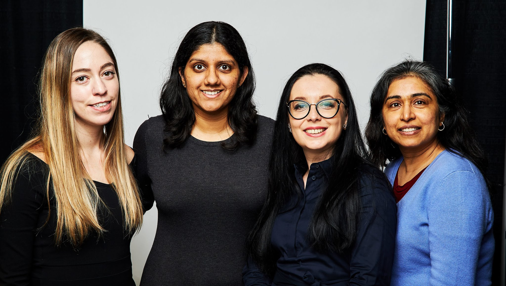

## Introduction and Background

I am an organizer for two New York city meetup groups:  [NYC Women in Machine Learning & Data Science](https://www.meetup.com/NYC-Women-in-Machine-Learning-Data-Science/) and [NYC PyLadies](https://www.meetup.com/NYC-PyLadies/).

I attended college in the 90’s and mentorship is not something that was discussed at the time.  In recent years, I *have heard* the discussion “find a mentor, you need a mentor to advance your career.”  

In early 2018, when I first began writing and when my [fastai_deep_learning](https://github.com/reshamas/fastai_deeplearn_part1) GitHub repository of documentation received increased traffic, I received numerous requests from readers around the world to be their mentor.  These requests encouraged me to think more closely about mentorship and the general expectations in the data science community.

## Survey on Mentoring

I held certain beliefs about asking for mentorship, but thought I would ask around and see what others thought prior to writing a blog.  In early 2019, I investigated this further by interviewing colleagues and conducting a [survey on mentoring](https://forms.gle/QpFFBd5tfMpvfwtN9).  The survey was distributed on Slack, Twitter and Linked and 50 people responded.  70% of respondents did not have a mentor, 55% had never been a mentor and 90% wanted to obtain a mentor.  **The demand for mentors is high; the supply is low.**  

## Definitions

This research elucidated that there are various understandings of what a “mentor” and the roles can be categorized primarily in four ways which are Mentor, Sponsor, Career Coach and Therapist.

### Mentor
- Provides advice, support and guidance
- Provides guidance on navigating work situations
- Offers feedback; provide constructive criticism
- Shares technical resources and expertise
- Helps to find solutions
- Shares different perspectives

### Sponsor
- Generally someone more senior and established in the field
- Opens up new opportunities for people
- Provides a connection to a valuable network of people and resources; provides introductions
- Advocates for them at work or other professional situations
- Provides opportunity for advancement to the next level

### Job / Career Coach
- Develops skills related to public speaking and networking effectively
- Action-oriented
- Provides guidance on emotional intelligence skills
- Advises on navigating political situations
- Managing stress

### Therapist / Psychologist
- Helps patients/clients make decisions and clarify feelings in order to solve problems
- Provides support and guidance

The good news is that depending on the support needed, the last two roles, career coaches and therapists, are people who can be hired and are accessible.  

## Avenues to Obtain Mentorship
These seem to be a few main avenues for obtaining mentorship:  
1. Work, formal programs
2. Work, informal connection
3. School
4. Outside of work; community

Large companies have structured, established programs.  For people who are seeking mentors, it is a good idea to work at a larger company.  

Also, when choosing a job, choose a boss over the company because your direct supervisor and your relationship with your manager has the greatest influence over the direction of your career.  

## What is the best way to find a mentor?
This is advice from others:
- Ask someone you know
- Ask someone you know to recommend someone

## Understanding the Demand for Mentorship

Mentorship is not something that was in the vocabulary back in the 90's. Looking back at the numerous companies where I worked, I was fortunate that at times, particularly earlier in my career, I had inspiring managers or colleagues who were knowledgeable, patient and generous with their time.  But, for the majority of organizations, my managers were generally unavailable and uncommunicative.  I think that could be due in large part to being in the field of statistics.  

I was continuously searching for a supporting manager, just as the elusive, non-existent "Fountain of Youth", there was an endless search for "Involved and Supportive Manager."

Traditionally, corporate America assigns managerial and leadership positions to those who have advanced degrees (preferably Ph.D.’s) and/or have attended top tier schools.  Rarely are they assessed on their management, leadership or communication expertise.  And yet, it is these skills that make a formidable and impactful leader.  Companies do not consider allocating these positions to managers who have the requisite "people skills."  There are a couple of ways that companies can address this paucity of skills:
1. Train managers --> not easy
2. Hire technical managers with good people managing and support skillset --> not easy
3. Create a position for managers to actually manage, that is non-technical.  Have 2 managers that can fulfill needs for technical and career support and advising.

Given the high cost of turnover, consider that this may actually be a cost-benefit to the company in retaining employees.

### Actionable Advice for Those Seeking Mentors
There are a plethora of articles out there about why mentorship is important, but a dearth of resources that delve deeper into successfully obtaining a mentor.  Until you find an official mentor, here is some advice.

**Look broadly for a mentor.**  It may seems like someone who is highly visible is a good person to ask, but imagine how busy they are.  Ask someone who is more available.

**Test the waters.**  Some people are interested in mentoring, and others are on the verge of burnout.  Find the right person.  

**Make SMART requests.** [SMART requests](https://hbr.org/2014/12/5-ways-to-get-better-at-asking-for-help) are:  
- **S**pecific
- **M**eaningful (why you need it)
- **A**ction-oriented (ask for something to be done)
- **R**eal (authentic, not made up)
- **T**ime-bound (when you need it)

Do not ask questions that are easily found via a Google search.

A potential and effective "mentor" will evaluate a request with the following criteria (from Adam Grant):
>Can I offer something of unique value to this person that will take me 5 minutes or less?” [low cost / high benefit ---> win / win]

**Be open to feedback and advice.** Do not ask for assistance and then ignore the recommendations that are offered.

**Reciprocity**  Just like any relationship, the ones that work best are two-way.  Find out what the need is on the other side and offer that.
>Remember that [reciprocity](https://hbr.org/2014/12/5-ways-to-get-better-at-asking-for-help) is a two-way street. Giving and taking are essential for individual success and positive cultures.

Offer something of value in return.  Ask what you can do first before making a request.

**Manage your expectations:**  You will still have to do the hard work.  Give up the idea of "Prince Charming."

## My Story on Mentorship
To share, I have never asked anyone to be my mentor.  I have no official mentor.  And yet, I feel abundandance in the resources available to me.  

This is my advice:

### Think Differently About Who a Mentor Could Be

You do not have to have a formal relationship with someone for them to be a mentor.  They can be people you see (on tv, at conferences, YouTube) or read.  

I have not yet met or spoken to Jeremy Howard.  Yet, I observed how he involved the community in contributing to fastai open source by his video lectures.  Last fall, when I was feeling overwhelmed with the WiMLDS meetup group as all 3 of my co-organizers were on maternity leave, it occurred to me that I could reach out to the WiMLDS community to get assistance for the events.  I learned from Jeremy without every meeting him or speaking with him.

### Something to be Learned from Negative Role Models

If you see behavior by someone which is not appealing, that is also educational.  We cannot control the behavior of others.  But, we can observe it and learn not to behave that way.  

One of my previous supervisors exhibited these traits:
- Lack of communication
- Treating people unfairly, playing favorites
- Being unavailable.  On the rare occasions I saw her at work, she began every conversation with “I am so busy, I am so overwhelmed at work….” That does not invite discussion.

With my meetup co-organziers, whom I have been mentoring for the past year, I have adopted the following behavior:
- Communicate regularly
- Communicate when I am away and unavailable by either emailing or blocking out my time away on a shared calendar
- Checking in regularly and asking:
>Asking:  “How are things going?  What is working well, what is not, and what can I help with?”
- Offer constructive feedback
- Explain decisions, the rationale, possible outcomes.

### Think Outside of Data Science:  "Transfer Mentorship"

A mentor does not have to be in data science.  One of my key confidants is a college friend who works in government, hundreds of miles away from me, doing non-quantitative work.  I often share workplace dilemnas with her via phone calls and her perspectives are insightful and useful.  

Just as in transfer learning, we can transfer knowledge from one machine learning task to another application, we can do the same in mentoring.

### Think All Genders

Men, women and gender minorities all offer uniquely valuable perspectives and a diversity of opinions.

### Think All Interaction
Anytime I interact with someone and I learn something, anything, from them, that is mentorship.  And the reverse holds as well.

### Read and Read More

These are all books that I have read and re-read.  I have physical copies of these books which are on my bookshelf, and which I often reference:
- Power, by Jeffrey Pfeffer
- Crucial Conversations; Tools for Talking When the Stakes are - High, Patterson, Grenny et al
- Micro Messaging, Stephen Young
- Getting Things Done, David Allen
- Your Job Survival Guide: A Manual for Thriving in Change, Gregory Shea
- How Google Works, Eric Schmidt & Jonathan Rosenberg
- Lean In, Sheryl Sandberg

### Observe

You can learn quite a bit from observation.  When you observe someone, whether on stage, in conversation, on video, in writing, observe what is appealing about that person and emulate it. Look at how they conduct themselves.  Ask yourself:
- What do I admire about them?
- What do they do well?
- How do they interact with others?  In person, in writing, on social media?

That is available to all of us without requesting a coffee meeting.

### Embrace (Negative) Feedback

While it can be instinctive to receive negative feedback, recognize that it can also be a powerful form of mentorship.  We do not have to agree with all feedback, but we can give it a chance.

### Put Some Effort Into It
People reach out on LI, twitter, because it’s so easy:
- low effort
- low risk
- thus, low return

Research what areas the person works in and see if there is something in common.  

### Open Sourcing Mentorship?

There has been discussion in data science community organizations about offering mentorship programs.  However, all of these organizations are operated primarily by volunteers who are already spread quite thin.  They include meetup organizers, conference organizers, open source contributors, educators and more.  It is recognized that there is a demand in the data science community for mentorship.  But, the problem with open source is that it is not really free.  They are products and services that are primarily created and maintained by volunteers.  There is a challenge in obtaining funding by corporations and donations by users.  So, if a Mentorship Program is offered, for free, someone is dedicating hours of their personal time for that.  

Conferences such as PyData, PyCon and others are primarily organized by volunteers.  If they were orgaized by a commercial organization, the registration prices would be exhorbitant and inaccessible to the majority of attendees.  

Personally, I think that offering mentoring services by the data science community is unsustainable.

### Get Involved in the Community / Volunteer
- help at meetups
- review conference proposals
- volunteer at conferences
- ask busy people what they need help with and offer to do those tasks
- contribute constructively to social media discussions in data science

## My Mentees

 

Do you seek mentorship and how do you successfully accomplish that?

I stick with SMART requests.  For example, if I create a slide presentation or write an application statement or CFP, I reach out to friends, acquaintances and individuals I have connected with at network events and ask if they can review it and provide feedback.

I am pretty straight with my requests.  Often I receive requests from people (with whom over a year has passed without any communication) where the first email begins with:

>I was just thinking about you the other day.  How are you?  It’s been a long time.  What’s new?

Then I respond, and they ask for something.  I really recommend being straight with people. 

>It’s been a long time since we have been in touch.  I have been up to xxx and wanted to ask you for yyy.

Be straight, be brief and to the point . 

Need commitment by mentor/mentee pair

Do you mentor?

Yes, new meetup co-organizers

---
## Contact

I encourage people to email me with questions: reshama@wimlds.org.  While I do not promise a response to every email, I do read them all and write blogs for the questions I receive over time.

## References

[5 Ways to Get Better at Asking for Help](https://hbr.org/2014/12/5-ways-to-get-better-at-asking-for-help), HBR

[What Does Sponsorship Look Like?](https://larahogan.me/blog/what-sponsorship-looks-like/), Lara Hogan

[Want a mentor? Stop asking for one.](https://hackernoon.com/want-a-mentor-stop-asking-for-one-cc4b12d8287a), Bethany Crystal

[Unable To Find The Right Mentor? Maybe You're The Problem
](https://www.forbes.com/sites/forbescoachescouncil/2016/10/11/unable-to-find-the-right-mentor-maybe-youre-the-problem/#7020420e3462), Becky Davis

[The Art of Mentoring](https://statgirlblog.wordpress.com/2018/08/28/the-art-of-mentoring/)

[The Importance of Sponsorship](http://hookedondata.org/The-Importance-of-Sponsorship/), Emily Robinson

[Building Your Data Science Network: Reaching Out
](https://robinsones.github.io/Building-Your-Data-Science-Network-Reaching-Out/)

[Men Are Afraid to Mentor Women. Here’s What We Can Do About It.
](https://www.linkedin.com/pulse/men-afraid-mentor-women-heres-what-we-can-do-adam-grant/), Adam Grant

[Give and Take](https://www.youtube.com/watch?v=-egUK2zaZlo) Adam Grant on YouTube

Lean In, Chapter 6: Will you be my mentor?, Sheryl Sandberg

[Why Men Still Get More Promotions Than Women](hbr.org/2010/09/why-men-still-get-more-promotions-than-women), HBR

[What Mentors Wish Their Mentees Knew](https://hbr.org/2017/11/what-mentors-wish-their-mentees-knew), HBR

[Data Science is Different Now](http://veekaybee.github.io/2019/02/13/data-science-is-different/), Vicki Boykis

---

<b>Note:  4 of the top 5 are English-speaking countries.</b>

## Coach

<blockquote class="twitter-tweet">
Jonathan Rosenberg quotes Bill Campbell:  A coach can  - see the things you can’t  - hear the things you can’t -SO you can be the person you want to be. <a href="https://twitter.com/hashtag/LeadershipDevelopment?src=hash&amp;ref_src=twsrc%5Etfw">#LeadershipDevelopment</a>
&mdash; Reshama Shaikh (@reshamas) <a href="https://twitter.com/reshamas/status/1118194936992751616?ref_src=twsrc%5Etfw">April 16, 2019</a></blockquote> 

<iframe src="https://www.linkedin.com/embed/feed/update/urn:li:share:6458278206884638720" height="713" width="504" frameborder="0" allowfullscreen="" title="Embedded post"></iframe>

<iframe src="https://www.linkedin.com/embed/feed/update/urn:li:share:6499438382450507777" height="404" width="504" frameborder="0" allowfullscreen="" title="Embedded post"></iframe>

## Tweets:  Getting Mentorship / Sponsorship
<blockquote class="twitter-tweet">
Great example of sponsorship: <a href="https://twitter.com/lara_hogan?ref_src=twsrc%5Etfw">@lara_hogan</a> wrote her first book after meeting an o’reilly editor at a conf. Editor didn’t just mentor her through the proposal process, she went to bat to help Lara get the contract. And now Lara’s written three books 🙌<a href="https://t.co/OzRPY6t2Z1">https://t.co/OzRPY6t2Z1</a>
&mdash; Emily Robinson (@robinson_es) <a href="https://twitter.com/robinson_es/status/1024736373645950977?ref_src=twsrc%5Etfw">August 1, 2018</a></blockquote> 

## Tweets:  Mentorship Leads

Vicki Boykis, [Data Science is Different Now](http://veekaybee.github.io/2019/02/13/data-science-is-different/)
>After fumbling on my own for a very long time, I’ve now been established in “data science” for the past 6 years, and, to serve as the mentor that I didn’t have, I’ve been answering emails and having coffee meetings with people looking for advice to get into data science.

Lana Garmire, Call for Mentors
<blockquote class="twitter-tweet">
Tweeps, I am looking for female academic mentors, who are: mothers + exceptionally successful senior faculty/scientists + heavy admin duties + advocate for women in STEM . Could you nominate someone? :)
&mdash; Lana Garmire (@GarmireGroup) <a href="https://twitter.com/GarmireGroup/status/1060385329260171265?ref_src=twsrc%5Etfw">November 8, 2018</a></blockquote> 

Emily Robinson, The Importance of Sponsorship
<blockquote class="twitter-tweet">
I’ve previously written about the importance of sponsorship, which is talked about a lot less often than mentorship, on my blog: <a href="https://t.co/pdc4FItg3Q">https://t.co/pdc4FItg3Q</a>.   And Lara has a great post on how to be a sponsor even when you’re not a manager: <a href="https://t.co/kcmU6543xS">https://t.co/kcmU6543xS</a>
&mdash; Emily Robinson (@robinson_es) <a href="https://twitter.com/robinson_es/status/1024755169383342090?ref_src=twsrc%5Etfw">August 1, 2018</a></blockquote> 

## Tweets:  by busy people
Understanding Why Mentors Are Not Available

Jeremy Howard, in [fastai Lesson 10](https://course18.fast.ai/lessonsml1/lesson10.html)
>You've got to be a bit careful, right? Because sometimes I get messages from random people saying "I've got lots of good ideas, can we have coffee?" I don't want to... you know, I can have coffee in my office anytime, thank you. But it's very different to say, hey, I took your ideas and I wrote a paper and I did a bunch of experiments and I figured out how your code works. They added documentation to it. Should we submit this to a conference? You see what I mean? There is nothing to stop you doing amazing work and if you do amazing work that helps someone else, like in this case, ok, I'm happy that we have a paper. I don't particularly care about papers. But, I think it's cool that these ideas now have this rigorous study. Let me show you what he did.

Cassie Kozyrkov
>If you're thinking about asking a stranger to #mentor you, it's a bit like asking a stranger to marry you.

<iframe src="https://www.linkedin.com/embed/feed/update/urn:li:share:6458278206884638720" height="713" width="504" frameborder="0" allowfullscreen="" title="Embedded post"></iframe>

Lisa Martinez of Google
>If you’re in the room, add value.

Bethany Crystal
>Like any meaningful relationship, mentorships are long-term, and loaded with mutual respect and benefits on both sides. They take time to cultivate and nurture.

Becky Davis
Becky Davis gives some blunt advice on mentorship in her article, [Unable To Find The Right Mentor? Maybe You're The Problem
](https://www.forbes.com/sites/forbescoachescouncil/2016/10/11/unable-to-find-the-right-mentor-maybe-youre-the-problem/#7020420e3462)

#### Do these
- Give before you get
- Build a relationship
- Commit to the process

#### Don’t do these
- Don’t use the word “mentor”
- Don’t ask a stranger
- Don't ask to pick their brain over coffee.
- Don't ask for their blueprint, roadmap or strategies to success.
- Don't give the victim story.
- Don't quit.

Ref:  https://dollarbillionaire.com/mentor/

Challenges to a successful mentorship (survey responses)

>Mentoring in a structured program is tough if the mentees don't take an active role by showing initiative and striving to grow.

>Finding time and commitment to the time is key to sustaining the mentorship relationship

>It's painful to the mentor when they do listen and can't perform, or when they easily have potential but won't listen. It's painful when people want to mentor you for everything except the thing you actually need.

>I had another mentor before, but both of us did not really know what to do. The first session was great but then we were not able to maintain a contact, because I did not have specific aims for that particular interaction. Also, many people are ok with being mentors, but have no clue how to do it.

Sheryl Sandberg Lean In | Chapter 5:“Are You My Mentor?”

>I realized that searching for a mentor has become the professional equivalent of waiting for Prince Charming

>The strongest relationships spring out of a real and often earned connection felt by both sides.

>Studies show that mentors select proteges based on performance and potential.  Intuitively, people invest in those who stand out for their talent or who can really benefit from help. 

>Mentors continue to invest when mentees use their time well and are truly open to feedback.  

>Peers can also mentor and sponsor one another.

<blockquote class="twitter-tweet">
Hi salaried people. Please don&#39;t get annoyed when a self-employed person sends you their rates in response to your invite to a 3.5 hour meeting where you want to &#39;share ideas&#39;. That&#39;s called consulting, and if I do it for free, I can&#39;t pay my rent. <a href="https://twitter.com/hashtag/freelancelife?src=hash&amp;ref_src=twsrc%5Etfw">#freelancelife</a>
&mdash; Laurie Winkless (@laurie_winkless) <a href="https://twitter.com/laurie_winkless/status/1023700573399314432?ref_src=twsrc%5Etfw">July 29, 2018</a></blockquote> 

<blockquote class="twitter-tweet">
We need to move away from this idea of “free mentoring”. It’s valuable time, especially for women who are already active in the community.  If people want mentoring, aka coaching, we should begin a conversation on compensation. <a href="https://t.co/ny8Q72CLPc">https://t.co/ny8Q72CLPc</a>
&mdash; Reshama Shaikh (@reshamas) <a href="https://twitter.com/reshamas/status/1060920991185059840?ref_src=twsrc%5Etfw">November 9, 2018</a></blockquote> 

<blockquote class="twitter-tweet">
Frankly, your description sounds like someone who wouldn’t or shouldn’t want to also take on the community service of mentoring a stranger. Sounds like a full plate to me.
&mdash; Mollie Manier (@maniermk) <a href="https://twitter.com/maniermk/status/1060522256130928641?ref_src=twsrc%5Etfw">November 8, 2018</a></blockquote> 

<blockquote class="twitter-tweet">
I agree, I already do approximately a hundred times more mentoring than I received from senior women.
&mdash; Anne Carpenter (@DrAnneCarpenter) <a href="https://twitter.com/DrAnneCarpenter/status/1061030140656918528?ref_src=twsrc%5Etfw">November 9, 2018</a></blockquote> 
