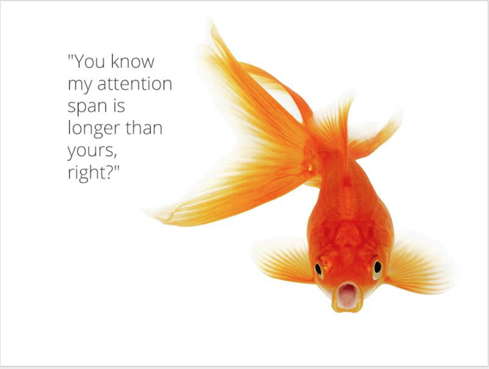

## Intro
*To what revolution are we referring?*  

## About [Women Techmakers](https://www.womentechmakers.com/)

Women Techmakers provides visibility, community, and resources for women in technology to drive participation and innovation in the field. They achieve this by hosting events, launching resources, and piloting new initiatives with communities and partners around the world. By joining Women Techmakers you'll receive regular emails with access to resources, tools and opportunities from Google and Women Techmakers partnerships to support you in your career.

>Filling out our membership form will ensure we're able to tailor offerings to your needs and interests, which we will send to you via email. If you have any questions or suggestions, please email the Women Techmakers team at wtmmembership@google.com.

## Participating in WTM

### Become a Member
[Join the movement](https://www.womentechmakers.com/membership)  
Membership empowers women in their careers by providing access to curated resources and events, as well as information and tools from Google, our partners, and the global tech ecosystem.  There is a [WTM form](https://services.google.com/fb/forms/joinwomentechmakers/) to join the program.

### Membership Statistics

- [@WomenTechmakers](https://twitter.com/WomenTechmakers)  on Twitter <a   style="color:red"><i> ⟶  </i></a>
<a   style="color:purple; font:italic"><b> 99.8K followers! </b></a>
- There are **43K** Women Techmaker **Members**, worldwide
  - the largest membership is in San Francisco, New York, London and Seattle
  - there are **550** Women Techmaker **Leads** around the world and in **69** countries

### Summit Information
Attendance for the summit was by invitation.  

- [WTM Summit Website](https://events.withgoogle.com/women-techmakers-leads-summit/)
- [Agenda](https://events.withgoogle.com/women-techmakers-leads-summit/schedule-v1/#content)
- Summit Social Media Hashtags
  - LinkedIn:  #NAWTMSummit18
  - Twitter: [#nawtmsummit18](https://twitter.com/search?q=%23nawtmsummit18&src=typd)

## Keynotes

| Speaker    | Role  | Twitter  |  
|----|----|----|
| [Kübra Zengin](https://www.linkedin.com/in/kubrazengin/) | Developer Relations Program Manager, **Google** | [@zenginkubraa](https://twitter.com/zenginkubraa) |
| [Lisa Martinez](https://www.linkedin.com/in/lisa-gilpin-48781b18/) | Global Head of News & Publishing Apps BD, **Google** |  |
| [Lauren Hasson](https://www.linkedin.com/in/laurenhasson/) | Founder of DevelopHer, Speaker, Engineer | [@laurenrhasson](https://twitter.com/laurenrhasson) |
| [Natalie Villabos](https://www.linkedin.com/in/natalievillalobos/) | Diversity and Inclusion Leader at **Google** | [@nataliaenvy](https://twitter.com/nataliaenvy) |
| [Melissa Muñoz](https://www.linkedin.com/in/melissa-munoz/) | Program Manager, **Google** Women Techmakers | [@Melrmoon](https://twitter.com/Melrmoon) |
| [Laura Gluhanich](https://www.linkedin.com/in/lauraglu/) | Program Manager, **Google** Women Techmakers | [@LauraGlu](https://twitter.com/LauraGlu) |
| [Komal Singh](https://www.linkedin.com/in/komals1/) | Program Manager, Engineering at **Google** | [@think_oid](https://twitter.com/think_oid) |
| [Regine Gilbert](https://www.linkedin.com/in/reginegilbert/) | Sr. UX Design Consultant, Educator, Speaker | [@reg_inee](https://twitter.com/reg_inee)  |
| [Tanya Valle](https://www.linkedin.com/in/tanyavalle/) | Coaching & Consulting, Public Speaker, Mindfulness Teacher | [@TanyaValle23](https://twitter.com/TanyaValle23) |
| [Jenn Schiffer](https://www.linkedin.com/in/jennschiffer/)  | Director of Community Engineering - Glitch   |   [@jennschiffer](https://twitter.com/jennschiffer) |
| [Jennifer Kohl](https://www.linkedin.com/in/jenkohl/) | Developer Relations Program Manager at **Google** | [@jen_kohl](https://twitter.com/jen_kohl) |
| [Nitya Narasimhan](https://www.linkedin.com/in/nityan/) | Senior Program Manager, Developer Relations at Microsoft | [@nitya](https://twitter.com/nitya) |
| [Jennifer Wadella](https://www.linkedin.com/in/jennifer-wadella-7985b46/) | Founder, President at Kansas City Women in Technology | [@likeOMGitsFEDAY](https://twitter.com/likeOMGitsFEDAY) |
| [Tina Arnoldi](https://www.linkedin.com/in/tinaarnoldi/) | Marketing Strategist, Performance Analyst - 360 Internet Strategy | [@TinaArnoldi](https://twitter.com/TinaArnoldi) |

### Slides
Here are links to slides, where available:  

#### Tina Arnoldi

#### Laura Hasson
Download the [Negotiation Framework](https://developher.com/resource/)

#### Nitya Narasimhan
[Why It Matters / How to Get There](http://bit.ly/2018-WTMSummit-Advocacy)

#### Jennifer Wadella
[Hacking Your Work Life](https://tehfedaykin.github.io/HackingYourWorkLife__Balance/#/title)

## My Favorite Takeaways

### Lisa Martinez:  "Big Little Truths"
Lisa has worked at Google for nearly 15 years, in various technologies.  She shared that at one point she went to work on Google AdWords because that was the "bread and butter" of the company, and she really wanted to understand it.  Her experience and wisdom were enlightening and inspiring.  These were my favorite shares from her talk:
- Trust your channels
  - that they have good intentions
  - always come from a good place
- Accept change, embrace change
- Invest in people, not projects
- Some men are heroes
- Let go of your Legos.  [Build a project and let it go.]
- Health is under-valued
- Reward yourself
- Word hard and be nice to people
- If you're in the room, add value
- Look for inspiring people around you

#### To Be Bold at Google Means
- Become a lifelong learner
- Accept failure
- Look for ways to make a difference
- Earn respect through work, not from a title
- Take risks

#### Presenting to High-level Executives
- The higher the executive, the briefer you need to be
- Know your numbers
- Lead *with* the data, but *you* tell the story!
- 3 key points
  - Here is where I am
  - Here is where I am stuck
  - Here is where I need help

#### Her advise to her younger self
Wish I had been more my authentic self.

### Lauren Hasson:  Become a Negotiat[Her]
Lauren is a full-time software engineer, and founded a company called DevelopHer to empower women to own their careers and negotiate their salaries.  She told a breathtaking story of how she was grossly underpaid relative to a less experience male co-working who she was training.  She did extensive research and **tripled her base salary** in less than 2 years!

My favorite takeway:
1.  Ground yourself in data!
  - data on salary
  - leverage data:  business needs & pain points
2.  Arm yourself with questions to handle pushback!
3.  Know when to walk away!

### Natalie Villalobos:  Women Techmakers Program & Updates
Natalie has been at Google for 9 years and is the Global Head of Women Techmakers.  

Natalie mentioned the phrase **"The revolution will not be televised"** as an analogy to empowering women where they are.  Women Techmaker leads are having a significant impact on their community at the grassroots level, and that activity, leadership and programming will have a ripple effect to impact a million women positively.  Women Techmakers will be the driver of that million with these 3 actions:
1.  Join
2.  Thrive
3.  Lead

### Tina Arnoldi:  A Digital Detox is Good for You - and Your Business
slides:  <a href="https://docs.google.com/presentation/d/17KKwUwdy5Xel3QrlsIFufVo73tB1cXdhv9tYAxIWtnM/edit#slide=id.p4"  style="color:orange; font:bold">Digital Well-Being</a>

  
   

Tina has had one of the most non-linear paths in tech.  She is a certified social worker who transitioned into tech.  Some great advice to manage our tech consumption in a more productive way:  
- Routine and habits are easier than willpower
  - keep email [and other browswer] tabs closed
  - use apps to limit social media use
  - set a timer for 25 minutes, then take a break, walk 
- **Voluntarily be bored** ---> that can stimulate creativity

---
 
swag

<blockquote class="twitter-tweet" data-lang="en">
Not bad. Not bad at all.  <a href="https://twitter.com/hashtag/NAWTMSummit18?src=hash&amp;ref_src=twsrc%5Etfw">#NAWTMSummit18</a> <a href="https://t.co/KHBmER1RSl">pic.twitter.com/KHBmER1RSl</a>
&mdash; Tina Arnoldi (@TinaArnoldi) <a href="https://twitter.com/TinaArnoldi/status/1051818284696424450?ref_src=twsrc%5Etfw">October 15, 2018</a></blockquote>

Neem Serra - baby tweet

<blockquote class="twitter-tweet" data-lang="en">
My baby is starting to hear this week, and I’m happy that some of the first things it’s hearing are all these strong, inspirational women at the <a href="https://twitter.com/WomenTechmakers?ref_src=twsrc%5Etfw">@WomenTechmakers</a> summit <a href="https://twitter.com/hashtag/NAWTMSummit18?src=hash&amp;ref_src=twsrc%5Etfw">#NAWTMSummit18</a>
&mdash; Neem Serra (@TeamNeem) <a href="https://twitter.com/TeamNeem/status/1051118909133344769?ref_src=twsrc%5Etfw">October 13, 2018</a></blockquote>

fun - GIF

<blockquote class="twitter-tweet" data-lang="en">
Having an amazing time at <a href="https://twitter.com/hashtag/NAWTMSummit18?src=hash&amp;ref_src=twsrc%5Etfw">#NAWTMSummit18</a> <a href="https://t.co/9EtoHlTJJ5">pic.twitter.com/9EtoHlTJJ5</a>
&mdash; 💎catface meowmers🔮 (@jordangee) <a href="https://twitter.com/jordangee/status/1051162698887639045?ref_src=twsrc%5Etfw">October 13, 2018</a></blockquote>

tweet: Word hard and be nice to people

<blockquote class="twitter-tweet" data-lang="en">
Work hard and be nice to people...it can go a long way <a href="https://twitter.com/hashtag/nawtmsummit18?src=hash&amp;ref_src=twsrc%5Etfw">#nawtmsummit18</a> <a href="https://t.co/QNnT2k7flg">pic.twitter.com/QNnT2k7flg</a>
&mdash; Trish Whetzel 🏳️‍🌈🇺🇲🇬🇧 (@TrishWhetzel) <a href="https://twitter.com/TrishWhetzel/status/1051102892197892098?ref_src=twsrc%5Etfw">October 13, 2018</a></blockquote>

Ara the book
<blockquote class="twitter-tweet" data-lang="en">
Hello New York! Excited to see <a href="https://twitter.com/AraStarEngineer?ref_src=twsrc%5Etfw">@AraStarEngineer</a> standing tall and happy at the Women Techmakers Leads Summit <a href="https://twitter.com/hashtag/nawtmsummit18?src=hash&amp;ref_src=twsrc%5Etfw">#nawtmsummit18</a>! Excited to talk about parallels between engineering and authoring. <a href="https://twitter.com/hashtag/nawtmsummit18?src=hash&amp;ref_src=twsrc%5Etfw">#nawtmsummit18</a> <a href="https://twitter.com/mad_sha?ref_src=twsrc%5Etfw">@mad_sha</a> <a href="https://twitter.com/Naveen__Nigam?ref_src=twsrc%5Etfw">@Naveen__Nigam</a> <a href="https://twitter.com/zenginkubraa?ref_src=twsrc%5Etfw">@zenginkubraa</a> <a href="https://t.co/KrYsVpfiR0">pic.twitter.com/KrYsVpfiR0</a>
&mdash; Komal Singh (@think_oid) <a href="https://twitter.com/think_oid/status/1051099494408957953?ref_src=twsrc%5Etfw">October 13, 2018</a></blockquote>

Natalie Env

<blockquote class="twitter-tweet" data-lang="en">
.<a href="https://twitter.com/nataliaenvy?ref_src=twsrc%5Etfw">@nataliaenvy</a> providing the state of the union of <a href="https://twitter.com/WomenTechmakers?ref_src=twsrc%5Etfw">@WomenTechmakers</a> - great news through WTM membership emails, WTM scholarships for learning and travel to tech summits and more. Awesome to hear of all the efforts! <a href="https://twitter.com/hashtag/nawtmsummit18?src=hash&amp;ref_src=twsrc%5Etfw">#nawtmsummit18</a> <a href="https://t.co/rXHLZw0Kao">pic.twitter.com/rXHLZw0Kao</a>
&mdash; Trish Whetzel 🏳️‍🌈🇺🇲🇬🇧 (@TrishWhetzel) <a href="https://twitter.com/TrishWhetzel/status/1051130063339573249?ref_src=twsrc%5Etfw">October 13, 2018</a></blockquote>

<blockquote class="twitter-tweet" data-lang="en">
&quot;Women Techmakers Program Updates&quot; by <a href="https://twitter.com/nataliaenvy?ref_src=twsrc%5Etfw">@nataliaenvy</a>, head of <a href="https://twitter.com/hashtag/WomenTechmakers?src=hash&amp;ref_src=twsrc%5Etfw">#WomenTechmakers</a> <a href="https://twitter.com/Google?ref_src=twsrc%5Etfw">@Google</a>.  <a href="https://twitter.com/hashtag/NAWTMSummit18?src=hash&amp;ref_src=twsrc%5Etfw">#NAWTMSummit18</a> <a href="https://twitter.com/hashtag/WomeninTech?src=hash&amp;ref_src=twsrc%5Etfw">#WomeninTech</a> <a href="https://t.co/rYnzQDpmHF">pic.twitter.com/rYnzQDpmHF</a>
&mdash; Margaret Maynard-Reid (@margaretmz) <a href="https://twitter.com/margaretmz/status/1051129431299948545?ref_src=twsrc%5Etfw">October 13, 2018</a></blockquote>

## Twitter Highlights

<blockquote class="twitter-tweet" data-lang="en">
Thanks to the 80+ Leads, GDEs, and community members that joined us for the <a href="https://twitter.com/hashtag/NAWTMSummit18?src=hash&amp;ref_src=twsrc%5Etfw">#NAWTMSummit18</a> today! It&#39;s been an incredible day of talks, ideas, and creativity 🙌🎉🗽 <a href="https://t.co/vPgXS9XEs0">pic.twitter.com/vPgXS9XEs0</a>
&mdash; Women Techmakers (@WomenTechmakers) <a href="https://twitter.com/WomenTechmakers/status/1051240425246392320?ref_src=twsrc%5Etfw">October 13, 2018</a></blockquote>

## References

- [The Revolution Will Not Be Televised](https://en.wikipedia.org/wiki/The_Revolution_Will_Not_Be_Televised)
  - [full lyrics](
https://www.google.com/search?q=lyrics+the+revolution+will+not+be+televised&oq=lyrics+the+revolution&aqs=chrome.0.0j69i57j0l4.3047j0j4&sourceid=chrome&ie=UTF-8
)

- [How Do We Stop Technology Addiction?](https://medium.com/s/story/how-do-we-stop-technology-addiction-c0c081b8c970)

