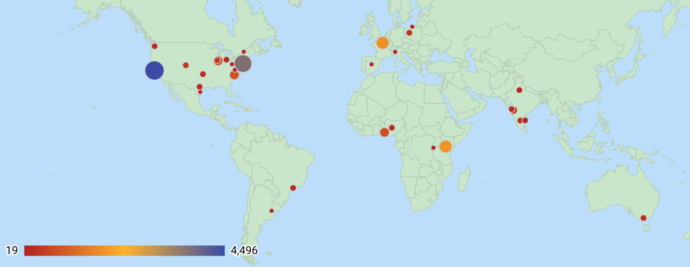

## Background
In October 2018, I was invited to the Google [Women Techmakers Leads Summit](https://events.withgoogle.com/women-techmakers-leads-summit/).   Attendance for the summit was by invitation to GDG (Google Developers Group) organizers and some tech community group leaders.  I am an organizer for the NYC chapters of Women in Machine Learning and Data Science (WiMLDS) and PyLadies.  I was curious to learn which of my favorite women-in-tech organizations were represented.  This prompted me to conduct further research on what I consider to be some of the most impactful and active women's meetup groups.  Luckily for me, all 6 of them have a chapter in NYC.

## Membership by Women-in-Tech Group

<iframe width="750" height="500" src="https://datastudio.google.com/embed/reporting/1GRHGgx6VnbmSbOWCbrLbzsZKys_-JmwY/page/qzrc" frameborder="0" style="border:0" allowfullscreen></iframe>

We can see from the pie chart that Women Who Code has the greatest percentage of members at an impressive 45%.  Girl Develop It comes in second at 30%.  The remaining 25% is comprised of the 4 groups:
- PyLadies:  ~10%
- R-Ladies:  8%
- WiMLDS:  5.5%
- Write/Speak/Code:  1.2%

<iframe width="750" height="500" src="https://datastudio.google.com/embed/reporting/1GRHGgx6VnbmSbOWCbrLbzsZKys_-JmwY/page/c9uc" frameborder="0" style="border:0" allowfullscreen></iframe>

## Data & Tools

### Data
- The statistics represented were updated November 2018.

### Tools
- Google spreadsheets were utilized to store the data.
- Source data is available in this [women-in-tech spreadsheet](https://docs.google.com/spreadsheets/d/105VtTjnMyhnqItMYORNxMkurb6essQN1xGW7RArjA-Q/edit?usp=sharing)
- Google [Data Studio](https://datastudio.google.com/u/0/navigation/reporting) to produce the visualizations.

---

## History

[WiMLDS](http://wimlds.org) is the acronym for "Women in Machine Learning & Data Science".  It was founded in 2013 by [Erin LeDell](https://twitter.com/ledell) in San Francisco, and the group hosts meetups.  This is the founding order of the chapters:
1.  [Bay Area](https://www.meetup.com/Bay-Area-Women-in-Machine-Learning-and-Data-Science/), Dec 2013
2.  [New York City](http://www.meetup.com/NYC-Women-in-Machine-Learning-Data-Science/), Oct 2014
3.  [Cary, North Carolina](https://www.meetup.com/NC-Women-in-Machine-Learning-and-Data-Science/ ), Feb 2016
4.  [Chicago, Illinois](https://www.meetup.com/NC-Women-in-Machine-Learning-and-Data-Science/), Mar 2016

Five years after the founding of WiMLDS, there are 30+ chapters worldwide in more than a dozen countries and 6 continents.  (Antarctica remains unrepresented.)  Total membership is 18K+.

## Mission
The mission of WiMLDS is to support and promote women and gender minorities who are practicing, studying or are interested in the fields of machine learning and data science.

## Map of WiMLDS Chapters

<iframe width="800" height="600" src="https://datastudio.google.com/embed/reporting/1jwcw5flFvjGaTY-Lxh5ZLQg7H4dbV1xs/page/3hia" frameborder="0" style="border:0" allowfullscreen></iframe>

## WiMLDS Chapters:  USA & Canada
The 4 chapters in North America with the greatest membership are, unsurprisingly:
1.  Bay Area (4.5K)
2.  New York City (3.7K)
3.  Cary, North Carolina (800+)
4.  Chicago, Illinois (750+)

<iframe width="800" height="600" src="https://datastudio.google.com/embed/reporting/1jwcw5flFvjGaTY-Lxh5ZLQg7H4dbV1xs/page/Sjja" frameborder="0" style="border:0" allowfullscreen></iframe>

## WiMLDS Chapters:  Outside of North America

The 5 chapters with the highest membership outside the USA are:
- Nairobi, Kenya
- Paris, France
- Lagos, Nigeria
- Pune, India
- Zurich, Switzerland

<b>Note:  France is where the Python library scikit-learn was developed.</b>

India has 5 chapters:
- Pune
- Bengaluru
- Mumbai
- Delhi
- Chennai

<iframe width="800" height="600" src="https://datastudio.google.com/embed/reporting/1jwcw5flFvjGaTY-Lxh5ZLQg7H4dbV1xs/page/shja" frameborder="0" style="border:0" allowfullscreen></iframe>

## Summary by Country
The 5 countries with the greatest membership are:
1.  USA
2.  Kenya
3.  France
4.  India
5.  Nigeria

<b>Note:  4 of the top 5 are English-speaking countries.</b>

<iframe width="800" height="600" src="https://datastudio.google.com/embed/reporting/1jwcw5flFvjGaTY-Lxh5ZLQg7H4dbV1xs/page/rpja" frameborder="0" style="border:0" allowfullscreen></iframe>

## Starting a New Chapter

<blockquote class="twitter-tweet" data-lang="en">
Interested in starting a women&#39;s <a href="https://twitter.com/hashtag/DataScience?src=hash&amp;ref_src=twsrc%5Etfw">#DataScience</a> or <a href="https://twitter.com/hashtag/MachineLearning?src=hash&amp;ref_src=twsrc%5Etfw">#MachineLearning</a> meetup in your city?  We&#39;d love to help!  Reach out at info@wimlds.org.
&mdash; Women+ in ML/DS (@wimlds) <a href="https://twitter.com/wimlds/status/667197958278934529?ref_src=twsrc%5Etfw">November 19, 2015</a></blockquote>

## Connecting with WiMLDS

### Twitter
Follow us on Twitter at [@wimlds](https://twitter.com/wimlds).  There is also a Twitter [list of chapters](https://twitter.com/wimlds/lists/wimlds-chapters/members). 

### Slack
We have a global Slack team for female and gender minority members of WiMLDS.  To join, send an email request to slack@wimlds.org with a brief note.

### Meetup Groups
A list of all chapters and their [meetup group links](http://wimlds.org/chapters/) can be found on our website.

## Data & Tools

### Data
- The statistics represented were updated October 2018.

### Tools
- Google spreadsheets were utilized to store the data.
- Google [Data Studio](https://datastudio.google.com/u/0/navigation/reporting) to produce the visualizations.
