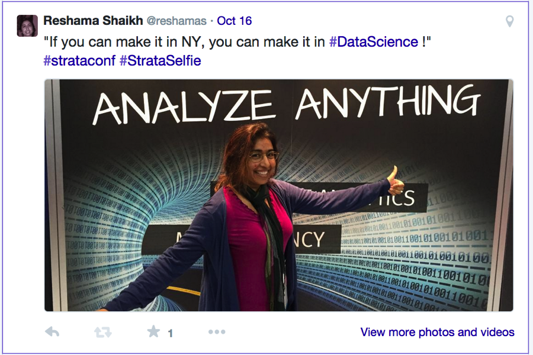

 

I attended the Strata + Hadoop World 2014 2-day conference in October for the first time.  It was held at New York city’s Javits Center, and it was organized by Cloudera and O’Reilly Media.  There were over 5000+ attendees from the following industries:  business, finance, media, fashion, retail, and government.  Numerous topics were covered including:  business & industry, data science, hadoop and security.

Each of the two days began with a 2-hour plenary session where prominent business people from large companies and startups presented.

## My favorites:

Rana el Kaliouby, co-founder and CSO of Affectiva, had an enlightening plenary session on human emotions, measurement and marketing.  Her company’s database includes 2 million facial images from 80+ countries.  These images are used to evaluate human emotions.  Since human emotions predict human behavior, this is extremely beneficial in marketing and other fields.

Julia Angwin of ProPublica presented on big data and privacy.  Her takeway:  privacy may ultimately be impossible, so let’s move to getting assurances in protecting our personal data.

## Software

### SAS
I spoke to the representative in the SAS booth and indicated that I was using SAS less frequently (since the license was so expensive), and instead I was using open source software such as python and R.  He informed me, to my great astonishment, that SAS is now offering a free download

### Revolution R
I also learned of Revolution R, which is an enhanced version of R (enhancements include multi-core processing and aid in managing R package versions for results which can be easily replicated).  It is available for free download.  The company also offers Revolution R Plus which is available for an annual subscription and includes technical support and training.  I was going to download and explore this software, but I recently upgraded to Yosemite on my mac, and this software has been tested on Mavericks.

### Tamr
Recently, a former classmate had posted on a community page about his need for software that could do text matching of similar names.  My initial recommendation was writing original regular expressions.  But, at this conference, I learned of Tamr, which does data curation.  I sent the information to him.  Hopefully, he will find it helpful.

Special thanks to NYC PyLadies and Strata Hadoop for sponsoring me. 

## Tweets
<blockquote class="twitter-tweet" data-lang="en">
Thank You <a href="https://twitter.com/Microsoft?ref_src=twsrc%5Etfw">@Microsoft</a> for t-shirt: In Datum Veritas | <a href="https://twitter.com/hashtag/BigData?src=hash&amp;ref_src=twsrc%5Etfw">#BigData</a> <a href="https://twitter.com/hashtag/DataScience?src=hash&amp;ref_src=twsrc%5Etfw">#DataScience</a> <a href="https://twitter.com/hashtag/python?src=hash&amp;ref_src=twsrc%5Etfw">#python</a> <a href="https://twitter.com/hashtag/Strataconf?src=hash&amp;ref_src=twsrc%5Etfw">#Strataconf</a> <a href="https://twitter.com/hashtag/Hadoop?src=hash&amp;ref_src=twsrc%5Etfw">#Hadoop</a> <a href="https://twitter.com/NYCPyLadies?ref_src=twsrc%5Etfw">@NYCPyLadies</a> <a href="http://t.co/WSBKig8ew0">pic.twitter.com/WSBKig8ew0</a>
&mdash; Reshama Shaikh (@reshamas) <a href="https://twitter.com/reshamas/status/522864129296449536?ref_src=twsrc%5Etfw">October 16, 2014</a></blockquote>

<blockquote class="twitter-tweet" data-lang="en">
.<a href="https://twitter.com/tinagroves?ref_src=twsrc%5Etfw">@tinagroves</a> <a href="https://twitter.com/IBMBigData?ref_src=twsrc%5Etfw">@IBMbigdata</a> : Culture, Slang &amp; Sarcasm make text analytics challenging     | <a href="https://twitter.com/hashtag/Stratconf?src=hash&amp;ref_src=twsrc%5Etfw">#Stratconf</a> <a href="https://twitter.com/NYCPyLadies?ref_src=twsrc%5Etfw">@NYCPyLadies</a> <a href="http://t.co/b2wvRtZblw">pic.twitter.com/b2wvRtZblw</a>
&mdash; Reshama Shaikh (@reshamas) <a href="https://twitter.com/reshamas/status/523139999567314944?ref_src=twsrc%5Etfw">October 17, 2014</a></blockquote>

<blockquote class="twitter-tweet" data-lang="en">
Live from NY: the Great Debate on <a href="https://twitter.com/hashtag/Coding?src=hash&amp;ref_src=twsrc%5Etfw">#Coding</a> &amp; <a href="https://twitter.com/hashtag/DataScience?src=hash&amp;ref_src=twsrc%5Etfw">#DataScience</a> | <a href="https://twitter.com/strataconf?ref_src=twsrc%5Etfw">@strataconf</a> <a href="https://twitter.com/hashtag/strataconf?src=hash&amp;ref_src=twsrc%5Etfw">#strataconf</a> <a href="https://twitter.com/NYCPyLadies?ref_src=twsrc%5Etfw">@nycpyladies</a> <a href="https://twitter.com/hmason?ref_src=twsrc%5Etfw">@hmason</a> <a href="http://t.co/NRU35fnpLn">pic.twitter.com/NRU35fnpLn</a>
&mdash; Reshama Shaikh (@reshamas) <a href="https://twitter.com/reshamas/status/522787246122889216?ref_src=twsrc%5Etfw">October 16, 2014</a></blockquote>

## References

- [Strata + Hadoop World 2014 website (Oct 15-17)](http://strataconf.com/stratany2014)

- [SAS University edition](http://www.sas.com/en_us/software/university-edition.html)

- [Revolution R]( http://www.revolutionanalytics.com/revolution-r-open)

- [TAMR](http://www.tamr.com/about-us/)
