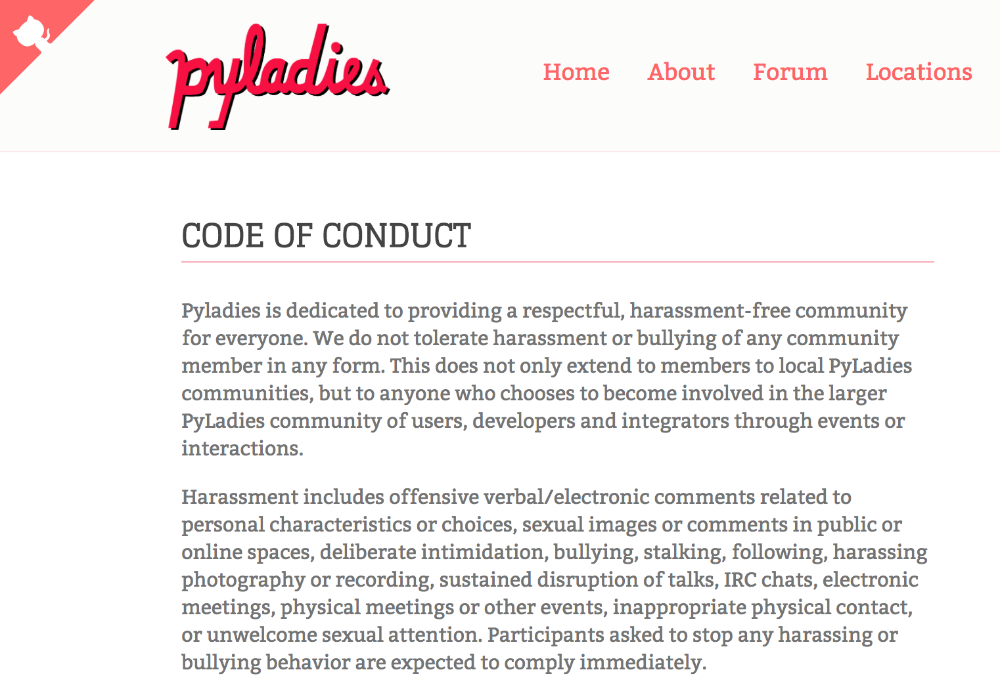

Codes of Conduct are popping up everywhere these days.  We see them, we read them.  But, what happens next?  How are they implemented?  Here's a brief post on the PyLadies Code of Conduct, and how to implement it.  I hope you'll be able to use this as a starting point for managing code of conduct violations in your meetup and open source communities.  

## PyLadies Code of Conduct (CoC)
The [PyLadies CoC](http://www.pyladies.com/CodeOfConduct/) is available on our website, and it applies to all our spaces, both online and off.  

   

## Goal
The goal of having and administering a CoC is to create an environment which is respectful, comfortable and professional for our meetup attendees.

## Communication
The best way to set a welcoming and professional environment is by **prevention**.  That can be done by **communicating** our CoC to our members and by bringing awareness that a certain level of etiquette is expected behavior at our events.  

This is done in the following ways:
1.  Include link to CoC in the event description
2.  Include link to CoC in “touch base - update RSVP” email which is sent a couple of days prior to the event
3.  Announce that all attendees must abide by our CoC at the start of an event.  If anyone has experienced any issues, they should feel free to come and speak to one of the organizers.  
4.  We also provide a form, which can be submitted anonymously, if a member chooses to.  The form is [CFaaS](https://goo.gl/forms/HiwT4P3uvEgVB3Xz2) (Communicating Feedback as a Service).

### Communicating CoC text:
>We are committed to providing a respectful space for our attendees.  All attendees are expected to abide by the [PyLadies CoC](http://www.pyladies.com/CodeOfConduct/) (that includes no harassment or heckling in any form). Anyone who violates the Code of Conduct will be asked to leave, and they will be removed from our meetup roster permanently.

This sets the tone and atmosphere for event.  It also makes it easier to call out any violations, should they occur.  It also communicates the consequences of a CoC violation.   

## Addressing Violations
Depending on the violation, it’s best to address it directly.  If possible, it would be good to do it privately between the CoC violator and the organizer.  Preferably, it would be good to include a third person, such as another organizer or event helper in the discussion.  

### Category 1 violation
#### Examples:  a bad joke, an underlying sexual reference, mocking someone’s choice of editor
Taking steps to bring awareness to a person’s behavior is a good way to begin addressing the violation and prevent future violations.  
* "I noticed you said/wrote 'xxx'.  That's not in the _spirit_ of our community."
* Here's an example of how that could have been phrased:  [include more acceptable text here]

### Category 2 violation
#### Examples:  heckler, disrespectful post on online forum
It’s good to give a warning first.  Bring attention of the behavior to  the violator.  Let them know it is a violation of our CoC and we handle this violation with a warning.  

### Category 3 violation
#### Examples:  sexual harassment
Let the violator know how they have violated the CoC.  Speak to venue host and escort person out of event and remove them from our meetup roster.

## Conclusion
Note that the above list of violations are examples and are not meant to represent the exhaustive list of possible violations.  

---
## Acknowledgments
Special thanks to the following whose insight has been profoundly helpful:  
* [NumFOCUS](https://www.numfocus.org/blog/) and their recent Diversity in STEM Unconference
* [Kelle Cruz](https://twitter.com/kellecruz)  
