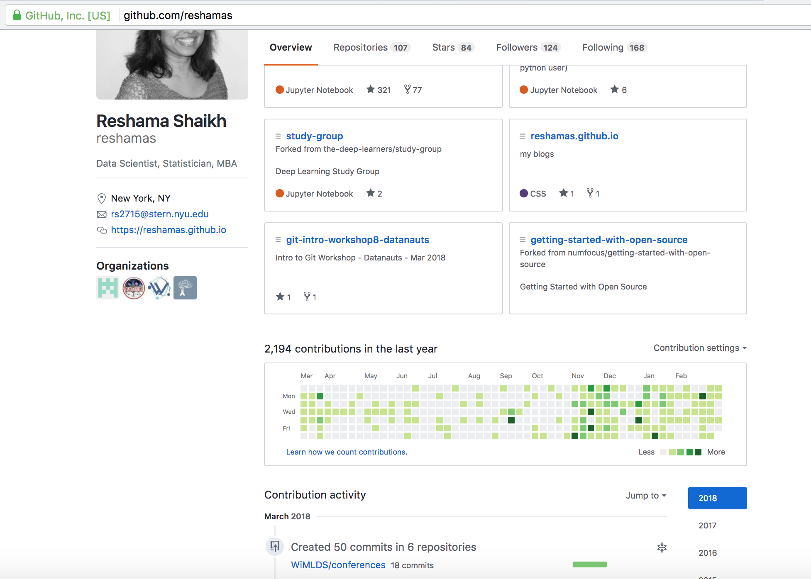

## How Do I Get My First Data Science Job?

## Intro

As an organizer for a data science meetup group, I am often asked this question:  
>*I am studying data science [either university degree, bootcamp, online or self-study].  How do I go about getting my first job in data science?*

Here are some key steps:  
1.  Showcase your work
2.  Be connected
3.  Participate in the community
4.  Find the opportunities

## Portfolio
The advantage, of living at a time when technology and social media are accessible, is that there are so many opportuntities to showcase your portfolio.  Here are the aspects of your portfolio that you have direct control over and which you can use to represent you and your work, hence your "brand":  
- Resume
- LinkedIn profile
- GitHub account
- Blog
- Twitter profile
- Kaggle profile

Make sure your LinkedIn account shows your **full name** with a professional-looking photo.  Use technology to your advantage - being anonymous on the internet makes it really challenging for employers to find and research you.  They'll just move along to the next candidate.  

  

Check out the blog by [Rachel Thomas](https://twitter.com/math_rachel) entitled [Making Peace with Personal Branding](http://www.fast.ai/2017/12/18/personal-brand/).  There is sage advice there on:  
- Why personal branding is useful
- Twitter for beginners
- Speaking at conferences / meetups
- Public speaking resources

### [Kaggle Competitions](https://www.kaggle.com/competitions)
[Participating in Kaggle competitions](https://reshamas.github.io/to-kaggle-or-not/) has numerous benefits:  
- there's a friendly community
- you can work with others in a team
- you become familiar with popular datasets

An added bonus is there are *kernels*, which is code in Jupyter Notebooks that others have shared.  You are free to copy and use them to get started on a competition.  Code is available in both R and Python.  

You can set up your public profile and share your work.  It's also a lot of fun.  

### Blogging
Blogging is a way to display your communication and writing skills.  Writing about a project or a data science topic allows you to share with the community as well as encourages you to write out your work process and thoughts.  This is particularly handy when interviewing.  

Check out [David Robinson](https://twitter.com/drob)'s article [Advice to Aspiring Data Scientists: Start a Blog](http://varianceexplained.org/r/start-blog/).  The blog includes:  
- possible blog topics
- creating a portfolio
- getting feedback

David shares his experience in social media and how he obtained his first data scientist job.  He also generously offers to retweet your first data science post.  With 20K+ followers, that's an offer that can't be refused.    

### GitHub: Show Your Code
Sharing your code, particularly in data science where the community relies on open source software, is a great way to show your skills.  Whether it's Kaggle competitions or projects, make your code available in a GitHub repository and write a corresponding blog.  Employers *do look* at GitHub accounts of candidates to see their GitHub activity, coding level and projects.  

## Networking
Networking is critical.  A definition of networking is:  
>*interact with other people to exchange information and develop contacts, especially to further one's career.*   

But it's so much more complicated than that.  [Emily Robinson](https://twitter.com/robinson_es) has written a couple of insightful blogs on what networking really is, and how to do it both effectively and respectfully:  
- [Building Your Data Science Network: Finding Community](https://robinsones.github.io/Building-Your-Data-Science-Network-Finding-Community/)
  - meetups
  - twitter
- [Building Your Data Science Network: Reaching Out](https://robinsones.github.io/Building-Your-Data-Science-Network-Reaching-Out/)
  - offer value
  - find a connection
  - follow-up

### Classroom
When in a formal educational program, make sure to speak and connect with everyone, not just the folks with whom you feel most comfortable socializing.  Make sure your professors/instructors know your name.  Get to know every Teaching Assistant in the classroom.  Get to know *all* of your fellow classmates.  Every person has different strengths and networks and skills and something to offer, *including you*. 

### Twitter
If you're new to twitter, I am sharing some of my favorite twitter accounts to follow.  Follow who they follow, follow the insightful (and sometimes fiery) conversations on data science, and build your network.  To make it easier, subscribe to this list on Twitter for one-touch following:  <a href="https://twitter.com/reshamas/lists/notable-data-scientists/members" style="color:blue">Notable Data Scientists</a>  

Participate... by liking tweets, retweeting or contributing to a conversation.  

## Education
With 12-week bootcamps costing about $16K these days, 2-year university graduate programs costing significantly more, and the costs associated with online data science programs, the investment is significant.  Considering the monetary, time and opportunity costs associated with learning data science, [do your research](https://datasciencebootcamps.com/2015/09/26/considering-a-data-science-bootcaps-program-questions-to-ask-things-to-look-for-and-look-out-for/).  Find out what the **placement statistics** are and what **resources** they offer to entry level analysts / data scientists.  
- How many / which hiring partners do they work with?
- Are there opportunities for internships or small projects?  
- How extensive is their alumni network?  
- Reach out to alumni of the program (via LinkedIn) and ask about their experience in the program, as well as job placement support.  Get the **inside scoop**.    

## Underground Resources
Almost every meetup group or organization has a community Slack team you can join.  You can find this information in their announcements.  Join their Slack teams and watch out for the job postings.  

Often, at the start of a meetup, attendees will share any job openings at their company.  It's a convenient opportunity to speak to them for more information.  

Subscribe to data science newsletters.  Here's a list of [Top 75 Data Science Blogs](https://blog.feedspot.com/data_science_blogs/).

**Read your emails.**  Meetup groups and newsletters regularly post job opportunities that are more "real" than the postings that appear in the well known job boards such as LinkedIn, Glassdoor, Indeed, etc. 

## Managing Expectations
If the title is other than "Data Scientist", such as "Analyst" or "Junior Data Scientist", and it allows you the opportunity to use and refine the data science tools you've learned, that is most important.  Your first data science job may not be the job of your dreams.  You may not have the exact title you envisioned.  And it may not be for a tech company that is a household name.  Think of it as a learning experience and stepping stone.  As long as you are moving in the right direction, that is good progress.  

## References
* [Data Science Resources](https://reshamas.github.io/resources/)
