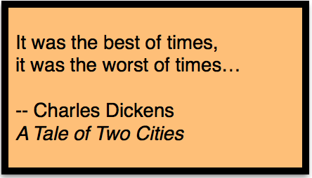

Like many data scientists, I desired to contribute to open source, but I thought that “open source contribution” meant creating a new library in Python.  That would require expertise in objects, inheritance, parallelism, asynchronous, classes, methods, decorators, and more to write that long, complex code.  But, I’m a statistician and that level of Python/computer science is beyond my scope of knowledge.  

## Take 1 :clapper:

In early 2017, [Andreas Mueller](https://twitter.com/amuellerml), who is the core maintainer of the Python analysis library [scikit-learn](https://github.com/scikit-learn/scikit-learn) and co-author of [Introduction to Machine Learning with Python](http://shop.oreilly.com/product/0636920030515.do), reached out to me, as an organizer for the NYC Women in Machine Learning & Data Science meetup group, to increase the participation of women in open source.  A 2013 survey found that only [11 percent of open-source contributors were women](https://www.newamerica.org/weekly/111/and-now-an-infuriating-statistic-about-women-and-coding/).   

After much planning, the event [Scikit-learn Sprint](https://www.meetup.com/NYC-Women-in-Machine-Learning-Data-Science/events/237123181/) was scheduled, the [scikit-sprint GitHub repo](https://github.com/WiMLDS/scikit-sprint) was set up, prep work was created for participants, teaching assistants were recruited, [Gitter](https://gitter.im/scikit-learn/scikit-learn) was introduced, breakfast was ordered…  All details were meticulously choreographed.  I was enthusiastic about organizing this event for many reasons:  
- to involve a community of users (particularly women) in open source
- to make a dent in the [700+ open issues at the time (now 1000+)](https://github.com/scikit-learn/scikit-learn/issues)
- for me to contribute by submitting a pull request to a critical Python library

After all that planning, I was unfortunately unable to attend due to a severe ankle injury.  My dreams of contributing to open source in March 2017 were crushed.  Perhaps next time.  

Fortunately, the event was still a success.

<blockquote class="twitter-tweet" data-lang="en">
A big thank you to everyone that made it out. Open source needs you! I hope we&#39;ll see more from you all in the future! <a href="https://t.co/7xgWklizMO">https://t.co/7xgWklizMO</a>
&mdash; Andreas Mueller (@amuellerml) <a href="https://twitter.com/amuellerml/status/838186956022513665?ref_src=twsrc%5Etfw">March 5, 2017</a></blockquote>

## What is Open Source

Open source has traditionally been known as:  
>free software whose source code is open to the public  

Examples include:  
- [Linux](https://www.linux.org/) operating system
- [Apache projects](https://projects.apache.org/projects.html?name)
- [NumFocus Sponsored Projects](https://www.numfocus.org/sponsored-projects)
- more [programming languages](https://github.com/collections/programming-languages)
- [web browsers](http://www.linuxandubuntu.com/home/best-open-source-web-browsers)
- [text editors](https://www.slant.co/topics/3418/~open-source-programming-text-editors)
- & even more [open source applications](https://opensource.com/resources/projects-and-applications)

In November 2017, I participated in the inaugural [Diversity & Inclusion in Scientific Computing (DISC)](https://pydata.org/nyc2017/diversity-inclusion/disc-unconference-2017/) Unconference where I broadened my knowledge of open source.    

We can expand the purview of open source to include the following contributions:
- creating additional libraries for programming languages
- contributing to programming languages by fixing bugs or adding features via GitHub
- documentation
- tutorials and training materials (text, video)
- blogs
- research papers
- answering user questions on forums ([StackOverflow](https://stackoverflow.com/questions))
- useful tweets <a href="https://twitter.com/reshamas/lists/notable-data-scientists/members" style="color:blue">(Notable Data Scientists)</a>
- talk slides and videos
- datasets ([Kaggle](https://www.kaggle.com/datasets))
- [trending repositories on GitHub](https://github.com/trending)
- translations of English documentation

An updated definition could be:  
>Free software whose source code is open to the public, as well as any documentation, examples, applications, maintenance and support of software and related tools for all users.

## Why Contribute to Open Source?
Because everyone uses it, benefits from it, and there is a *lot of work* to be done.  Other advantages include:  
- learning a skill by contributing
- sharing work
- augmenting your portfolio by including your OS contributions
- networking opportunities

There is more information available in this dossier, [Getting Started with Open Source](https://github.com/numfocus/getting-started-with-open-source), which is an outcome of the [DISC Unconference Projects](https://github.com/numfocus/DISC-unconf-17).

## Take 2 :clapper:

[fast.ai](http://www.fast.ai) was founded by Jeremy Howard and Rachel Thomas with the goal of making deep learning (DL) accessible to the masses.  Fortunately and most importantly, the program also allows those who are interested, but not based in San Francisco, an opportunity to attend the lectures online and it makes available all course materials including an active and vibrant Discourse community (free of charge!).  I learned of the [fastai International Fellowship](http://www.fast.ai/2017/09/08/international-fellowship/) (for the Fall 2017 class) through a data science connection of mine  just 2 days before the deadline to apply.  I applied and I am happy to say, I was accepted!  There were approximately 300 students attending in person and 400 International fellows participating online.  

My personal experience in data science (both as a student and teacher) is that Dev Ops can be a barrier to entry.  Dev Ops are those skills needed to set up a workable environment even before doing any data science.  It includes skills in:  Git (version control), setting up a machine in the cloud (via AWS or Paperspace or a myriad of other options), configuring environment, navigating bash and editor on a terminal on the cloud machine, downloading images and transferring them to a cloud machine.  It is separate from the machine learning part.  Beginner data scientists often struggle with these dev ops skills.

Initially, while enrolled in this online course, I took notes in google docs for myself.  After a week or so, I decided to create a repo on GitHub, <a href="https://github.com/reshamas/fastai_deeplearn_part1" style="color:blue">fastai_deeplearn_part1</a>, and share my notes in case a *few other students* might find them helpful.  

To date, **thousands of users** have referenced the documents in this repo.

I had contributed to open source!  

<blockquote class="twitter-tweet" data-lang="en">
If you&#39;re doing the new <a href="https://t.co/GEOZuodrZj">https://t.co/GEOZuodrZj</a> course, this list of terms compiled by <a href="https://twitter.com/reshamas?ref_src=twsrc%5Etfw">@reshamas</a> is likely to be a great help<a href="https://t.co/N3JOWaujGM">https://t.co/N3JOWaujGM</a>
&mdash; Jeremy Howard (@jeremyphoward) <a href="https://twitter.com/jeremyphoward/status/956321940536410112?ref_src=twsrc%5Etfw">January 25, 2018</a></blockquote>

<blockquote class="twitter-tweet" data-lang="en">
Many <a href="https://twitter.com/fastdotai?ref_src=twsrc%5Etfw">@fastdotai</a> students find tmux really useful with Jupyter Notebook, so <a href="https://twitter.com/reshamas?ref_src=twsrc%5Etfw">@reshamas</a> has written a nice intro to help get you started! <a href="https://t.co/99OjQCdM9A">https://t.co/99OjQCdM9A</a>
&mdash; Jeremy Howard (@jeremyphoward) <a href="https://twitter.com/jeremyphoward/status/929568271795306498?ref_src=twsrc%5Etfw">November 12, 2017</a></blockquote>

 
## Conclusion & Inspiration

I live in the United States, specifically New York City.  It’s a time period when any topic under discussion is inherently divisive.  I am reminded of Charles Dickens’ famous lines:  

  

What I love about data science is the passion that all, who are bit by the data bug, bring to it.  Data science ignores artificial boundaries, field of study, profession, nationality, religion, language and time zone.  I have benefited from the work and tools of many contributors to build my data science skills.  It’s been enormously gratifying to create and share this repo which enables so many aspiring and practicing data scientists **all over the world** to manage dev ops tools and move forward with deep learning.  That is the true depth and value of open source.  **It really is open to everyone.**  

## What the Future Holds
Given the expanded definition of open source, the opportunity to contribute to open source is available to users of all levels.  I foresee a section on the resume entitled “Open Source Contributions” where data scientists will include how they have contributed to open source.

## References
[Interview with Andreas Mueller, Lecturer at Columbia University and Core Contributor to Scikit-Learn](https://mlconf.com/interview-andreas-muller-lecturer-columbia-university-core-contributor-scikit-learn-reshama-shaikh/)

[WiMLDS Scikit Sprint](http://wimlds.org/noemi-derzsy-scikit-learn-sprint/)

[NumFocus Project: Getting Started with Open Source](https://github.com/numfocus/getting-started-with-open-source)

[What Is Open Source Software, and Why Does It Matter?](https://www.howtogeek.com/129967/htg-explains-what-is-open-source-software-and-why-you-should-care/)

[Do Software and Data Products Advance Biology More Than Papers?
 (C. Titus Browns)](http://ivory.idyll.org/blog/2018-software-and-data-better-than-papers.html)

[Why Should I Contribute to Open Source?](https://github.com/numfocus/getting-started-with-open-source/blob/master/what_is_open_source_and_why_contribute.md#why-should-i-contribute-to-open-source)

Open Source Projects
- [Software Carpentry](https://software-carpentry.org/lessons/) / [Data Carpentry](http://www.datacarpentry.org/lessons/) lessons
- [fastai Deep Learning Library](https://github.com/fastai/fastai)
