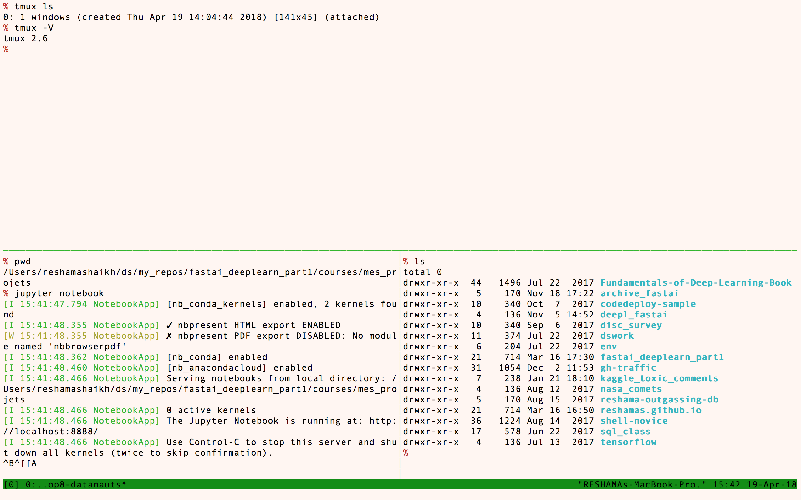
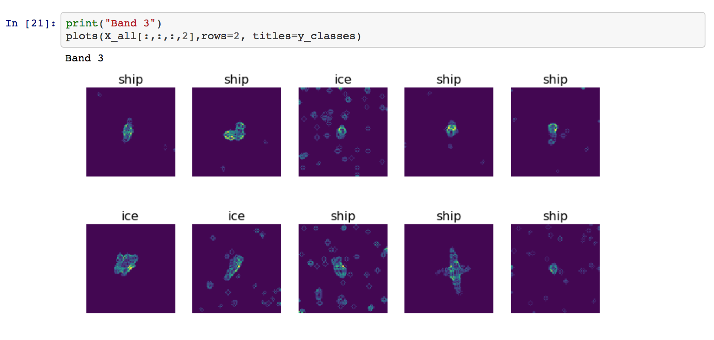
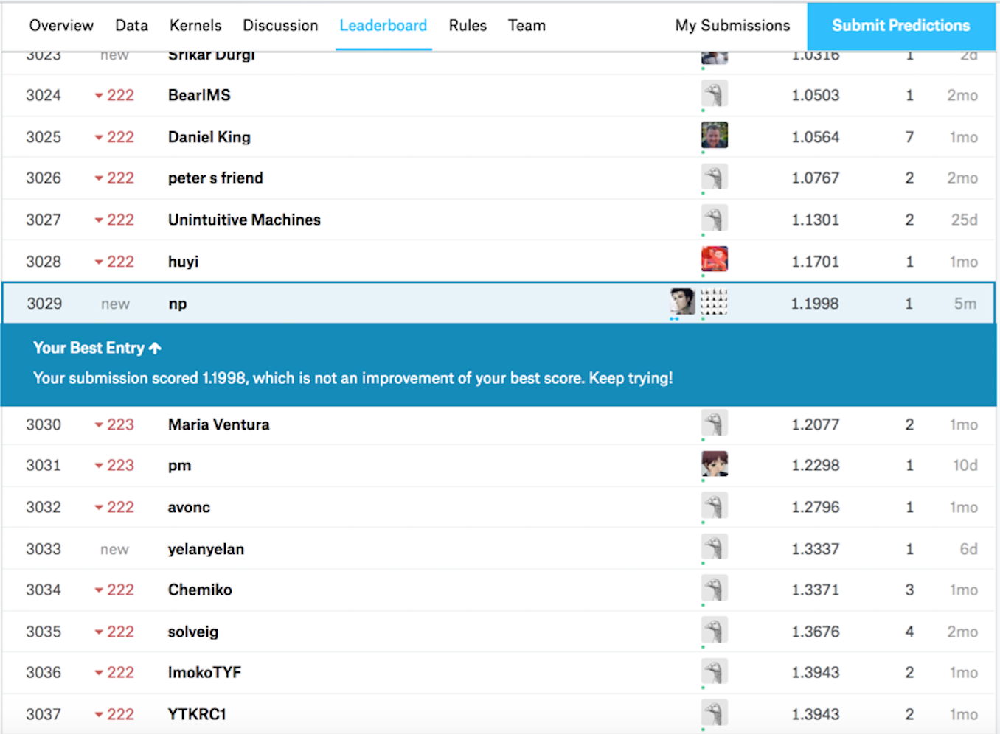

## Fastai and the Kaggle Connection
[fast.ai](http://www.fast.ai) is a 7-week deep learning MOOC, for which I was an international fellow for the Fall 2017 course.  My [course notes](https://github.com/reshamas/fastai_deeplearn_part1/tree/master/courses/dl1) are on GitHub.  Kaggle had seemed intimidating prior to this course, but Jeremy Howard, the instructor, explained and reviewed closed competitions with such mastery. Each week he introduced a competition and suggested others for practice.  In one evening lecture, he demonstrated how to download the data to a cloud server, run a simple deep learning model and submit results.  And scores of students were doing competitions weekly and performing well with the [fastai](https://github.com/fastai/fastai) deep learning library that was, at times, beating state of the art results.  It is worth mentioning that [Jeremy Howard was previously president of Kaggle](https://www.kdnuggets.com/2017/01/exclusive-interview-jeremy-howard-deep-learning-kaggle-data-science.html), and what a treat it was to learn about the platform from someone with that depth of knowledge.    

I watched the videos and took notes studiously, but it was not until the course was complete that I finally participated in a Kaggle competition.  

## My First Kaggle Competition

I found a teammate in NYC who was interested, and we worked on the [Statoil/C-CORE Iceberg Classifier Challenge
 | Ship or iceberg, can you decide from space.](https://www.kaggle.com/c/statoil-iceberg-classifier-challenge)  
 
We chose this competition for a few reasons:
- image data (we wanted to use the [fastai](https://github.com/fastai/fastai) deep learning library)
- it was an active competition at the time
- the dataset size was manageable (~1300 images in the training dataset, with 4 features)

There are kernels available to start the analysis.  However, we were unable to run GPU on the kernels, so we went to AWS to do our work.  We set up the cloud machine, downloaded the data, ran a neural network and submitted our first results within one Saturday afternoon.  

## GitHub Project Repository
Our GitHub repository is [kaggle_iceberg](https://github.com/reshamas/kaggle_iceberg).  

## What I Learned:  Dev Ops Tools

### Cloud Computing
Fastai created a public template for users.  There are detailed instructions in this [Set up AWS GPU](https://github.com/reshamas/fastai_deeplearn_part1/blob/master/tools/aws_ami_gpu_setup.md) document for getting started.  

### Logging into AWS
There is a routine process when using AWS such as:
- remembering my login syntax
- updating Ubuntu packages
- using latest version of fastai library
- updating Anaconda packages
- remembering where the data and my working directory are located

I wrote up notes in [0_login](https://github.com/reshamas/fastai_deeplearn_part1/blob/master/courses/mes_projets/0_login.md) so I could easily reference the steps in the future.

### Downloading Data
Since we were working on AWS, it was necessary to load the data to that cloud machine.  Kaggle has a command line interface (CLI) that makes it convenient, and I have written up notes in [downloading data from Kaggle](https://github.com/reshamas/fastai_deeplearn_part1/blob/master/tools/download_data_kaggle_cli.md).  

### Tmux
Tmux stands for "terminal multiplexer" which lets you switch easily between several programs or windows in one terminal, which is particularly useful when working on a remote machine.  It also:  
* Lets you tile window panes in a command-line environment.
* This in turn allows you to run, or keep an eye on, multiple programs within one terminal.
* **:key: With tmux, you can leave scripts running for a while, and it doesn’t matter if the terminal closes or you lose your internet connection for a moment; the script is running in the background**

I have written up [tmux instructions](https://github.com/reshamas/fastai_deeplearn_part1/blob/master/tools/tmux.md) for easy reference.  

  

### Git
We wanted to ensure that our code was backed up on GitHub at [reshamas/kaggle_iceberg](https://github.com/reshamas/kaggle_iceberg).  I was familiar with Git through my prior experience, and I have provided useful notes for the Git beginner here [git-intro-workshop](https://github.com/reshamas/git-intro-workshop).

During the competition, the repository was set to private.  Once the competition was complete, we changed the privileges to public.

### Jupyter Notebook
I learned of some shortcuts for Jupyter Notebook from the fastai lectures and wrote them up for easy reference in [jupyter_notebook](https://github.com/reshamas/fastai_deeplearn_part1/blob/master/tools/jupyter_notebook).

## What I Learned:  Data / Algorithm Knowledge

### Domain Knowledge:  Understanding the Data
It took some time to explore the data.  Differentiating between dogs and cats is one thing.  But separating the satellite images of icebergs and ships was visually challenging.  

  

### Benchmark:  Log Loss
Accuracy is a metric generally used to evaluate model performance.  However, Kaggle often uses [log loss](http://wiki.fast.ai/index.php/Log_Loss).  We investigated and discovered why:
- accuracy is the sum of correctly classified images, each image is assigned to 0 or 1
- log loss begins by examining the probability of each class.  So, if it is < 0.50, it is classified as 0, and if > 0.50, it is classified as 1
- log loss then measures the difference, or distance, between actual and predicted probabilities
- log loss provides more detail on how close the predicted is to actual.  For example, if a prediction for an image is 0.45 (while classified corrrectly), it is less precise than if the prediction was 0.05.  That indicates our model could be improved.  

### Hyperparameters
Since this competition is image analysis, we used convolutional neural networks (CNN) which is state of art.  We began with the resnet18 architecture which was a simple architecture; another benefit was its presence in one of the kernels which helped us to establish a baseline.  After the baseline was confirmed, we moved on to resnet34 and resnext50, which were introduced in the fastai course.  I also tried a more advanced architecture, nasnet, which did not work since it had not been fully incorporated into the fastai library at the time.

With my background in statistics, my favorite step of the competition was tuning the hyperparameters.  I played with various architectures, batch sizes, cyclical learning rates, epochs, dropout rate, and image sizes to obtain optimal results which is to minimize log loss.  I learned that there are many forms of regularization in deep learning:  
- large learning rates
- small batch sizes
- weight decay
- dropout 

## Submitting Results
When we first submitted results, we were way off.  It turned out there were errors in how we created our submission file.  We fixed it and saw our results more in alignment with others on the [leaderboard](https://www.kaggle.com/c/statoil-iceberg-classifier-challenge/leaderboard).

### Rankings
It was exciting and encouraging to see our rankings increase as we became more familiar with the data and tried various hyperparameters.  

  

## Conclusion
My first Kaggle competition was a lot of fun!  It was enlightening to learn the wide skillset required to getting started.  I was grateful to work with my teammate where we could bounce ideas off of each other.  I am also thankful for the all the guidance that the fastai lectures provided for participating in my first Kaggle competition.  **It was neither easy nor difficult; it was manageable based on my skills and the background that fastai provided.**

