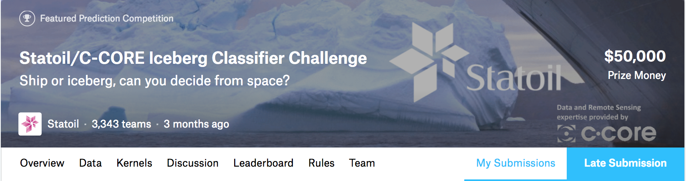

## About Kaggle
[Kaggle](https://www.kaggle.com/) is the most well known competition platform for **predictive modeling and analytics**.  The company was founded in 2010 in Melbourne, Australia, and a year later, it moved to San Francisco after receiving funding from Silicon Valley.  In 2017, it was acquired by Google.  Read more about its history and future in [Interview with Anthony Goldbloom, CEO of Kaggle.](https://medium.com/implodinggradients/ama-with-anthony-goldbloom-ceo-of-kaggle-the-open-data-science-platform-6a2012538316)

The term “data science” has gradually floated and elevated into the English lexicon over the past decade.  And so, the words “data science” and “kaggle” have become inextricably linked, and many in the data science community contemplate and debate the utility of the platform:  
> <a   style="color:blue; font:italic"><i>Is Kaggle... useful?</i></a>

## My Initial Thoughts on Kaggle
Like many people, I had some preconceived notions about Kaggle competitions.  I had heard about them for several years, and these were my thoughts or opinions from others in the field:  
- I had heard the legend that retired PhD’s with decades of experience were the ones winning the Kaggle comps.  <a   style="color:gray; font:italic"><i>(I had often wondered if these geniuses were on a beach with clear turquoise water and flawless wifi access or in a dark, dusty, cluttered office...)</i></a>
- I had close to zero chance of winning
- Would I really learn something of value?
- What is the point of investing time to improve accuracy by 0.01 points?
- Is it really the *best use* of my time?  Ought I not invest the time learning another, more valuable, data science skill?
- The winners have to use complex ensemble methods
- The data is artificially clean, and that is unrealistic
- Doing one Kaggle competition will not make me a qualified data scientist, so why bother?
- I am not sure where to begin...

## My First Kaggle Competition
After years of resistance, I participated in my first Kaggle competition recently, [Is it a Ship or Iceberg](https://www.kaggle.com/c/statoil-iceberg-classifier-challenge).  I wrote a post <a href="https://reshamas.github.io/my-first-kaggle-competition/" style="color:red">My First Kaggle Competition</a> of my experience.  

  

## Kaggle Competitions and the NYC Marathon
What I discovered is that Kaggle competitions are a lot like the NYC marathon.  <a   style="color:blue">Most people participate for the journey, not for winning first place. </a>

## Verdict:  Yes to Kaggle
I would say "yes", there is value in doing a Kaggle competition, either for the beginner or seasoned data scientist.  Here are the many reasons why.

### Benchmark
While there are learning benefits to acquiring your own datasets or scraping the web, the downside to that is there is no benchmark, no way to compare your findings.  There is the possibility of significant errors, and no one would know because there is no validation being performed.  Kaggle competitions provide a platform for "checking your work."

### For All Levels, There is Learning
For the beginner, there is lots to learn:
- Becoming familiar with the Kaggle platform
- Downloading data using Kaggle [CLI](https://github.com/reshamas/fastai_deeplearn_part1/blob/master/tools/download_data_kaggle_cli.md) or [API](https://github.com/Kaggle/kaggle-api)
- The structured ecosystem allows for people with less advanced statistical skills to focus on that
- Understanding the evaluation metrics
- Use dev ops skills:  Git, cloud computing 
- Practice
- Kaggle offers some free interactive [tutorials](https://www.kaggle.com/learn/overview)

For the experienced practitioner, there is always more to learn:
- The structured ecosystem allows for people with more advanced statistical skills to focus on that
- Explore hyperparameters more deeply
- Focus on state of the art and emerging methodologies
- Post-competition analysis of winner entries
- Managing with very large datasets (1 million records or more)
- Setting up GPU-enabled machine for deep learning
- Use deep learning and compare results to traditionally used algorithms

### Data 
All throughout the data science community, you will hear references to datasets.  You will become familiar with popular datasets to which other learning platforms and conference speakers refer.

Despite the fact that the dataset is provided, there remains the requirement to understand the data and the evaluation metrics.  Contrary to popular belief, there is still "dirty data" which requires further investigation.  Digging deeper into misclassified items begets adjustments to the algorithm.  

### Portfolio Segment
It is true, doing one Kaggle competition does not qualify someone to be a data scientist.  Neither does taking one class or attending one conference tutorial or analyzing one dataset or reading one book in data science.  Working on competition(s) adds to your experience and augments your portfolio.  It is a complement to your other projects, not the sole litmus test of one's data science skillset. 

### Having Fun
Often, people are unsure whether to pursue a career in data science.  Participating in a competition is one informative way to gauge your abilities and excitement.  If you truly enjoy the process of Kaggle, it will point you more clearly in the right direction.  If you prefer to spend your time doing something else, that is all right too; it is one way to find out. 

## Getting Started with Kaggle

### Beginner's Guide
This article provides extensive information on Kaggle as well as tips on getting started:  [The Beginner’s Guide to Kaggle](https://elitedatascience.com/beginner-kaggle)

### Kernels
There are kernels, which is code in Jupyter Notebooks that others have shared.  You are free to copy and use them to get started on a competition.  Code is available in both R and Python. 

### Discussion Board
Each competition has a discussion board for asking questions and upvoting kernels and topics.

### Slack
Kaggle has a Slack team:  [KaggleNoobs slack channel](http://kagglenoobs.herokuapp.com).  There are almost 4000 members, and there is a channel for AMA (Ask Me Anything), where they regularly interview Kaggle participants and winners. 

### Choices
- You can participate in competitions that have closed.  Keep in mind, it is about the learning, not the end result.  
- There are a variety of topics (random forests, multi-class, neural networks, NLP) and types of datasets (images, structured data, text, big data)

### Partner with Someone
- Whether you are a beginner or experienced in data science, work with someone
- Note that it is best to have separate teams on Kaggle so you can each make the maximum daily submissions of results, but merge teams later towards the end

## Conclusion
I think it is worthwhile to participate in at least one competition.  There is a difference in having an opinion on something you have tried versus not.  Kaggle is evolving, like everything, especially since its acquisition by Google.  Check back periodically and see what is new.

## It Doesn’t Have to be Kaggle 
While Kaggle is the most well-known platform, there are many other opportunities to participate in competitions:
- many university analytics departments have an annual competition
- conferences often have competitions or what are called "tasks"
- private companies sponsor their own competitions

Here is a sample list of other [data science competitions](https://github.com/reshamas/fastai_deeplearn_part1/blob/master/notes/competitions.md).  Spending some time with google search will produce more recent and active opportunities.  

## References

[ Interview with Jeremy Howard on Deep Learning, Kaggle, Data Science, and more](https://www.kdnuggets.com/2017/01/exclusive-interview-jeremy-howard-deep-learning-kaggle-data-science.html), 2017

[My Kaggle Experience & Spot-Chasing Retirement](http://blog.kaggle.com/2016/02/10/my-kaggle-experience-spot-chasing-retirement/), Marios Michailidis, 2016

[Machine Learning Isn’t Kaggle Competitions](https://jvns.ca/blog/2014/06/19/machine-learning-isnt-kaggle-competitions/), Julia Evans, 2014

[A Very Short History of Data Science](https://www.forbes.com/sites/gilpress/2013/05/28/a-very-short-history-of-data-science/#2dbc356155cf), 2013

## Translation Note  
This blog is available in [Mandarin translation.](https://www.jqr.com/article/000380)
