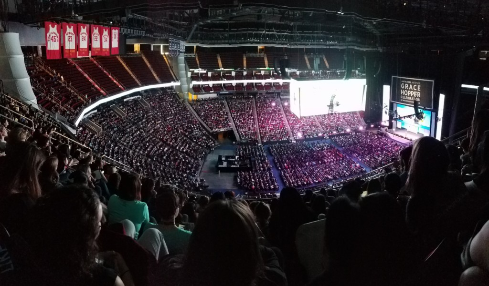

 

## Diversity 
These are the stages of the current conversation on diversity:  
1.  **What** is diversity?
2.  **Why** is it important? ([demographic representation](http://www.diversitywoman.com/why-diversity-matters/) & [good for business](https://techcrunch.com/2018/01/18/diverse-teams-are-still-really-good-for-business-mckinsey-says/))
3.  **Where** to find candidates and make my organization diverse?
4.  **How** to [retain employees](https://medium.com/tech-diversity-files/if-you-think-women-in-tech-is-just-a-pipeline-problem-you-haven-t-been-paying-attention-cb7a2073b996) from underrepresented groups?

The focus of this post is to share a comprehensive list of resources for women and non-binary people in data science for the goal of increasing diversity in the workplace.  

## Purpose

There has been extensive research which shows that women are:
- [underrepresented in tech](https://www.bloomberg.com/news/articles/2017-06-02/why-so-few-women-break-through-tech-s-bro-culture-quicktake-q-a) and the [statistics are severely imbalanced](http://observer.com/2017/06/women-in-tech-statistics/)
- [lagging in senior positions](https://research.hackerrank.com/women-in-tech/2018/)
- [paid inequitably](http://www.businessinsider.com/gender-wage-pay-gap-charts-2017-3#the-number-of-women-promoted-to-the-highest-levels-of-companies-reveals-unconscious-biases-6)
- [experiencing sexism](https://twitter.com/math_rachel/status/897600522722705408)   

Some positive news is that research has shown that networking events for women *do indeed* [move the needle on equality](https://hbr.org/2018/02/do-womens-networking-events-move-the-needle-on-equality).

This guide was created to provide a resource for women and non-binary individuals in data science to accomplish the following in a friendly and supportive environment:  
- building community
- networking 
- developing skills, education
- sharing knowledge
- finding jobs
- advancing their careers
- advocating for themselves and others

### Male Allies
This resource will also be valuable to **male allies** who seek to diversify their organization, by **proactively**:   
- supporting and amplifying women
- finding women speakers for conferences
- recruiting women candidates for jobs 

<blockquote class="twitter-tweet" data-lang="en">
If you invite me to speak at your conference, be prepared to get this answer.  I invite other men to do the same.<a href="https://twitter.com/hashtag/diversity?src=hash&amp;ref_src=twsrc%5Etfw">#diversity</a> <a href="https://twitter.com/hashtag/inclusion?src=hash&amp;ref_src=twsrc%5Etfw">#inclusion</a> <a href="https://t.co/gJlECWOAux">pic.twitter.com/gJlECWOAux</a>
&mdash; Francesc @ #io18 (@francesc) <a href="https://twitter.com/francesc/status/984500776671240192?ref_src=twsrc%5Etfw">April 12, 2018</a></blockquote>

## Guidelines for Engagement
Prior to joining any of the organizations or attending their events, it is essential to become familiar with these details:  
-  **Mission:**   read the mission statement of the organization
-  **Code of Conduct:**   read the CoC of the organization
-  **Membership:**   some of the organizations are open solely to women and non-binary people. Others are open to male allies.  Be informed and respectful of their membership requirements before joining.  

## Analytics Conferences for Women

### [Women in Data Science](https://www.widsconference.org) (WiDS)
- hosted at Stanford University
- livestreamed around the world, 75K+ participants from 75 countries
- 2018 conference was March 5
- twitter hashtag:  #WiDS2018

### [Women in Analytics](https://www.womeninanalytics.org)
- 2018 conference was March 15 in Columbus, Ohio
- twitter hashtag:  #WIA2018

### [Women in Robotics IV](https://sites.google.com/view/rss2018women/home)
- 2018 conference is June 29 in Pittsburgh, PA

### [Women in Computer Vision Workshop](https://wicvworkshop.github.io/ECCV2018/index.html)
- 2018 conference is September 9 in Munich, Germany

### [Women in Statistics & Data Science Conference](http://ww2.amstat.org/meetings/wsds/2018/)
- organized by American Statistical Association
- 2018 conference is October 18-20 in Cincinatti, Ohio

### [Women in Machine Learning Workshop](http://wimlworkshop.org/sh_events/wiml-workshop-2018/) (WiML)
- 2018 conference is December 3-4 in Montreal, Canada
- co-located with NIPS 2018
- other events co-located with COLT, ICML and [more](http://wimlworkshop.org/events/)

## Women in Data Science Groups
Here's a list of other organizations in the same space:    
- [WiDS:  Women in Data Science](https://www.widsconference.org/)
- [WiML:  Women in Machine Learning](https://wimlworkshop.org/)
- [WiMLDS:  Women in Machine Learning & Data Science](http://wimlds.org)
- [WiBD:  Women in Big Data](https://www.womeninbigdata.org/)
- [WSDS:  Women in Statistics and Data Science (conference)](http://www.amstat.org/ASA/Meetings/Women-in-Statistics-and-Data-Science.aspx)

 
## Women in Tech Conferences

### [Women Who Code CONNECT](https://connect2018.womenwhocode.com/)
- 2018 conference was April 28 in San Francisco, CA
- for women in tech and software engineering

### [Write/Speak/Code](http://www.writespeakcode.com/2018/index.html)
- 2018 conference is August 1-4 in New York, NY

### [Lesbians Who Tech + Allies](https://lesbianswhotech.org/newyork2018/)
- 2018 conference is September 12-14 in New York, NY

### [Grace Hopper Celebration](https://ghc.anitab.org) 
- world's largest gathering of women technologists, 18K+ attendees
- 2018 conference is September 26-18 in Houston, TX
- twitter hashtag for 2017:  #GHC17, #GHC2017

## Organizations
Below are various groups in the data and tech space.  You can participate by:
- subscribing to their newsletters
- joining discussions:  Slack team, LinkedIn or Facebook group, Twitter 
- joining a local chapter or meetup group
- attending their talks and workshops (where available: hackathons, conferences)
- being an event speaker; giving a workshop
- volunteering your time 

If there is not a local chapter, consider starting one and enlist the aid of others.  

###  Tech Groups

| Group Name    | Twitter  |  
|----|----|
| [Anita Borg Institute](https://anitab.org) | [@CommunityAnitaB](https://twitter.com/CommunityAnitaB) |
| [Black Girls Code](http://www.blackgirlscode.com) | [@blackgirlscode](https://twitter.com/blackgirlscode) |
| [Black in AI](https://blackinai.github.io) | [@black_in_ai](https://twitter.com/black_in_ai)  |
| [Black Women in Computing](http://blackwomenincomputing.org) | [@BWiComputing](https://twitter.com/BWiComputing) |
| [Codebar](https://codebar.io) | [@codebar](twitter.com/codebar) |
| [Django Girls](https://djangogirls.org) | [@djangogirls](https://twitter.com/djangogirls?lang=en)  |
| [EdTechWomen](http://edtechwomen.com/chapters-and-events) | [@edtechwomen](https://twitter.com/edtechwomen) |
| [Girl Develop It](https://www.girldevelopit.com) | [@girldevelopit](https://twitter.com/girldevelopit)  |
| [Girl Geek Dinner](http://girlgeekdinners.com)  | [@ggdworldwide](https://twitter.com/ggdworldwide) |
| [Ladies Get Paid](http://www.ladiesgetpaid.com) | [@ladiesgetpaid](https://twitter.com/ladiesgetpaid)|
| [Lesbians Who Tech + Allies](https://lesbianswhotech.org) | [@lesbiantech](https://twitter.com/lesbiantech) |
| [National Center for Women & Information Technology](https://www.ncwit.org) | [@NCWIT](https://twitter.com/NCWIT) |
| [PyLadies](http://www.pyladies.com) |  [@pyladies](https://twitter.com/pyladies)  |
| [PyLadies Remote](http://remote.pyladies.com/index.html) | [@PyLadiesRemote](https://twitter.com/PyLadiesRemote)  |
| [Rladies Global](https://rladies.org) | [@RLadiesGlobal](https://twitter.com/RLadiesGlobal)  |
| [Widening Natural Language Processing](http://www.winlp.org) | [@WiNLPWorkshop](https://twitter.com/winlpworkshop) |
| [Women in Big Data](https://www.womeninbigdata.org) | [@DataWomen](https://twitter.com/DataWomen)   |
| [Women in Computer Vision Workshop](https://wicvworkshop.github.io) | [@WiCVworkshop](https://twitter.com/WiCVworkshop) |
| [Women in Linux](http://www.womeninlinux.com/) | [@WomenInLinux](https://twitter.com/WomenInLinux) |
| [Women in Machine Learning & Data Science](http://wimlds.org) | [@wimlds](https://twitter.com/wimlds)   |
| [Women in Tech Summit](https://womenintechsummit.net) | [@WomenTechSummit](https://twitter.com/WomenTechSummit)  |
| [Women Who Code](https://www.womenwhocode.com) | [@WomenWhoCode](https://twitter.com/womenwhocode)   |
| [Write/Speak/Code](https://www.writespeakcode.com) | [@WriteSpeakCode](https://twitter.com/WriteSpeakCode)  |

### Diversity & Inclusion Groups

| Group Name    | Twitter  |  
|----|----|
| [NumFOCUS DISC](https://www.numfocus.org/programs/diversity-inclusion) | [@NumFOCUS](https://twitter.com/NumFOCUS) |
| [Project Include](http://projectinclude.org) |   [@projectinclude](https://twitter.com/projectinclude) |
| [Power to Fly](https://powertofly.com/about/) |    [@powertofly](https://twitter.com/powertofly) |
| [Women in Tech Fund](https://womenintechfund.org/en/about/) |   [@womenintechfund](https://twitter.com/womenintechfund) |
| [Women 2.0](http://www.women2.com) |  [@women2](https://twitter.com/women2) |

 
###  Regional Groups

| Group Name    | Twitter  |  
|----|----|
| [AI Club for Gender Minorities](https://www.meetup.com/ai-club/) (London) | [@AIClubGenderMin](https://twitter.com/AIClubGenderMin)  |
| [Ladies Learning Code](https://www.canadalearningcode.ca) (Canada)| [@learningcode](https://twitter.com/learningcode)  |

### Groups with Membership by Application

| Group Name    | Twitter  |  
|----|----|
| [Datanauts](https://open.nasa.gov/explore/datanauts/) |   |
| [Tech Women](https://www.techwomen.org)  | [@techwomen](https://twitter.com/techwomen) | 

### Groups with a Membership Fee

| Group Name    | Twitter  |  
|----|----|
| [Apres](https://apresgroup.com/about-us/) |  [@apresnyc](https://twitter.com/apresnyc) | 
| [Tech Ladies](https://www.hiretechladies.com) |  [@HireTechLadies](https://twitter.com/HireTechLadies) | 
| [Women in Technology International](https://www.witi.com) |   [@witi](https://www.witi.com) | 

## Travel Grants

### [Google Travel and Conference Grants](https://buildyourfuture.withgoogle.com/scholarships/google-travel-and-conference-grants/#!?detail-content-tabby_activeEl=detail-overview-content)
Grants are available for selected conferences in the fields of technology and business. Grants are available in North America for all traditionally underrepresented groups in technology (including, but not limited to, Black, Latinx, Native Americans, persons with disabilities, women and veterans), in Europe for women in technology, in India and in Africa for students who have their research papers accepted at top-tier conferences in Computer Science and related areas.

### [Diversity Tickets](https://diversitytickets.org)  
A Travis Foundation app which helps conference organisers reach out to minority groups by offering them ticket and travel grants

## Resources

### [Geek Feminism](http://geekfeminism.wikia.com/wiki/Geek_Feminism_Wiki)
Geek Feminism provides various resources, including a template for [Code of Conduct](http://citizencodeofconduct.org)

### [Girls in Tech](https://girlsintech.org)
GIT aims to accelerate the growth of innovative women entering into the high-tech industry and building startups through the creation of proprietary, innovative programming and strategic global partnerships.

### [Global Fund for Women](https://www.globalfundforwomen.org)
A global champion for the human rights of women and girls.  They use our powerful networks to find, fund, and amplify the courageous work of women who are building social movements and challenging the status quo.

## Published Lists for Finding Speakers
Here are curated lists of women in the data sciece and AI space.  This is an excellent reference next time there is a Call for Proposals (CFP) for conferences.

- [Women in Data Science](https://twitter.com/BecomingDataSci/lists/women-in-data-science/members) 
   - you can subscribe to this twitter list  which has 1400+ women members

- Comprehensive list of [Women in Machine Learning](http://wimlworkshop.org/directory-of-women-in-machine-learning/) 
   - this list is maintained by [@WiMLworkshop](https://twitter.com/WiMLworkshop)
   - you can opt in and add your name

- Twitter list of [Women in Deep Learning](https://twitter.com/wimlds/lists/women-in-deep-learning/members)

- [R Ladies Directory](https://rladies.org/directory/)

- [Here are 508 women in the UK who could speak at your tech event](https://www.techworld.com/careers/here-are-508-uk-women-who-could-speak-at-your-tech-event-3645661/?platform=hootsuite)

- [Organizations Serving Under-represented Groups in Scientific Computing](https://docs.google.com/spreadsheets/d/1mabliZfmuElyQhyzgn3rlaOyG7njVu5HJC45t7RpjPs/edit?usp=sharing), NumFOCUS

- Meta Brown's list of [180+ Outstanding Women in Analytics](https://www.slideshare.net/metabrown/outstanding-women-in-analytics-2017-83016733)

- Meta Brown's list of [285 Women Who Wrote the Analytics Book](https://www.slideshare.net/metabrown/women-who-wrote-the-analytics-book-2nd-edition-83016736)

- Onalytica [List of Women in Tech Top Influencers](http://www.onalytica.com/blog/posts/women-tech-hot-topics-top-influencers/) in AI, Fintech, Blockchain, Big Data, IOT, EdTech, MarTech

<blockquote class="twitter-tweet" data-lang="en">
45% of speakers are female 👍🏼<a href="https://twitter.com/NumFOCUS?ref_src=twsrc%5Etfw">@NumFOCUS</a> <a href="https://twitter.com/wimlds?ref_src=twsrc%5Etfw">@wimlds</a> <a href="https://twitter.com/hashtag/diversityawards?src=hash&amp;ref_src=twsrc%5Etfw">#diversityawards</a> <a href="https://twitter.com/hashtag/rstatsnyc?src=hash&amp;ref_src=twsrc%5Etfw">#rstatsnyc</a> <a href="https://t.co/UNbqBESRa4">https://t.co/UNbqBESRa4</a>
&mdash; Reshama Shaikh (@reshamas) <a href="https://twitter.com/reshamas/status/987384241070616576?ref_src=twsrc%5Etfw">April 20, 2018</a></blockquote>

## Women in Open Source

Women are overwhelmingly [underrepresented in open source](https://www.newamerica.org/weekly/111/and-now-an-infuriating-statistic-about-women-and-coding/).  Here is a twitter list of [Women in Open Source](https://twitter.com/reshamas/lists/women-in-open-source/members) which was inspired by this [twitter discussion](https://twitter.com/wimlds/status/972005489771921416).

## Examples of Amplifying Women in Data

Here are some examples of how to bring visibility to women and non-binary people in the data space: 
- RLadies: [tweet stream on International Women's Day (IWD)](https://twitter.com/rladies_iwd2018)
- Women in Statistics:  [Twitter hashtag #statswomen](https://twitter.com/hashtag/statswomen)
- David Robinson tweet: [Five amazing #rstats data scientists to follow if you're not already](https://twitter.com/drob/status/839564664321282048)
- Amstat News: [Celebrating Women in Statistics](http://magazine.amstat.org/blog/2018/03/01/wis/)
- KD Nuggets: [Inspiring Women In Data](https://www.kdnuggets.com/2018/03/inspiring-women-ai-big-data-science.html)

<blockquote class="twitter-tweet" data-lang="en">
Aren&#39;t you impressed by this cool R-Lady?! <a href="https://t.co/SQKK9oVU5Q">https://t.co/SQKK9oVU5Q</a> <a href="https://twitter.com/hashtag/rladies?src=hash&amp;ref_src=twsrc%5Etfw">#rladies</a> <a href="https://twitter.com/hashtag/iwd2018?src=hash&amp;ref_src=twsrc%5Etfw">#iwd2018</a> <a href="https://t.co/KueF3yZb5E">pic.twitter.com/KueF3yZb5E</a>
&mdash; IWD 2018 featured R-Ladies (@rladies_iwd2018) <a href="https://twitter.com/rladies_iwd2018/status/971878712319922177?ref_src=twsrc%5Etfw">March 8, 2018</a></blockquote>

In honor of Women's History Month, we are celebrating several ASA women who work in statistics and data science. These accomplished women were chosen because they inspired and influenced other women in their field. [Read their biographies](http://magazine.amstat.org/blog/2018/03/01/wis/) to learn why they chose statistics, who influenced them, and what all they have accomplished.

<iframe width="460" height="215" src="https://www.youtube.com/embed/y2udE5N4l_4" frameborder="0" allow="autoplay; encrypted-media" allowfullscreen></iframe>

 
 
## Slack Teams  (* **for women and gender minorities** *)
* [PyLadies Global](http://slackin.pyladies.com)
* R-Ladies 
  - Global:  https://rladies-community-slack.herokuapp.com/
  - New York City:  send an email to `nyc@rladies.org` to request your invite
* WiMLDS:  email `slack@wimlds.org` for invite link

## For Pre-college Students

Roadblocks to gender parity are present early in education.  Here are some groups who are impacting the participation and retention of young women prior to college.  

### [CoderDojo](https://coderdojo.com)
A global network of free, volunteer-led, community-based programming clubs for young people. Anyone aged seven to seventeen can visit a Dojo where they can learn to code, build a website, create an app or a game, and explore technology in an informal, creative, and social environment.

### [Girls Who Code](https://girlswhocode.com/about-us/)
Girls Who Code was founded by with the mission to close the gender gap in technology.

### [AI 4 All](http://www.ai-4-all.org)
The core model is educating and supporting the next generation of diverse leaders in AI through summer camps for **underrepresented high school students** at leading universities including Stanford, UC Berkeley, Princeton, Carnegie Mellon, and Boston University.

## Supporting Organizations

You can support any of these organizations by:  
- Subscribing to their newsletters
- Connecting on social media
- Becoming familiar with their mission and projects
- Sharing their mission and projects with others
- Building a relationship with the organizations
- Participating in events and networking
- Volunteering your time
- Sharing job postings and internship opportunities
- Donating to their cause
- Becoming a corporate sponsor

## Data Science Resources

This [resource list](https://reshamas.github.io/resources/) includes podcasts, conference list, newsletters, learning materials and more.

## References

- [Top Five Women Tech Organizations: Building Networks and Bridging the Gap](https://www.huffingtonpost.com/ivo-lukas/women-tech_b_1583348.html)

- [100K People Will Attend the Global Women in Data Science Conference](https://www.forbes.com/sites/metabrown/2018/03/01/100000-people-will-attend-global-women-in-data-science-conference/#146417c96d9a)

- [The Dangers of Keeping Women Out of Tech](https://www.wired.com/story/dangers-keeping-women-out-of-tech/amp?utm_content=bufferc52c7), Maria Klawe, Harvey Mudd College

- [Deborah Hanus tweet](https://twitter.com/deborahhanus/status/969672442196013057)

- [No More Excuses – 470 Outstanding Women in Analytics](https://www.kdnuggets.com/2017/12/470-outstanding-women-analytics.html), Meta Brown

- [NumFocus DISC Directory to Increase Diversity & Inclusion](https://www.numfocus.org/blog/directory-increase-diversity-inclusion-notes-disc-unconference)

- [On the Design of Women’s Spaces](https://medium.com/@maybekatz/on-the-design-of-womens-spaces-72bf8f396dc0)

- [Women are Underrepresented in the High Tech Industry Globally](https://www.bloomberg.com/quicktake/women-are-underrepresented-in-the-high-tech-industry-globally)

- photo credit: [What We Learned from the Largest Women Technology Conference in the World](https://actionsprout.com/inside-actionsprout/learned-largest-women-technology-conference-world/)

- [Guidelines for Running an Inclusive Conference](https://cra.org/cra-w/wp-content/uploads/sites/5/2018/05/CRAW-Best-Practices-for-Conferences-v5.pdf) by [Computing Research Association](https://cra.org/)
