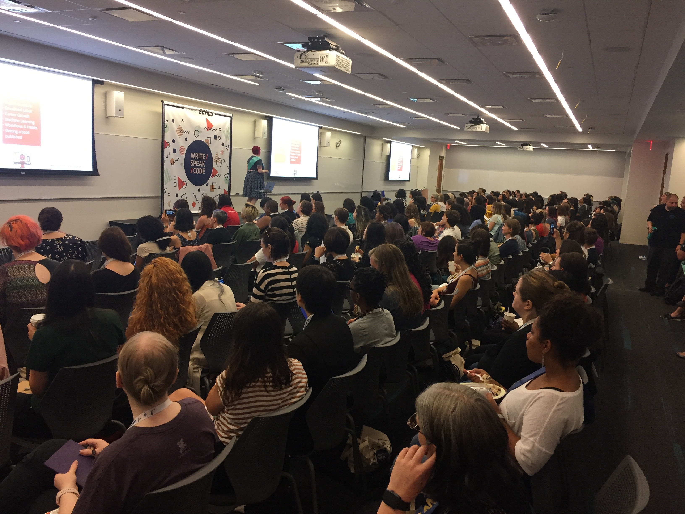
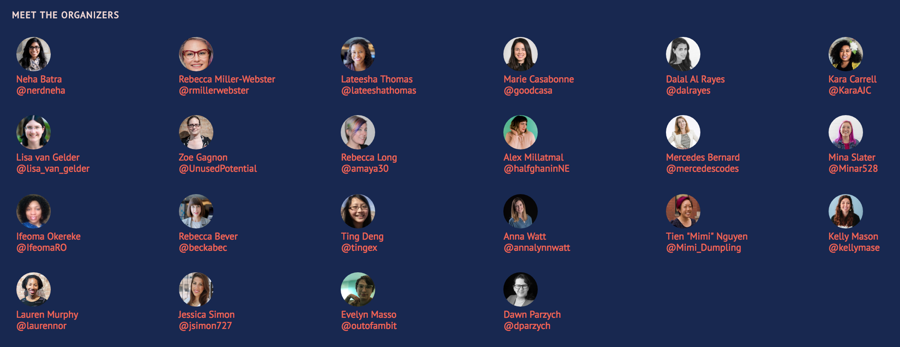
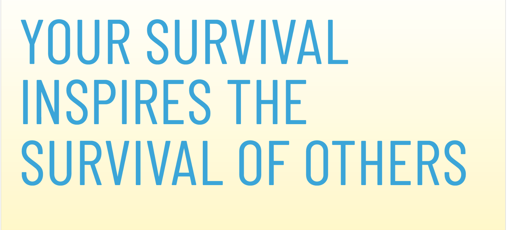

  
   

## About Write/Speak/Code
[Write/Speak/Code](https://www.writespeakcode.com) (WSC) was founded in 2013 by [Rebecca Miller-Webster](https://www.linkedin.com/in/rjmillerwebster/) ([@rmillerwebster](https://twitter.com/rmillerwebster)).  Its mission is to increase the visibility and leadership of **women and non-binary** coders through:  
- thought leadership
- conference speaking
- open source contributions
- career development
- personal growth
- self-care

They currently have [5 meetup chapters](https://www.meetup.com/pro/writespeakcode) in the following United States cities:  
- [Chicago](https://www.meetup.com/WriteSpeakCode-Chicago/)
- [New York](https://www.meetup.com/Write-Speak-Code-NYC/)
- [Seattle](https://www.meetup.com/WSC-Seattle/)
- [San Francisco Bay Area](https://www.meetup.com/WriteSpeakCode-SFBay/)
- [Los Angeles](https://www.meetup.com/Write-Speak-Code-Los-Angeles/)

If you live in a city that is not represented, and you would like to start a chapter, email `info@writespeakcode.com`

## WSC 2018 Conference

The fifth annual [WSC national conference](http://www.writespeakcode.com/2018/) was held in New York City at the [Microsoft Technology Center](https://www.microsoft.com/en-us/mtc/locations/new-york.aspx) on August 1-4, 2018.  Multiple [WeWork](https://www.wework.com/l/new-york-city--NY) venues in midtown Manhattan were also utilized for breakout sessions. About 300 women and non-binary people in tech attended.   

### Conference Organizers - It Takes A Village
Conference tickets are priced from $75 to $600 for the 4-day conference.  These registration fees only represent a fraction of the actual cost of the conference.  This conference was organized by dozens of people ("volunteers") who gave hours (days and weeks) of their personal time to make the conference possible.  Sponsors also donate to cover the cost of venue, food, childcare, scholarships, sign language interpreters and more. 

#### Organizers
Here are some of the organizers whom I met during the conference:  
- Neha Batra, [@nerdneha](https://twitter.com/nerdneha)
- Lateesha Thomas, [@lateeshathomas](https://twitter.com/lateeshathomas)
- Marie Casabonne, [@goodcasa](https://twitter.com/goodcasa)
- Lisa van Gelder, [@lisa_van_gelder](https://twitter.com/lisa_van_gelder)
- Mina Slater, [@Minar528](@Minar528)

 

---
## Conference Content 
- Conference [schedule](http://www.writespeakcode.com/2018/schedule.html) of speakers and talk titles
- All conference [slides](https://github.com/WriteSpeakCode/wsc-resources/tree/master/conference/2018-conference/slides) are available on GitHub.  The talks were not video-recorded.  
- Twitter hashtag is [#wsc2018conf](https://twitter.com/hashtag/wsc2018conf?vertical=default&src=hash)

---
## What Makes Write/Speak/Code Awe-inspiring
 <figure>
   
 <figcaption>Ann Guilinger @aguilinger </figcaption>
</figure>

While reports and laments of lack of diversity in tech are plentiful, actions that propel change are more meaningful and helpful.  The conversation in tech has recently been in acknowledging the problems:  Silicon Valley and throughout the nation on sexual harassment in tech, the diversity deficit in STEM fields, lack of advancement of women and underrepresented groups, the abysmal diversity statistics at the top tech companies.  This group has explored what their needs are, examined how others are succeeding, have built an inclusive environment and encourage people to share their expertise and inspire and support others; their taglines are **Own Your Expertise!** and **Speak Your Truth.**

## What Makes WSC Inclusive: 'If You Build It, They Will Come'
This was the most inclusive, welcoming conference I have ever attended.  I had never seen so many women of color and transgender and non-binary tech people assembled in one place as well as giving keynote talks!  These are all the ways in which WSC created an environment of inclusivity: 

- Code of Conduct
  - available on the website
  - reviewed each morning of the conference
  - on-site representatives available to discuss any concerns or violations
- Organizers
  - conference organizers wore a sash, and it was was very easy to identify and locate someone to ask questions or for help
  - organizers were from all underrepresented groups
- Diversity of Speakers
  - speakers were women or binary people
  - women of color were well-represented on stage
- Language
  - gender inclusive language was explained, examples were given
  - personally, it was refreshing to be at an event where I did not have to hear "You guys..."
  - any misstep of language use was acknowledged
  - ableist language was explained, including its impact, examples were given 
- Gender Pronouns
  - buttons provided for pronouns
  - all speakers introduced themselves with their pronoun
- Food
  - there were options for vegan, halal, dairy-free, gluten-free
  - attendees with dietary restrictions were permitted to get their food first, so they would have the opportunity to get what they needed
- Microphone
  - use of microphones was required for all speakers
  - all speakers had been instructed on how to effectively use a microphone so attendees could hear theme
  - questions from the audience were either spoken into microphone by asker, or repeated by the stage speaker
- Communicating with Others
  - give others a chance to speak and finish what they have to say
  - encourage listening; then asking "Do you want me to listen or also respond?"
  - prefer shared experience over advice ("should")
- Tshirts
  - t-shirts were available in **women's cut** and in different sizes 
- Quiet Rooms
- Lactation Rooms
- Childcare
- Transportation
  - Lyft service was provided for attendees with mobility needs to the nearby venues for breakout sessions
- Gender neutral bathrooms were available
- Sign language interpreters
- Seats for mobility impaired were reserved in the front of the room
- Scholarships were awarded based on need and impact, including some need-based travel stipends
- Feedback
  - at the end of each day there were feedback forms 
- Networking
  - Slack was available to communicate with conference organizers as well as attendees
- Lap Desks
  - lap desks were available to make working on the computer easier
- Content Warnings
  - emails were sent the day prior to any talks that were deemed "potentially triggering content."  Examples include topics of self-help, mental health, disability and others.  This communication alone prepared us as well as being a general acknowledgment that many of the topics, including those of career development, could trigger difficult feelings.
  
## My Experience
This was my first time attending a WSC national conference.  I am grateful to have received one of the scholarships and that it was located in a venue that accessible to me.  As someone who cannot eat dairy, I was thankful that there were appropriate food options available.  Although it was generous of WSC to offer Lyft service for mobility impaired attendees to go to the outside venues, since I recently had ankle surgery, I chose to stay in the main venue at Microsoft and attend the Explorations Track.  I attended as much of the conference as I was able to, with my ankle healing.  I did not attend for all 4 full days and skipped the evening events.

### Networking

Since I live in New York City, I saw many familiar faces from the local meetup community.  During many of the talks, we were asked to partner up to do exercises and encouraged to speak to someone new.  As an introvert, I appreciated the nudge to meet and speak to others.  I met amazing women and non-binary folks from Portland, Seattle, Chicago, Toronto, St. Louis, Boston and more.  I met a few data scientists, but primarily the attendees were developers and software engineers.  It was advantageous to expand my network and meet so many inspiring and ambitious coders from all walks of tech.  I learned about topics that we don't even touch upon in data science such as mentorship and asking for feedback.  

### The Important Stuff
I was pleasantly surprised to discover that many topics I had explored privately via google searches were discussed openly in a room full of hundreds of women and non-binary people!  Those topics include:
- **Rockstars at Work, aka "Toxic Workers"**:  Ann Guilinger's ([@aguinlinger](https://twitter.com/AGuilinger)) talk on surviving toxic co-workers was enlightening and hopeful
- **Onboarding**:  helping new employees as well as asking for help when we are the *new employee*
- **Mindfulness**:  how just being aware can impact our actions
- **Getting Feedback**:  from co-workers, that is **A**ctionable, **S**pecific and **K**ind.  
  - they also mention that the feedback spotlight technical skills
  - there is a worksheet for [feedback](is.gd/feedback_wsc)
- **Self-care**:  balancing work, not having our entire lives revolve around tech and that it is ok and to be encouraged to have other passions
- **Getting Promoted**:  being visible at work, speaking up, asking directly for promotion requirements, delivering and following up
- **Conflict**:  communicating and emotions in the workplace, by Lara Hogan ([@lara_hogan](https://twitter.com/lara_hogan), [blogs](https://larahogan.me/blog/))

### The Technical Stuff
There were breakout sessions on these topics as well:
- Blogging
- Submitting a CFP Proposal
- Podcasting
- Publishing a book
- Open source
- Jewelry making
- Investing, Venture Capital
- and more

## Supporting Write/Speak/Code

The [WSC Sponsorship Prospectus](https://www.writespeakcode.com/assets/WSC-SponsorshipProspectus-2018.pdf) is available online for corporate sponsors.  

Individuals can donate via:  
- [Patreon](https://www.patreon.com/writespeakcode)
- [Paypal](https://www.paypal.me/writespeakcode)
- Venmo:  @writespeakcode

---
# Twitter Highlights

Twitter was rocking at this conference!  It's also a convenient way to get to know others, access resources and take notes.  Since not everyone can attend this national conference, the live-tweeting made the conference accessible to folks around the world.  I share the sentiment of the below tweeter.  In this section, I share some of my favorite tweets from the conference.  

<blockquote class="twitter-tweet" data-lang="en">
Super thankful for all you livetweeters out there. You&#39;re helping those of us who can&#39;t join in on these great conversations! <a href="https://twitter.com/hashtag/wsc2018conf?src=hash&amp;ref_src=twsrc%5Etfw">#wsc2018conf</a> <a href="https://twitter.com/hashtag/jsm2018?src=hash&amp;ref_src=twsrc%5Etfw">#jsm2018</a> <a href="https://twitter.com/hashtag/useR2018?src=hash&amp;ref_src=twsrc%5Etfw">#useR2018</a>
&mdash; Elan Simon Parsons 🔎 (@daoteajing) <a href="https://twitter.com/daoteajing/status/1025054583536734209?ref_src=twsrc%5Etfw">August 2, 2018</a></blockquote>

## Diversity, Inclusion and Equity

<blockquote class="twitter-tweet" data-lang="en">
.<a href="https://twitter.com/WriteSpeakCode?ref_src=twsrc%5Etfw">@WriteSpeakCode</a> is a true example of RADICAL INCLUSION. If you are confused on how to make a conference inclusive to EVERYONE, take some time to learn from this conf! I am so inspired and filled with gratitude. <a href="https://twitter.com/hashtag/WSC2018conf?src=hash&amp;ref_src=twsrc%5Etfw">#WSC2018conf</a>
&mdash; Crystal Martin (@codermeow) <a href="https://twitter.com/codermeow/status/1025148796420993024?ref_src=twsrc%5Etfw">August 2, 2018</a></blockquote>

<blockquote class="twitter-tweet" data-lang="en">
Making it inclusive: - sign language interpreter - nursing rooms  - childcare - quiet room - gender neutral bathrooms  - seats for limited mobility - vegan food options - code of conduct <a href="https://twitter.com/hashtag/WSC2018Conf?src=hash&amp;ref_src=twsrc%5Etfw">#WSC2018Conf</a> <a href="https://t.co/xy5wJsAZ6p">pic.twitter.com/xy5wJsAZ6p</a>
&mdash; Reshama Shaikh (@reshamas) <a href="https://twitter.com/reshamas/status/1024649862657265668?ref_src=twsrc%5Etfw">August 1, 2018</a></blockquote>

<blockquote class="twitter-tweet" data-lang="en">
Diversity:  make sure everyone is in the room  Inclusion:  make sure everyone feels welcome  Integrity:  how we do that  Equity: make sure everyone gets what they *need*  Emma Rodriguez of Google at <a href="https://twitter.com/hashtag/WSC2018Conf?src=hash&amp;ref_src=twsrc%5Etfw">#WSC2018Conf</a> <a href="https://t.co/HQyDBdkjPq">pic.twitter.com/HQyDBdkjPq</a>
&mdash; Reshama Shaikh (@reshamas) <a href="https://twitter.com/reshamas/status/1025384111861653505?ref_src=twsrc%5Etfw">August 3, 2018</a></blockquote>

<blockquote class="twitter-tweet" data-lang="en">
💡Pro-tip: Consider having a marginalized person to review your blog posts, technical zines, talks, etc. They might be able to catch some unintentional gendered language, ableist language, etc. <a href="https://twitter.com/hashtag/WSC2018Conf?src=hash&amp;ref_src=twsrc%5Etfw">#WSC2018Conf</a> <a href="https://t.co/LUzaOH4yJA">pic.twitter.com/LUzaOH4yJA</a>
&mdash; Write/Speak/Code (@WriteSpeakCode) <a href="https://twitter.com/WriteSpeakCode/status/1024767226849755136?ref_src=twsrc%5Etfw">August 1, 2018</a></blockquote>

## Dietary Restrictions

<blockquote class="twitter-tweet" data-lang="en">
It is 💯 that Write Speak Code has people with dietary restrictions go first in the food line. Often there is little vegan food left by the time I get to the front.<a href="https://twitter.com/hashtag/WSC2018Conf?src=hash&amp;ref_src=twsrc%5Etfw">#WSC2018Conf</a>
&mdash; Tilde Ann Thurium (@annthurium) <a href="https://twitter.com/annthurium/status/1024713344526282753?ref_src=twsrc%5Etfw">August 1, 2018</a></blockquote>

## Blogging

<blockquote class="twitter-tweet" data-lang="en">
Love <a href="https://twitter.com/techgirl1908?ref_src=twsrc%5Etfw">@techgirl1908</a>’s four categories of blog outlines. A blank page can be intimidating; following an outline structure can help you get started &amp; make your writing more effective <a href="https://twitter.com/hashtag/WSC2018Conf?src=hash&amp;ref_src=twsrc%5Etfw">#WSC2018Conf</a> <a href="https://t.co/AEdfVLlmyj">pic.twitter.com/AEdfVLlmyj</a>
&mdash; Emily Robinson (@robinson_es) <a href="https://twitter.com/robinson_es/status/1024747996989325314?ref_src=twsrc%5Etfw">August 1, 2018</a></blockquote>

  
## Toxic "Rockstar" Co-workers

<blockquote class="twitter-tweet" data-lang="en">
Don&#39;t pull the ladder up behind you, celebrate when people get to where you got faster, be happy that you created a path and provided the tools! <a href="https://twitter.com/hashtag/WSC2018?src=hash&amp;ref_src=twsrc%5Etfw">#WSC2018</a>
&mdash; Ann Guilinger @ Write/Speak/Code NYC (@AGuilinger) <a href="https://twitter.com/AGuilinger/status/1025509916927303680?ref_src=twsrc%5Etfw">August 3, 2018</a></blockquote>

 
<blockquote class="twitter-tweet" data-lang="en">
Surviving &#39;Rockstar&#39; Programmers by <a href="https://twitter.com/AGuilinger?ref_src=twsrc%5Etfw">@AGuilinger</a> <a href="https://twitter.com/hashtag/wsc2018conf?src=hash&amp;ref_src=twsrc%5Etfw">#wsc2018conf</a> <a href="https://twitter.com/hashtag/sketchnotes?src=hash&amp;ref_src=twsrc%5Etfw">#sketchnotes</a> <a href="https://t.co/rtdOCBIh8n">pic.twitter.com/rtdOCBIh8n</a>
&mdash; Chiu-Ki Chan (@chiuki) <a href="https://twitter.com/chiuki/status/1025760044581904384?ref_src=twsrc%5Etfw">August 4, 2018</a></blockquote>

 

  
<blockquote class="twitter-tweet" data-lang="en">
Toxic &quot;rockstar&quot; coworkers, even if theyre super performers, arent worth it to org - <a href="https://twitter.com/AGuilinger?ref_src=twsrc%5Etfw">@AGuilinger</a> Ways to survive 🔍 Focus on yourself ⛑ Protect the team 😔 Have empathy 🛠️ Fix cultural flaws 🗣 Tell others 💬 Have difficult conversations 💆💆‍♂️ Stress mgmt  <a href="https://twitter.com/hashtag/WSC2018Conf?src=hash&amp;ref_src=twsrc%5Etfw">#WSC2018Conf</a> <a href="https://t.co/8Y2qCm22nN">pic.twitter.com/8Y2qCm22nN</a>
&mdash; Write/Speak/Code (@WriteSpeakCode) <a href="https://twitter.com/WriteSpeakCode/status/1025761482762592259?ref_src=twsrc%5Etfw">August 4, 2018</a></blockquote>

  

## Getting Promoted / Building a Career

<blockquote class="twitter-tweet" data-lang="en">
⚡️ KEEP ⚡️ RECEIPTS⚡️ Show your manager the things you’ve done. Find a way to make these receipts public, like through blog posts. ⚡️ GET ⚡️ THAT ⚡️ VISIBILITY ⚡️ IN ⚡️ THE ⚡️ COMPANY - Career Growth and Performance Reviews panel <a href="https://twitter.com/hashtag/WSC2018Conf?src=hash&amp;ref_src=twsrc%5Etfw">#WSC2018Conf</a> <a href="https://t.co/CDELTDzJ5m">pic.twitter.com/CDELTDzJ5m</a>
&mdash; Write/Speak/Code (@WriteSpeakCode) <a href="https://twitter.com/WriteSpeakCode/status/1025074607710240768?ref_src=twsrc%5Etfw">August 2, 2018</a></blockquote>

<blockquote class="twitter-tweet" data-lang="en">
💯 career advice from <a href="https://twitter.com/whereistanya?ref_src=twsrc%5Etfw">@whereistanya</a>:  1) Ask your manager “What do I need to do to exceed expectations?”  2) Send an email afterwards saying “Here’s what we discussed I needed to work on to be on track to be promoted in 9 months”<a href="https://twitter.com/hashtag/wsc2018conf?src=hash&amp;ref_src=twsrc%5Etfw">#wsc2018conf</a>
&mdash; Emily Robinson (@robinson_es) <a href="https://twitter.com/robinson_es/status/1025053020860624901?ref_src=twsrc%5Etfw">August 2, 2018</a></blockquote>

<blockquote class="twitter-tweet" data-lang="en">
Carolyn Van Slyck of <a href="https://twitter.com/Microsoft?ref_src=twsrc%5Etfw">@Microsoft</a> - quit a toxic job - relied on “F*uck It Fund” - followed people on twitter and asked for job - went to job and asked to do things, such as public speaking &amp; more - owned her expertise - loves mentoring &amp; being an advocate <a href="https://twitter.com/hashtag/WSC2018conf?src=hash&amp;ref_src=twsrc%5Etfw">#WSC2018conf</a> <a href="https://t.co/ayH5hjORFb">pic.twitter.com/ayH5hjORFb</a>
&mdash; Reshama Shaikh (@reshamas) <a href="https://twitter.com/reshamas/status/1025021766450733057?ref_src=twsrc%5Etfw">August 2, 2018</a></blockquote>

### On Being "Glue"

<blockquote class="twitter-tweet" data-lang="en">
Slides from my <a href="https://twitter.com/hashtag/wsc2018conf?src=hash&amp;ref_src=twsrc%5Etfw">#wsc2018conf</a> talk on Being Glue:<a href="https://t.co/ZAlBZmdjj8">https://t.co/ZAlBZmdjj8</a>
&mdash; Tanya Reilly (@whereistanya) <a href="https://twitter.com/whereistanya/status/1025191765362597888?ref_src=twsrc%5Etfw">August 3, 2018</a></blockquote>

## Self Care

<blockquote class="twitter-tweet" data-lang="en">
. <a href="https://twitter.com/MinaMarkham?ref_src=twsrc%5Etfw">@MinaMarkham</a> is giving the most excruciatingly vulnerable talk I have ever witnessed at a “tech” conference, and I feel so grateful to have participated in creating the space to make it possible. <a href="https://twitter.com/hashtag/wsc2018conf?src=hash&amp;ref_src=twsrc%5Etfw">#wsc2018conf</a> ❤️ This is why we do the work.
&mdash; Lateesha Thomas (@lateeshathomas) <a href="https://twitter.com/lateeshathomas/status/1024661689000701952?ref_src=twsrc%5Etfw">August 1, 2018</a></blockquote>

<blockquote class="twitter-tweet" data-lang="en">
The audience jotting down notes about how it’s okay to not have passion for coding outside of work, despite what the tech industry says. You love your work, that’s great, but what else do you love? It&#39;s okay to divert that passion to another personal interest. <a href="https://twitter.com/hashtag/WSC2018Conf?src=hash&amp;ref_src=twsrc%5Etfw">#WSC2018Conf</a> <a href="https://t.co/dR9pKgsfeB">pic.twitter.com/dR9pKgsfeB</a>
&mdash; Write/Speak/Code (@WriteSpeakCode) <a href="https://twitter.com/WriteSpeakCode/status/1024739010420387845?ref_src=twsrc%5Etfw">August 1, 2018</a></blockquote>

## Mindfulness

<blockquote class="twitter-tweet" data-lang="en">
Mindfulness Your Way Through the Maelstrom by <a href="https://twitter.com/codermeow?ref_src=twsrc%5Etfw">@codermeow</a>  - mindfulness: non judgmental awareness - builds self confidence  - how you respond to things will change <a href="https://twitter.com/hashtag/wsc2018conf?src=hash&amp;ref_src=twsrc%5Etfw">#wsc2018conf</a> <a href="https://twitter.com/Slalom?ref_src=twsrc%5Etfw">@Slalom</a> <a href="https://t.co/KKLUVsq3Vn">pic.twitter.com/KKLUVsq3Vn</a>
&mdash; Reshama Shaikh (@reshamas) <a href="https://twitter.com/reshamas/status/1025815558812585985?ref_src=twsrc%5Etfw">August 4, 2018</a></blockquote>

<blockquote class="twitter-tweet" data-lang="en">
It&#39;s important to enjoy the moment, b/c many of the people who came before us didn&#39;t have the privilege of enjoying the present. They had to spend too much of the time fighting.  We owe it to our ancestors and our predecessors to enjoy our lives fully. -- <a href="https://twitter.com/codermeow?ref_src=twsrc%5Etfw">@codermeow</a> <a href="https://twitter.com/hashtag/WSC2018Conf?src=hash&amp;ref_src=twsrc%5Etfw">#WSC2018Conf</a> <a href="https://t.co/Y4SbbJjzl3">pic.twitter.com/Y4SbbJjzl3</a>
&mdash; Write/Speak/Code (@WriteSpeakCode) <a href="https://twitter.com/WriteSpeakCode/status/1025827234886701056?ref_src=twsrc%5Etfw">August 4, 2018</a></blockquote>

## Onboarding

<blockquote class="twitter-tweet" data-lang="en">
Solutions for onboarding and welcoming a junior dev: Managers: mentorship program + career ladders Teammates: say hi + check in + offer to pair Junior Devs: update documentation for future jr devs<a href="https://twitter.com/hashtag/WSC2018Conf?src=hash&amp;ref_src=twsrc%5Etfw">#WSC2018Conf</a> <a href="https://t.co/v7jSO2KYHv">pic.twitter.com/v7jSO2KYHv</a>
&mdash; Write/Speak/Code (@WriteSpeakCode) <a href="https://twitter.com/WriteSpeakCode/status/1025824859547480064?ref_src=twsrc%5Etfw">August 4, 2018</a></blockquote>

## Feedback
- [Feedback Worksheet](https://docs.google.com/document/d/1HHQZeGQSod8JRN1aiKzjqUb3kqC8WwCMSZe1YQ3gp_Y/edit)

<blockquote class="twitter-tweet" data-lang="en">
*internal screaming*  Tips to give better feedback:  * Feedback should be actionable, specific, and kind * Feedback should be relevant to your actual role, not about extraneous things like personality or cleanliness * Kind feedback that is not actionable is useless<a href="https://twitter.com/hashtag/WSC2018Conf?src=hash&amp;ref_src=twsrc%5Etfw">#WSC2018Conf</a> <a href="https://t.co/CRuLHq5E1o">https://t.co/CRuLHq5E1o</a>
&mdash; Catt Small (@cattsmall) <a href="https://twitter.com/cattsmall/status/1025837890075615232?ref_src=twsrc%5Etfw">August 4, 2018</a></blockquote>

## Women and Non-binary Folks in Tech

<blockquote class="twitter-tweet" data-lang="en">
The secret history of women and nonbinary folks in tech by <a href="https://twitter.com/hilarysk?ref_src=twsrc%5Etfw">@hilarysk</a> <a href="https://twitter.com/hashtag/WSC2018Conf?src=hash&amp;ref_src=twsrc%5Etfw">#WSC2018Conf</a> <a href="https://twitter.com/hashtag/sketchnotes?src=hash&amp;ref_src=twsrc%5Etfw">#sketchnotes</a> <a href="https://t.co/YtRFwX71j2">pic.twitter.com/YtRFwX71j2</a>
&mdash; Chiu-Ki Chan (@chiuki) <a href="https://twitter.com/chiuki/status/1024788259992481792?ref_src=twsrc%5Etfw">August 1, 2018</a></blockquote>

## Podcasting

<blockquote class="twitter-tweet" data-lang="en">
Everything you want to know about podcasting (but were afraid to ask) by <a href="https://twitter.com/film_girl?ref_src=twsrc%5Etfw">@film_girl</a> <a href="https://twitter.com/hashtag/wsc2018conf?src=hash&amp;ref_src=twsrc%5Etfw">#wsc2018conf</a> <a href="https://twitter.com/hashtag/sketchnotes?src=hash&amp;ref_src=twsrc%5Etfw">#sketchnotes</a> <a href="https://t.co/KC6rxxLTzI">pic.twitter.com/KC6rxxLTzI</a>
&mdash; Chiu-Ki Chan (@chiuki) <a href="https://twitter.com/chiuki/status/1025424447258480642?ref_src=twsrc%5Etfw">August 3, 2018</a></blockquote>

---
## Resources

- [22 Tips on Storytelling from Pixar](https://nofilmschool.com/2012/06/22-rules-storytelling-pixar)
- [Chloe Capital](http://chloecapital.com/about/):  Chloe Capital is focused on early stage technology and tech-enabled companies with talented, hard working, diverse teams. We make seed stage investments in promising companies and use our networks and experience to help them grow. We’re also excited to advance the next generation of inspiring leaders by building a community that offers exclusive access to founder and investor events.
- [Teachers Pay Teachers](https://www.teacherspayteachers.com)
- [Empathetic Engineering](https://speakerdeck.com/outofambit/empathetic-engineering) by Evelyn Masso
- [Canva Presentations](https://www.canva.com/create/presentations/)

## WSC Past Conferences
Past conferences info is available here for reference:    
- [2017 in Portland, Oregon](https://2017.writespeakcode.com/index.html)
- [2016 in Chicago, Illinois](https://2016.writespeakcode.com)
- [2015 in New York, New York](http://2015.writespeakcode.com) 
- [2014 in New York, New York](https://ti.to/rmw/writespeakcode-2014/en)

