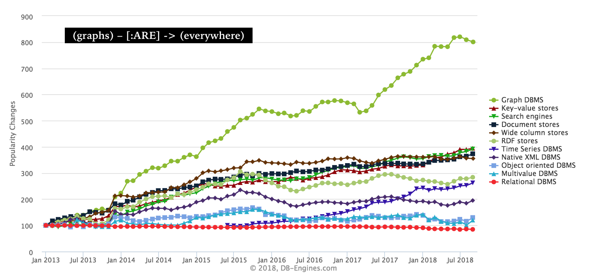

 

## GraphConnect 2018
[GraphConnect 2018](https://graphconnect.com), Neo4j's bi-annual conference, was held in New York City in mid-September.  It took place right in mid-town Manhattan at the beautiful Marriott Marquis Times Square. I had the opportunity to attend some parts of the conference. 

This was the schedule of events:
- Keynotes and Sessions (Thursday)
- Training Sessions (Friday)
- Ecosystem Summit (Friday)
- Community Hackathon (Saturday)
  
### History of GraphConnect
The [first GraphConnect](https://graphconnect.com/#location) conference was held in 2012.  It is worth noting the community and user growth of Neo4j.  I spoke to a participant who attended the first conference 6 years prior who shared that back then about 50 to 100 people attended.  This year, over 1000 people attended.

## About Neo4j
Neo4j efficiency is derived in using "pointers" to connect data, rather than "indices."  Traditional tabular datasets may contain "sparse matrices" if not all relationships between entities exist which slows down performance and is not optimally efficient.  

Neo4j is [open-sourced](https://neo4j.com/open-source-project/).  There is a [Community Edition](https://neo4j.com/download/) that is available for free and also an Enterprise Edition which is available under a commercial license.

## Conference

Neo4j founder [Emil Eifrem](https://www.linkedin.com/in/emileifrem/) and iconic data scientist [Hilary Mason](https://twitter.com/hmason) both delivered fantastic keynotes. [Video recordings](https://neo4j.com/graphconnect-live/) are publicly available for viewing *all* the keynote talks (about 90 minutes in duration).

<blockquote class="twitter-tweet" data-lang="en">
Hello fellow Graphistas and aspiring Graphistas!  Did you miss the <a href="https://twitter.com/hashtag/GraphConnect?src=hash&amp;ref_src=twsrc%5Etfw">#GraphConnect</a> keynotes yesterday from <a href="https://twitter.com/emileifrem?ref_src=twsrc%5Etfw">@emileifrem</a> and the amazing <a href="https://twitter.com/hmason?ref_src=twsrc%5Etfw">@hmason</a>?  Sit down and watch now!!
&mdash; Neo4j (@neo4j) <a href="https://twitter.com/neo4j/status/1043217310369112064?ref_src=twsrc%5Etfw">September 21, 2018</a></blockquote>

  
### Conference Highlights / Key Takeaways from Emil Eifrem

####  Seeing our Data as Networks

<blockquote class="twitter-tweet" data-lang="en">
If our world is a network, we should look at our data as connected.  <a href="https://twitter.com/hashtag/neo4j?src=hash&amp;ref_src=twsrc%5Etfw">#neo4j</a> widely used in health insurance companies.
&mdash; Reshama Shaikh (@reshamas) <a href="https://twitter.com/reshamas/status/1042766874134630400?ref_src=twsrc%5Etfw">September 20, 2018</a></blockquote>

  
####  NoSQL is Resource Intensive / Graphs are Efficient

<blockquote class="twitter-tweet" data-lang="en">
Adobe has a creative cloud.  Users can follow other creatives. Used to use noSQL. Was very resource intensive.  Realizing their data was increasingly connected, reduced # of servers with &gt; results.  <a href="https://twitter.com/hashtag/neo4j?src=hash&amp;ref_src=twsrc%5Etfw">#neo4j</a>
&mdash; Reshama Shaikh (@reshamas) <a href="https://twitter.com/reshamas/status/1042766430851280896?ref_src=twsrc%5Etfw">September 20, 2018</a></blockquote>

####  Popularity of Graphs

<blockquote class="twitter-tweet" data-lang="en">
<a href="https://twitter.com/hashtag/graphconnect?src=hash&amp;ref_src=twsrc%5Etfw">#graphconnect</a> <a href="https://twitter.com/hashtag/neo4j?src=hash&amp;ref_src=twsrc%5Etfw">#neo4j</a> popularity of graph databases <a href="https://t.co/Heb1EuveEF">pic.twitter.com/Heb1EuveEF</a>
&mdash; Jaspreet Singh (@singhjaspreet) <a href="https://twitter.com/singhjaspreet/status/1042767644921876481?ref_src=twsrc%5Etfw">September 20, 2018</a></blockquote>

<blockquote class="twitter-tweet" data-lang="en">
99% of the world’s airline ticket pricing runs through <a href="https://twitter.com/hashtag/neo4j?src=hash&amp;ref_src=twsrc%5Etfw">#neo4j</a>, says our CEO <a href="https://twitter.com/emileifrem?ref_src=twsrc%5Etfw">@emileifrem</a>. <a href="https://twitter.com/hashtag/graphconnect?src=hash&amp;ref_src=twsrc%5Etfw">#graphconnect</a>
&mdash; Lance Walter (@lancewalter) <a href="https://twitter.com/lancewalter/status/1042764322080997379?ref_src=twsrc%5Etfw">September 20, 2018</a></blockquote>

#### Healthcare Application

<blockquote class="twitter-tweet" data-lang="en">
Healthcare Network Graph<a href="https://twitter.com/hashtag/neo4j?src=hash&amp;ref_src=twsrc%5Etfw">#neo4j</a> <a href="https://t.co/8n0lf1jzEA">pic.twitter.com/8n0lf1jzEA</a>
&mdash; Reshama Shaikh (@reshamas) <a href="https://twitter.com/reshamas/status/1042881464189247488?ref_src=twsrc%5Etfw">September 20, 2018</a></blockquote>

### Hilary Mason

<blockquote class="twitter-tweet" data-lang="en">
Packed room for ⁦<a href="https://twitter.com/hmason?ref_src=twsrc%5Etfw">@hmason</a>⁩ kicking off <a href="https://twitter.com/hashtag/GraphConnect?src=hash&amp;ref_src=twsrc%5Etfw">#GraphConnect</a> NYC! <a href="https://twitter.com/hashtag/neo4j?src=hash&amp;ref_src=twsrc%5Etfw">#neo4j</a> <a href="https://t.co/gPKCBC6obm">pic.twitter.com/gPKCBC6obm</a>
&mdash; Jesús Barrasa (@BarrasaDV) <a href="https://twitter.com/BarrasaDV/status/1042779775625035777?ref_src=twsrc%5Etfw">September 20, 2018</a></blockquote>

<blockquote class="twitter-tweet" data-lang="en">
.<a href="https://twitter.com/hmason?ref_src=twsrc%5Etfw">@hmason</a> says, &quot;What does successful AI look like? It&#39;s boring. Like Google Maps, you don&#39;t have to know anything or think about the visualization of getting to your destination. That&#39;s what <a href="https://twitter.com/hashtag/AI?src=hash&amp;ref_src=twsrc%5Etfw">#AI</a> success looks like.&quot;<a href="https://twitter.com/hashtag/graphconnect?src=hash&amp;ref_src=twsrc%5Etfw">#graphconnect</a>
&mdash; GraphConnect 2018 (@GraphConnect) <a href="https://twitter.com/GraphConnect/status/1042778457892106240?ref_src=twsrc%5Etfw">September 20, 2018</a></blockquote>

  
## [Trainings](https://graphconnect.com/#training)
Thirteen different training sessions were offered as a separate conference event.  Topics included modeling, development, data science and analysis for people at all levels of Neo4j experience:
- New to Graphs
  - Neo4j Basics
  - New Features in Neo4j
- Data Scientists and BI/Analysts
  - Graph Algorithms
  - Data Science and ML
  - Discovery and Visualization with Bloom
- Architects, DBAs, and Data Modelers
  - Intro to Graph Modelling  
  - Graph Modelling Clinic
- Developers
  - Python web app development
  - Building apps on the GRANDstack
  - Modeling for Developers (refactoring, evolving, hands-on Cypher)
  - Cypher Tuning & Performance
  - APOC Extensions for Analytics and Operations
  - Graph-Based Natural Language Understanding

<blockquote class="twitter-tweet" data-lang="en">
.<a href="https://twitter.com/amyhodler?ref_src=twsrc%5Etfw">@amyhodler</a> and <a href="https://twitter.com/JMHReif?ref_src=twsrc%5Etfw">@JMHReif</a> teaching centrality algorithms at <a href="https://twitter.com/hashtag/GraphConnect?src=hash&amp;ref_src=twsrc%5Etfw">#GraphConnect</a> <a href="https://t.co/zC4XluvNxV">pic.twitter.com/zC4XluvNxV</a>
&mdash; M. David Allen (@mdavidallen) <a href="https://twitter.com/mdavidallen/status/1043223688961839105?ref_src=twsrc%5Etfw">September 21, 2018</a></blockquote>

<blockquote class="twitter-tweet" data-lang="en">
If you ever have a chance to sit through a <a href="https://twitter.com/hashtag/neo4j?src=hash&amp;ref_src=twsrc%5Etfw">#neo4j</a> Algorithms course with <a href="https://twitter.com/amyhodler?ref_src=twsrc%5Etfw">@amyhodler</a>, do it! <a href="https://twitter.com/hashtag/GraphConnect?src=hash&amp;ref_src=twsrc%5Etfw">#GraphConnect</a>
&mdash; Clair J. Sullivan, PhD (@cjIsALock) <a href="https://twitter.com/cjIsALock/status/1043235299780947970?ref_src=twsrc%5Etfw">September 21, 2018</a></blockquote>

## Ecosystem Summit
This was a private event to bring together the top Neo4j open source contributors, influencers and inspirational community leaders.  Discussions were held in a smaller room.  It was an intimate and casual discussion with Neo4j executives.

<blockquote class="twitter-tweet" data-lang="en">
Lovveeeee these women. They inspire me!!! Thank you for coming and speaking at the Neo4j Ecosystem Summit!!!!<a href="https://twitter.com/gabidavila?ref_src=twsrc%5Etfw">@gabidavila</a> (Developer Advocate, Google), <a href="https://twitter.com/reshamas?ref_src=twsrc%5Etfw">@reshamas</a> (Data Scientist and Organizer of WiMLDS, PyLadies NYC), <a href="https://twitter.com/jumokedada?ref_src=twsrc%5Etfw">@jumokedada</a> (Founder, Tech Women Network) <a href="https://twitter.com/hashtag/Neo4j?src=hash&amp;ref_src=twsrc%5Etfw">#Neo4j</a> <a href="https://twitter.com/hashtag/GraphConnect?src=hash&amp;ref_src=twsrc%5Etfw">#GraphConnect</a> <a href="https://t.co/cpFfXxHsdt">pic.twitter.com/cpFfXxHsdt</a>
&mdash; Karin Wolok (@askkerush) <a href="https://twitter.com/askkerush/status/1043205704134414338?ref_src=twsrc%5Etfw">September 21, 2018</a></blockquote>

<blockquote class="twitter-tweet" data-lang="en">
Balancing <a href="https://twitter.com/hashtag/opensource?src=hash&amp;ref_src=twsrc%5Etfw">#opensource</a> and strategizing revenue is challenging for all tech founders <a href="https://twitter.com/hashtag/GraphConnect?src=hash&amp;ref_src=twsrc%5Etfw">#GraphConnect</a> <a href="https://twitter.com/emileifrem?ref_src=twsrc%5Etfw">@emileifrem</a> <a href="https://t.co/iGn4Mf85fH">pic.twitter.com/iGn4Mf85fH</a>
&mdash; Reshama Shaikh (@reshamas) <a href="https://twitter.com/reshamas/status/1043210439780454400?ref_src=twsrc%5Etfw">September 21, 2018</a></blockquote>

  

<blockquote class="twitter-tweet" data-lang="en">
- The biggest competitors of <a href="https://twitter.com/hashtag/neo4j?src=hash&amp;ref_src=twsrc%5Etfw">#neo4j</a> are all the people who do not know about this product.   - We need to reach users who can and absolutely need to use graphs for their data.   <a href="https://twitter.com/emileifrem?ref_src=twsrc%5Etfw">@emileifrem</a> <a href="https://twitter.com/hashtag/GraphConnect?src=hash&amp;ref_src=twsrc%5Etfw">#GraphConnect</a> <a href="https://t.co/VwG3mMTRLX">pic.twitter.com/VwG3mMTRLX</a>
&mdash; Reshama Shaikh (@reshamas) <a href="https://twitter.com/reshamas/status/1043212788699734017?ref_src=twsrc%5Etfw">September 21, 2018</a></blockquote>

## Hackathon

On Saturday, September 22, there was a free [community event](https://www.meetup.com/nycneo4j/events/253585951/), called [Neo4j Buzzword Bingo Hackathon](https://buzzword.graph.zone), which was a hackathon using the open-source software.  Over 120 tech lovers attended this event which was hosted at [Stack Overflow](https://twitter.com/StackOverflow).
  

<blockquote class="twitter-tweet" data-lang="en">
Graphs workshop in full swing at <a href="https://twitter.com/StackOverflow?ref_src=twsrc%5Etfw">@StackOverflow</a> <a href="https://twitter.com/hashtag/networks?src=hash&amp;ref_src=twsrc%5Etfw">#networks</a> <a href="https://twitter.com/wimlds?ref_src=twsrc%5Etfw">@wimlds</a> <a href="https://twitter.com/NYCPyLadies?ref_src=twsrc%5Etfw">@NYCPyLadies</a> <a href="https://twitter.com/neo4j?ref_src=twsrc%5Etfw">@neo4j</a> <a href="https://t.co/WGJkz3tf2X">pic.twitter.com/WGJkz3tf2X</a>
&mdash; WiMLDS NYC (@WiMLDS_NYC) <a href="https://twitter.com/WiMLDS_NYC/status/1043508496136843264?ref_src=twsrc%5Etfw">September 22, 2018</a></blockquote>

  

<blockquote class="twitter-tweet" data-lang="en">
.<a href="https://twitter.com/mkheck?ref_src=twsrc%5Etfw">@mkheck</a> look at how awesome your daughter is!!! <a href="https://twitter.com/JMHReif?ref_src=twsrc%5Etfw">@JMHReif</a> leading the &#39;Intro to <a href="https://twitter.com/hashtag/Neo4j?src=hash&amp;ref_src=twsrc%5Etfw">#Neo4j</a>&#39; workshop at this year&#39;s <a href="https://twitter.com/hashtag/GraphConnect?src=hash&amp;ref_src=twsrc%5Etfw">#GraphConnect</a> <a href="https://twitter.com/hashtag/GraphHack?src=hash&amp;ref_src=twsrc%5Etfw">#GraphHack</a> <a href="https://twitter.com/hashtag/hackathon?src=hash&amp;ref_src=twsrc%5Etfw">#hackathon</a> at <a href="https://twitter.com/StackOverflow?ref_src=twsrc%5Etfw">@StackOverflow</a> <a href="https://t.co/Rn2eVwInMa">pic.twitter.com/Rn2eVwInMa</a>
&mdash; Karin Wolok (@askkerush) <a href="https://twitter.com/askkerush/status/1043495245286187008?ref_src=twsrc%5Etfw">September 22, 2018</a></blockquote>

## Social Media
- Conference hashtags are:
  - [#GraphConnect](https://twitter.com/hashtag/GraphConnect?src=hash)
  - [#Neo4j](https://twitter.com/hashtag/GraphConnect?src=hash)
- Twitter Handles
  - [@neo4j](https://twitter.com/neo4j?lang=en)
  - [@graphconnect](https://twitter.com/graphconnect?lang=en)
  - [@emileifrem](https://twitter.com/emileifrem) (Founder)

## Neo4j [Company Milestones](https://neo4j.com/company/)
- **2000:**  Neo’s founders encountered performance problems with RDBMS and started building the first Neo4j prototype
- **2002:**  Developed the first ever version of Neo4j
- **2003:**  First 24×7 production Neo4j deployment
- **2007:**  Formed a Swedish-based company behind Neo4j. Also open sourced the first graph database, Neo4j, under the GPL
- **2009:**  Raised seed funding, $2.5M, from Sunstone and Conor and continued development
  - First Global 2000 Customer
- **2010:**  Released Neo4j version 1.0  
- **2011:**  Raised A round and moved headquarters to Silicon Valley  
- **2012:**  Raised $11M Series B from Fidelity, Sunstone, and Conor
  - GraphConnect SF 2012GraphConnect, first conference on graph databases
- **2015:**  Raised $20M Series C from Creandum with Dawn and existing investors
  - 2M+ Downloads of Neo4j
- **2016:**  $36M Series D from Greenbridge Investment
- **2017:**  Neo4j announces the Graph Platform, a connection-first approach to data query, visualization and analysis data.

## Resources
- [Graph Databases](http://graphdatabases.com/?_ga=2.167459646.1699415370.1537624498-769648181.1535652704) (book by:  [Jim Webber](https://twitter.com/jimwebber), [Ian Robinson](https://twitter.com/iansrobinson) and [Emil Eifrem](https://twitter.com/emileifrem))
- [Neo4j Community](https://community.neo4j.com)
- [Neo4j Certification](https://neo4j.com/graphacademy/neo4j-certification/)
- [Neo4j Users Slack team](http://neo4j-users-slack-invite.herokuapp.com/)
- [Become a Neo4j Community Maven](https://neo4j.com/community/neo4j-community-maven/)
- [Download Neo4j Desktop](https://neo4j.com/download/)
- [The Neo4j Operations Manual v3.4](https://neo4j.com/docs/operations-manual/3.4/)
- [DB-Engines](https://db-engines.com/en/ranking_categories)

## Fun

### Networking at a Networks Conference

<blockquote class="twitter-tweet" data-lang="en">
People connecting at <a href="https://twitter.com/hashtag/GraphConnect?src=hash&amp;ref_src=twsrc%5Etfw">#GraphConnect</a>. A year from now you might not remember bullet 3 on slide 15, but you might be running a project with someone you meet.  Coffee is important.  ;) <a href="https://t.co/WS1oqfKmVk">pic.twitter.com/WS1oqfKmVk</a>
&mdash; M. David Allen (@mdavidallen) <a href="https://twitter.com/mdavidallen/status/1042789644633559040?ref_src=twsrc%5Etfw">September 20, 2018</a></blockquote>

<blockquote class="twitter-tweet" data-lang="en">
“I drink in pubs that are older than your country.” 😅 says a Brit to an American at <a href="https://twitter.com/hashtag/GraphConnect?src=hash&amp;ref_src=twsrc%5Etfw">#GraphConnect</a>
&mdash; Reshama Shaikh (@reshamas) <a href="https://twitter.com/reshamas/status/1043205461141536768?ref_src=twsrc%5Etfw">September 21, 2018</a></blockquote>

### Fun in the DevZone

<blockquote class="twitter-tweet" data-lang="en">
GraphConnect is getting weird and keynote hasn&#39;t even started .... Lol <a href="https://twitter.com/hashtag/GraphConnect2018?src=hash&amp;ref_src=twsrc%5Etfw">#GraphConnect2018</a> <a href="https://twitter.com/hashtag/Neo4j?src=hash&amp;ref_src=twsrc%5Etfw">#Neo4j</a> <a href="https://twitter.com/hashtag/DevZone?src=hash&amp;ref_src=twsrc%5Etfw">#DevZone</a> <a href="https://twitter.com/hashtag/GraphConnect?src=hash&amp;ref_src=twsrc%5Etfw">#GraphConnect</a> <a href="https://twitter.com/hashtag/GraphDatabases?src=hash&amp;ref_src=twsrc%5Etfw">#GraphDatabases</a> <a href="https://t.co/BEatese2pL">pic.twitter.com/BEatese2pL</a>
&mdash; Karin Wolok (@askkerush) <a href="https://twitter.com/askkerush/status/1042765878000017409?ref_src=twsrc%5Etfw">September 20, 2018</a></blockquote>

### Learning Neo4j

<blockquote class="twitter-tweet" data-lang="en">
.<a href="https://twitter.com/jimwebber?ref_src=twsrc%5Etfw">@jimwebber</a> visualizing the “graph learning curve.” Seems unfamiliar and scary at first (because it’s different), then people get it and eventually love it. <a href="https://twitter.com/hashtag/neo4j?src=hash&amp;ref_src=twsrc%5Etfw">#neo4j</a> <a href="https://twitter.com/hashtag/graphconnect?src=hash&amp;ref_src=twsrc%5Etfw">#graphconnect</a> <a href="https://t.co/woMX1Ba0F0">pic.twitter.com/woMX1Ba0F0</a>
&mdash; Lance Walter (@lancewalter) <a href="https://twitter.com/lancewalter/status/1043164356459077633?ref_src=twsrc%5Etfw">September 21, 2018</a></blockquote>

