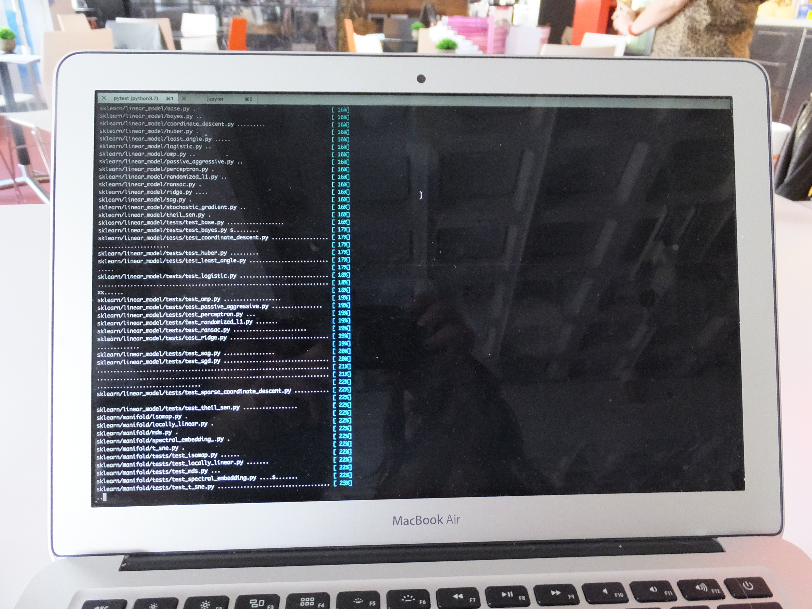
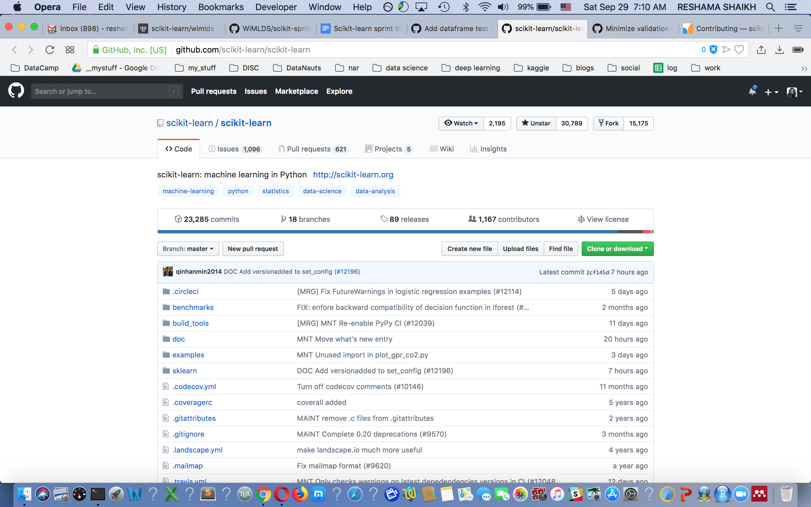
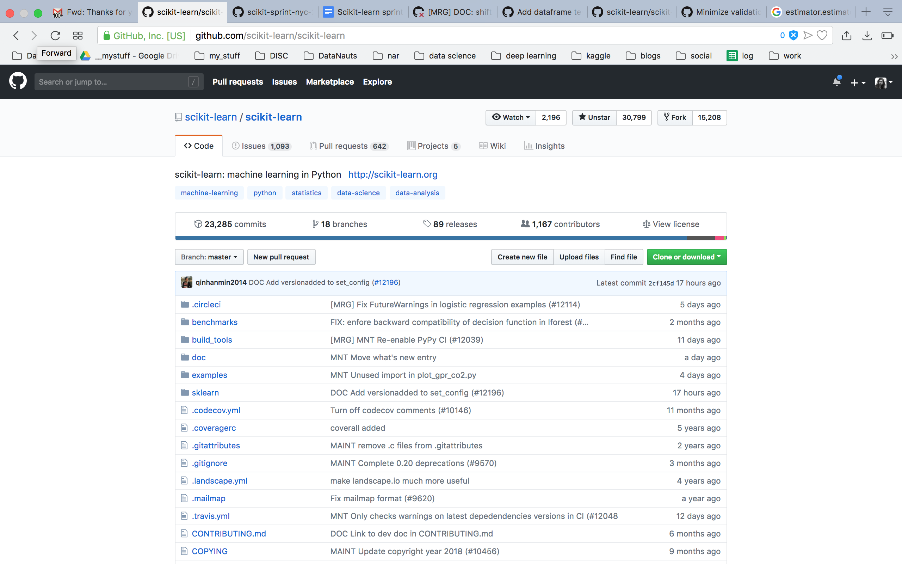

## Sprint Repo
This is our repository for all items related to the [2018 NYC WiMLDS Scikit Sprint](https://github.com/WiMLDS/scikit-sprint-nyc-2018)

## Advertising Sprint

<blockquote class="twitter-tweet" data-lang="en">
There&#39;s still some spots left in the  NYC Women in Machine Learning &amp; Data Science Scikit-learn Sprint on September 29! Joing <a href="https://twitter.com/reshamas?ref_src=twsrc%5Etfw">@reshamas</a> and me for a day of contributing to OSS! <a href="https://t.co/vpsdafg4DD">https://t.co/vpsdafg4DD</a>
&mdash; Andreas Mueller (@amuellerml) <a href="https://twitter.com/amuellerml/status/1037001088371752960?ref_src=twsrc%5Etfw">September 4, 2018</a></blockquote>

### Honorable Mentions
- Alice Martin
- Belgian

## [History of Scikit-Learn](http://scikit-learn.org/stable/about.html) Python Library

This project was started in 2007 as a Google Summer of Code project by [David Cournapeau](https://twitter.com/cournape). Later that year, [Matthieu Brucher](https://www.linkedin.com/in/matthieubrucher/) started work on this project as part of his thesis.

In 2010 [Fabian Pedregosa](https://twitter.com/fpedregosa), [Gael Varoquaux](https://twitter.com/GaelVaroquaux), [Alexandre Gramfort](https://twitter.com/agramfort) and [Vincent Michel](https://www.linkedin.com/in/vincent-michel-79526427/) of [INRIA](https://www.inria.fr/en) took leadership of the project and made the first public release, February the 1st 2010. Since then, several releases have appeared following a ~3 month cycle, and a thriving international community has been leading the development.

## The Sprint

<blockquote class="twitter-tweet" data-lang="en">
Kicking off the <a href="https://twitter.com/hashtag/scikitSprint?src=hash&amp;ref_src=twsrc%5Etfw">#scikitSprint</a> <a href="https://twitter.com/StackExchange?ref_src=twsrc%5Etfw">@StackExchange</a> with <a href="https://twitter.com/amuellerml?ref_src=twsrc%5Etfw">@amuellerml</a> <a href="https://twitter.com/hashtag/opensource?src=hash&amp;ref_src=twsrc%5Etfw">#opensource</a> <a href="https://twitter.com/wimlds?ref_src=twsrc%5Etfw">@wimlds</a> <a href="https://twitter.com/WiMLDS_NYC?ref_src=twsrc%5Etfw">@WiMLDS_NYC</a> <a href="https://t.co/FQmTWUGHMs">pic.twitter.com/FQmTWUGHMs</a>
&mdash; Laurence de Torrenté (@LauTor83) <a href="https://twitter.com/LauTor83/status/1046041026811637761?ref_src=twsrc%5Etfw">September 29, 2018</a></blockquote>

<blockquote class="twitter-tweet" data-lang="en">
Excited to be TAing at the Crash-Course in Contributing to Open Source Projects workshop with <a href="https://twitter.com/wimlds?ref_src=twsrc%5Etfw">@wimlds</a>! <a href="https://twitter.com/hashtag/ScikitSprint?src=hash&amp;ref_src=twsrc%5Etfw">#ScikitSprint</a> <a href="https://twitter.com/hashtag/opensource?src=hash&amp;ref_src=twsrc%5Etfw">#opensource</a> <a href="https://twitter.com/hashtag/nyc?src=hash&amp;ref_src=twsrc%5Etfw">#nyc</a> <a href="https://twitter.com/hashtag/MachineLearning?src=hash&amp;ref_src=twsrc%5Etfw">#MachineLearning</a>
&mdash; Theodora Hinkle (@acornthea) <a href="https://twitter.com/acornthea/status/1046041016107765760?ref_src=twsrc%5Etfw">September 29, 2018</a></blockquote>

<blockquote class="twitter-tweet" data-lang="en">
We made it to lunchtime, with many teams working on fixing open issues! Go team <a href="https://twitter.com/hashtag/ScikitSprint?src=hash&amp;ref_src=twsrc%5Etfw">#ScikitSprint</a> <a href="https://twitter.com/hashtag/opensource?src=hash&amp;ref_src=twsrc%5Etfw">#opensource</a> <a href="https://twitter.com/wimlds?ref_src=twsrc%5Etfw">@wimlds</a> <a href="https://t.co/rxHuhJfF5E">pic.twitter.com/rxHuhJfF5E</a>
&mdash; Theodora Hinkle (@acornthea) <a href="https://twitter.com/acornthea/status/1046087076385632257?ref_src=twsrc%5Etfw">September 29, 2018</a></blockquote>

<blockquote class="twitter-tweet" data-lang="en">
Thanks <a href="https://twitter.com/amuellerml?ref_src=twsrc%5Etfw">@amuellerml</a> for giving copies of your book Introduction to Machine Learning with Python for attendees of the scikit-learn sprint today! <a href="https://twitter.com/hashtag/SciKitSprint?src=hash&amp;ref_src=twsrc%5Etfw">#SciKitSprint</a> <a href="https://twitter.com/hashtag/MachineLearning?src=hash&amp;ref_src=twsrc%5Etfw">#MachineLearning</a> <a href="https://t.co/Avdo39sQQZ">pic.twitter.com/Avdo39sQQZ</a>
&mdash; Theodora Hinkle (@acornthea) <a href="https://twitter.com/acornthea/status/1046122924787273729?ref_src=twsrc%5Etfw">September 29, 2018</a></blockquote>

## Testing Our Pull Request

<blockquote class="twitter-tweet" data-lang="en">
Saturday well spent co-organizing another great <a href="https://twitter.com/WiMLDS_NYC?ref_src=twsrc%5Etfw">@WiMLDS_NYC</a> event! Scikit-learn sprint to contribute to open source with <a href="https://twitter.com/amuellerml?ref_src=twsrc%5Etfw">@amuellerml</a>! And he brought his awesome <a href="https://twitter.com/OReillyMedia?ref_src=twsrc%5Etfw">@OReillyMedia</a> book for signing! Thank you <a href="https://twitter.com/StackExchange?ref_src=twsrc%5Etfw">@StackExchange</a> for hosting us! <a href="https://twitter.com/hashtag/python?src=hash&amp;ref_src=twsrc%5Etfw">#python</a> <a href="https://twitter.com/hashtag/opensource?src=hash&amp;ref_src=twsrc%5Etfw">#opensource</a> <a href="https://twitter.com/hashtag/ScikitSprint?src=hash&amp;ref_src=twsrc%5Etfw">#ScikitSprint</a> <a href="https://twitter.com/hashtag/ml?src=hash&amp;ref_src=twsrc%5Etfw">#ml</a> <a href="https://twitter.com/hashtag/WiMLDS?src=hash&amp;ref_src=twsrc%5Etfw">#WiMLDS</a> <a href="https://t.co/C5KFEm0kBz">pic.twitter.com/C5KFEm0kBz</a>
&mdash; Noemi Derzsy (@NoemiDerzsy) <a href="https://twitter.com/NoemiDerzsy/status/1046221251587510272?ref_src=twsrc%5Etfw">September 30, 2018</a></blockquote>

## We Did It!

<blockquote class="twitter-tweet" data-lang="en">
A big thank you to <a href="https://twitter.com/reshamas?ref_src=twsrc%5Etfw">@reshamas</a> for organizing a <a href="https://twitter.com/scikit_learn?ref_src=twsrc%5Etfw">@scikit_learn</a> Sprint with <a href="https://twitter.com/hashtag/WiMLDS?src=hash&amp;ref_src=twsrc%5Etfw">#WiMLDS</a>. Thanks also to <a href="https://twitter.com/StackOverflow?ref_src=twsrc%5Etfw">@StackOverflow</a> for hosting us! <a href="https://twitter.com/hashtag/opensource?src=hash&amp;ref_src=twsrc%5Etfw">#opensource</a> <a href="https://t.co/Lv9ziNbBJa">pic.twitter.com/Lv9ziNbBJa</a>
&mdash; Andreas Mueller (@amuellerml) <a href="https://twitter.com/amuellerml/status/1046120461476802561?ref_src=twsrc%5Etfw">September 29, 2018</a></blockquote>

## Pull Requests 
It looks like 24 pull requests were submitted.  Here's a list of the pull requests:  https://github.com/scikit-learn/scikit-learn/pulls

  
   

