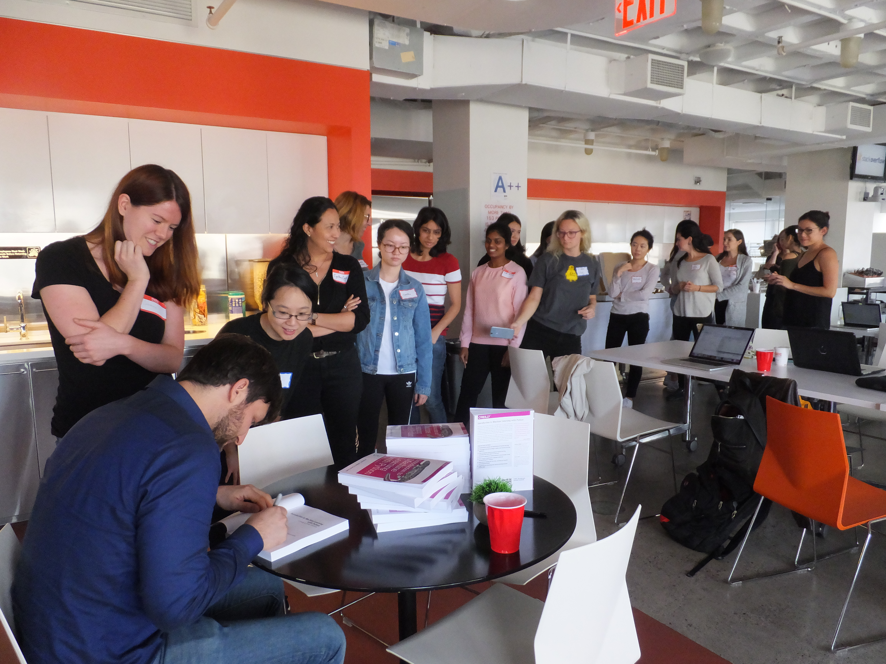
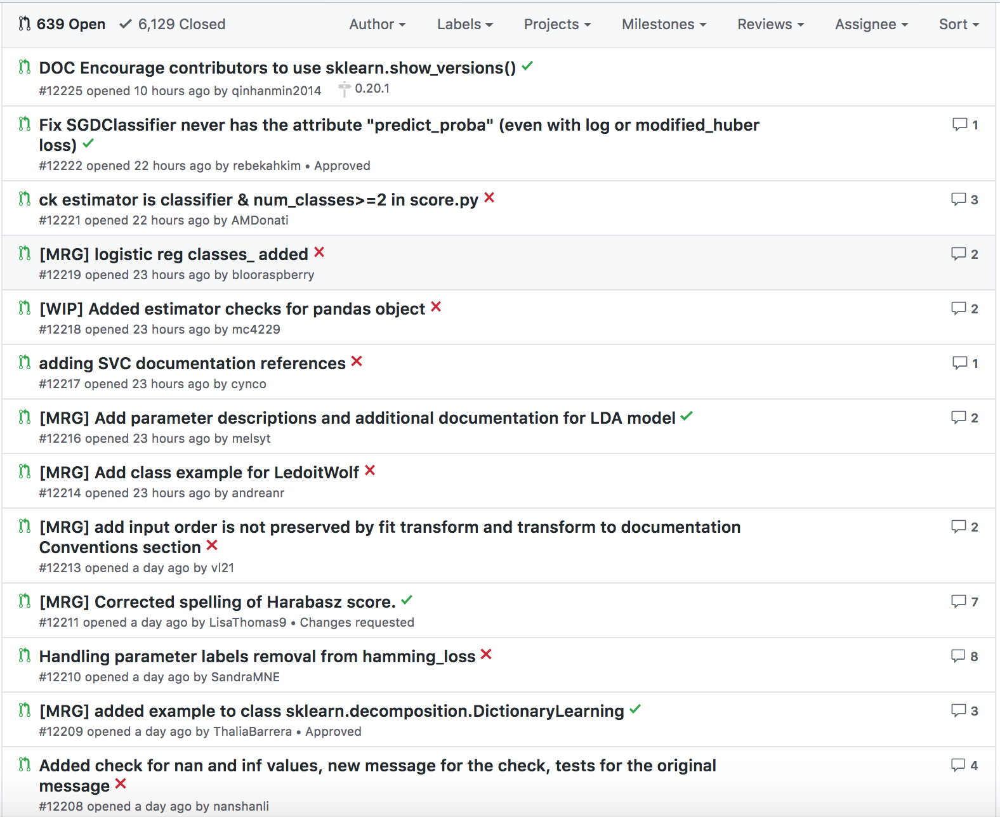
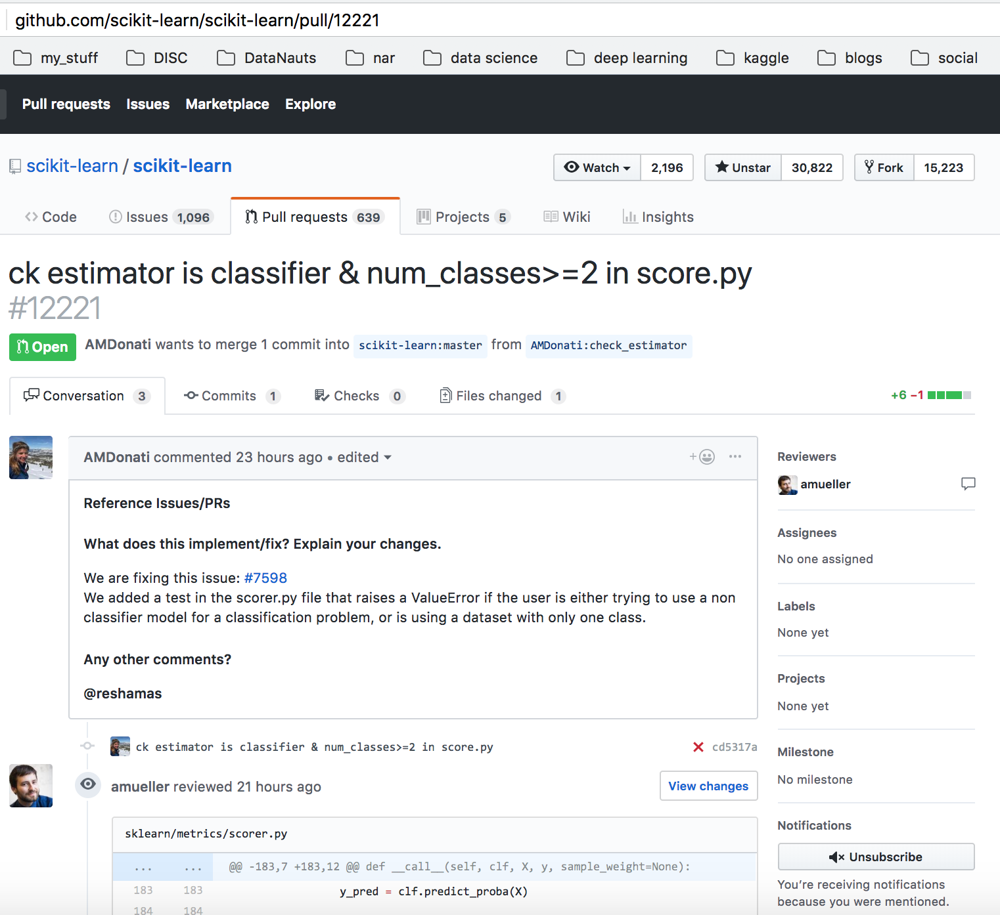
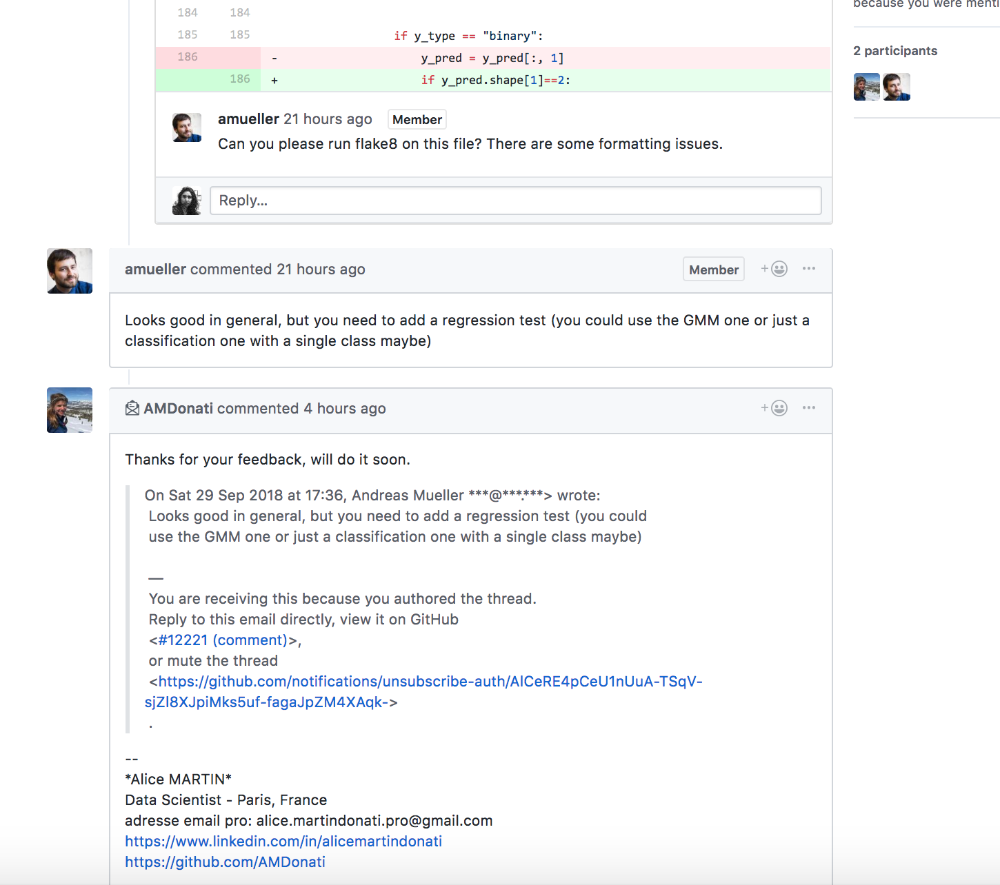

<p float="left">
  
   
</p>
<p>
</p>


## Sprint Repo
The 2nd Annual NYC WiMLDS / Scikit Sprint was held on Saturday, September 29 at Stack Exchange in New York City.  This is our repository for all items related to the [2018 NYC WiMLDS Scikit Sprint](https://github.com/WiMLDS/scikit-sprint-nyc-2018).


## Acknowledgements
- Thank you to Stack Exchange for hosting WiMLDS.  They are also hiring!  Check out their [open positions](https://stackoverflow.com/company/work-here).
- Andreas Mueller, core contributor of scikit-learn for facilitating this event and his team of TAs.
  * [Theodora Hinkle](https://www.linkedin.com/in/theodora-hinkle-5b80a238/)
  * [Nicolas Hug](https://www.linkedin.com/in/nicolas-hug/)
- [WiMLDS Team](https://github.com/WiMLDS/scikit-sprint-nyc-2018/blob/master/README.md#the-team)
  * [Laurence DeTorrente](https://twitter.com/LauTor83)
  * [Noemi Derzsy](https://twitter.com/NoemiDerzsy)
  * [Marina Piller](https://twitter.com/mgpiller)
  * [Carissa Shafto](https://twitter.com/carissa_shafto)

## [History of Scikit-Learn](http://scikit-learn.org/stable/about.html) Python Library

This project was started in 2007 as a Google Summer of Code project by [David Cournapeau](https://twitter.com/cournape). Later that year, [Matthieu Brucher](https://www.linkedin.com/in/matthieubrucher/) started work on this project as part of his thesis.

In 2010 [Fabian Pedregosa](https://twitter.com/fpedregosa), [Gael Varoquaux](https://twitter.com/GaelVaroquaux), [Alexandre Gramfort](https://twitter.com/agramfort) and [Vincent Michel](https://www.linkedin.com/in/vincent-michel-79526427/) of [INRIA](https://www.inria.fr/en) took leadership of the project and made the first public release, February the 1st 2010. Since then, several releases have appeared following a ~3 month cycle, and a thriving international community has been leading the development.

This is how Andreas Mueller became involved in scikit-learn:  
>While working on my Ph.D. in computer vision and learning, the scikit-learn library became an essential part of my toolkit. I was an ardent user of the library, and I wanted to partake in its advancement. My initial participation in open source began in 2011 at the NIPS conference in Granada, Spain, where I had attended a scikit-learn sprint. The scikit-learn release manager at the time had to leave, and the project leads asked me to become release manager; that’s how it all got started.

Read more in this [interview with Andreas Mueller](http://mlconf.com/interview-andreas-muller-lecturer-columbia-university-core-contributor-scikit-learn-reshama-shaikh/). 

## Advertising the Sprint
A few weeks before the sprint, we still had 30 spots open.  The below tweet reached so many scikit-learn users that it ensured that all spots were taken.  

We even had two attendees who lived in Europe.  They were visiting NYC during that time, and so joined the event on Saturday!  I worked with one of them, Alice, who was visiting all the way from Paris.  I was surprised and impressed that they chose to spend their Saturday in New York City at the sprint. 

<blockquote class="twitter-tweet" data-lang="en"><p lang="en" dir="ltr">There&#39;s still some spots left in the <br>NYC Women in Machine Learning &amp; Data Science Scikit-learn Sprint on September 29! Joing <a href="https://twitter.com/reshamas?ref_src=twsrc%5Etfw">@reshamas</a> and me for a day of contributing to OSS! <a href="https://t.co/vpsdafg4DD">https://t.co/vpsdafg4DD</a></p>&mdash; Andreas Mueller (@amuellerml) <a href="https://twitter.com/amuellerml/status/1037001088371752960?ref_src=twsrc%5Etfw">September 4, 2018</a></blockquote>
<script async src="https://platform.twitter.com/widgets.js" charset="utf-8"></script>


## The Sprint

<p>
<blockquote class="twitter-tweet" data-lang="en"><p lang="en" dir="ltr">Kicking off the <a href="https://twitter.com/hashtag/scikitSprint?src=hash&amp;ref_src=twsrc%5Etfw">#scikitSprint</a> <a href="https://twitter.com/StackExchange?ref_src=twsrc%5Etfw">@StackExchange</a> with <a href="https://twitter.com/amuellerml?ref_src=twsrc%5Etfw">@amuellerml</a> <a href="https://twitter.com/hashtag/opensource?src=hash&amp;ref_src=twsrc%5Etfw">#opensource</a> <a href="https://twitter.com/wimlds?ref_src=twsrc%5Etfw">@wimlds</a> <a href="https://twitter.com/WiMLDS_NYC?ref_src=twsrc%5Etfw">@WiMLDS_NYC</a> <a href="https://t.co/FQmTWUGHMs">pic.twitter.com/FQmTWUGHMs</a></p>&mdash; Laurence de Torrenté (@LauTor83) <a href="https://twitter.com/LauTor83/status/1046041026811637761?ref_src=twsrc%5Etfw">September 29, 2018</a></blockquote>
<script async src="https://platform.twitter.com/widgets.js" charset="utf-8"></script>
</p>


<p>
<blockquote class="twitter-tweet" data-lang="en"><p lang="en" dir="ltr">Excited to be TAing at the Crash-Course in Contributing to Open Source Projects workshop with <a href="https://twitter.com/wimlds?ref_src=twsrc%5Etfw">@wimlds</a>! <a href="https://twitter.com/hashtag/ScikitSprint?src=hash&amp;ref_src=twsrc%5Etfw">#ScikitSprint</a> <a href="https://twitter.com/hashtag/opensource?src=hash&amp;ref_src=twsrc%5Etfw">#opensource</a> <a href="https://twitter.com/hashtag/nyc?src=hash&amp;ref_src=twsrc%5Etfw">#nyc</a> <a href="https://twitter.com/hashtag/MachineLearning?src=hash&amp;ref_src=twsrc%5Etfw">#MachineLearning</a></p>&mdash; Theodora Hinkle (@acornthea) <a href="https://twitter.com/acornthea/status/1046041016107765760?ref_src=twsrc%5Etfw">September 29, 2018</a></blockquote>
<script async src="https://platform.twitter.com/widgets.js" charset="utf-8"></script>
</p>


<p>
<blockquote class="twitter-tweet" data-lang="en"><p lang="en" dir="ltr">We made it to lunchtime, with many teams working on fixing open issues! Go team <a href="https://twitter.com/hashtag/ScikitSprint?src=hash&amp;ref_src=twsrc%5Etfw">#ScikitSprint</a> <a href="https://twitter.com/hashtag/opensource?src=hash&amp;ref_src=twsrc%5Etfw">#opensource</a> <a href="https://twitter.com/wimlds?ref_src=twsrc%5Etfw">@wimlds</a> <a href="https://t.co/rxHuhJfF5E">pic.twitter.com/rxHuhJfF5E</a></p>&mdash; Theodora Hinkle (@acornthea) <a href="https://twitter.com/acornthea/status/1046087076385632257?ref_src=twsrc%5Etfw">September 29, 2018</a></blockquote>
<script async src="https://platform.twitter.com/widgets.js" charset="utf-8"></script>
</p>

---

## Book Signing
Andy gave away signed copies of his book [Machine Learning with Python](http://shop.oreilly.com/product/0636920030515.do).



<p>
<blockquote class="twitter-tweet" data-lang="en"><p lang="en" dir="ltr">Thanks <a href="https://twitter.com/amuellerml?ref_src=twsrc%5Etfw">@amuellerml</a> for giving copies of your book Introduction to Machine Learning with Python for attendees of the scikit-learn sprint today! <a href="https://twitter.com/hashtag/SciKitSprint?src=hash&amp;ref_src=twsrc%5Etfw">#SciKitSprint</a> <a href="https://twitter.com/hashtag/MachineLearning?src=hash&amp;ref_src=twsrc%5Etfw">#MachineLearning</a> <a href="https://t.co/Avdo39sQQZ">pic.twitter.com/Avdo39sQQZ</a></p>&mdash; Theodora Hinkle (@acornthea) <a href="https://twitter.com/acornthea/status/1046122924787273729?ref_src=twsrc%5Etfw">September 29, 2018</a></blockquote>
<script async src="https://platform.twitter.com/widgets.js" charset="utf-8"></script>
</p>

---

## Testing Our Pull Request

After working on the issue and committing changes to our branch, we tested our pull request with this code:  
```python
pytest sklearn
```
It is always exciting to see (most of) our code tests passing.

<p>

</p>


---

## Pull Requests Summary
It looks like **24 pull requests** were submitted.  Here's a list of some of the [pull requests](https://github.com/scikit-learn/scikit-learn/pulls).




<p float="left">
  
   
</p>
<p>
</p>

## Now I know why it's called a sprint!
It was more challenging than I had anticipated.  We spent most of the day going through the Python code base, trying to understand the maze of functions and how they are all related.  We explored the Python files to determine where to place the `assert` error for the issue we picked.  


<p>
 <blockquote class="twitter-tweet" data-lang="en"><p lang="en" dir="ltr">This weekend I contributed to an open source project <a href="https://twitter.com/scikit_learn?ref_src=twsrc%5Etfw">@scikit_learn</a> <a href="https://twitter.com/WiMLDS_NYC?ref_src=twsrc%5Etfw">@WiMLDS_NYC</a>. It was more challenging than I had expected but I learned so much! Check out <a href="https://twitter.com/reshamas?ref_src=twsrc%5Etfw">@reshamas</a> blog post to get an idea of what the day looked like. Thanks to <a href="https://twitter.com/StackOverflow?ref_src=twsrc%5Etfw">@StackOverflow</a> for the amazing space 😍 <a href="https://t.co/zcmN3imRnE">https://t.co/zcmN3imRnE</a></p>&mdash; Melissa Ferrari (@Ferrari3Melissa) <a href="https://twitter.com/Ferrari3Melissa/status/1046761969049632774?ref_src=twsrc%5Etfw">October 1, 2018</a></blockquote>
<script async src="https://platform.twitter.com/widgets.js" charset="utf-8"></script>
</p>


---

## We Made It!

<p>
<blockquote class="twitter-tweet" data-lang="en"><p lang="en" dir="ltr">A big thank you to <a href="https://twitter.com/reshamas?ref_src=twsrc%5Etfw">@reshamas</a> for organizing a <a href="https://twitter.com/scikit_learn?ref_src=twsrc%5Etfw">@scikit_learn</a> Sprint with <a href="https://twitter.com/hashtag/WiMLDS?src=hash&amp;ref_src=twsrc%5Etfw">#WiMLDS</a>. Thanks also to <a href="https://twitter.com/StackOverflow?ref_src=twsrc%5Etfw">@StackOverflow</a> for hosting us! <a href="https://twitter.com/hashtag/opensource?src=hash&amp;ref_src=twsrc%5Etfw">#opensource</a> <a href="https://t.co/Lv9ziNbBJa">pic.twitter.com/Lv9ziNbBJa</a></p>&mdash; Andreas Mueller (@amuellerml) <a href="https://twitter.com/amuellerml/status/1046120461476802561?ref_src=twsrc%5Etfw">September 29, 2018</a></blockquote>
<script async src="https://platform.twitter.com/widgets.js" charset="utf-8"></script>
</p>

<p>
<blockquote class="twitter-tweet" data-lang="en"><p lang="en" dir="ltr">Saturday well spent co-organizing another great <a href="https://twitter.com/WiMLDS_NYC?ref_src=twsrc%5Etfw">@WiMLDS_NYC</a> event! Scikit-learn sprint to contribute to open source with <a href="https://twitter.com/amuellerml?ref_src=twsrc%5Etfw">@amuellerml</a>! And he brought his awesome <a href="https://twitter.com/OReillyMedia?ref_src=twsrc%5Etfw">@OReillyMedia</a> book for signing! Thank you <a href="https://twitter.com/StackExchange?ref_src=twsrc%5Etfw">@StackExchange</a> for hosting us! <a href="https://twitter.com/hashtag/python?src=hash&amp;ref_src=twsrc%5Etfw">#python</a> <a href="https://twitter.com/hashtag/opensource?src=hash&amp;ref_src=twsrc%5Etfw">#opensource</a> <a href="https://twitter.com/hashtag/ScikitSprint?src=hash&amp;ref_src=twsrc%5Etfw">#ScikitSprint</a> <a href="https://twitter.com/hashtag/ml?src=hash&amp;ref_src=twsrc%5Etfw">#ml</a> <a href="https://twitter.com/hashtag/WiMLDS?src=hash&amp;ref_src=twsrc%5Etfw">#WiMLDS</a> <a href="https://t.co/C5KFEm0kBz">pic.twitter.com/C5KFEm0kBz</a></p>&mdash; Noemi Derzsy (@NoemiDerzsy) <a href="https://twitter.com/NoemiDerzsy/status/1046221251587510272?ref_src=twsrc%5Etfw">September 30, 2018</a></blockquote>
<script async src="https://platform.twitter.com/widgets.js" charset="utf-8"></script>
</p>

<p>

</p>

## What's Next?
Looks like we still have some work to do on the pull request submitted by my sprint partner, Alice and me.  

<p>

</p>

<p>

 </p>
 
---

## Participating in a Scikit Sprint
If you would like to participate in a scikit sprint, based on the history below, these look like the three best cities:
1.  **Paris, France:**  where the scikit learn library was developed and where the majority of contributors reside
2.  **New York, New York:**  where Andreas Mueller resides
3.  **Austin, Texas:**  where the annual SciPy conference takes place


### Listing of Scikit Sprints
There is a list on the [scikit-learn wiki](https://github.com/scikit-learn/scikit-learn/wiki/Past-sprints). 

- 2018
  - WiMLDS:  [New York City](https://reshamas.github.io/highlights-from-the-2018-NYC-WiMLDS-scikit-sprint) (Sep)
  - SciPy:  [Austin](http://gael-varoquaux.info/programming/sprint-on-scikit-learn-in-paris-and-austin.html) (open sprint, for new contributors) (Jul)
  - Paris:  core sprint, for advanced contributors (Jul)
  - Two Sigma:  [New York City](https://twitter.com/amuellerml/status/1007670849774784512) (Jun)
- 2017
  - [Paris](http://gael-varoquaux.info/programming/scikit-learn-paris-sprint-2017.html) (Jun)
  - WiMLDS: [New York City](https://github.com/WiMLDS/scikit-sprint-nyc-2017/blob/master/README.md) (Mar)
- 2016
  - SciPy:  [Austin](https://scipy2016.scipy.org/ehome/146062/332969/) (Jul)
- 2015
  - SciPy:  [Austin](https://scipy2016.scipy.org/ehome/115969/292867/) (Jul)
  - ODSC:   San Francisco (Nov)
  - Criteo:  [Paris](https://twitter.com/GaelVaroquaux/status/656847270550310912) (Oct)
  - PyData:  Paris (Apr)
- 2014
  - Euro SciPy, Cambridge (Aug)
  - INRIA, Criteo, La paillasse, Tinyclues:  [Paris](http://gael-varoquaux.info/programming/scikit-learn-2014-sprint-a-report.html) (Jul)
  - Cloudera, SF (Feb)
- 2013
  - Paris (Jul)
  - SciPy:  [Austin](https://conference.scipy.org/scipy2013/sprint_detail.php?id=36) (Jun)
- 2012
  - EuroSciPy Bruxelles (Aug)
  - PyCon France (Jul)
  - SciPy:  [Austin](http://conference.scipy.org/scipy2012/sprints/sprint_detail.php?id=15) (Jul)
- 2011
  - NIPS:  [Granada, Spain](http://gael-varoquaux.info/programming/scikit-learn-nips-2011-sprint-international-thanks-to-our-sponsors.html) (Dec)
  - Euro SciPy:  [Paris](http://fa.bianp.net/blog/2011/scikit-learn-euroscipy-2011-coding-sprint-day-one/) (Aug)
  - Austin SciPy (Jul)
  - Paris (Apr)
- 2010 
  - Paris (Sep)
  - Paris (Jun)
  - Paris (Mar)
  - **first release of scikit-learn** (Feb)
