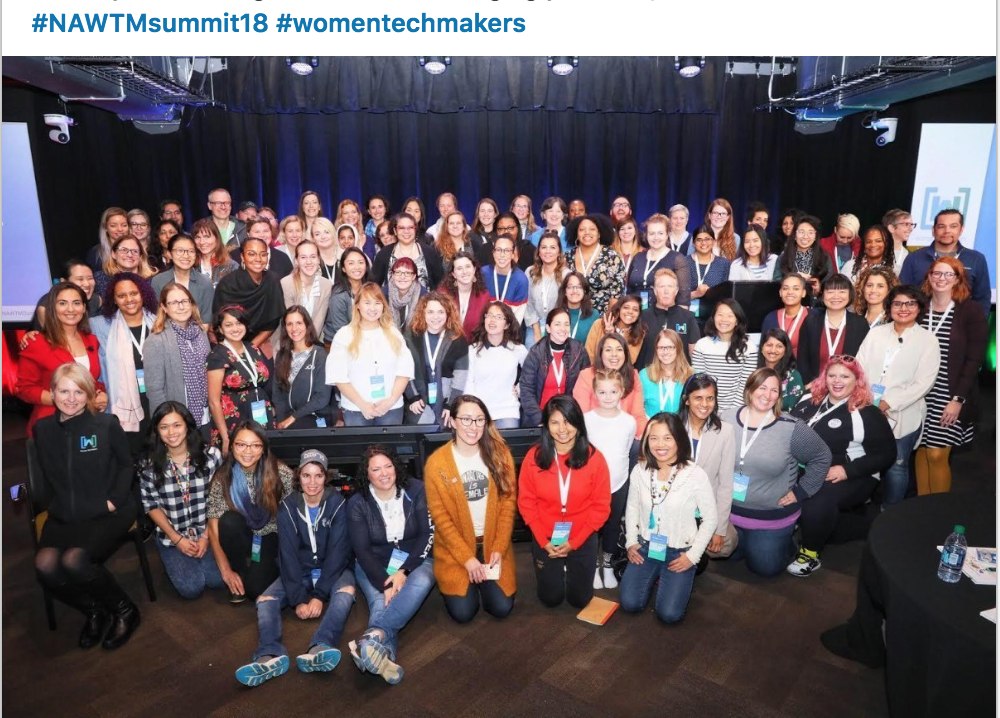
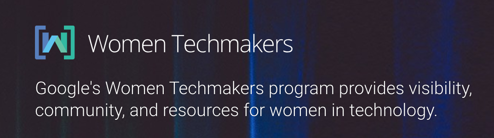
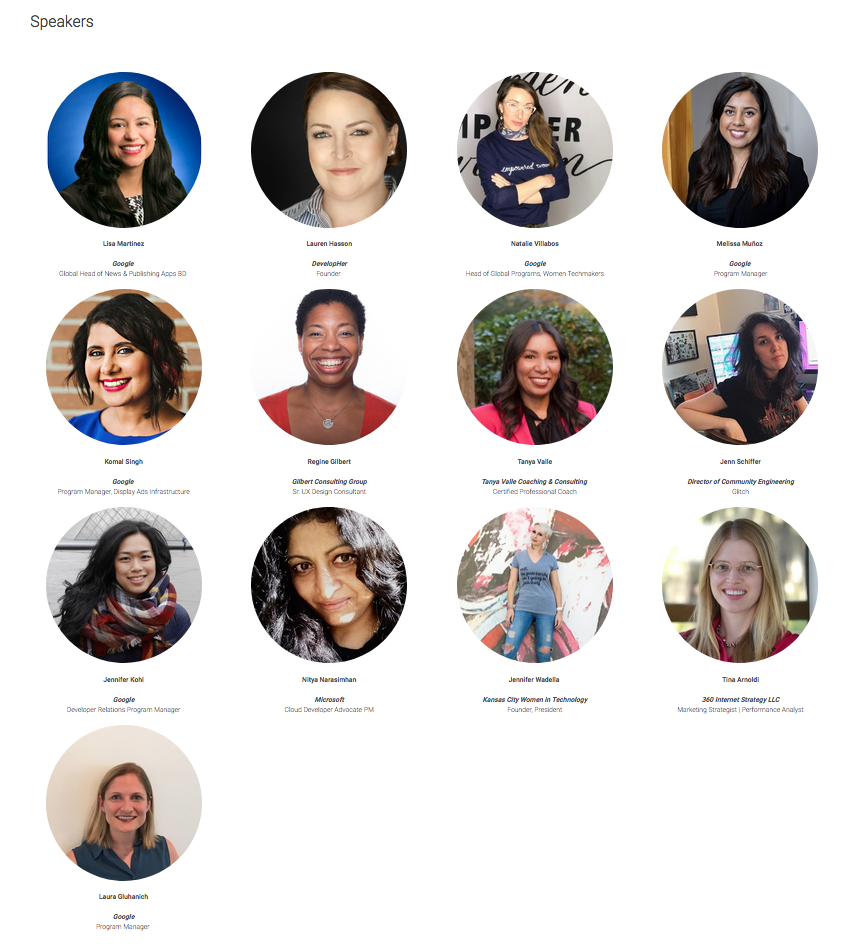
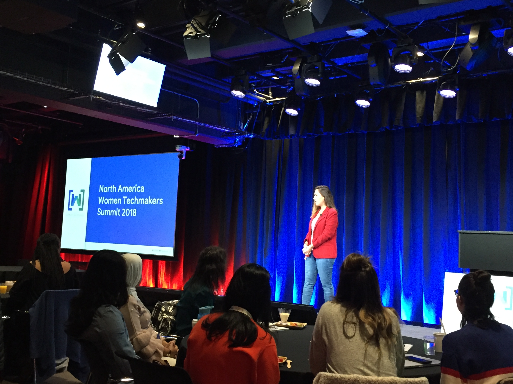
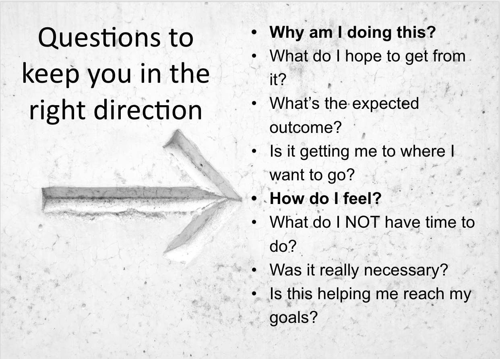

## Intro

*To what revolution are we referring?*  
- Women in Tech.  Around the World.  

*What is one of the grassroots initiatives that will propel women in tech?*  
- Google Women Techmakers Program.  

*How will that happen?*  
- Read more below.  

## About [Women Techmakers](https://www.womentechmakers.com/)

Women Techmakers provides visibility, community, and resources for women in technology to drive participation and innovation in the field. They achieve this by hosting events, launching resources, and piloting new initiatives with communities and partners around the world. By joining Women Techmakers you'll receive regular emails with access to resources, tools and opportunities from Google and Women Techmakers partnerships to support you in your career.

>Filling out our membership form will ensure we're able to tailor offerings to your needs and interests, which we will send to you via email. If you have any questions or suggestions, please email the Women Techmakers team at wtmmembership@google.com.

## Participating in WTM
 
### Becoming a WTM Member
[Join the movement](https://www.womentechmakers.com/membership):  Membership empowers women in their careers by providing access to curated resources and events, as well as information and tools from Google, our partners, and the global tech ecosystem.

### Becoming a WTM Lead
Leads are invited through GDG (Google Developer Group). 

### Statistics on Members / Leads

- [@WomenTechmakers](https://twitter.com/WomenTechmakers)  on Twitter <a   style="color:red"><i> ⟶  </i></a>
<a   style="color:purple; font:italic"><b> 99.8K followers! </b></a>
- There are **43K** Women Techmaker **Members**, worldwide
  - the largest membership is in San Francisco, New York, London and Seattle
- There are **550** Women Techmaker **Leads** around the world and in **69** countries

### Summit Information
Attendance for the summit was by invitation to GDG organizers and some tech community group leaders.

- [WTM Summit Website](https://events.withgoogle.com/women-techmakers-leads-summit/)
- [Agenda](https://events.withgoogle.com/women-techmakers-leads-summit/schedule-v1/#content)
- Summit Social Media Hashtags
  - LinkedIn:  #NAWTMSummit18
  - Twitter: [#nawtmsummit18](https://twitter.com/search?q=%23nawtmsummit18&src=typd)

## Keynotes

| Speaker    | Role  | Twitter  |  
|----|----|----|
| [Kübra Zengin](https://www.linkedin.com/in/kubrazengin/) | Developer Relations Program Manager, **Google** | [@zenginkubraa](https://twitter.com/zenginkubraa) |
| [Lisa Martinez](https://www.linkedin.com/in/lisa-gilpin-48781b18/) | Global Head of News & Publishing Apps BD, **Google** |  |
| [Lauren Hasson](https://www.linkedin.com/in/laurenhasson/) | Founder of DevelopHer, Speaker, Engineer | [@laurenrhasson](https://twitter.com/laurenrhasson) |
| [Natalie Villabos](https://www.linkedin.com/in/natalievillalobos/) | Diversity and Inclusion Leader at **Google** | [@nataliaenvy](https://twitter.com/nataliaenvy) |
| [Melissa Muñoz](https://www.linkedin.com/in/melissa-munoz/) | Program Manager, **Google** Women Techmakers | [@Melrmoon](https://twitter.com/Melrmoon) |
| [Laura Gluhanich](https://www.linkedin.com/in/lauraglu/) | Program Manager, **Google** Women Techmakers | [@LauraGlu](https://twitter.com/LauraGlu) |
| [Komal Singh](https://www.linkedin.com/in/komals1/) | Program Manager, Engineering at **Google** | [@think_oid](https://twitter.com/think_oid) |
| [Regine Gilbert](https://www.linkedin.com/in/reginegilbert/) | Sr. UX Design Consultant, Educator, Speaker | [@reg_inee](https://twitter.com/reg_inee)  |
| [Tanya Valle](https://www.linkedin.com/in/tanyavalle/) | Coaching & Consulting, Public Speaker, Mindfulness Teacher | [@TanyaValle23](https://twitter.com/TanyaValle23) |
| [Jenn Schiffer](https://www.linkedin.com/in/jennschiffer/)  | Director of Community Engineering - Glitch   |   [@jennschiffer](https://twitter.com/jennschiffer) |
| [Jennifer Kohl](https://www.linkedin.com/in/jenkohl/) | Developer Relations Program Manager at **Google** | [@jen_kohl](https://twitter.com/jen_kohl) |
| [Nitya Narasimhan](https://www.linkedin.com/in/nityan/) | Senior Program Manager, Developer Relations at Microsoft | [@nitya](https://twitter.com/nitya) |
| [Jennifer Wadella](https://www.linkedin.com/in/jennifer-wadella-7985b46/) | Founder, President at Kansas City Women in Technology | [@likeOMGitsFEDAY](https://twitter.com/likeOMGitsFEDAY) |
| [Tina Arnoldi](https://www.linkedin.com/in/tinaarnoldi/) | Marketing Strategist, Performance Analyst - 360 Internet Strategy | [@TinaArnoldi](https://twitter.com/TinaArnoldi) |

## Highlights
All of the speakers and talks were incredibly inspiring and informative.  The content and delivery was at an unmatched level.  Here are some highlights from the keynotes. 

### Kübra Zengin:  Opening Talk
Kubra was the lead organizer of the event and emcee'd the program. 

<blockquote class="twitter-tweet" data-lang="en">
Thanks to the 80+ Leads, GDEs, and community members that joined us for the <a href="https://twitter.com/hashtag/NAWTMSummit18?src=hash&amp;ref_src=twsrc%5Etfw">#NAWTMSummit18</a> today! It&#39;s been an incredible day of talks, ideas, and creativity 🙌🎉🗽 <a href="https://t.co/vPgXS9XEs0">pic.twitter.com/vPgXS9XEs0</a>
&mdash; Women Techmakers (@WomenTechmakers) <a href="https://twitter.com/WomenTechmakers/status/1051240425246392320?ref_src=twsrc%5Etfw">October 13, 2018</a></blockquote>

### Lisa Martinez:  "Big Little Truths"
Lisa has worked at Google for nearly 15 years, in various technologies.  She shared that at one point she went to work on Google AdWords because that was the "bread and butter" of the company, and she really wanted to understand it.  Her experience and wisdom were enlightening and inspiring.  These were my favorite shares from her talk:
- Trust your channels
  - that they have good intentions
  - always come from a good place
- Accept change, embrace change
- Invest in people, not projects
- Some men are heroes
- Let go of your Legos.  [Build a project and let it go.]
- Health is under-valued
- Reward yourself
- Word hard and be nice to people
- If you're in the room, add value
- Look for inspiring people around you

#### To Be Bold at Google Means
- Become a lifelong learner
- Accept failure
- Look for ways to make a difference
- Earn respect through work, not from a title
- Take risks

#### Presenting to High-level Executives
- The higher the executive, the briefer you need to be
- Know your numbers
- Lead *with* the data, but *you* tell the story!
- 3 key points
  - Here is where I am
  - Here is where I am stuck
  - Here is where I need help

#### Her advise to her younger self
Wish I had been more my authentic self.

<blockquote class="twitter-tweet" data-lang="en">
Work hard and be nice to people...it can go a long way <a href="https://twitter.com/hashtag/nawtmsummit18?src=hash&amp;ref_src=twsrc%5Etfw">#nawtmsummit18</a> <a href="https://t.co/QNnT2k7flg">pic.twitter.com/QNnT2k7flg</a>
&mdash; Trish Whetzel 🏳️‍🌈🇺🇲🇬🇧 (@TrishWhetzel) <a href="https://twitter.com/TrishWhetzel/status/1051102892197892098?ref_src=twsrc%5Etfw">October 13, 2018</a></blockquote>

### Lauren Hasson:  Become a Negotiat[Her]
Lauren is a full-time software engineer, and founded a company called DevelopHer to empower women to own their careers and negotiate their salaries.  She told a breathtaking story of how she was grossly underpaid relative to a less experience male co-working who she was training.  She did extensive research and **tripled her base salary** in less than 2 years!

My favorite takeway:
1.  Ground yourself in data!
  - data on salary
  - leverage data:  business needs & pain points
2.  Arm yourself with questions to handle pushback!
3.  Know when to walk away!

Download the [Negotiation Framework](https://developher.com/resource/)

<blockquote class="twitter-tweet" data-lang="en">
It&#39;s not just your ability to write code but your ability to communicate the value you bring that will determine your worth - <a href="https://twitter.com/laurenrhasson?ref_src=twsrc%5Etfw">@laurenrhasson</a> <a href="https://twitter.com/hashtag/NAWTMSummit18?src=hash&amp;ref_src=twsrc%5Etfw">#NAWTMSummit18</a> <a href="https://t.co/1uESOyuqmk">pic.twitter.com/1uESOyuqmk</a>
&mdash; Jiaqi Liu (@jiaqicodes) <a href="https://twitter.com/jiaqicodes/status/1051110025266118656?ref_src=twsrc%5Etfw">October 13, 2018</a></blockquote>

### Natalie Villalobos:  Women Techmakers Program & Updates
Natalie has been at Google for 9 years and is the Global Head of Women Techmakers.  

Natalie mentioned the phrase **"The revolution will not be televised"** as an analogy to the community events of empowering and advancing women in tech.  Women Techmaker leads are having a significant impact on their community at the grassroots level, and that activity, leadership and programming will have a ripple effect to impact a million women positively.  Women Techmakers will be the driver of that million with this advice:
1.  Join
2.  Thrive
3.  Lead

<blockquote class="twitter-tweet" data-lang="en">
.<a href="https://twitter.com/nataliaenvy?ref_src=twsrc%5Etfw">@nataliaenvy</a> providing the state of the union of <a href="https://twitter.com/WomenTechmakers?ref_src=twsrc%5Etfw">@WomenTechmakers</a> - great news through WTM membership emails, WTM scholarships for learning and travel to tech summits and more. Awesome to hear of all the efforts! <a href="https://twitter.com/hashtag/nawtmsummit18?src=hash&amp;ref_src=twsrc%5Etfw">#nawtmsummit18</a> <a href="https://t.co/rXHLZw0Kao">pic.twitter.com/rXHLZw0Kao</a>
&mdash; Trish Whetzel 🏳️‍🌈🇺🇲🇬🇧 (@TrishWhetzel) <a href="https://twitter.com/TrishWhetzel/status/1051130063339573249?ref_src=twsrc%5Etfw">October 13, 2018</a></blockquote>

<blockquote class="twitter-tweet" data-lang="en">
&quot;Women Techmakers Program Updates&quot; by <a href="https://twitter.com/nataliaenvy?ref_src=twsrc%5Etfw">@nataliaenvy</a>, head of <a href="https://twitter.com/hashtag/WomenTechmakers?src=hash&amp;ref_src=twsrc%5Etfw">#WomenTechmakers</a> <a href="https://twitter.com/Google?ref_src=twsrc%5Etfw">@Google</a>.  <a href="https://twitter.com/hashtag/NAWTMSummit18?src=hash&amp;ref_src=twsrc%5Etfw">#NAWTMSummit18</a> <a href="https://twitter.com/hashtag/WomeninTech?src=hash&amp;ref_src=twsrc%5Etfw">#WomeninTech</a> <a href="https://t.co/rYnzQDpmHF">pic.twitter.com/rYnzQDpmHF</a>
&mdash; Margaret Maynard-Reid (@margaretmz) <a href="https://twitter.com/margaretmz/status/1051129431299948545?ref_src=twsrc%5Etfw">October 13, 2018</a></blockquote>

### Nitya Narasimhan:  Why It Matters / How to Get There (#FirstLadyOfTech)
slides:  <a href="http://bit.ly/2018-WTMSummit-Advocacy"  style="color:orange; font:bold">Advocacy</a>

  <blockquote class="twitter-tweet" data-lang="en">
The &quot;A.B.C.D.E.F&quot; of &quot;G.D.E&quot; - Why it matters &amp; How to get there, an inspirational talk by <a href="https://twitter.com/nitya?ref_src=twsrc%5Etfw">@nitya</a>.  <a href="https://twitter.com/hashtag/NAWTMSummit18?src=hash&amp;ref_src=twsrc%5Etfw">#NAWTMSummit18</a> <a href="https://twitter.com/hashtag/GDE?src=hash&amp;ref_src=twsrc%5Etfw">#GDE</a> <a href="https://t.co/QzqWj5nS8N">pic.twitter.com/QzqWj5nS8N</a>
&mdash; Margaret Maynard-Reid (@margaretmz) <a href="https://twitter.com/margaretmz/status/1051206292474347528?ref_src=twsrc%5Etfw">October 13, 2018</a></blockquote>

<blockquote class="twitter-tweet" data-lang="en">
<a href="https://twitter.com/gdg?ref_src=twsrc%5Etfw">@gdg</a>, <a href="https://twitter.com/GoogleDevExpert?ref_src=twsrc%5Etfw">@GoogleDevExpert</a>,  <a href="https://twitter.com/WomenTechmakers?ref_src=twsrc%5Etfw">@WomenTechmakers</a>,  <a href="https://twitter.com/Microsoft?ref_src=twsrc%5Etfw">@Microsoft</a> Devrel,  <a href="https://twitter.com/hashtag/FirstLadyofTech?src=hash&amp;ref_src=twsrc%5Etfw">#FirstLadyofTech</a> extrodinaire <a href="https://twitter.com/nitya?ref_src=twsrc%5Etfw">@nitya</a> 👩‍🏫 teaching how to be a Tech advocate. Listen Up! 👂 <a href="https://twitter.com/hashtag/nawtmsummit18?src=hash&amp;ref_src=twsrc%5Etfw">#nawtmsummit18</a> <a href="https://t.co/5U41wvRVjO">pic.twitter.com/5U41wvRVjO</a>
&mdash; Stacy Devino 👟 (@DoesitPew) <a href="https://twitter.com/DoesitPew/status/1051206330768330752?ref_src=twsrc%5Etfw">October 13, 2018</a></blockquote>

<blockquote class="twitter-tweet" data-lang="en">
on taking compliments: do as <a href="https://twitter.com/nitya?ref_src=twsrc%5Etfw">@nitya</a> says not as she does<a href="https://twitter.com/hashtag/NAWTMSummit18?src=hash&amp;ref_src=twsrc%5Etfw">#NAWTMSummit18</a> <a href="https://twitter.com/hashtag/WTM?src=hash&amp;ref_src=twsrc%5Etfw">#WTM</a> <a href="https://t.co/dBmvTXtG5F">pic.twitter.com/dBmvTXtG5F</a>
&mdash; pthalocyanine (@pthalocyanine) <a href="https://twitter.com/pthalocyanine/status/1051207803195588613?ref_src=twsrc%5Etfw">October 13, 2018</a></blockquote>

### Jennifer Wadella:  Hacking Your Work Life __ Balance To Take Over The World
slides:  <a href="https://tehfedaykin.github.io/HackingYourWorkLife__Balance/#/title"  style="color:orange; font:bold">Hacking Your Work Life</a>

<blockquote class="twitter-tweet" data-lang="en">
Now listening to <a href="https://twitter.com/likeOMGitsFEDAY?ref_src=twsrc%5Etfw">@likeOMGitsFEDAY</a> talking about taking care of yourself and hacking your work/life balance! Dropping serious truths &amp; advice.<a href="https://twitter.com/hashtag/nawtmsummit18?src=hash&amp;ref_src=twsrc%5Etfw">#nawtmsummit18</a> <a href="https://t.co/MPSOq1xpGQ">pic.twitter.com/MPSOq1xpGQ</a>
&mdash; Nitya Narasimhan (@nitya) <a href="https://twitter.com/nitya/status/1051214680247685120?ref_src=twsrc%5Etfw">October 13, 2018</a></blockquote>

  <blockquote class="twitter-tweet" data-lang="en">
🔥🔥 Quote of the day: &quot;I&#39;m a JavaScript Developer which means I have to learn a new framework more often than I get my period.&quot;  <a href="https://twitter.com/likeOMGitsFEDAY?ref_src=twsrc%5Etfw">@likeOMGitsFEDAY</a> on Work/Volunteer Life Balance <a href="https://twitter.com/hashtag/hackyourbalance?src=hash&amp;ref_src=twsrc%5Etfw">#hackyourbalance</a> <a href="https://twitter.com/hashtag/NAWTMSummit18?src=hash&amp;ref_src=twsrc%5Etfw">#NAWTMSummit18</a>  <a href="https://twitter.com/WomenTechmakers?ref_src=twsrc%5Etfw">@WomenTechmakers</a> <a href="https://t.co/DFxqoDtY32">pic.twitter.com/DFxqoDtY32</a>
&mdash; Amal Hussein (@nomadtechie) <a href="https://twitter.com/nomadtechie/status/1051213853114204162?ref_src=twsrc%5Etfw">October 13, 2018</a></blockquote>

### Tina Arnoldi:  A Digital Detox is Good for You - and Your Business
slides:  <a href="https://docs.google.com/presentation/d/17KKwUwdy5Xel3QrlsIFufVo73tB1cXdhv9tYAxIWtnM/edit#slide=id.p4"  style="color:orange; font:bold">Digital Well-Being</a>

  
   

Tina has had one of the most non-linear paths in tech.  She is a licensed professional counselor who transitioned into tech.  Some great advice to manage our tech consumption in a more productive way:  
- Routine and habits are easier than willpower
  - keep email [and other browser] tabs closed
  - use apps to limit social media use
  - set a timer for 25 minutes, then take a break, walk 
- **Voluntarily be bored** ---> that can stimulate creativity

---
 
## Twitter Highlights

### Swag

<blockquote class="twitter-tweet" data-lang="en">
Not bad. Not bad at all.  <a href="https://twitter.com/hashtag/NAWTMSummit18?src=hash&amp;ref_src=twsrc%5Etfw">#NAWTMSummit18</a> <a href="https://t.co/KHBmER1RSl">pic.twitter.com/KHBmER1RSl</a>
&mdash; Tina Arnoldi (@TinaArnoldi) <a href="https://twitter.com/TinaArnoldi/status/1051818284696424450?ref_src=twsrc%5Etfw">October 15, 2018</a></blockquote>

### Inspiring

<blockquote class="twitter-tweet" data-lang="en">
My baby is starting to hear this week, and I’m happy that some of the first things it’s hearing are all these strong, inspirational women at the <a href="https://twitter.com/WomenTechmakers?ref_src=twsrc%5Etfw">@WomenTechmakers</a> summit <a href="https://twitter.com/hashtag/NAWTMSummit18?src=hash&amp;ref_src=twsrc%5Etfw">#NAWTMSummit18</a>
&mdash; Neem Serra (@TeamNeem) <a href="https://twitter.com/TeamNeem/status/1051118909133344769?ref_src=twsrc%5Etfw">October 13, 2018</a></blockquote>

### Fun

<blockquote class="twitter-tweet" data-lang="en">
Having an amazing time at <a href="https://twitter.com/hashtag/NAWTMSummit18?src=hash&amp;ref_src=twsrc%5Etfw">#NAWTMSummit18</a> <a href="https://t.co/9EtoHlTJJ5">pic.twitter.com/9EtoHlTJJ5</a>
&mdash; 💎catface meowmers🔮 (@jordangee) <a href="https://twitter.com/jordangee/status/1051162698887639045?ref_src=twsrc%5Etfw">October 13, 2018</a></blockquote>

### book:  Ara the Star Engineer

<blockquote class="twitter-tweet" data-lang="en">
Hello New York! Excited to see <a href="https://twitter.com/AraStarEngineer?ref_src=twsrc%5Etfw">@AraStarEngineer</a> standing tall and happy at the Women Techmakers Leads Summit <a href="https://twitter.com/hashtag/nawtmsummit18?src=hash&amp;ref_src=twsrc%5Etfw">#nawtmsummit18</a>! Excited to talk about parallels between engineering and authoring. <a href="https://twitter.com/hashtag/nawtmsummit18?src=hash&amp;ref_src=twsrc%5Etfw">#nawtmsummit18</a> <a href="https://twitter.com/mad_sha?ref_src=twsrc%5Etfw">@mad_sha</a> <a href="https://twitter.com/Naveen__Nigam?ref_src=twsrc%5Etfw">@Naveen__Nigam</a> <a href="https://twitter.com/zenginkubraa?ref_src=twsrc%5Etfw">@zenginkubraa</a> <a href="https://t.co/KrYsVpfiR0">pic.twitter.com/KrYsVpfiR0</a>
&mdash; Komal Singh (@think_oid) <a href="https://twitter.com/think_oid/status/1051099494408957953?ref_src=twsrc%5Etfw">October 13, 2018</a></blockquote>

  <blockquote class="twitter-tweet" data-lang="en">
We&#39;re thrilled to have Komal Singh, author of <a href="https://twitter.com/AraStarEngineer?ref_src=twsrc%5Etfw">@AraStarEngineer</a> speaking at the <a href="https://twitter.com/hashtag/NAWTMsummit18?src=hash&amp;ref_src=twsrc%5Etfw">#NAWTMsummit18</a> about bringing a passion project to launch 🎉👩🏽‍💻 <a href="https://t.co/9amwhFJAES">pic.twitter.com/9amwhFJAES</a>
&mdash; Women Techmakers (@WomenTechmakers) <a href="https://twitter.com/WomenTechmakers/status/1051149288229756928?ref_src=twsrc%5Etfw">October 13, 2018</a></blockquote>

### Regine Gilbert

  <blockquote class="twitter-tweet" data-lang="en">
<a href="https://twitter.com/reg_inee?ref_src=twsrc%5Etfw">@reg_inee</a> “you don’t grow when everything is easy” live at this very moment and no regret <a href="https://twitter.com/hashtag/NAWTMSummit18?src=hash&amp;ref_src=twsrc%5Etfw">#NAWTMSummit18</a> <a href="https://twitter.com/hashtag/womentechmakers?src=hash&amp;ref_src=twsrc%5Etfw">#womentechmakers</a> <a href="https://twitter.com/hashtag/Empowerment?src=hash&amp;ref_src=twsrc%5Etfw">#Empowerment</a> <a href="https://t.co/JFQvGgvjey">pic.twitter.com/JFQvGgvjey</a>
&mdash; Macy Kuang (@MacyKuang) <a href="https://twitter.com/MacyKuang/status/1051171384653750273?ref_src=twsrc%5Etfw">October 13, 2018</a></blockquote>

  <blockquote class="twitter-tweet" data-lang="en">
RT DoesitPew: reg_inee Everyone has a Story. You have to be lost in order to be found. WomenTechmakers  <a href="https://twitter.com/hashtag/WTMsummit?src=hash&amp;ref_src=twsrc%5Etfw">#WTMsummit</a>  <a href="https://twitter.com/hashtag/NAWTMSummit18?src=hash&amp;ref_src=twsrc%5Etfw">#NAWTMSummit18</a> <a href="https://t.co/Jskw9dKQj5">pic.twitter.com/Jskw9dKQj5</a>
&mdash; Women Techmakers Palermo (@WTMpalermo) <a href="https://twitter.com/WTMpalermo/status/1051171581588922368?ref_src=twsrc%5Etfw">October 13, 2018</a></blockquote>

### Jen Kohl

<blockquote class="twitter-tweet" data-lang="en">
Curating and refining stories with <a href="https://twitter.com/jen_kohl?ref_src=twsrc%5Etfw">@jen_kohl</a> <a href="https://twitter.com/hashtag/NAWTMSummit18?src=hash&amp;ref_src=twsrc%5Etfw">#NAWTMSummit18</a> <a href="https://twitter.com/hashtag/WTM?src=hash&amp;ref_src=twsrc%5Etfw">#WTM</a> <a href="https://t.co/36soj9FZbP">pic.twitter.com/36soj9FZbP</a>
&mdash; pthalocyanine (@pthalocyanine) <a href="https://twitter.com/pthalocyanine/status/1051197564836503552?ref_src=twsrc%5Etfw">October 13, 2018</a></blockquote>

### Jenn Schiffer

<blockquote class="twitter-tweet" data-lang="en">
Art, technology, planned obsolescence, digial art shelf life ,non-consentual ephemerality. Racist machines and too much to put in one tweet.   Thank you for an epic <a href="https://twitter.com/jennschiffer?ref_src=twsrc%5Etfw">@jennschiffer</a> <a href="https://twitter.com/WomenTechmakers?ref_src=twsrc%5Etfw">@WomenTechmakers</a> <a href="https://twitter.com/hashtag/NAWTMSummit18?src=hash&amp;ref_src=twsrc%5Etfw">#NAWTMSummit18</a> <a href="https://t.co/JxYn42Y3uM">pic.twitter.com/JxYn42Y3uM</a>
&mdash; Amal Hussein (@nomadtechie) <a href="https://twitter.com/nomadtechie/status/1051186138667540482?ref_src=twsrc%5Etfw">October 13, 2018</a></blockquote>

  <blockquote class="twitter-tweet" data-lang="en">
&quot;technology is making it easier to steal when it should be making it easier to share and express ownership&quot; <a href="https://twitter.com/jennschiffer?ref_src=twsrc%5Etfw">@jennschiffer</a> <a href="https://twitter.com/hashtag/NAWTMSummit18?src=hash&amp;ref_src=twsrc%5Etfw">#NAWTMSummit18</a> <a href="https://twitter.com/hashtag/WTM?src=hash&amp;ref_src=twsrc%5Etfw">#WTM</a> apparently <a href="https://twitter.com/glitch?ref_src=twsrc%5Etfw">@glitch</a> just made a feature to allow you to add a code of conduct to your app which is p cool
&mdash; pthalocyanine (@pthalocyanine) <a href="https://twitter.com/pthalocyanine/status/1051184666231889922?ref_src=twsrc%5Etfw">October 13, 2018</a></blockquote>

<blockquote class="twitter-tweet" data-lang="en">
&quot;I always keep saying the worst thing that could happen to a white person is being called racist... Maybe if we keep doing it long enough we&#39;ll all break down and stop being complicit&quot; <a href="https://twitter.com/jennschiffer?ref_src=twsrc%5Etfw">@jennschiffer</a> <a href="https://twitter.com/hashtag/NAWTMSummit18?src=hash&amp;ref_src=twsrc%5Etfw">#NAWTMSummit18</a> <a href="https://twitter.com/hashtag/WTM?src=hash&amp;ref_src=twsrc%5Etfw">#WTM</a>
&mdash; pthalocyanine (@pthalocyanine) <a href="https://twitter.com/pthalocyanine/status/1051189374807928832?ref_src=twsrc%5Etfw">October 13, 2018</a></blockquote>

### Tanya Valle

  <blockquote class="twitter-tweet" data-lang="en">
Excited to be a guest speaker at Google’s Women Techmakers Leads Summit! I’ll be talking about how to be a Mindful Leader of yourself and others—and why that matters. <a href="https://twitter.com/hashtag/nawtmsummit18?src=hash&amp;ref_src=twsrc%5Etfw">#nawtmsummit18</a> <a href="https://twitter.com/hashtag/mindfulness?src=hash&amp;ref_src=twsrc%5Etfw">#mindfulness</a> <a href="https://twitter.com/hashtag/compassionateleadership?src=hash&amp;ref_src=twsrc%5Etfw">#compassionateleadership</a> <a href="https://twitter.com/hashtag/leadership?src=hash&amp;ref_src=twsrc%5Etfw">#leadership</a> <a href="https://twitter.com/hashtag/careercoach?src=hash&amp;ref_src=twsrc%5Etfw">#careercoach</a> <a href="https://twitter.com/hashtag/entrepreneur?src=hash&amp;ref_src=twsrc%5Etfw">#entrepreneur</a> <a href="https://twitter.com/hashtag/womenintech?src=hash&amp;ref_src=twsrc%5Etfw">#womenintech</a> <a href="https://t.co/fVaDqdi9Ck">pic.twitter.com/fVaDqdi9Ck</a>
&mdash; Tanya Valle (@TanyaValle23) <a href="https://twitter.com/TanyaValle23/status/1050876321524400128?ref_src=twsrc%5Etfw">October 12, 2018</a></blockquote>

### Community

<blockquote class="twitter-tweet" data-lang="en">
Got to love the energy in this room <a href="https://twitter.com/hashtag/NAWTMsummit18?src=hash&amp;ref_src=twsrc%5Etfw">#NAWTMsummit18</a> <a href="https://t.co/2cjz51yMXi">pic.twitter.com/2cjz51yMXi</a>
&mdash; Naveen Nigam 🇨🇦 (@Naveen__Nigam) <a href="https://twitter.com/Naveen__Nigam/status/1051204624806498304?ref_src=twsrc%5Etfw">October 13, 2018</a></blockquote>

## Thank you
Thank you to Google and their team for creating this stellar event:
- [Kübra Zengin](https://www.linkedin.com/in/kubrazengin/) 
- [Natalie Villabos](https://www.linkedin.com/in/natalievillalobos/)
- [Melissa Muñoz](https://www.linkedin.com/in/melissa-munoz/)
- [Laura Gluhanich](https://www.linkedin.com/in/lauraglu/)
- [Naveen Nigam](https://www.linkedin.com/in/naveen-nigam/)
- [Madusha Cooray](https://www.linkedin.com/in/madushacooray/)
- [Natasha Moustache](https://twitter.com/iammoustache), photographer

## References

- [The Revolution Will Not Be Televised](https://en.wikipedia.org/wiki/The_Revolution_Will_Not_Be_Televised)
  - [full lyrics](
https://www.google.com/search?q=lyrics+the+revolution+will+not+be+televised&oq=lyrics+the+revolution&aqs=chrome.0.0j69i57j0l4.3047j0j4&sourceid=chrome&ie=UTF-8
)

