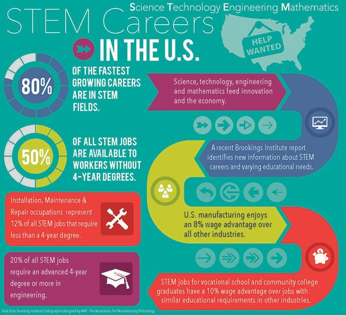
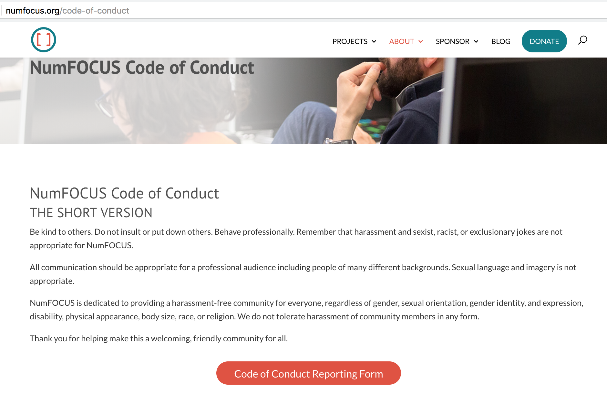
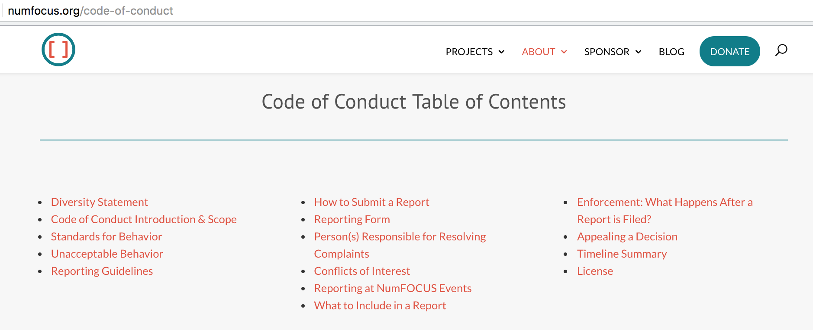

## Goal
This article examines the professional organizations that serve some of the major fields of study or related areas in STEM.  These organizations represent many of the disciplines that flow into the **data science** pipeline.  The focus is on American associations.  However, often membership can be worldwide.  The goal of this writing is to see what the current codes of conduct (CoC) are in some of the largest STEM associations.  

The hope is that organizations that are lagging in their CoC policies will reach out to the trailblazing organizations to gain knowledge and update their procedures.  

There is a hypothesis here that to create a welcoming and professional environment, it is necessary to have a comprehensive code of conduct as well as detailed procedures for handling violations.  The expected impact is that comprehensive codes of conduct will:  
- prevent inappropriate behavior in the community
- encourage professional and inclusionary behavior
- provide a safe avenue for communicating violations

## Background 
I am a member of the NumFOCUS **Diversity and Inclusion in Scientific Computing** [(DISC) committee](https://numfocus.org/programs/diversity-inclusion).  This group worked on drafting a new CoC and guidelines for reporting violations.  Both the short and long version of the [NumFOCUS CoC](https://numfocus.org/code-of-conduct) have been finalized and published. 

I am an organizer for two NYC meetup groups:  
- [NYC Women in Machine Learning & Data Science](https://www.meetup.com/NYC-Women-in-Machine-Learning-Data-Science/), ([@WiMLDS](https://twitter.com/wimlds))
- [NYC PyLadies](https://www.meetup.com/NYC-PyLadies/)

I am also a [Board Member](http://wimlds.org) for WiMLDS.  

All views in this article are my own. 

## Overview of Organizations
Let's begin with some background on some of the major STEM organizations.  I chose 10 STEM organizations in various quantitative disciplines and researched them. **Positively changing the culture in these organizations has the potential to have a profound effect on the entire STEM ecosystem.**  

| Acronym    | Name  | Field  |  Membership | Headquarters | Non-profit | 
|------------|--------|--------|------------|----| ----| 
| [ASA](http://www.amstat.org)     | American Statistical Association      | Statistics         | 18K/ 6.3K (a)   | Alexandra, VA  | yes |
| [NumFOCUS](https://numfocus.org) |                                       | Open Source        | 96K/ 3.5K (b)   | Austin, TX     | yes|
| [ACM](https://www.acm.org)       | Association for Computing Machinery   | Computer Science   | 100K    | New York, NY   | no  |
| [ICML](https://icml.cc)          | Int'l Conf on Machine Learning        | Machine Learning   | 10K (c) |               | yes |
| [NIPS](https://nips.cc)          | Neural Information Processing Systems |                    | 8K (c)  |               | yes |
| [AIP](https://www.aip.org/)      | American Institute of Physics         | Physics            | 135K    | College Park, MD | yes | 
| [AEA](https://www.aeaweb.org)    | American Economic Association         | Economics          | 20K     | Nashville, TN  |yes |
| [AAES](http://www.aaes.org/)         | American Association of Engineering Societies| Engineering |         | Reston, VA     | yes |
| [AMS](https://www.ams.org/home/page) | American Mathematical Society         | Mathematics        | 30K     | Providence, RI | no |
| [AMF](https://www.afajof.org)        | American Finance Association          | Finance            | 8K      |               | no |

(a) **ASA** membership is 18K.  The recent [JSM](http://ww2.amstat.org/meetings/jsm/2018/) (Joint Statistical Meetings) in August 2018 had 6346 attendees.  

(b) **NumFOCUS** has approximately [96K members](http://meetup.com/pro/pydata) and 3500 attendees to their conferences annually.  They have about [1K voting members](https://numfocus.org/blog/endorsements-in-the-2018-numfocus-election).  Their user base is upwards of **1 million**.  They sponsor numerous open source projects.  As an example, any comment on an issue to a GitHub repo for open source is covered under their CoC.  

(c) **NIPS/ICML** do not have official "membership".  This number represents total attendees at their annual conference.  

## Codes of Conduct
I investigated the STEM associations and their current status on CoC as well as reporting procedures.  

| Acronym    |    CoC  | Instructions for Reporting Violations?   |  Anonymous Reporting Possible? | Independent Reporting Party? | Note  | 
|------------|--------|--------|------------|----| ----| 
| [ASA](http://www.amstat.org)   | [CP for JSM](https://ww2.amstat.org/meetings/jsm/2016/conductpolicy.cfm) | ✅ | ✅ | ✅  | [Ombuds Service: pilot program](http://ww2.amstat.org/meetings/jsm/2018/conductpolicy.cfm)   |  
| [NumFOCUS](https://numfocus.org)| [CoC](https://numfocus.org/code-of-conduct)   | ✅|  ✅ | ❌  | |
| [ACM](https://www.acm.org)    | [CoE](https://www.acm.org/code-of-ethics)    | ❌    |  ❌   | ❌    |    |
| [ICML](https://icml.cc)       | [CoC](https://icml.cc/public/CodeOfConduct) | ✅ | ❌  |  ❌  | not easy to find CoC   |
| [NIPS](https://nips.cc)       | [CoC](https://nips.cc/public/CodeOfConduct)  | ✅ | ❌  |  ❌  | not easy to find CoC   |
| [AIP](https://www.aip.org/)   | [CoC](https://www.aip.org/diversity-initiatives/member-society-efforts-encourage-inclusion-equity-society-conferences)  (a) |    ✅ (vague)    |  ❌   | ❌    |    |
| [AEA](https://www.aeaweb.org) | [CPC](https://www.aeaweb.org/about-aea/code-of-conduct)   |  ❌   |  ❌ |    ❌         |    |
| [AAES](http://www.aaes.org/)  |   ❌       | ❌    | ❌ |    ❌         |    |
| [AMS](https://www.ams.org/home/page)| [CCP](https://www.ams.org/about-us/governance/policy-statements/code-of-conduct.pdf)  | ✅ |      ❌  |  ❌     | not easy to find CoC   |
| [AMF](https://www.afajof.org) | [CPCE](https://cdn.ymaws.com/www.afajof.org/resource/resmgr/files/afacodeofprofessionalconduct.pdf)         | ❌    | ❌ |    ❌         |  not easy to find CoC   |

(a)  **AIP** Each member society has its own "Member Society Policies and Codes of Conduct"

#### Acronyms
Different organizations using different naming conventions.  There are many variations of the term CoC:  
- CoC = Code of Condudct
- CoE = Code of Ethics
- CP = Conduct Policy
- CPC = Code of Professional Conduct 
- CCP = Code of Conduct Policy
- CPCE = Code of Professional Conduct and Ethics

## High Profile Cases of Violations
These are examples of some highly publicized harassment incidents within the **statistics** community:   
- Brad Carlin
	- [Statistics, we have a problem](https://medium.com/@kristianlum/statistics-we-have-a-problem-304638dc5de5)
	- [UMN biostatistics professor investigated after allegation on conduct](https://www.twincities.com/2017/12/18/umn-biostatistics-professor-investigated-after-allegation-on-conduct/)
	- [Minnesota professor Brad Carlin resigns amid sexual harassment complaints](http://www.citypages.com/news/minnesota-professor-brad-carlin-resigns-amid-sexual-harassment-complaints/482944771)
- [Google AI Researcher Accused of Sexual Harassment](https://www.bloomberg.com/news/articles/2017-12-16/google-researcher-accused-of-sexual-harassment-roiling-ai-field)
- [UC Berkeley statistics professor allegedly sexually harassed postdoctoral researcher](http://www.dailycal.org/2018/03/25/uc-berkeley-statistics-professor-allegedly-sexually-harassed-postdoctoral-researcher/)

## Associations

### ASA (American Statistical Association)
It was founded in Boston, Massachusetts in 1839, and is the second oldest continuously operating professional society in the US.  JSM has a [Conduct Policy](http://ww2.amstat.org/meetings/jsm/2019/conductpolicy.cfm).  Beginning in August 2018, they used an independent third party where attendees can report violations, as a **pilot program**.  It is called [Ombuds Service](http://ww2.amstat.org/meetings/jsm/2018/conductpolicy.cfm).  

<i>The ASA is the most mature organization in their reporting procedures.  
</i>
  They have also experienced high-profile conduct violations in the community.  The fact that it has a long history and is a structured organization with a formal membership likely also contributed to implementing these changes first.  

For more information, contact Donna LaLonde at DonnaL@amstat.org

### NumFOCUS
NumFOCUS was founded in 2012, and it supports and promotes world-class, innovative, open source scientific software (some examples: Numpy, Pandas and Jupyter).  NumFOCUS issued an updated comprehensive CoC [October 4, 2018](https://numfocus.org/blog/updates-to-the-numfocus-code-of-conduct).  They also recently implemented a [CoC Reporting Form](https://numfocus.typeform.com/to/ynjGdT) which permits anonymous reporting.  There is also a detailed guide on the process for addressing violations.  

<i>NumFOCUS offers the most comprehensive CoC as well as procedures for handling violations.  
</i>

#### For more information on NumFOCUS DISC
- [DISC Wiki](https://wiki.numfocus.org/DISC:_Diversity_%26_Inclusion_in_Scientific_Computing)
- Join the [DISC mailing list](https://groups.google.com/a/numfocus.org/forum/#!forum/disc/join)
- Specific inquiries can be directed to Gina Helfrich at gina@numfocus.org

### [Association for Computing Machinery](https://www.acm.org/) 
ACM was founded in 1947.  Its Special Interest Groups (SIGs) sponsor more than 170 computing conferences, workshops, and symposia around the world.  They sponsor [SIGKDD](https://www.kdd.org/conferences) which is a premier and highly respected international data mining conference.  

For an organization of that size, their reporting guidelines are disappointingly skeletal: 
> Each ACM member should encourage and support adherence by all computing professionals regardless of ACM membership. ACM members who recognize a breach of the Code should consider reporting the violation to the ACM, which may result in remedial action as specified in the ACM's Code of Ethics and Professional Conduct Enforcement Policy.

### NIPS
- [About NIPS](https://nips.cc/About)
The Neural Information Processing Systems (NIPS) Foundation is a non-profit corporation whose purpose is to foster the exchange of research on neural information processing systems in their biological, technological, mathematical, and theoretical aspects. Neural information processing is a field which benefits from a combined view of biological, physical, mathematical, and computational sciences.

The primary focus of the NIPS Foundation is the presentation of a continuing series of professional meetings known as the Neural Information Processing Systems Conference, held over the years at various locations in the United States, Canada and Spain.

Both conferences (NIPS and ICML) have a minimal code of conduct and reporting guidelines.

This *used to be* the CoC for NIPS (quite brief):
>The NIPS foundation is welcoming of all attendees and the diversity of opinions they bring. However, we ask that their contributions are made in a manner which is respectful of their colleagues. Scientific work will necessarily from time to time enter into areas of controversy, and such discussions, when handled sensitively, will be welcome at NIPS. However, frivolous use of material or content that threatens the inclusivity of our community will not be tolerated. The NIPS organising committee reserves the right to withdraw registration without refund from attendees who transgress these ideals.

After the publicized violations, this is the [NIPS Updated CoC (summer 2018)](https://nips.cc/public/CodeOfConduct) 

Given the highly publicized incidents, NIPS should have a more comprehensive CoC including a reporting policy.  They should also permit anonymous reporting as well as use an independent party for receiving violations reports.  

 
## Suggestions
- Put CoC at main menu level on the website where it is easy to find.  It also shows the priority of professional conduct to the organization.  
- Require that attendees check that CoC has been read prior to completing registration for an event.
- Have clear guidelines for what behavior is and is not acceptable.
- Have clear reporting guidelines.
- Use independent party reporting.
- Walk the talk:  take violations seriously.
- Be **transparent** about procedures with your membership and the community

Resources:   
NumFOCUS [Code of Conduct](https://numfocus.org/code-of-conduct) is licensed under a [Creative Commons Attribution 3.0 Unported License.](https://creativecommons.org/licenses/by/3.0/)

## Challenges
1.  Most of these organizations are broad umbrella associations.  They have numerous societies and projects within their fold.  It's possible that CoC may *not exist* for all these sub-divisions or be standard.  There may also be a disconnect from a society CoC and a conference or event CoC.  
2.  CoC are fairly new, emerging within the last few years.  
3.  There is no global communication system for this type of information to be funneled to various organizations.  

Hence, that is why I am writing this article.

## References
- [Hopkins faculty promote better climate in machine learning](https://hopkinscsw.wordpress.com/2018/03/30/hopkins-faculty-promote-better-climate-in-machine-learning/)
- [Changing the Culture for Women and Underrepresented Groups in STEM+M](http://www.insightintodiversity.com/changing-the-culture-for-women-and-underrepresented-groups-in-stemm/)
- Report:  [Sexual Harassment of Women
Climate, Culture, and Consequences in Academic Sciences, Engineering, and Medicine](https://www.nap.edu/catalog/24994/sexual-harassment-of-women-climate-culture-and-consequences-in-academic)
	- Even though the focus was academics, the report has a lot to offer in terms of understanding the problem and working toward solutions.
- [Where do Data Scientists Come From?](https://medium.com/indeed-data-science/where-do-data-scientists-come-from-fc526023ace)

## Resources
- Bystander Training:  ["It's on US"](https://www.itsonus.org/)
	- has a pledge that folks can take. 
- [Managing our Code of Conduct](https://reshamas.github.io/managing-our-code-of-conduct/) (lists different types of violations)

### Creating a Code of Conduct
- [How to Design a Code of Conduct for Your Community](https://adainitiative.org/2014/02/18/howto-design-a-code-of-conduct-for-your-community)
- [Project Include](http://projectinclude.org/)
- [Django Code of Conduct](https://www.djangoproject.com/conduct/)
- [Geek Feminism Wiki](http://geekfeminism.wikia.com/wiki/Conference_anti-harassment/Responding_to_reports)

## Diversity & Inclusion
- [DISC Cookbook](https://github.com/numfocus/DISCOVER-Cookbook)
- [Five Tactical Tips to Improve Diversity for Pitch Event Organizers](https://medium.com/@reiwang/five-tactical-tips-to-improve-diversity-for-pitch-event-organizers-5493cf915926)

## Acknowledgements
Special thanks to the following people who work in diversity and inclusion and shared their knowledge and experiences:
- [Gina Helfrich](https://www.linkedin.com/in/ginahelfrich/) of NumFOCUS
- [Donna LaLonde](https://www.linkedin.com/in/donna-lalonde-a6a41124/) of ASA
- [Hal Daume](https://twitter.com/haldaume3) of NIPS

## Tweets

### Conference Organizers:  Be very clear with your speakers on code of conduct and expectations

<blockquote class="twitter-tweet" data-lang="en">
Conference organizers: Be very clear with your speakers on code of conduct and expectations. Here is a great example (🙏 <a href="https://twitter.com/gnat?ref_src=twsrc%5Etfw">@gnat</a>) <a href="https://t.co/UPvX3euh5N">pic.twitter.com/UPvX3euh5N</a>
&mdash; Karthik Ram (@_inundata) <a href="https://twitter.com/_inundata/status/986398238092574720?ref_src=twsrc%5Etfw">April 18, 2018</a></blockquote>

### NIPS

#### NIPS 2018 [Press](https://nips.cc/Conferences/2018/Press)
- [survey results](https://nips.cc/Conferences/2018/News)
- [NIPS Foundation Board Concludes Name Change Deliberations](https://nips.cc/Conferences/2018/Press)
- [Response to Further Questions on Name Change](https://nips.cc/Conferences/2018/Press)
- [NIPS 2018 Demographics and Inclusion Survey](https://github.com/hal3/nips2018survey) 
- [Top AI conference NIPS won't change its name amid growing protest over 'bad taste' acronym](https://www.theregister.co.uk/2018/10/29/nips_ai_conference/)
- [AI Researchers Fight Over 4 Letters: NIPS](https://www.wired.com/story/ai-researchers-fight-over-four-letters-nips/)

<blockquote class="twitter-tweet" data-lang="en">
Some disturbing claims about <a href="https://twitter.com/NipsConference?ref_src=twsrc%5Etfw">@NipsConference</a> in this thread.  Jokes about sexual assault and apparently NIPS does not have a Code of Conduct!?!? cc <a href="https://twitter.com/WiMLworkshop?ref_src=twsrc%5Etfw">@WiMLworkshop</a> <a href="https://t.co/IomT3pwLvK">https://t.co/IomT3pwLvK</a>
&mdash; Women+ in ML/DS (@wimlds) <a href="https://twitter.com/wimlds/status/940111697368334336?ref_src=twsrc%5Etfw">December 11, 2017</a></blockquote>

<blockquote class="twitter-tweet" data-lang="en">
I&#39;m proud to be a member of the <a href="https://twitter.com/JohnsHopkins?ref_src=twsrc%5Etfw">@JohnsHopkins</a> faculty making a call for greater inclusion for <a href="https://twitter.com/hashtag/MachineLearning?src=hash&amp;ref_src=twsrc%5Etfw">#MachineLearning</a> and <a href="https://twitter.com/hashtag/WomenInSTEM?src=hash&amp;ref_src=twsrc%5Etfw">#WomenInSTEM</a> at <a href="https://twitter.com/NipsConference?ref_src=twsrc%5Etfw">@NipsConference</a> <a href="https://t.co/HqgteO1tit">https://t.co/HqgteO1tit</a>
&mdash; Dr. Elana J Fertig (@FertigLab) <a href="https://twitter.com/FertigLab/status/979738095481434112?ref_src=twsrc%5Etfw">March 30, 2018</a></blockquote>

<blockquote class="twitter-tweet" data-lang="en">
NIPS conference decided to keep its name unchanged <a href="https://t.co/ExEAJmu9O0">https://t.co/ExEAJmu9O0</a> <a href="https://t.co/AFLCaZ8s62">pic.twitter.com/AFLCaZ8s62</a>
&mdash; hardmaru (@hardmaru) <a href="https://twitter.com/hardmaru/status/1054872232722223104?ref_src=twsrc%5Etfw">October 23, 2018</a></blockquote>

#### [NIPS Name Change](https://nips.cc/public/NameChange)
A statement issued by NIPS on why the name was not changed is [included here](https://nips.cc/public/NameChange).

[NIPS AI Conference to Continue Laughing about Nipples at the Expense of Women in Tech](https://medium.com/@therese.koch1/nips-ai-conference-to-continue-laughing-about-nipples-at-the-expense-of-women-in-tech-8c0fa74b1ec4):  
> By only inviting former attendees of the conference to respond to the survey, the organizers had to have known that the demographics would break down in this way. This drowns out the voices of the minority of people — women — most affected by this issue and completely erases the voices of any women who have been discouraged from attending the conference in the past due to the name or to the fratty, sexist culture in tech more broadly.

>By conducting this survey and publicly announcing the result, the NIPS conference organizers knew that they would be making an important statement, one way or the other. Rather than choosing to oppose a tradition that promotes sexism and harassment, they decided that the majority — the men who have attended in the past — count more than those women who chose to speak up and criticize the name, both through the survey and publicly, at risk to their own careers.

>If you feel strongly about this issue, consider [signing this open letter](https://www.change.org/p/members-of-nips-board-protestnips-nips-acronym-encourages-sexism-and-is-a-slur-change-the-name) to the NIPS board asking them to reconsider.

#### Responses to Not Changing NIPS Name

	<blockquote class="twitter-tweet" data-lang="en">
I am so disappointed in <a href="https://twitter.com/NipsConference?ref_src=twsrc%5Etfw">@NipsConference</a> for missing the opportunity to join the 21st century and change the name of this conference. But maybe the worst part is that their purported justification is based on a shoddy analysis of their survey results. 1/n<a href="https://t.co/YmyRObpUch">https://t.co/YmyRObpUch</a>
&mdash; Daniela Witten (@daniela_witten) <a href="https://twitter.com/daniela_witten/status/1054800509364621312?ref_src=twsrc%5Etfw">October 23, 2018</a></blockquote>

<blockquote class="twitter-tweet" data-lang="en">
This is textbook results of a classifier applied to a biased training set to lead to a biased outcome 3/ <a href="https://t.co/97SFgX9Ud7">pic.twitter.com/97SFgX9Ud7</a>
&mdash; Dr. Elana J Fertig (@FertigLab) <a href="https://twitter.com/FertigLab/status/1054500054868860928?ref_src=twsrc%5Etfw">October 22, 2018</a></blockquote>

<blockquote class="twitter-tweet" data-lang="en">
<a href="https://twitter.com/hashtag/ProtestNIPS?src=hash&amp;ref_src=twsrc%5Etfw">#ProtestNIPS</a>   Great hashtag to follow if you want to see how many people are *seriously pissed off* that <a href="https://twitter.com/NipsConference?ref_src=twsrc%5Etfw">@NipsConference</a> is burying its head in the sand after the request by the members of the <a href="https://twitter.com/hashtag/MachineLearning?src=hash&amp;ref_src=twsrc%5Etfw">#MachineLearning</a> community to change the name of the conference. <a href="https://t.co/Wf9ExCv6bo">pic.twitter.com/Wf9ExCv6bo</a>
&mdash; Women+ in ML/DS (@wimlds) <a href="https://twitter.com/wimlds/status/1055312910103175168?ref_src=twsrc%5Etfw">October 25, 2018</a></blockquote>

## Diversity & Inclusion

### When it's working

<blockquote class="twitter-tweet" data-lang="en">
45% of speakers are female 👍🏼<a href="https://twitter.com/NumFOCUS?ref_src=twsrc%5Etfw">@NumFOCUS</a> <a href="https://twitter.com/wimlds?ref_src=twsrc%5Etfw">@wimlds</a> <a href="https://twitter.com/hashtag/diversityawards?src=hash&amp;ref_src=twsrc%5Etfw">#diversityawards</a> <a href="https://twitter.com/hashtag/rstatsnyc?src=hash&amp;ref_src=twsrc%5Etfw">#rstatsnyc</a> <a href="https://t.co/UNbqBESRa4">https://t.co/UNbqBESRa4</a>
&mdash; Reshama Shaikh (@reshamas) <a href="https://twitter.com/reshamas/status/987384241070616576?ref_src=twsrc%5Etfw">April 20, 2018</a></blockquote>

### When it's not working 

<blockquote class="twitter-tweet" data-lang="en">
Are you looking to attend an all-male conference in <a href="https://twitter.com/hashtag/DataScience?src=hash&amp;ref_src=twsrc%5Etfw">#DataScience</a>?  <a href="https://twitter.com/hashtag/rfinance2018?src=hash&amp;ref_src=twsrc%5Etfw">#rfinance2018</a> has got you covered! 🧑🏻🙋🏻‍♂️🧓🏻👱🏻‍♂️🤵🏻👨🏻🧔🏻👴🏻👨🏻‍💼 100% male committee, 100% male speakers, no Code of Conduct. Yes, this is 2018! 📆 <a href="https://t.co/EfhR1QhwWj">https://t.co/EfhR1QhwWj</a> <a href="https://twitter.com/hashtag/BinderFullofMen?src=hash&amp;ref_src=twsrc%5Etfw">#BinderFullofMen</a> 👬 <a href="https://t.co/NLbS31y43V">pic.twitter.com/NLbS31y43V</a>
&mdash; Women+ in ML/DS (@wimlds) <a href="https://twitter.com/wimlds/status/1002597607468761088?ref_src=twsrc%5Etfw">June 1, 2018</a></blockquote>

### Demma Rodriguez of Google says it best

<blockquote class="twitter-tweet" data-lang="en">
Diversity:  make sure everyone is in the room  Inclusion:  make sure everyone feels welcome  Integrity:  how we do that  Equity: make sure everyone gets what they *need*  Emma Rodriguez of Google at <a href="https://twitter.com/hashtag/WSC2018Conf?src=hash&amp;ref_src=twsrc%5Etfw">#WSC2018Conf</a> <a href="https://t.co/HQyDBdkjPq">pic.twitter.com/HQyDBdkjPq</a>
&mdash; Reshama Shaikh (@reshamas) <a href="https://twitter.com/reshamas/status/1025384111861653505?ref_src=twsrc%5Etfw">August 3, 2018</a></blockquote>

## Contact
I welcome any updates to the CoC status of organizations.  Email me at reshama@wimlds.org to request any edits to this article.  
