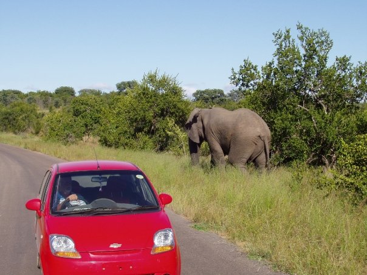
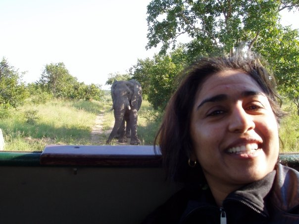

<p>

</p>

## Week 2 of fastai (Nov 2018)
Our NYC study group met again, and our guest for Week 2 was [Sylvain Gugger](https://www.linkedin.com/in/sylvain-gugger-74218b144/).  
This is Sylvain's intro:  
>I’m French but relocated to New York City three years ago. I’ve been a Math and Computer Science teacher for undergrads for seven years in Paris, and since I discovered deep learning (through the first part of this course) I’ve been really excited about Machine Learning. So far, I’ve mostly been teaching myself, between the part one (v1 and v2), blogs and online books.

Sylvain is fast.ai’s first Researcher in Residence (sponsored by Amazon Web Services), and he is the primary contributor to the development of fastai v1.  It was a privilege meeting Sylvain in person and learning first hand about the development of fastai.  

<p>

</p>

## Classifier for Elephants:  African vs Asian
Elephants are one of my favorite animals.  This is the closest I ever came to an elephant, while on a safari in South Africa in 2009.

<p>

</p>

I remember learning in school that there are two different types.  I cannot visually distinguish between the two types.  

I learned, after reading [What’s the Difference Between Asian and African Elephants?
](https://www.britannica.com/story/whats-the-difference-between-asian-and-african-elephants), that's it's all in the **ears**.

>Asian and African elephants can be differentiated most easily by their **ears, their head shape, and their tusks**.
The easiest way to distinguish African elephants from Asian elephants is to look at the ears. African elephants have much larger ears that look sort of like the continent of Africa, while Asian elephants have smaller, round ears. Elephants’ ears dissipate their body heat, and African elephants need to dissipate more heat than Asian elephants, since they live in a hotter climate (that’s getting even hotter with climate change). African elephants and Asian elephants also differ in head shape. African elephants have rounded heads, while Asian elephants have a twin-domed head, which means there’s a divot line running up the head. Finally, you can look at the tusks. Both male and female African elephants can have tusks, but only male Asian elephants can grow them. It’s important to note, however, that not all male Asian elephants nor all African elephants necessarily develop tusks.

Let's see how well a CNN classifier does in differentiating the two types of elephants!

### PART A:  Getting Data Ready

#### Step 1:  **Download URLs** (on local computer)

- for [african elephants](https://www.google.com/search?tbm=isch&source=hp&biw=1706&bih=773&ei=NuLVW_vZKeKGggfj5JzwDw&q=african+elephants&oq=african+elephants&gs_l=img.3..0l10.2032.4335..4430...0.0..0.80.943.17......0....1..gws-wiz-img.x6tVGnm8lj0)
	- this will put `download.csv` file in `Downloads` folder
	- rename to:  `african.csv`
	
- for [asian elephants](https://www.google.com/search?tbm=isch&source=hp&biw=1706&bih=773&ei=TOLVW4GiI8Ob_QbqwqOwBg&q=asian+elephants&oq=asian+elephants&gs_l=img.3..0l10.1085.3027..3092...0.0..0.65.837.15......0....1..gws-wiz-img.U3fVVgzco34 )
    	- this will put `download.csv` file in `Downloads` folder
	- Rename to:  `asian.csv`

#### Step 2:  **Upload both URLs file to GCP** (on local computer)

```bash
gcloud compute scp /Users/reshamashaikh/Downloads/african.csv jupyter@my-fastai-instance:~/tutorials/data
gcloud compute scp /Users/reshamashaikh/Downloads/asian.csv jupyter@my-fastai-instance:~/tutorials/data
```

>my example

```bash
% gcloud compute scp /Users/reshamashaikh/Downloads/african.csv jupyter@my-fastai-instance:~/tutorials/data
No zone specified. Using zone [us-west2-b] for instance: [my-fastai-instance].
Enter passphrase for key '/Users/reshamashaikh/.ssh/google_compute_engine': 
african.csv                                                                 100%   72KB 197.2KB/s   00:00    
% gcloud compute scp /Users/reshamashaikh/Downloads/asian.csv jupyter@my-fastai-instance:~/tutorials/data
No zone specified. Using zone [us-west2-b] for instance: [my-fastai-instance].
Enter passphrase for key '/Users/reshamashaikh/.ssh/google_compute_engine': 
asian.csv                                                                   100%   80KB 236.1KB/s   00:00    
% 
```

#### Step 3:  Log back into GCP

```bash
% gcloud compute ssh --zone=us-west2-b jupyter@my-fastai-instance -- -L 8080:localhost:8080                
Enter passphrase for key '/Users/reshamashaikh/.ssh/google_compute_engine': 
```

#### Step 4:  Go to appropriate `data` directory on GCP

```
jupyter@my-fastai-instance:~/tutorials/data$ pwd
/home/jupyter/tutorials/data
```

#### Step 5:  Convert to `.txt` files & Rename files

```bash
cat african.csv | tr  ',' '\n' > urls_african.txt
cat asian.csv | tr  ',' '\n' > urls_asian.txt
```

#### Step 6:  View the first 10 rows of the file

```bash
head urls_african.txt
head urls_asian.txt
```

>my example

```bash
jupyter@my-fastai-instance:~/tutorials/data$ head urls_african.txt 
https://media.buzzle.com/media/images-en/gallery/mammals/elephants/1200-elephants-performing-tricks-before-trainer.jpg
https://africageographic.com/wp-content/uploads/2017/03/Satao-II-a-6695-Dex-Kotze.jpg
https://i.pinimg.com/736x/17/34/95/173495e502ec35d16b24070a6d0cbb14--happy-elephant-cute-baby-elephant.jpg
https://i.pinimg.com/originals/57/39/13/573913e131f653e8b4600bba4a1e828b.jpg
https://c402277.ssl.cf1.rackcdn.com/photos/885/images/carousel_small/African_Elephant_7.27.2012_whytheymatter_HI_58709.jpg?1345580947
http://d2ouvy59p0dg6k.cloudfront.net/img/108954_374154.jpg
https://news.nationalgeographic.com/content/dam/news/photos/000/306/30651.ngsversion.1421960098780.adapt.1900.1.jpg
https://kids.sandiegozoo.org/sites/default/files/2017-07/elephant-tusks.jpg
https://nails.newsela.com/s3/newsela-media/article_media/2018/01/elem-es-african-elephant-dfbc68c5.jpg?crop=0%2C93%2C1366%2C860&height=496&width=885
https://elephantconservation.org/iefImages/2009/12/afele1.jpg
jupyter@my-fastai-instance:~/tutorials/data$
```

### PART A:  Working with the data
1.  Back to Jupyter notebook
- I began by making a copy of my `reshama_camels_clean.ipynb`.  Will call this project:  `reshama_elephants.ipynb`
```bash
cd /home/jupyter/course-v3/nbs/dl1/dl_fastai
cp reshama_camels_clean.ipynb reshama_elephants.ipynb
```

>my example

```bash
jupyter@my-fastai-instance:~/course-v3/nbs/dl1/dl_fastai$ pwd
/home/jupyter/course-v3/nbs/dl1/dl_fastai
jupyter@my-fastai-instance:~/course-v3/nbs/dl1/dl_fastai$ ls
lesson1-camels-reshama.ipynb  README.md                   reshama_camels.ipynb
lesson1-pets-reshama.ipynb    reshama_camels_clean.ipynb
jupyter@my-fastai-instance:~/course-v3/nbs/dl1/dl_fastai$ cp reshama_camels_clean.ipynb reshama_elephants.ipynb
```

I used 378 images.  After running the pre-trained CNN resnet34 model, these are the results.  Unsurprisingly, it did not perform as well as on the camels/horses data.  However, it is much more accurate than what I would predict, which would be similar to a random classifier, which would be 50%.  The error rate for this classifier is **29.9%**

<p>

</p>

After unfreezing last layers and re-running the neural net, the error improved to **25.4%**.
```bash
Total time: 00:18
epoch  train_loss  valid_loss  error_rate
1      0.343066    0.696139    0.164179    (00:08)
2      0.334749    1.065531    0.253731    (00:10)
```
 
Here's a visual on some of the misclassified images, dispelling the myth that deep learning is a black box and non-interpretable:
1.  In the middle image, both types of elephants are present.  So, it is unsurprising this image was misclassified.  
2.  In the lower left and lower right images, ears are missing in the image.  Since that is the key difference in differentiating between the two, it is unsurprising.
3.  In the top right image, the ears are hidden behind the splashing water.


<p>

</p>


This is the confusion matrix:  
- 12 and 38 African/Asian elephants were labeled correctly
- 9 and 8 African/Asian elephants were misclassified, respectively

<p>

</p>

After unfreezing the model and training some more, the error rate reduced to **19.4%**.  Making progress!
```bash
Total time: 00:16
epoch  train_loss  valid_loss  error_rate
1      0.239210    0.705375    0.223881    (00:07)
2      0.255059    0.636563    0.194030    (00:08)
```
Note:  re-train since valid loss > train loss, it is overfit right now.  

#### Next steps
- I used about 400 images.  I can re-run the neural networks with a larger sample and see if the error rate decreases.
- I will try different architectures, such as resnet50.  
- My **work in progress** is here:  [dl_fastai](https://github.com/reshamas/dl_fastai)
