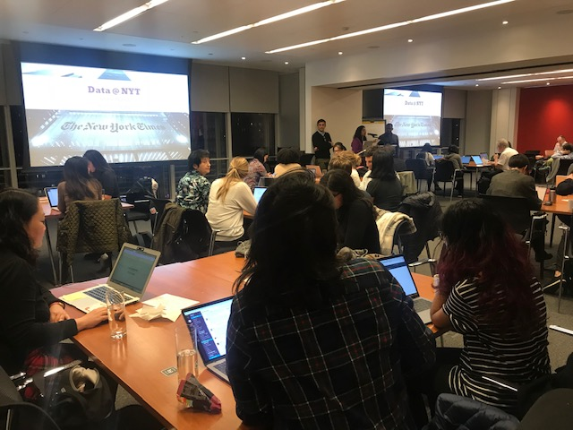

<figure>
   
 <figcaption>NYC WiMLDS event at NY Times, Oct 2018, photo credit to @jennkanjana</figcaption>
</figure>

## Background
In October 2018, I was invited to the Google [Women Techmakers Leads Summit](https://events.withgoogle.com/women-techmakers-leads-summit/).   Attendance for the summit was by invitation to GDG (Google Developers Group) organizers and some tech community group leaders.  I am an organizer for the NYC chapters of Women in Machine Learning & Data Science and PyLadies.  I was curious to learn which of my favorite women-in-tech organizations were represented.  This prompted me to conduct further research on what I consider to be some of the most impactful and active women's meetup groups.  Luckily for me, all 6 of them have a chapter in New York City:
- [Women Who Code](https://www.womenwhocode.com/networks) (WWCode)
- [Girl Develop It](https://www.girldevelopit.com/chapters) (GDI)
- [PyLadies](https://www.pyladies.com/locations/)
- [R-Ladies](https://rladies.org/about-us/history/)
- [Women in Machine Learning and Data Science](http://wimlds.org/chapters/) (WiMLDS)
- [Write/Speak/Code](https://www.writespeakcode.com) (WSC)

## Membership by Women-in-Tech Group
This horizontal histogram plots membership statistics as well as number of Twitter followers ordered by the most populous groups.  

<iframe width="750" height="500" src="https://datastudio.google.com/embed/reporting/1GRHGgx6VnbmSbOWCbrLbzsZKys_-JmwY/page/qzrc" frameborder="0" style="border:0" allowfullscreen></iframe>

We can see from the pie chart that Women Who Code has the greatest percentage of members at an impressive **45%**.  Girl Develop It comes in second at **30%**.  The remaining **25%** is comprised of the 4 groups:
- PyLadies:  **~10%**
- R-Ladies:  **8%**
- WiMLDS:  **5.5%**
- Write/Speak/Code:  **1.2%**

<iframe width="750" height="500" src="https://datastudio.google.com/embed/reporting/1GRHGgx6VnbmSbOWCbrLbzsZKys_-JmwY/page/c9uc" frameborder="0" style="border:0" allowfullscreen></iframe>

## Comparing Statistics
The plot below shows 5 different key statistics.  
1.  On the x-axis, the groups are plotted in the order in which they were founded.  The year of founding is shown below the group name. 
2.  We can see there is a correlation between number of members and twitter followers for each group (upper two lines).
3.  The two lines representing number of chapters and countries for each group are the lower two lines.  
  - Both Girl Develop It and Write/Speak/Code are only represented in the United States.
  - Aside from the US-only groups, for the other 4 groups, we can see a relationship between number of chapters and number of countries represented.
  - R-Ladies is the most broadly present group.  They have 120 chapters in 40 countries.

<iframe width="750" height="500" src="https://datastudio.google.com/embed/reporting/1GRHGgx6VnbmSbOWCbrLbzsZKys_-JmwY/page/d1rc" frameborder="0" style="border:0" allowfullscreen></iframe>

## Insider Insights
The majority of these organizations are led by volunteers.  Almost all chapter events are organized by volunteers.  These groups have worked diligently to build and support their communities.  

Please do not reach out to these organizations for *unpaid marketing*. 

We often receive requests with the magic **D-word**, such as: 

>We support diversity.  Can you promote our [product / organization / event / job posting]?

>We support diversity.  Can you share our [event / product]?  We will share your logo in return.

>We want to help women in data science.  Can I drop into your next event to do a 10-minute pitch on our [for-profit program]?

Support them by making a monetary contribution and building an authentic business partnership.  

## Guidelines for Engagement
Prior to joining any of the organizations or attending their events, it is essential to become familiar with these details:  
-  **Mission:**   read the mission statement of the organization
-  **Code of Conduct:**   read the CoC of the organization
-  **Membership:**   some of the organizations are open solely to women and **gender minorities**. Others are open to male allies.  Be informed and respectful of their membership requirements before joining.  

These meetup groups are for women in tech/coding/analytics.  These organizations are *not* for meeting women to date.  Anyone who contacts a meetup member for a dating proposition will be removed and blocked from the group.  

## Data & Tools

### Data
- The statistics represented were updated November 2018.

### Tools
- Google spreadsheets were utilized to store the data.
- Source data is available in this [women-in-tech spreadsheet](https://docs.google.com/spreadsheets/d/105VtTjnMyhnqItMYORNxMkurb6essQN1xGW7RArjA-Q/edit?usp=sharing)
- Google [Data Studio](https://datastudio.google.com/u/0/navigation/reporting) to produce the visualizations.

