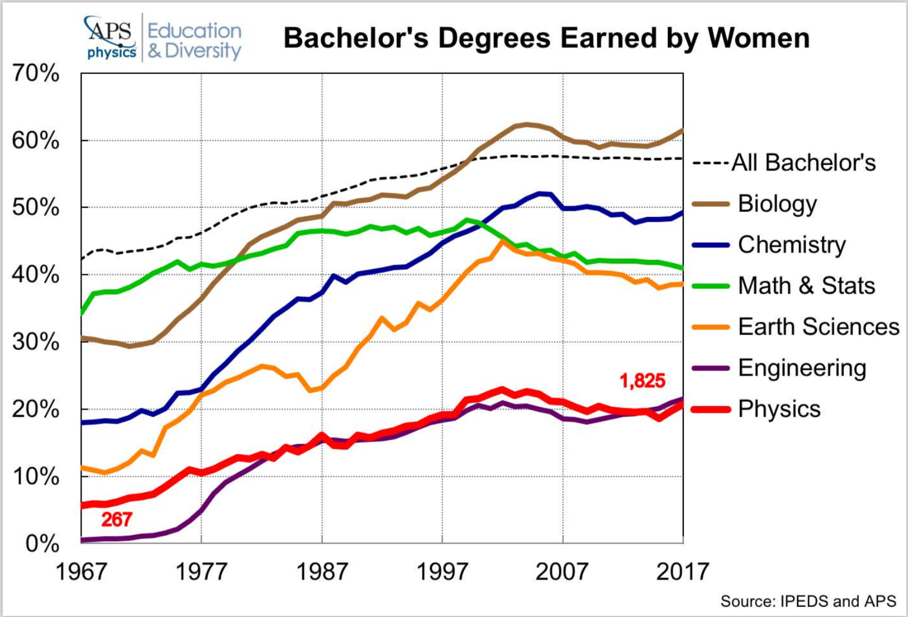
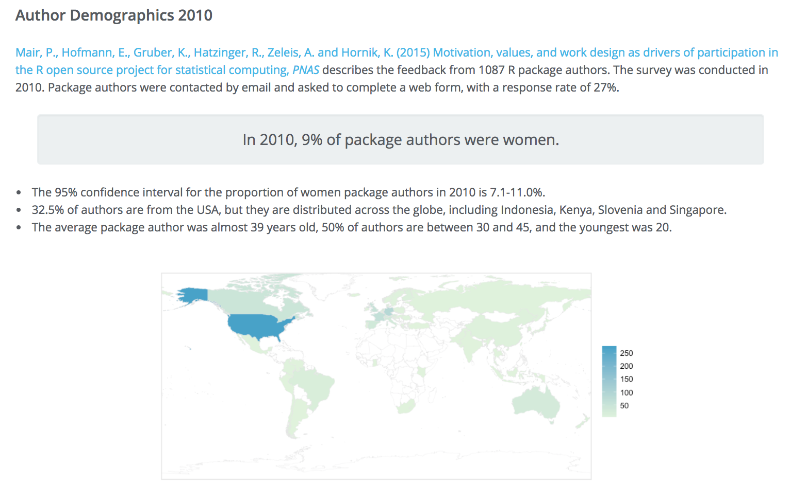
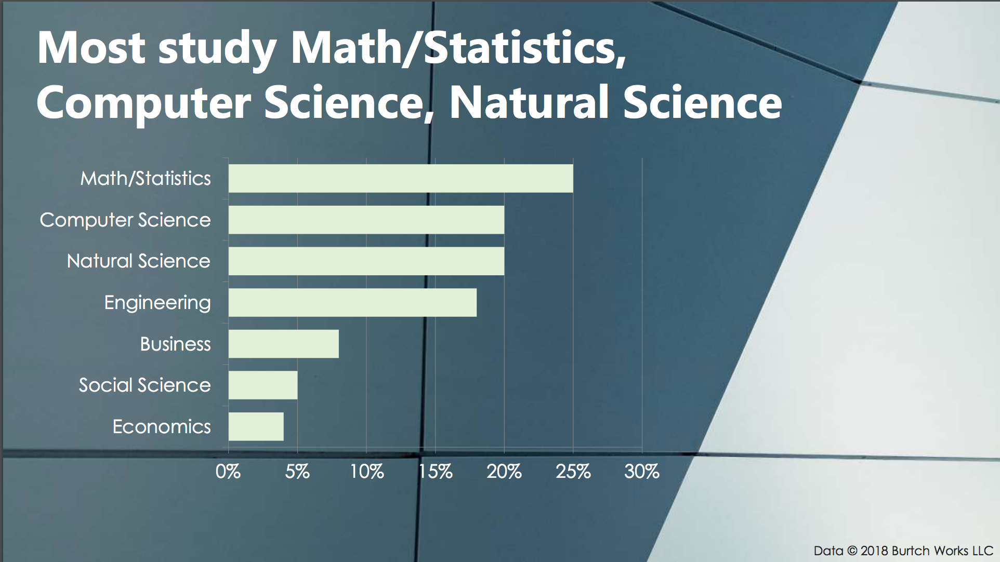
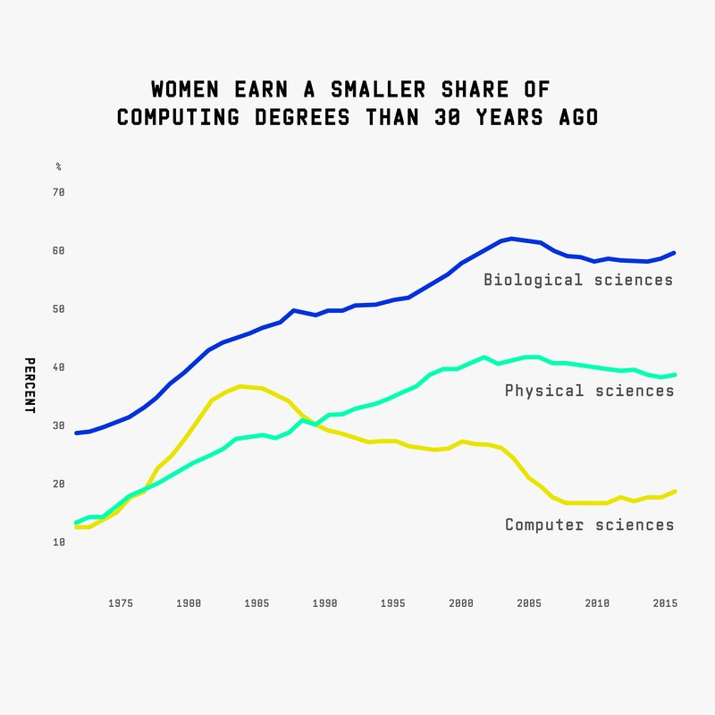
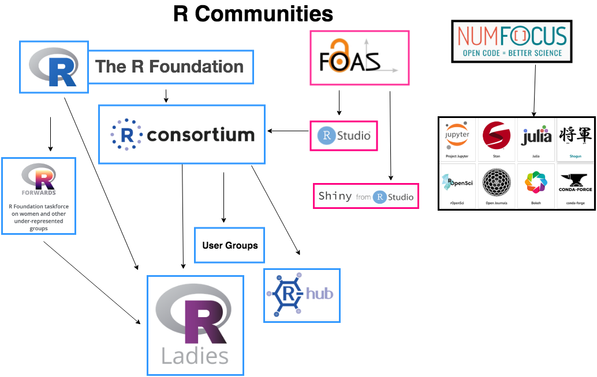
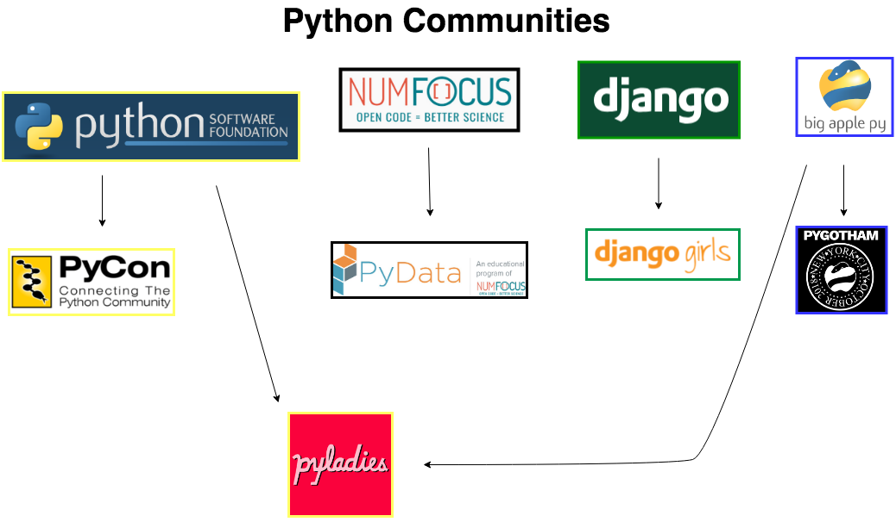

There is a general understanding in the world of data and coding that the R community is impressively welcoming and inclusive of women.  Python does not necessarily have a reputation for being exclusive, but we do not often hear accolades of its inclusivity either.  In this article, I compare numbers of users in the R and Python communities.  I also compare statistics on the respective women's meetup organizations for each language:  R-Ladies and PyLadies.  

## What makes people think R is more inclusive, anyway?

### Open Source Contributions

#### R Package Authors
In 2010, **9%** of [package authors](https://forwards.github.io/data/) were women.  Data is **self-reported** with a 27% response rate. 

This plot was taken from [Gender Ratios of Programmers](https://blog.revolutionanalytics.com/2016/06/programmers-gender.html) (2016 data) and shows the percent women GitHub contributors for some popular coding languages.  Note that this data is **gender-inferred**, *not* **self-reported gender.**  For the languages of interest here, we see that these are the statistics:  
- R:  **9.3%**
- Python : **2.0%**

While these stats are shockingly low for both groups, R has more than 4 times more female contributors than Python.

This plot was presented in [Inequality of Underrepresented Groups in PyData Leadership](http://nbviewer.jupyter.org/github/scopatz/nf-project-inequality/blob/9b83df3090c9b9b1b953d2905d428b71165ce607/nf-project-inequality.ipynb).  It shows projects that are sponsored by NumFOCUS, an organization that provides fiscal support to open source projects.  The projects that are higher up show a greater degree of gender inequality in open source contributions.  We can see many Python projects (NumPy, PyMC3, matplotlib) are higher up and rOpenSci is one with a low degree of inequality.  

### Conference Speakers

The New York R 2018 conference had 45% women speakers. 

<blockquote class="twitter-tweet" data-lang="en">
45% of speakers are female 👍🏼<a href="https://twitter.com/NumFOCUS?ref_src=twsrc%5Etfw">@NumFOCUS</a> <a href="https://twitter.com/wimlds?ref_src=twsrc%5Etfw">@wimlds</a> <a href="https://twitter.com/hashtag/diversityawards?src=hash&amp;ref_src=twsrc%5Etfw">#diversityawards</a> <a href="https://twitter.com/hashtag/rstatsnyc?src=hash&amp;ref_src=twsrc%5Etfw">#rstatsnyc</a> <a href="https://t.co/UNbqBESRa4">https://t.co/UNbqBESRa4</a>
&mdash; Reshama Shaikh (@reshamas) <a href="https://twitter.com/reshamas/status/987384241070616576?ref_src=twsrc%5Etfw">April 20, 2018</a></blockquote>

**Data is being collected and shared** for the [useR! conference](https://user2018.r-project.org/).  Data was last [published for 2016](https://forwards.github.io/data/) which shows:  
- 2016 saw a rise in the proportion of female attendees from 19% to 28%
- "The numbers of female invited speakers has increased from zero in the early years (2004-2008) through one in later years (2009-2013) to two in recent years - this is the level that useR! is seeking to maintain for now."

### Membership Numbers
Python is, by far, more widely used than R.  Both languages are popular for data science and analysis.  Python, however, is used widely by computer scientists, web developers (Django), software engineers, and many others.  According to the [2018 Stack Overflow Developer's Survey](https://insights.stackoverflow.com/survey/2018/#technology-programming-scripting-and-markup-languages), this is the breakdown of users:  
- R:  **6.1%**
- Python:  **38.8%**

These are the breakdowns for membership in the meetup groups:
- R-Ladies: **29.5K**
- PyLadies:  **36.5K**

Given that there are more than **6x** the number of users of Python as compared to R (loose deduction from survey), we would expect the number of meetup members to be significantly greater.   But, the meetup population for PyLadies is **only 1.25x** greater than R-Ladies.   

### Demographics Data
A [2017 demographics study](https://blog.revolutionanalytics.com/downloads/Voice%20of%20R%20Community.pdf) by the R Consortium found the following:  
- 3618 users responded
- Gender:  
   - 14% women
   - ~83% men
   - 2% did not answer
   - ~1% other
- Industry
   - 35% academic
   - 65% industry

I would like to repeat a previous statement:  **Data is being collected and shared.**  The *collecting and sharing* of key demographic data indicates a commitment to understanding and improving diversity.  

### Amplification / Networking / Marketing on Twitter
R-Ladies has a designated twitter account to celebrate International Women's Day (IWD), [@rladies_iwd2018](https://twitter.com/rladies_iwd2018).  Last year, on IWD, I noticed blazing R-Ladies activity on Twitter. From March 7 to 8, 2018, they posted over 400 tweets highlighting women in R.  Here is one of those tweets:  

<blockquote class="twitter-tweet" data-lang="en">
Another brilliant R-Lady! <a href="https://t.co/x1fhRE5U6Y">https://t.co/x1fhRE5U6Y</a> <a href="https://twitter.com/hashtag/rladies?src=hash&amp;ref_src=twsrc%5Etfw">#rladies</a> <a href="https://twitter.com/hashtag/iwd2018?src=hash&amp;ref_src=twsrc%5Etfw">#iwd2018</a> <a href="https://t.co/bd2Tksseib">pic.twitter.com/bd2Tksseib</a>
&mdash; IWD 2018 featured R-Ladies (@rladies_iwd2018) <a href="https://twitter.com/rladies_iwd2018/status/972020099166212096?ref_src=twsrc%5Etfw">March 9, 2018</a></blockquote>

## How is the R community achieving inclusion at such a high rate?
How is the R community so successful and what can the Python community learn from the R community?

These are some feasible reasons for the R community's culture:
- Infrastructure (board vs no board)
- Foundational:  Underlying field of study (statistics vs computer science)
- Funding
- Scope
- R Communities Connected Network
- R-Ladies Network
- Enthusiasm / Priority
- Prominent Male Supporters

### Infrastructure
PyLadies has no board.  I discovered via a deep Google search a [PyLadies Kit](https://media.readthedocs.org/pdf/pyladies-kit/latest/pyladies-kit.pdf) which I do not see linked on the [main Pyladies website](https://www.pyladies.com/):

>The global PyLadies community has no formal organization behind it; no board of directors, no appointed leadership.
We found that PyLadies growth and success stems from being decentralized and non-bureaucratic.
We do have a few point people that can answer and address general, or non-location specific PyLadies questions. If
you are not a local PyLadies leader, you may do so via our general email. If you are a local PyLadies leader, you may
email our organizers list (must be added to the mailing list first).

[R-Ladies Global](https://rladies.org/about-us/team/) has an active board.  I am an organizer for both Women in Machine Learning & Data Science (WiMLDS) and PyLadies.  As a board member of WiMLDS, I can say from personal experience that WiMLDS is better able to support our chapters with a board and designated leadership.  It is indeed challenging, since it is a volunteer position, but well worth the effort.  

The PyLadies website currently has [89 chapters listed](https://www.pyladies.com/locations/), but 17 of them are defunct, and that data has not been updated.  Determining how many active chapters and members was a tedious and manual process.  Comparatively, R-Ladies has a [central account](https://www.meetup.com/pro/rladies/) where it is easy to obtain the numbers.  Some of the PyLadies chapters are included in the [PSF account](https://www.meetup.com/pro/python-software-foundation-meetups/) which includes various Python user groups. 

Here is a recently published [PyLadies Overview](https://prith13.github.io/posts/2018/11/pyladies-overview/).  

### Foundational
The proportion of women graduating with degrees in statistics (44%) is significantly greater than those graduating in computer science (19%).  The pipeline of R users and statisticians is rich with women compared to computer science.  

<iframe width="750" height="500" src="https://datastudio.google.com/embed/reporting/1C8ouhyJ9WVyvGftSkkAhiEqAuWvksE5n/page/yr0c" frameborder="0" style="border:0" allowfullscreen></iframe>

Data scientists come from a [number of disciplines](https://www.burtchworks.com/wp-content/uploads/2018/05/Burtch-Works-Study-DS-2018-Webinar-Slide-Deck.pdf).  For those who study math/statistics (25%), natural science (20%), social science (5%), and economics (4%), R is the primary language.  For those who study computer science (20%) (and some math people), C++ or Python is more likely to be the starting coding language. In summary, there are more entry points into R from various disciplines compared to Python, and those various disciplines have a greater gender balance than in computer science.  

Membership in the American Statistical Association (ASA) is [53% women](http://www.asanet.org/research-and-publications/research-sociology/trends/asa-membership-gender). 

We can make a rough comparison to computer scientists.  The Association for Computing Machinery is the largest society of computer scientists.  I emailed ACM to obtain female membership percent, and I received the following response:  
>ACM has nearly 100,000 members from more than 190 countries.   We do not have any additional information to provide.

### Funding
This hypothesis has not been tested, because I do not have the data.  But, it could be a possible factor:  

$$
\begin{align*}
   H_0&: \text{R and Python receive equal funding (adjusted by number of users)}
   \\
   H_1&: \text{R receives greater funding than Python}
\end{align*}
$$

### R-Ladies is a priority project for R Consortium
In March 2018, the R Consortium announced that R-Ladies is a [top level project](https://www.r-consortium.org/announcement/2018/03/27/r-consortium-welcomes-r-ladies-as-a-top-level-project).  This provides R-Ladies with a longer term budget cycle (3 years instead of 1 year) to support their community. R-Ladies will also have a voting seat on the [Infrastructure Steering Committee](https://www.r-consortium.org/about/isc-charter) of R Consortium.  

### R Open Source Initiative
The annual [rstudio::conf](https://www.rstudio.com/conference/) is scheduled for January 17-19, 2019 in Austin, Texas.  On Saturday, January 19, there is a [tidyverse dev day](https://www.eventbrite.com/e/tidyverse-developer-day-tickets-1617065687):    
>The broad goal of this event is to nurture regular contributors to the tidyverse by having a day where we can work together on anything ranging from submitting your first pull request, to working on a package.

### R Forwards Taskforce
The [R Forwards](https://forwards.github.io) task force was set up by the [R Foundation](https://www.r-project.org/foundation/) in December 2015 to address the underrepresentation of women and rebranded in January 2017 to accommodate **more under-represented groups such as LGBT, minority ethnic groups, and people with disabilities in the R community.**

### rOpenSci
[rOpenSci](https://ropensci.org/about/) is an organization whose mission is to make scientific data retrieval reproducible.  There is 
rOpenSci [Educators Collaborative:  What Educational Resources Work Well and Why?](https://ropensci.org/blog/2018/07/25/educollab-resources/) which provides resources to educators of the R language.  

### R Communities Connected Network
Below is a network of the R communities.  We can see there is a tight network of collaboration.  

### Scope
R is used for statistical analysis and has about 10K CRAN packages.  Python has the ability to be deployed at scale and the Python Package Index ([PyPI](https://en.wikipedia.org/wiki/Python_Package_Index)) offers over 100K libraries.  The fact that R is statistically based with a specific focus makes it easier to manage.  As an analogy, it is much easier to know neighbors and shopkeepers in a small town than in a large city.  

### Prominent Women and URG in R and the R Network
The R-Ladies network is broad.  They have [120 chapters in 40 countries](https://www.meetup.com/pro/rladies/).  It’s easy to find R-Ladies (to speak at conferences).  There is an [R-Ladies directory form](https://rladies.org/r-ladies-directory-form/) which asks this question:   
> Could we list you as someone willing to speak about your relevant R topics/experience?

Here is the [complete R-Ladies list](https://rladies.org/ladies-complete-list/).  (Warning:  the website is *very slow* to load.)

As a comparison, PyLadies has 45 chapters in 19 countries which is surprisingly narrow given its user base.  

There are a number of prominent women who are making significant contributions in making R welcoming to beginners and people of different backgrounds and growing the community:  
- [Gabriela de Queiroz](https://twitter.com/gdequeiroz), Senior Developer at IBM and Founder of R-Ladies
- [Jenny Bryan](https://twitter.com/JennyBryan), software engineer at RStudio and Adjunct Professor of UBC, creator of [stat 545](http://stat545.com/), [Happy Git with R](http://happygitwithr.com/), package reprex, readr, and google sheets and ordinary member of the R Foundation
- [Di Cook](https://twitter.com/visnut), Professor at Monash University, ordinary member of the R Foundation
- [Jesse Mostipak](https://twitter.com/kierisi), managing director of data science at teaching trust, creator of R4DS online learning community
- [Mara Averick](https://twitter.com/dataandme), tidyverse developer advocate at RStudio and well known for her frequent tweets on R resources
- [Erin LeDell](https://twitter.com/ledell), leadership at R-Ladies Global

There are a dozen women on the [leadership team and "R-Masters"](https://rladies.org/about-us/team/).  The list is very long, in a good way.

### Enthusiasm / Priority
R-Ladies are either more enthusiastic and/or more communicative.  There are many related twitter accounts:  
- [@WeAreRLadies](https://twitter.com/WeAreRLadies), 4900+ followers, which has a weekly rotating curator for the @RLadiesGlobal community #rladies. 
- [@RCatLadies](https://twitter.com/RCatLadies) with this [#rcatladies](https://twitter.com/hashtag/rcatladies?src=hash)
- [@R_Forwards](https://twitter.com/R_Forwards):  taskforce on women and other under-represented groups
- [@_R_Foundation](https://twitter.com/_R_Foundation)

### Prominent Male Supporters
The R community has prominent data scientists that are vocally supportive of women in the R community and R-Ladies:  

- [Hadley Wickham](https://twitter.com/hadleywickham), Chief Scientist at RStudio, Adjunct Professor
- [David Robinson](https://twitter.com/drob), Chief Data Scientist at DataCamp
- [Jared Lander](https://twitter.com/jaredlander), CDS of Lander Analytics / Organizer of NY Open Stats Meetup & NY R Conference
- [Nicholas Horton](https://twitter.com/askdrstats), Biostatistician and Professor at Amherst College
- [David Meza](https://twitter.com/davidmeza1), Chief Knowledge Architect at NASA
- [Noam Ross](https://twitter.com/noamross), Senior Research Scientist at EcoHealth / Editor at rOpenSci
- [Karthik Ram](https://twitter.com/_inundata), Data Scientist at Berkeley Institute for DS / Lead for rOpenSci project

### Diversity Scholarships
[rstudio](https://blog.rstudio.com/2018/08/10/rstudio-conf-2019-diversity-scholarships/) is offering 32 domestic diversity scholarships and 6 internatioal scholarships to its 2019 conference. 

## Table of Key Characteristics of R-Ladies and PyLadies
This table compares key details of R-Ladies and PyLadies, as well as Women in Machine Learning and Data Science (WiMLDS).  WiMLDS is included because it serves both populations in data science.

| Detail            | R-Ladies     | WiMLDS | PyLadies         |  
|-------------------|--------------|--------|------------------|
| Founded           | 2012         | 2013   | 2011             |   
| Users (a)         | 6.1%         |        | 38.8%            |
| Language          | R            |        | Python           |
| Sponsors          | R Consortium | none   | PSF (b)          |  
| Funding           | $?           | none   | $?               |
| Sponsor Followers | [5.9K](https://twitter.com/RConsortium)             |        | [223K](https://twitter.com/ThePSF) |
| Field of Study    | Statistics   |        | CS (c), others   |
| Board             | yes          | yes    | no               |
| Members           | 29,455       | 20,140 | 36,500           |
| Chapters          | 120          | 34     | 45               |
| Countries         | 40           | 17     | 19               |
| Slack Members     | 650          | 751    | 1515             |
| Twitter Followers | 8112         | 8376   | 10000            |
| Affiliated Conferences | Rstudio, useR!      | none   | PyCon            |
| Other Conferences | NYR | none |      |
| Language First Released |   1993 |         | 1990            |

Notes:  
- SO (a) = Stack Overflow Survey data
- PSF (b) = Python Software Foundation
- CS (c) = Computer Science

It is interesting to note that Python and R were released in the early 90's (1990 and 1993) and the women's communities were created nearly 20 years later.  Python did not add a woman to their core developer team until 2017, and it seems that R does not have a woman on its core development team.  This sheds some light on the need for creating, growing and supporting communities for women and all under-represented groups.  

## What steps has the Python community taken?
The Python community has acknowledged the lack of diversity in speakers, open source contributors and developers/engineers.  There are various organizations with initiatives to improve diversity.  

*Note:*  This article is not intended to focus only on the New York City community.  I use examples of NYC events, but all the organizations have events that are world-wide.  

### Python Open Source
This article [By Welcoming Women, Python’s Founder [Guido van Rossum] Overcomes Closed Minds In Open Source](https://www.forbes.com/sites/oracle/2018/11/20/by-welcoming-women-pythons-founder-overcomes-closed-minds-in-open-source/#516361614a73) was published on November 20, 2018.  

>...van Rossum is dedicating himself to other efforts to support the wildly successful language and community. One such activity is mentoring women apprentices to the core team of about 30 developers.

>Since van Rossum’s invitation to mentor women, Python has added four women to the team of around 50 core developers, with one or two apprentices who might become core developers in the next year, he says.

#### Open Source Sprints
[Scikit-learn](https://scikit-learn.org/stable/) is the machine learning library of Python, and there is only 1 woman in the [100 top contributors](https://scikit-learn.org/stable/about.html#citing-scikit-learn).

To increase the participation of women in open source, and specifically for scikit-learn, [Andreas Mueller](https://twitter.com/amuellerml) has organized open source sprints with [NYC Women in Machine Learning and Data Science](https://github.com/WiMLDS/nyc-2018-scikit-sprint).  While the event was a positive learning experience, the impact is undetermined, with 5 pull requests merged at the event, and two more merged post-sprint.  It will take a while to make a significant dent.  Scikit-learn has frequent sprints, a listing can be found at the end of [this article](https://reshamas.github.io/highlights-from-the-2018-NYC-WiMLDS-scikit-sprint/).  

[NumFOCUS DISC and Jupyter](https://github.com/sbrice/disc-sprint-nyc-2018) held a sprint in October 2018 to increase diversity in open source.  The impact of that sprint has been published here:  [Highlights From The 2018 NYC DISC Sprint](https://medium.com/@sbrice/highlights-from-the-2018-nyc-disc-sprint-ac4cf34b1566). Six pull requests were merged, and 72% of the attendees were first-time contributors.

It is unclear how many open source sprints are being held, which are targeted to under-represented groups and their impact.  This data is not being tracked by a single organization.  

### Prominent Women in Python
There are many active women and URG in the Python community, but there is no central list.  Here are some.  **On the "Python Initiatives List" is to create a list for easy reference.**  
- [Audrey Roy Greenfeld](https://www.linkedin.com/in/audrey/) co-founder of PyLadies, co-author of [Two Scoops of Django](https://www.twoscoopspress.com/), and creator of cookiecutter Python package [a]
- [Hilary Mason](https://twitter.com/hmason) co-founder of DataGotham, Data Science expert
- [Renee Teate](https://twitter.com/BecomingDataSci) Creator/Host of Becoming a Data Scientist Podcast, and so many other resources
- [Lynn Root](https://twitter.com/roguelynn) Python Software Foundation member, PyLadies San Francisco Founder
- [Jessica McKellar](https://twitter.com/jessicamckellar) PyCon Staff, Python Software Foundation
- [Sarah Guido](https://twitter.com/sarah_guido) co-author of [Introduction to Machine Learning with Python](http://shop.oreilly.com/product/0636920030515.do)
- [Julia Evans](https://twitter.com/b0rk) avid blogger, prolific contributor to the community
- [Catherine Devlin](https://twitter.com/catherinedevlin) founder PyOhio
- [Anna Ossowski](https://twitter.com/OssAnna16) PyLadies Remote organizer
- [Nina Zakharenko](https://twitter.com/nnja) developer, active speaker

[a] [PyLadies was founded](https://en.m.wikipedia.org/wiki/PyLadies) in 2011 in Los Angeles, California by 7 women.  

### [Python Software Foundation](https://www.python.org/psf/) (PSF)
The Python Software Foundation manages the open source licensing of Python.  They also run PyCon as well as other Python conferences around the world.  They have a grants program for funding special projects.  PSF has [27 meetup groups](https://www.meetup.com/pro/python-software-foundation-meetups/) in 3 countries, totaling 46K members. 

#### [PyCon](https://www.pycon.org/)

PyCon [2018](https://us.pycon.org/2018/about/) was held in Cleveland, Ohio this past May.  It is the national conference, sponsored by PSF, and is the largest annual gathering for the community using and developing the open-source Python programming language.   PyCon organizers reached out to women to encourage them to submit proposals and they also provided mentoring around the process.  PyCon also offers diversity scholarships for its conference.

The 2016 impact of this process is:  
**% PyCon talks by women**:  
- 2011: 1%
- 2012: 7%
- 2013: 15%
- 2014: 33%
- 2015: 33%
- 2016: **40%**

<blockquote class="twitter-tweet" data-lang="en">
Hello from your <a href="https://twitter.com/pycon?ref_src=twsrc%5Etfw">@PyCon</a> Diversity Chair. % PyCon talks by women: (2011: 1%), (2012: 7%), (2013: 15%), (2014/15: 33%), (2016: 40%). <a href="https://twitter.com/hashtag/pycon2016?src=hash&amp;ref_src=twsrc%5Etfw">#pycon2016</a>
&mdash; Jessica McKellar (@jessicamckellar) <a href="https://twitter.com/jessicamckellar/status/737299461563502595?ref_src=twsrc%5Etfw">May 30, 2016</a></blockquote>

### NumFOCUS

NumFOCUS was founded in 2012, and it supports and promotes open source scientific software (some examples: Numpy, Pandas and Jupyter).  Beginning in 2017, they began a [Diversity in Scientific Computing (DISC)](https://numfocus.org/programs/diversity-inclusion) committee whose aim is to increase diversity in the open source community.  

#### Project Jupyter
Project Jupyter is taking on two interns from URG for their open source project development. 

<blockquote class="twitter-tweet" data-lang="en">
News! The <a href="https://twitter.com/ProjectJupyter?ref_src=twsrc%5Etfw">@ProjectJupyter</a> community is participating in <a href="https://twitter.com/outreachy?ref_src=twsrc%5Etfw">@outreachy</a> to grow our community and increase our diversity. We&#39;ll take on two interns this cycle from under-represented backgrounds thanks to generous support from <a href="https://twitter.com/UCBIDS?ref_src=twsrc%5Etfw">@UCBIDS</a> and <a href="https://twitter.com/NumFOCUS?ref_src=twsrc%5Etfw">@NumFOCUS</a> <a href="https://t.co/VbRI6vDeEF">https://t.co/VbRI6vDeEF</a>
&mdash; Chris Holdgraf (@choldgraf) <a href="https://twitter.com/choldgraf/status/1067833035100348416?ref_src=twsrc%5Etfw">November 28, 2018</a></blockquote>

#### [PyData](https://pydata.org/)

PyData is an educational program of NumFOCUS which provides a forum for the international community of users and developers of data analysis tools to share ideas and learn from each other. They have a [community of meetup groups](https://www.meetup.com/pro/pydata/) with 100K members in 120 groups in 47 countries.  They host meetup events as well as annual conferences in [various cities](https://pydata.org/events/).  

NumFOCUS / PyData offers diversity scholarships.  But, there is no formal relationship between PyData and PyLadies.  Sharing PyData events happens organically.  In the case of PyData NYC 2018, PyLadies NYC shared their conference and diversity scholarship information because I, as an organizer for NYC PyLadies, knew the organizer for NYC PyData.  In past years, conference information was not formally shared.  

It is unclear if there is a formal collaboration between NumFOCUS and the Python Software Foundation.  

### [Big Apple Py](https://bigapplepy.org/)

Big Apple Py is an organization which supports open source in New York City.  They organize the annual Python conference [PyGotham](https://2018.pygotham.org/).  They are a transparent and inclusive NYC organization which is committed to increasing diversity of speakers and attendees at PyGotham.  They offer NYC PyLadies a booth at the conference free of charge.  

### [SciPy](http://conference.scipy.org/)
SciPy hosts the annual Scientific Computing with Python conference.  There are generally two events, one in Austin, Texas and one in Europe.  From their [past events](http://conference.scipy.org/past.html), it seems that some years there is also a conference in South America.  They have a [Diversity Committee](https://scipy2018.scipy.org/ehome/299527/648148/), and they offer diversity fellowships and assistance to first-time abstract submitters.  The conference schedule also includes 2 days of open source sprints which cover over a dozen Python packages. 

### [Django Girls](https://djangogirls.org/)
Django is a Python-based free and open-source web framework, which follows the model-view-template architectural pattern. It is maintained by the Django Software Foundation.  

Django Girls is a non-profit organization and a community that empowers and helps women to organize free, one-day programming workshops by providing tools, resources and support. During each of their events, 30-60 women build their first web application using HTML, CSS, Python and Django.

In 2015, the Django Girls community organized **89 events** - almost 6 times as much as year before. They went to **77 cities** across **36 countries** and all 6 continents.

In 2015, **2785 women** attended their events, and more than **8,600 applied**. All of those events were organized by volunteers: an army of 221 organizers and 920 coaches supported by 393 sponsors.

In 2015, the Django Girls tutorial was translated to **12 languages** thanks to thousands hours of work contributed by **358 translators**.  **169,107 people** visited the [Django Tutorial](https://tutorial.djangogirls.org/en/) generating more than 2 million page views!  More data is available in the [2015 Django Girls Report](https://djangogirls.org/2015/).  

## How connected are the Python communities?
Below is a network of some of the Python communities.  It is unknown whether and to what extent the communities collaborate with each other.  

## What more can the Python community do?
The Python community is large and disparate.  A good starting point would be for all the entities to connect, collaborate and measure/share diversity statistics.  

Here are some ideas:   
1.  Create an entity designated solely for diversity for under-represented groups and connect it to all the Python communities. 
  - Create a full time position funded by the PSF to make increasing diversity a priority
    - Increase PyLadies membership and track statistics
    - Track number of women and URG speakers at conferences and make goals for increasing those statistics
2.  Connect the Python communities
3.  Create an official/unofficial "Board" for PyLadies
  - Connect women in Python with each other
4.  Create a list of active women and URGs in Python for speaking at conferences
5.  Get more male allies
6.  Celebrate the broad scope of Python
7.  Involve more members from under-represented groups to be contributors to open source
8.  Reach out to under-represented group in universities and high schools to become involved in the Python community at an earlier age
9.  Create a central list of Python conferences and events
10.  Collaborate on a repository on how to submit Calls for Proposals for Conferences
11.  Create a central repository of resources for Python users and **educators**.  (There is a [Python Educators Working Group](https://wiki.python.org/psf/PythonEduWG) with the PSF, but no specific information.)
12.  Create an initiative to make Python friendly for beginners.  (There are some [beginner resources](https://wiki.python.org/moin/BeginnersGuide/Programmers) from the PSF, but no google searches have led me here.)
13.  Create a repository of Python open source sprints and track and publish their impact.  

## Contact 
I welcome any updates or edits to this article.   I can be contacted via email at reshama@wimlds.org 

## References
- [Bachelor’s Degrees Earned by Women, by Major](https://www.aps.org/programs/education/statistics/womenmajors.cfm)
- [NSF Field of Degree: Women](https://www.nsf.gov/statistics/2017/nsf17310/digest/fod-women/)
- [Statistics We Still Have a Problem and We Need Your Help](https://statisticalrecipes.blogspot.com/2018/10/statistics-we-still-have-problem-and-we.html)
- [R vs Python:  Meta-review on Usability, Popularity, Pros & Cons, Jobs, and Salaries](https://www.stoodnt.com/blog/r-vs-python-metareview-usability-popularity-pros-cons-jobs-salaries/)
- [R vs Python for Data Science](https://www.kdnuggets.com/2015/05/r-vs-python-data-science.html)
- [Redmonk Language Rankings](https://blog.revolutionanalytics.com/popularity/)
- [2017 SAS, R, or Python Flash Survey Results](https://www.burtchworks.com/2017/06/19/2017-sas-r-python-flash-survey-results/)
- [Women a Growing Force in Statistics and Data Science, Reports Washington Post](https://thisisstatistics.org/women-a-growing-force-in-statistics-and-data-science-reports-washington-post/)
- [Women In Science, Technology, Engineering, And Mathematics (STEM)](https://www.catalyst.org/knowledge/women-science-technology-engineering-and-mathematics-stem)
- [AI is the Future, But Where are the women?](https://www.wired.com/story/artificial-intelligence-researchers-gender-imbalance/)
- [Gender Ratio of Programmers, by Language](https://blog.revolutionanalytics.com/2016/06/programmers-gender.html)
- [Inequality of underrepresnted groups in PyData leadership](http://nbviewer.jupyter.org/github/scopatz/nf-project-inequality/blob/9b83df3090c9b9b1b953d2905d428b71165ce607/nf-project-inequality.ipynb)
- [Stop Mapping Names to Gender](https://ironholds.org/names-gender/) on gender inference
- [Don't Just Open the Door, Welcome People Through It](https://snarky.ca/dont-just-open-the-door-welcome-people-through-it/)
- [Outreachy & Jupyter: Supporting diversity in open communities](https://blog.jupyter.org/outreachy-jupyter-supporting-diversity-in-open-communities-dfa78db4b0bd)
- [Diversity in Open Source is Even Worse Than in Tech Overall](https://www.wired.com/2017/06/diversity-open-source-even-worse-tech-overall/)

## Acknowledgements
Special thanks to the following people who provided information for my blog via twitter or email:  
- [Emily Robinson](https://twitter.com/robinson_es/status/1067107701086478337) for sharing demographic data and R organization structure
- [Jenny Bryan](https://twitter.com/JennyBryan/status/1067101086970916864) for sharing the Guido Van Rossum article
- [Greg Wilson](https://twitter.com/gvwilson) for sharing PyCon percent women speakers
- [Gabriela de Queiroz](https://twitter.com/gdequeiroz/status/1067108850128568323) for sharing R-Ladies and Pyladies contributors
- [Fernando Masanori](https://twitter.com/fmasanori/status/1067415718067613696) for sharing statistics on Django Girls
- [David Smith](https://twitter.com/revodavid/status/1067519542128254976) for sharing R demographics survey for 2017
- [Catherine Zhou](https://twitter.com/catherinezh/status/1067487447376896003) for sharing entry degrees to data science and R
- [April Wright](https://twitter.com/WrightingApril/status/1067825378184462336) for sharing the Educators Collaborative of R and SciPy
- [Mariatta Wijaya](https://www.linkedin.com/in/mariatta/) for sharing more names in section "Prominent Women in Python"
