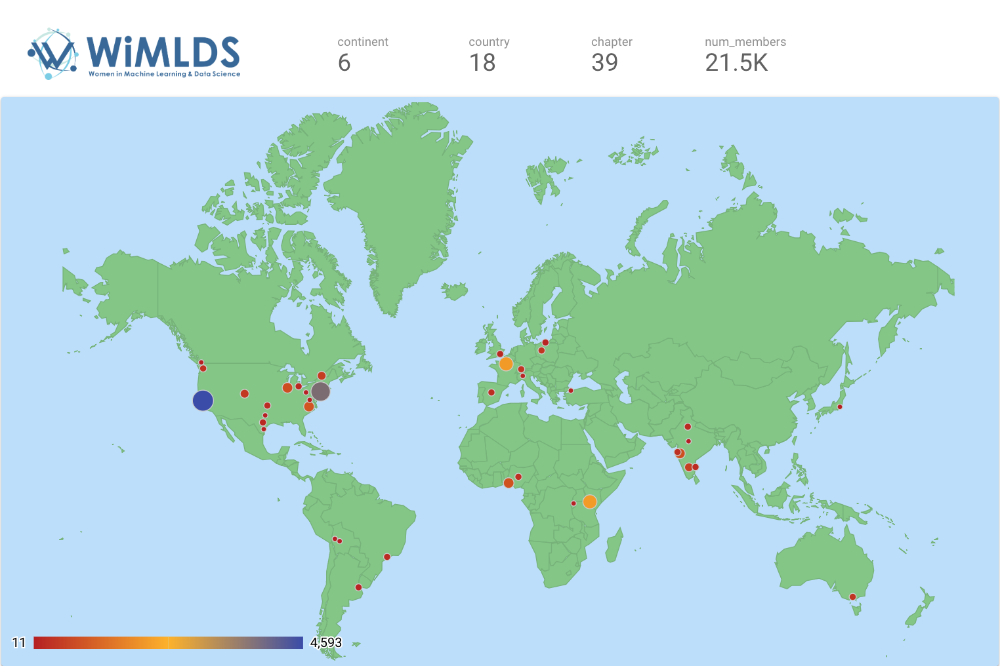

## About
Women in Machine Learning and Data Science (WiMLDS) is a non-profit 501 (c)(3) corporation with headquarters in New York, New York.  It was founded in 2013.

The mission of WiMLDS is to support and promote women and gender minorities who are practicing, studying or are interested in the fields of machine learning and data science.

## Summary

| Dimension                                 | Stats            |
|-------------------------------------------|-------------------|
| Data for time period ending               | 31-Dec-2018       |
| Report published                          | 02-Jan-2019       |
| Number of continents represented          | 6                 |
| Number of countries represented           | 18                |
| Number of cities represented (chapters)   | 39                |
| Number of members                         | 21,500            |
| Total number of meetups organized to date | 332               |
| Twitter followers: [@wimlds](https://twitter.com/wimlds) | 8700 |
| Data reference | [data source](https://docs.google.com/spreadsheets/d/1el7TG5566-3Zs9KUrlDqjS2_5Tvs4R-T9BVzyl_DBTA/edit?usp=sharing) / [visualization URL](https://datastudio.google.com/embed/reporting/1kB3wUBjUovKY_V81NldPy6zPD9E7U4M9/page/068e)
| Website                                   | [wimlds.org](http://wimlds.org) |

<b>General note:  click on "full screen" icon on lower right to see enlarged images of visualizations in this article. </b>

## Introduction to the WiMLDS Annnual Report
WiMLDS celebrated its 5th anniversary in December of 2018.  This meetup community has seen significant worldwide growth over the past five years, particularly in 2018.  The objective of the report is to share statistics of the WiMLDS community.

<b>Another objective is to improve diversity by connecting the WiMLDS community with the greater data science, machine learning and artificial intelligence communities.</b>

## Map of WiMLDS Chapters

<iframe width="600" height="450" src="https://datastudio.google.com/embed/reporting/1kB3wUBjUovKY_V81NldPy6zPD9E7U4M9/page/f38e" frameborder="0" style="border:0" allowfullscreen></iframe>

## Growth
Twenty-five new chapters were founded in 2018, bringing the total number of WiMLDS chapters to 39.  Nearly 50% of the new chapters in 2018 were from Asia, South America and Africa.  The remaining 50% were in North America, Europe and Australia.

<iframe width="600" height="450" src="https://datastudio.google.com/embed/reporting/1kB3wUBjUovKY_V81NldPy6zPD9E7U4M9/page/Q58e" frameborder="0" style="border:0" allowfullscreen></iframe>

## Chapters

### By Continent

About 55% of WiMLDS members are in North America (USA and Canada).

<iframe width="600" height="450" src="https://datastudio.google.com/embed/reporting/1kB3wUBjUovKY_V81NldPy6zPD9E7U4M9/page/068e" frameborder="0" style="border:0" allowfullscreen></iframe>

### By Country
The 5 countries with the greatest membership size are:  

1.  USA (11.7K, 54.2%)
2.  India (2.0K, 9.3%)
3.  Kenya (2.0K, 9.1%)
4.  France (1.9K, 9.0%)
5.  Nigeria (1.1K, 5.2%)

<iframe width="600" height="450" src="https://datastudio.google.com/embed/reporting/1kB3wUBjUovKY_V81NldPy6zPD9E7U4M9/page/C78e" frameborder="0" style="border:0" allowfullscreen></iframe>

<iframe width="600" height="450" src="https://datastudio.google.com/embed/reporting/1kB3wUBjUovKY_V81NldPy6zPD9E7U4M9/page/hC9e" frameborder="0" style="border:0" allowfullscreen></iframe>

These 6 countries have multiple chapters (more than one city in country with a WiMLDS chapter):
1.  USA (13)
2.  India (6)
3.  Bolivia (2)
4.  Poland (2)
5.  Nigeria (2)
6.  Canada (2)

<iframe width="600" height="450" src="https://datastudio.google.com/embed/reporting/1kB3wUBjUovKY_V81NldPy6zPD9E7U4M9/page/JK9e" frameborder="0" style="border:0" allowfullscreen></iframe>

### By City Chapter

The 5 city chapters with the greatest membership size are:  
1.  San Francisco Bay Area, California, USA (4.6K)
2.  New York, New York, USA (3.8K)
3.  Nairobi, Kenya (2.0K)
4.  Paris, France (1.9K)
5.  Cary, North Carolina, USA (0.9K)

<iframe width="600" height="450" src="https://datastudio.google.com/embed/reporting/1kB3wUBjUovKY_V81NldPy6zPD9E7U4M9/page/s38e" frameborder="0" style="border:0" allowfullscreen></iframe>

### By Events Organized
A total of **332 meetup events** have been organized by the various WiMLDS chapters in the past 5 years.  This barchart shows the number of events organized by the different chapters.  These 5 chapters have organized 69% of the meetup events since their founding:

1.  San Francisco Bay Area, California, USA (83)
2.  New York, New York, USA (71)
3.  Nairobi, Kenya (27)
4.  Burlington, Vermont, USA (25)
5.  Boulder, Colorado, USA (23)

<iframe width="600" height="450" src="https://datastudio.google.com/embed/reporting/1kB3wUBjUovKY_V81NldPy6zPD9E7U4M9/page/nE9e" frameborder="0" style="border:0" allowfullscreen></iframe>

<iframe width="600" height="450" src="https://datastudio.google.com/embed/reporting/1kB3wUBjUovKY_V81NldPy6zPD9E7U4M9/page/VE9e" frameborder="0" style="border:0" allowfullscreen></iframe>

 
The below visualization is of number of past meetup events organized by meetup membership size.  

<b>Note:  put mouse over bubble to obtain chapter name.</b>

Here are some key observations:  

• We can see that the chapters that have been established earlier, such as Bay Area and New York, have greater membership size and also organize a greater number of events.  

• Paris, France and Nairobi, Kenya have high memberships, relative to when chapters were founded.

• Burlington, Vermont and Boulder, Colorado are organizing greater number of events, relative to their membership size.

<iframe width="600" height="450" src="https://datastudio.google.com/embed/reporting/1kB3wUBjUovKY_V81NldPy6zPD9E7U4M9/page/N88e" frameborder="0" style="border:0" allowfullscreen></iframe>

### Events, by Year

#### Number of Meetup Events By Year (all chapters combined)

<iframe width="600" height="450" src="https://datastudio.google.com/embed/reporting/1ZynFvDe8RUSoPv0hlnUc4u7T3LjeGI63/page/WYZf" frameborder="0" style="border:0" allowfullscreen></iframe>

#### Number of Meetups Organized, by Chapter (>=3 events organized in 2018)

<iframe width="600" height="450" src="https://datastudio.google.com/embed/reporting/1ZynFvDe8RUSoPv0hlnUc4u7T3LjeGI63/page/ASZf" frameborder="0" style="border:0" allowfullscreen></iframe>

#### Table of Meetup Events in 2018, by Chapter

<iframe width="600" height="450" src="https://datastudio.google.com/embed/reporting/1ZynFvDe8RUSoPv0hlnUc4u7T3LjeGI63/page/ly3f" frameborder="0" style="border:0" allowfullscreen></iframe>

## Inactive Chapters
A chapter is considered inactive if they did not organize at least one event in 2018.  The following chapters are currently considered inactive:  
1.  Detroit Metro, Michigan, USA
2.  Lagos, Nigeria
3.  Sao Paolo, Brazil
4.  Kigali, Rwanda

## Data Table

<b>Note:  You can click on "Full Screen" icon on lower right to see enlarged image.  </b>

<iframe width="600" height="450" src="https://datastudio.google.com/embed/reporting/1kB3wUBjUovKY_V81NldPy6zPD9E7U4M9/page/yH9e" frameborder="0" style="border:0" allowfullscreen></iframe>

## Additional Notes
- The Delhi, India chapter of WiMLDS uses these 2 forums for communication and events:
  - [Delhi WiMLDS Meetup Group](https://www.meetup.com/Delhi-Women-in-Machine-Learning-Data-Science/) (179 members, 5 events in 2018)
  - [Delhi FB page](https://www.facebook.com/delhiwimlds/) (1150 followers, 9 events listed for 2018)
 
## Contact
I can be reached at reshama@wimlds.org
 
 
## References
- [AI Index 2018 Annual Report](http://cdn.aiindex.org/2018/AI%20Index%202018%20Annual%20Report.pdf)
- [Overview of WiMLDS Chapters](https://reshamas.github.io/overview-of-wimlds-chapters/) Oct 2018
- [Video](https://spark.adobe.com/video/4qLqIbJjt55PB) celebrating WiMLDS 5th Anniversary (10-Dec-2018)
<iframe src="https://spark.adobe.com/video/4qLqIbJjt55PB/embed" width="600" height="450" frameborder="0" allowfullscreen></iframe>

## Updates
- 13-Feb-2019:  move Corpus Christie from "inactive" to "active".  The chapter did organize [two events](http://faculty.tamucc.edu/mrahnemoonfar/bina/outreach/) in 2018:
    - IBM visits our Lab, March 2018
    - Girls code camp: Women in Technology (WITS) Unmanned Ground Vehicles (UGVs), Summer 2018
    
