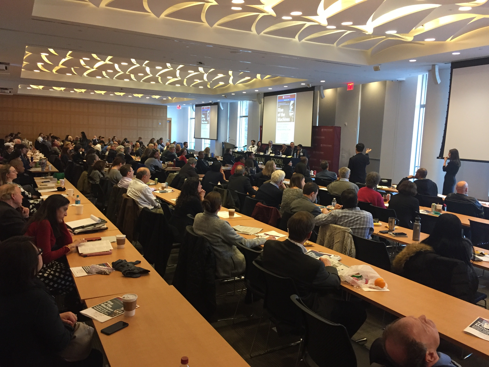

  

 

## Intro

Artificial intelligence (AI) is all the talks these days, with its doom and gloom, profits and perils. Everyone uses it (smartphone, Google search, GPS and more).  Many are perturbed about it, thinking it is a runaway train.  In case you are wondering if AI will take your job, this site will let you know the probability of that scenario:  [Will Robots Take My Job](https://willrobotstakemyjob.com/)

>*Aside:*  for statisticians, the probability is 22%.

Within the data science community, discourse on algorithm ethics are common-place, and that should be reassuring.  The pace of research and progress is dizzying.  Just in the past week, the story broke that [OpenAI](https://openai.com/), a non-profit AI research company, decided against releasing its latest natural language model, GPT-2, due to concerns about its potential misuse.  The public debate has been fierce:
- [OpenAI built a text generator so good, it’s considered too dangerous to release
](https://techcrunch.com/2019/02/17/openai-text-generator-dangerous/) Feb 2018
- [Ilya Sutskever](https://twitter.com/ilyasut/status/1096875730225397760) twitter thread on resistance to transparency and reproducibility in AI
- [Jeremy Howard](https://twitter.com/jeremyphoward/status/1097234160337412096) twitter thread analysis of the decision and debate

Fortunately, attorneys are also contributing to the overall discussion in AI.

Fordham Law School in New York City held a symposium on February 15, 2015 entitled The Fordham Law Review and the Neuroscience and Law Center present Rise of the Machines: [Artificial Intelligence, Robotics, and the Reprogramming of Law](https://go.activecalendar.com/FordhamUniversity/site/law/event/rise-of-the-machines-artificial-intelligence-robotics-and-the-reprogramming-of-law). The last time I was in one room with over 100 attorneys was February 2015 at [Algorithms & Accountability Conference: NYU School of Law](https://www.law.nyu.edu/centers/ili/AlgorithmsConference)).  The event was free and open to the public.  

The event was recorded.  Full proceedings will be published in Fall 2019.  [I will update this article with the links when they are available.]

## Key Takeaways

Here are the key takeaways from the 8-hour symposium:

### Complexity
- Law policy is complex.
- AI is changing so rapidly.
- Law should resist being overly technical or detailed on policy 
  - Example:  European regulation spans over 2000 pages long.
  - Example:  waiting for SCC to make decision on what blockchain is.  And then blockchain changes their technology to avoid the decision, reality of what is happening
- Determine whether AI is really different.   Is there such a thing as “AI Exceptionalism”?  Or can we utilize existing laws?
  - Use existing laws and expand them for AI 
  - AI law can draw on privacy, tort and copyright law.
- Since people are more biased than AI, the best plan of action is to combine human input with AI. 
- Interconnectedness:  AI is connected by various technologies:  software, sensors, developers, users and more. Many parties need to be involved in the ethnics and liability discusssions.

### Stakeholders
- Attorneys are thinking about it.
- The “younger” generation will push policy forward, along with their educators. 
- The US government needs to invest more in cybersecurity over building a border wall as cybersecurity poses a greater threat to the country. 

### AI Liability and Compensation
- Insurance is one way to deal with damage from AI; establish compulsory insurance pools.
- Admission by attorneys that AI policies are likely to be implemented only when the loss of life due to AI occurs.

## History of Law and AI
The first lawsuit involving AI is:  

[Judge Sides with Inventors in Massive Intellectual Property Case Against Disney, Fox, Paramount and Others, Allowing Cases to Continue](https://www.hbsslaw.com/cases/disney-marvel-mova-contour/pressrelease/mova-contour-ip-theft-judge-sides-with-inventors-in-massive-intellectual-property-case-against-disney-fox-paramount-and-others-allowing-cases-to-continue)
>The lawsuits, originally filed in 2017, state that defendants knowingly used Contour to make high-grossing movies including Guardians of the Galaxy, Avengers: Age of Ultron, Terminator Genisys, Deadpool, Beauty and the Beast, the Rise of the Tomb Raider videogame, and others, without authorization from Rearden LLC and Rearden Mova LLC, the plaintiffs in the action and inventors of the technology. 

[Disney & Studios Can’t Dodge Claims Over Stolen Technology
](https://www.courthousenews.com/disney-studios-cant-dodge-claims-over-stolen-technology/)

WMFH (Work Made For Hire) [Law](https://www.owe.com/resources/legalities/4-what-is-work-made-for-hire/)
>“Work made for hire” is a doctrine created by U.S. Copyright Law. Generally, the person who creates a work is considered its “author” and the automatic owner of copyright in that work. However, under the work made for hire doctrine, your employer or the company that has commissioned your work, not you, is considered the author and automatic copyright owner of your work.

One approach to resolving AI related litigation is to bridge an old law to a new one.

## Law Policy Is Complex
[Iria Giuffrida,](https://www.linkedin.com/in/iriagiuffrida/) discusses the complexity of AI is related to the “challenges of interaction.”  AI systems are powered by Internet of Things (IOT) which are talking to each other all the time, yet the traditional approach to robot-related laws has been siloed.

Giuffrida also raises the following points:
- 

[Huu Nguyen](https://www.linkedin.com/in/hiep256/), a computer scientist turned attorney states:
We as programmers, lawyers, are **ALL RESPONSIBLE**.  Let’s figure out how to deal with it.
- AI should be safe
- AI should be ethical (but that varies, in USA and China)
- We need Accountability, Controls and Oversight (that means we need people to oversee AI)
- Law students [are the next generation] and they will deal with what is next.
- Cyber policies (cover a business' liability for a data breach in which the firm's customers' personal information, such as Social Security or credit card numbers, is exposed or stolen by a hacker or other criminal who has gained access to the firm's electronic network.) exist, but no one is following them.  More engagement would be good. 

Nguyen shares the example of a coffee maker with AI capability.  If the coffee made by this machine is too hot and burns the person, who is liable?
- User, who said “hot”
- Provider of software
- AI as a service companies 
- Data provider
- Sensor maker

Options:
Test it  (has its own challenges with any number of possible scenarios, impossible to anticipate and test them all)
Release the transcript that the AI product was learned from (maybe AI has first amendment rights? How about copyright for the company?)

[Judge Orders Amazon to Turn over Alexa in Murder Case](https://techcrunch.com/2018/11/14/amazon-echo-recordings-judge-murder-case/)

## Dealing with Biases in Machine Learning
Presented by [Solon Barocas](https://twitter.com/s010n), Professor of Information Science at Cornell University

There are numerous examples of biases in algorithms used in machine learning which reinforce negative stereotypes.  Here are a few:
- Latanya Sweeney study that found search ads showed repeated incidence of racial bias. ([Can computers be racist?]( https://vimeo.com/145335290))
- Natural Language Processing (NLP) co-occurrence (man → doctor, woman - - > nurse)
- Accuracy for identifying gender: works less well for women and less well for dark skinned people
- Offensive classifications: person in image mistakenly tagged as gorilla
- Language translation:  assigning a baseline norm vs outlier; “ethnic food” vs “normal food”

These are possible scenarios:
1. Do nothing
2. Improve accuracy (add more data, better learning)
3. Blacklist (exclude problematic tags)
4. Scrub to neutral (break problematic associations)
5. Representativeness (create a statistically representative distribution for trianing data)
6. Equal representative (create equal representative of all groups)

Barocas made two insightful points:  
1.  Anti-discrimination laws in the US have generably been ineffective.
2.  If a group of people is being excluded, ask this other question:  *Why aren't people in this group?* and examine those causes.  

## Transparency, Accountability and Governance
Presented by [Edward Felten](https://twitter.com/EdFelten), Professor of Computer Science and Public Affairs at Princeton University

There are three possible approaches to develop safety critical systems:
1. Transparency
  - Publish code, let experts look at and study code.  
  - Looking at or studying code is known as “static analysis” and has its practical limiations
2. Provide Hands-on System Access to Auditors
  - Give auditors access to the system
  - Pros:  can be powerful for some purposes
  - Cons:  may not test all scenarios and it is weak for “fairness” property, is limited and inadequate
3. Due diligence on engineering process
  - Consideration on how the system was designed and the methods used
  - Look at the process and what it leads to
  - Cons:  it is an immature discipline

Felten says all of the proposed approaches above are weak.  He suggests designing a system that is analyzable and governable.  

## Privacy Paradox
Presented by [Ari Ezra Waldman](https://twitter.com/ariezrawaldman)

Waldman is both a law professor and sociologist.  He presents the following paradox:  
- If we think that algorithm decisions are legitimate, we will continue to let those algorithms be used.
- But, what *makes us feel* that these decisions are legitimate?
- Once humans are removed from decision making process, legitimacy in algorithms drops.  And yet, people generally feel more comfortable with algorithms.  

## Definitions
A **cyber security policy** outlines the assets you need to protect, the threats to those assets and the rules and controls for protecting them and your business. The policyshould inform your employees and approved users of their responsibilities to protect the technology and information assets of your business.
[ref](https://www.business.gov.au/risk-management/cyber-security/creating-a-cyber-security-policy-for-your-business)

A **tort** is an act or omission that gives rise to injury or harm to another and amounts to a civil wrong for which courts impose liability. In the context of torts, "injury" describes the invasion of any legal right, whereas "harm" describes a loss or detriment in fact that an individual suffers.1 
[ref](https://www.law.cornell.edu/wex/tort)

The **Privacy Paradox**
The privacy paradox – Investigating discrepancies between expressed privacy concerns and actual online behavior – A systematic literature review
[ref](https://www.sciencedirect.com/science/article/pii/S0736585317302022)

#### EU General Data Protection Regulation (GDPR) 
a new set of rules designed to give EU citizens more control over their personal data
[ref](https://eugdpr.org/)

#### Biometric Information Privacy Law
The Biometric Information Privacy Act (BIPA) was passed by the Illinois General Assembly on October 3, 2008. BIPA guards against the unlawful collection and storing of biometric information
[ref](https://en.wikipedia.org/wiki/Biometric_Information_Privacy_Act)

#### Gramm-Leach-Bliley Act (GLBA)
Protects the personal data of individuals
[ref](https://www.epic.org/privacy/glba/)

#### Unfair, Deceptive or Abusive Acts and Practices (UDAP)
prohibits "unfair or deceptive acts or practices in or affecting commerce." 
[ref](https://www.aba.com/Compliance/Pages/compliance_UDAP.aspx#)

## References

- [EU expert group wants your say on draft AI ethics guidelines](https://www.siliconrepublic.com/machines/ai-ethics-eu), Dec 2018

- [U.S. Senator Schatz Introduces Bill to Protect Consumers’ Information Online](https://www.kitv.com/story/39632564/state-senator-schatz-introduces-bill-to-protect-consumers-information-online), Dec 2018

- [Edward Felten (Princeton University) talk at NeurIPS 2018](https://www.facebook.com/nipsfoundation/videos/neurips-2018-test-of-time-award-invited-talk/271569366878864/), Dec 2018

- Lail Brainard (Federal Reserve Board of Governors):  [What Are We Learning about Artificial Intelligence in Financial Services?](https://www.federalreserve.gov/newsevents/speech/brainard20181113a.htm), Nov 2018

- [Weapons of Math Destruction](https://www.datacamp.com/community/podcast/weapons-math-destruction) podcast, Nov 2018

- [New York City’s Bold, Flawed Attempt to Make Algorithms Accountable](https://www.newyorker.com/tech/annals-of-technology/new-york-citys-bold-flawed-attempt-to-make-algorithms-accountable) Dec 2017

- [Computer paints 'new Rembrandt' after old works analysis
](https://www.bbc.com/news/technology-35977315), Apr 2016

- [Facebook and YouTube should have learned from Microsoft's racist chatbot
](https://www.cnbc.com/2018/03/17/facebook-and-youtube-should-learn-from-microsoft-tay-racist-chatbot.html), Mar 2018

