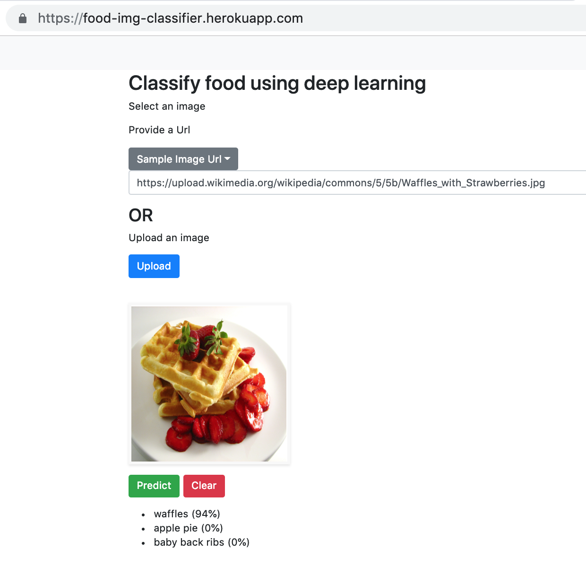

<p>
 
</p>


This project was completed by [Nidhin Pattaniyil](https://www.linkedin.com/in/nidhinpattaniyil/) and [Reshama Shaikh](https://reshamas.github.io).  This article details how to create a web and mobile app image classifier and is deep-learning-language agnostic.  Our example uses the fastai library, but a model weights file from **any deep learning library** can be used to create a web and mobile app using our methods.


## Summary

The project covers:
- training a deep learning model for food images using fastai
- deploying a web app using Heroku and Flask
- deploying a mobile app

Our Heroku **web** app is [**food-img-classifier**](https://food-img-classifier.herokuapp.com)

Our **mobile** apps are available:  
- iOS Apple store: [Food Classifier](https://itunes.apple.com/us/app/food-classifier/id1445356461?mt=8)
- Android Google Play: [Food Classifier](https://play.google.com/store/apps/details?id=com.rsnp.foodclassifier)

## Citation Note
If you do use our blog or GitHub repos to create your own web or mobile app, we would appreciate it if you would give our work attribution by sharing the below citation:  
>Pattaniyil, Nidhin and Shaikh, Reshama, [Deploying Deep Learning Models On Web And Mobile](https://reshamas.github.io/deploying-deep-learning-models-on-web-and-mobile/), 2019


## Jump to:
Part 1. [Training the Classifier](#training-the-classifier)
    
Part 2. [Deploying the **WEB** App](#deploying-the-web-app)  
    1. [Input to Heroku App](#input-to-heroku-app)  
    2. [File Updates to Make](#file-updates-to-make)  
    3. [Heroku Setup](#heroku-setup)  
    4. [Our Flask Web Application](#our-flask-web-application)  

Part 3. [Deploying the **MOBILE** App](#deploying-the-mobile-app)  
    1. [File Updates to Make](#file-updates-to-make)  
    2. [Our Apps](#our-apps)  
    3. [Pricing Options](#pricing-options) 

 
## Training the Classifier
The Jupyter notebook and code used to train the model are available in this GitHub repository:  [web-deep-learning-classifier](https://github.com/npatta01/web-deep-learning-classifier) 

The following were used for model **training** (see [requirements.txt](requirements.txt)):    
- fastai:  version 1.0.42
- PyTorch:  version  1.0.0
- Python:  version 3.6

### Deep learning library:  fastai
The [fastai](https://github.com/fastai/fastai) deep learning library, version 1.0 was utilized.  Fastai runs on top of PyTorch.   The [fastai MOOC](https://docs.fast.ai) was officially released to the public in early 2019.

### GPU:  Google Cloud Compute
The data was retrieved and analyzed on Google Cloud Platform[(GCP)](console.cloud.google.com/compute/instances).  Any cloud platform (such as Paperspace or AWS) is usable, as long as a GPU is available.  Instructions for setting up a GPU working environment will be available from fastai.  

For this project, we used the Nvidia Tesla P100 with 100 GB of storage.  

### Dataset:  Food-101
The [Food-101](https://www.vision.ee.ethz.ch/datasets_extra/food-101/) data was used which included **101 food categories** with a total of 101K images.  Thus, each class had 1000 images, of which 250 are manually reviewed test images and 750 are training images:    
>On purpose, the training images were not cleaned, and thus still contain some amount of noise. This comes mostly in the form of intense colors and sometimes wrong labels. All images were rescaled to have a maximum side length of 512 pixels.

#### Data Citation
Bossard, Lukas and Guillaumin, Matthieu and Van Gool, Luc, Food-101 -- Mining Discriminative Components with Random Forests, European Conference on Computer Vision, 2014


#### Retrieving the data
The dataset size is 5GB and can be retrieved using:  
```bash
wget http://data.vision.ee.ethz.ch/cvl/food-101.tar.gz
```

#### Unzip data
The `tar.gz` file can be opened using:  
```bash
tar xzf file.tar.gz
```

### Training the data:  Resnet-34 CNN

#### Training Time
We used the Resnet-34 CNN architecture.  The model took about an hour to run on GCP. 

#### Training the Deep Learning Model
The code used for training the data is available in the repository [npatta01/web-deep-learning-classifier](https://github.com/npatta01/web-deep-learning-classifier) in the notebook [1_train.ipynb](https://github.com/npatta01/web-deep-learning-classifier/blob/master/notebooks/1_train_large.ipynb)  

We use `ImageDataBunch` to read in the images.  This Python class does the following:
- specifies the path where the images are located
- assigns training/validation ratio to 80/20
- uses the default transformation of images
- sets the image size to 224
- sets batch size to 64
- normalizes the images

```python
path = Path('../data/food-101/images')
data = ImageDataBunch.from_folder(path, valid_pct=0.2,
        ds_tfms=get_transforms(), size=224, num_workers=8, bs=64).normalize(imagenet_stats)
```

The data is trained on a pre-trained model, resnet34, and we run the `learner` to determine the optimal learning rate. 
```python
learn = create_cnn(data, models.resnet34, metrics=error_rate,pretrained=True)
learn.lr_find()
learn.recorder.plot()
```
In our case, a learning rate of 0.01 works well
```python
lr = 1e-2
```


#### Other Architectures
We did run more complex architectures.  However, because the data had 101 classes and for the purpose of this example and article, and GPU time and storage, we used a simple architecture of `resnet34`. 

#### Back to training
Next, we fit 8 epochs using our learning rate of 0.01, and we observe our error rate drops to 28.9%.  

```bash
epoch	train_loss	valid_loss	error_rate
1	1.999872	1.817976	0.470594
2	2.006050	1.872519	0.483911
3	1.893473	1.697205	0.441634
4	1.778546	1.497193	0.388960
5	1.572615	1.307390	0.342030
6	1.475655	1.188818	0.310990
7	1.294712	1.108866	0.293218
8	1.248308	1.094019	0.288564
```

#### Unfreezing the layers
Next, we unfreezed some of the last layers and looked for a new learning rate. 
```python
learn.unfreeze()
learn.lr_find(start_lr=1e-09, end_lr=1e-3)
learn.recorder.plot(skip_end=10)
```

#### More training
We trained the data for 5 more epochs, which reduced our error rate from **28.9%** to **28.1%**.

```python
learn.fit_one_cycle(5, max_lr=slice(1e-8,1e-4))
```
```bash
epoch	train_loss	valid_loss	error_rate
1	1.253053	1.089987	0.286584
2	1.215632	1.080179	0.284901
3	1.177106	1.072547	0.282871
4	1.183173	1.069058	0.282376
5	1.180598	1.069759	0.281436
```

#### Confusion matrix
The confusion matrix revealed that the following foods were most commonly misclassified.
```bash
[('filet_mignon', 'steak', 26),
 ('steak', 'filet_mignon', 26),
 ('tuna_tartare', 'beef_tartare', 23),
 ('chocolate_cake', 'chocolate_mousse', 21),
 ('pork_chop', 'filet_mignon', 20),
 ('pork_chop', 'grilled_salmon', 20),
 ('chocolate_mousse', 'chocolate_cake', 19),
 ('prime_rib', 'steak', 18),
 ('ravioli', 'lasagna', 18),
 ('breakfast_burrito', 'huevos_rancheros', 17),
 ('beef_tartare', 'tuna_tartare', 16),
 ('lobster_bisque', 'clam_chowder', 16),
 ('steak', 'pork_chop', 16),
 ('tiramisu', 'chocolate_mousse', 16),
 ('chicken_quesadilla', 'breakfast_burrito', 15),
 ('panna_cotta', 'chocolate_mousse', 15),
 ('ramen', 'pho', 15),
 ```
 

### Output from the Deep Learning Model
The output of the deep learning model is a file with weights.  The file is called `model.pth` (or `final.pth`).  If you train the model as in this repo, the model is saved to the `models` folder.  

The `final.pth` file can be downloaded to your local computer from Jupyter.

The `model.pth` file may be too large to be included in the git commit.  There are various options for proceeding with that size dataset:  
1.  Store the model on google drive.
2.  Store the model on GitHub releases.
3.  Store the model on a bucket in the cloud.  

We stored our final model data file under the "releases" area of the repository:  [web-deep-learning-classifier/releases](https://github.com/npatta01/web-deep-learning-classifier/releases)


---

## Deploying the Web App
- We are using this repository as a template: [web-deep-learning-classifier](https://github.com/npatta01/web-deep-learning-classifier) 
- Our web app can be found here:  [food-img-classifier](https://food-img-classifier.herokuapp.com)

[Heroku](https://www.heroku.com/) and Flask were utilized to deploy the web app.

### Input to Heroku App

This output file from the classifier algorithm, `model.pth` is the input to the Heroku app.  


### File Updates to Make
:point_right: To run your own **web** app, you need only make the following adjustments:

1.  In this file [src/config.yaml](https://github.com/npatta01/web-deep-learning-classifier/blob/2a30245d467b51705e51aa7a71658dd407dc49cf/src/config.yaml), updates these fields:
- `title`
- `description`
- `about`
- `code`
- `sampleImages`

2.  In this file [docs/2_heroku_app.md](https://github.com/npatta01/web-deep-learning-classifier/blob/e9a41bc0a09fe98d44a168b1d64323dad2d074e0/docs/2_heroku_app.md), the following changes need to be made:  
- Replace our app name with your app name:  `APP_NAME="food-img-classifier"`.  As an example:  if you classified birds, your app name could be `APP_NAME="bird-img-classifier"`

### Heroku Setup

If you don't have a Heroku account, create one here: [www.heroku.com](https://www.heroku.com/).  Each line can be copied and submitted on the terminal.    

**Reminder:** in your code, you will have updated your `APP_NAME` 

```
wget -qO- https://cli-assets.heroku.com/install-ubuntu.sh | sh
heroku login
heroku container:login

APP_NAME="food-img-classifier"
heroku create $APP_NAME

heroku container:push web --app ${APP_NAME}

heroku container:release web --app ${APP_NAME}
heroku open --app $APP_NAME
heroku logs --tail --app ${APP_NAME}
```

Note:  After 15 minutes of inactivity, Heroku will suspend the app.  The next time the web app is called, Heroku will restart the app.  There could be a slight delay in starting the app.
 
### Our Flask Web Application
- Our Flask web app is available here on Heroku:  
[**food-img-classifier**](https://food-img-classifier.herokuapp.com)
- Give it a try!  Upload an image or add a URL.


---

## Deploying the Mobile App
- repo: [mobile-deep-learning-classifier](https://github.com/npatta01/mobile-deep-learning-classifier)

The documentation for deploying a mobile app can be found in this folder, [docs](https://github.com/npatta01/mobile-deep-learning-classifier/tree/master/docs).  

### File Updates to Make
:point_right: To run your own **mobile** app, you need only make the following adjustments:    

In this file [config.js](https://github.com/npatta01/mobile-deep-learning-classifier/blob/03cc52c6ae2af67b93d20a3efd55210f1da83aed/config.js), updates these fields:
- `AppConfig`  
    - update the `title`  
    - point `host` to the heroku app url  
- `description`

Check out our gif below to see our app in motion, or our 2-minute video on YouTube [Food classifier using fastai](https://www.youtube.com/watch?reload=9&v=7d2qFLeYvRc).
<p>
    </p>

### Our Apps

**Video of mobile app**:  2-minute demo of [Food classifier using fastai](https://www.youtube.com/watch?reload=9&amp;v=7d2qFLeYvRc)

**Apple store app:**  [Food Classifier](https://itunes.apple.com/us/app/food-classifier/id1445356461?mt=8)

**Android Google Play app:** [Food Classifier](https://play.google.com/store/apps/details?id=com.rsnp.foodclassifier)

### Pricing Options
1.  Apple store:  $100  
2.  Android Google Play:  $30
3.  Android using **Expo** app:  **Free**  
    - Develop app
    - Download **Expo** on your Android phone
    - Open **Expo** app and scan the app barcode, and give it a try!  (can share barcode with others)


<p>
 
</p>
