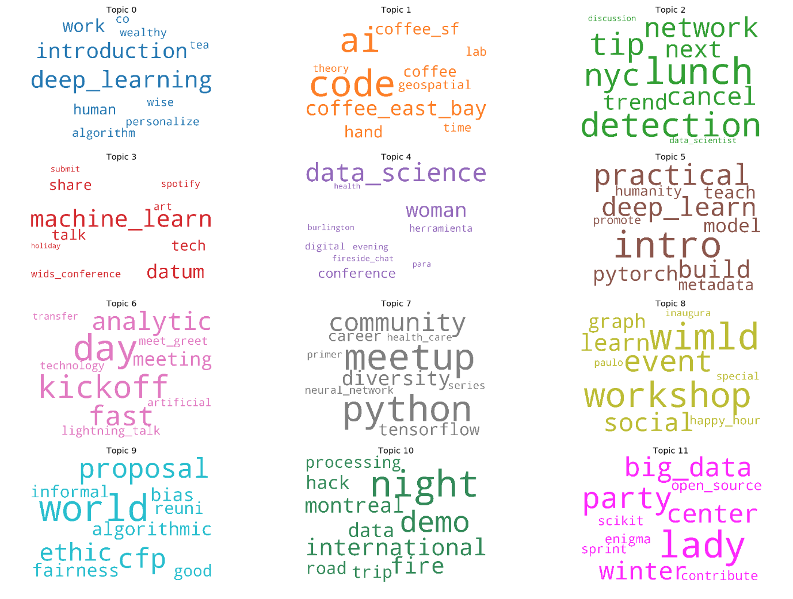
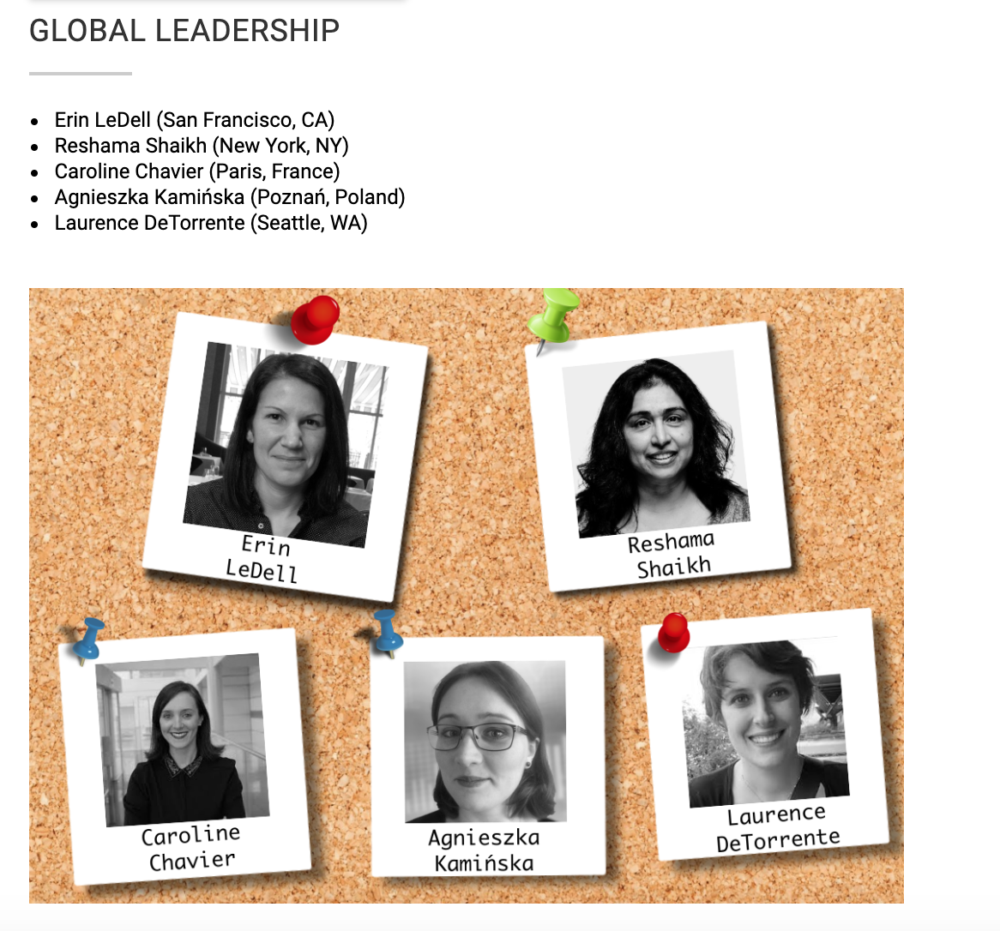
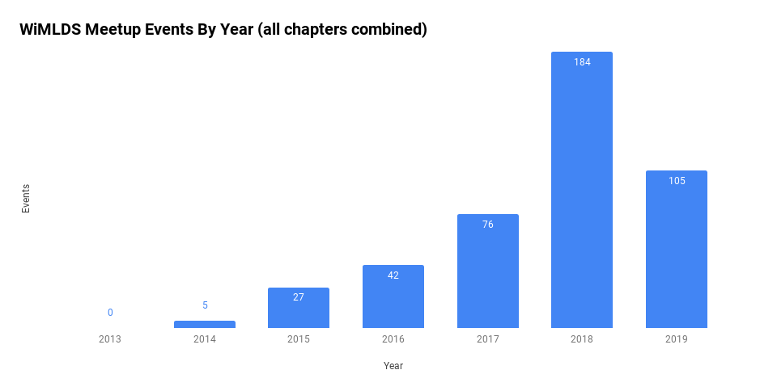
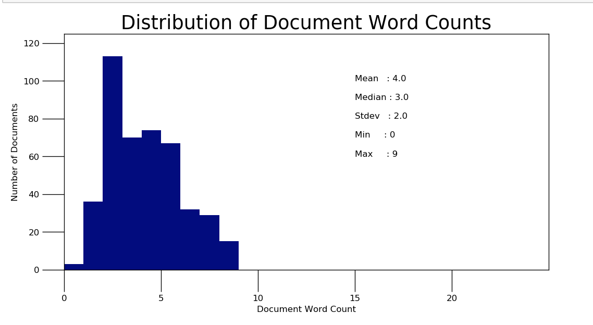
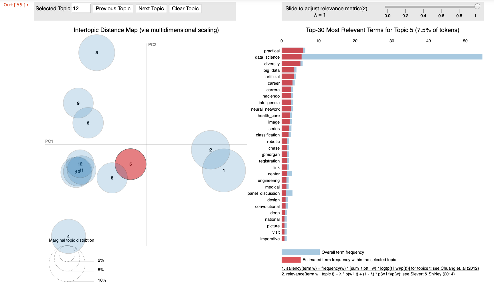
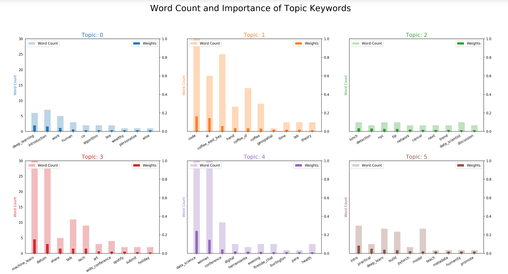
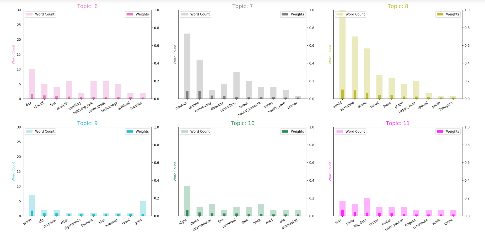
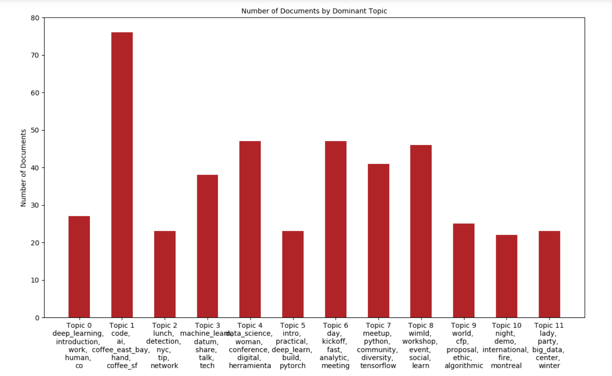
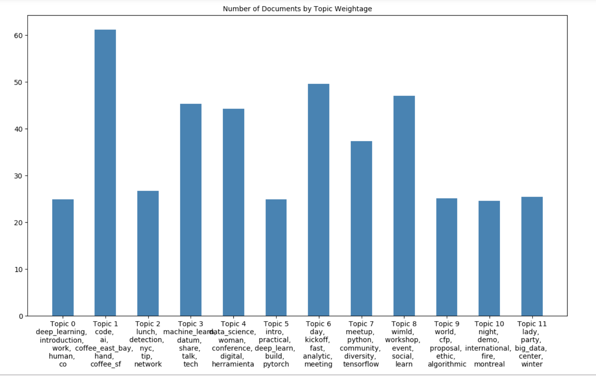
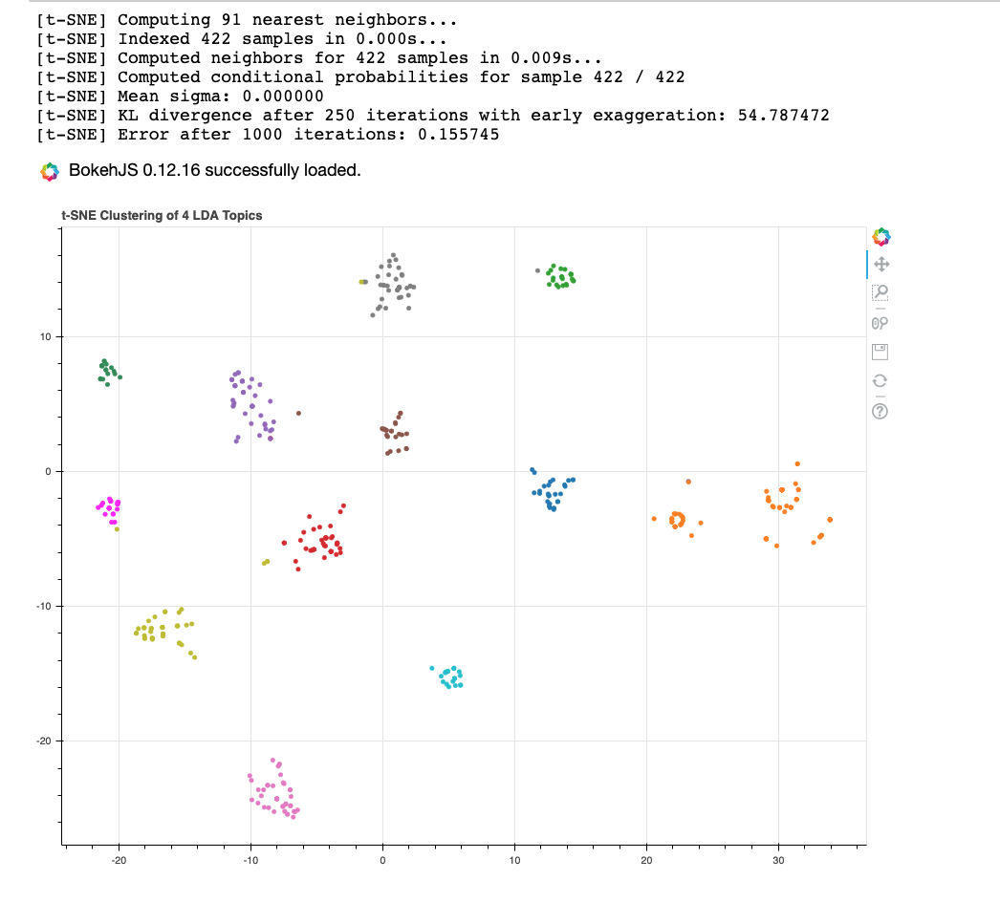

<p>

</p>

## Abstract

Forty three WiMLDS chapters have organized 439 events over the past 5 1/2 years.  These are some **distinct / popular** topics for WiMLDS meetup events:
- Deep learning
- San Francisco Bay Area Code & Coffee; not surprising since they host weekly events
- Networking, [anomaly] detection
- Machine learning, WiDS conference events
- Data science
- Deep learning, PyTorch, introductory
- Kickoff events, lightning talks, meet and greet; not surprising since we have had almost 40 new chapters open in the past year.  
- Python, TensorFlow, diversity events
- Workshops are popular, as well as social events with happy hours
- Fairness, bias, algorithmic events; CFP proposal events
- Demo, hackathons
- Scikit-learn open source sprints

---


## Introduction

Do you ever lie awake in bed wondering what kind of events WiMLDS chapters around the world are organizing? (I do!)  If you said “yes”, there is a good chance you are one of 120+ WiMLDS organizers in 30 countries around the world.  As an NYC chapter organizer for the past 4 years, I am intimately familiar with the types of events we organize locally.  

As a member of the 5-person [Global WiMLDS Leadership Team](http://wimlds.org/the-leadership/), I was curious for some time to learn what sort of events other WiMLDS chapters were organizing globally. 

<p>

</p>

The number of events organized were too many to sift through manually.   I typically recruit volunteers to help with website or graphics task to support WiMLDS.  But for this task, my data science skills came in handy, and I conducted a topic analysis using natural language processing (NLP) to answer the question that had been keeping me awake at night!

## About WiMLDS

Women in Machine Learning and Data Science ([WiMLDS](http://wimlds.org)) is a non-profit 501 (c)(3) corporation with headquarters in New York, New York.  It was founded in 2013.

The mission of WiMLDS is to support and promote women and gender minorities who are practicing, studying or are interested in the fields of machine learning and data science.  The [2019 Q1 Report](https://reshamas.github.io/wimlds-2019-q1-report/) was released April 2019.  As of June 2019, WiMLDS has **68 chapters** in **30 countries** with [**34000+ members**](https://www.meetup.com/topics/wimlds/all/).

## Events Overview

Data was collected from December 2013 through May 2019, and it included **439 meetup event titles** hosted by **43 different chapters**.   This graph shows the number of events organized by year.

<p>

</p>

 

## Events Analysis

The NLP analysis of event titles can be found on GitHub in this repository:  [ds_projects/wimlds_nlp](https://github.com/reshamas/ds_projects/tree/master/wimlds_nlp)
 
These two articles by [Selva Prabhakaran](https://www.linkedin.com/in/selvaprabhakaran/) were very helpful in performing these analyses.  
- [Topic Modeling with Gensim (Python)](https://www.machinelearningplus.com/nlp/topic-modeling-gensim-python/)
- [Topic modeling visualization – How to present the results of LDA models?](https://www.machinelearningplus.com/nlp/topic-modeling-visualization-how-to-present-results-lda-models/)


### Data Preparation
The standard data preparation for NLP analysis was conducted:  
- remove stopwords (common words such as “the”, “a”, etc.)
- tokenize phrases (remove punctuation, convert sentences to words)
- build bigram and trigram models (setting frequently occurring words together)
- lemmatization (obtain root forms of words)
- create a term-frequency dictionary  (list of each word by its frequency in the corpus, where corpus is the complete list of words that appear in the event titles)
 


## What Sort of Events Does WiMLDS Organize?

### The Data
Here is a example of some event titles.  The event titles had at most 9 words with a mean of 4 words and a median of 3 words.  


<p>

</p>


```bash
['Big Data: From Chaos to Intelligence',
 'Machine Learning: A Focus on Supervised and Unsupervised Learning',
 'Deep Learning: Build An Image Classification Model',
 'NLP: Zero to one',
 'Handling Imbalanced Datasets: Building a model and deploying to production',
 'The ABC-XYZ of Data Science before Machine Learning',
 'Uncovering patterns and trends using exploratory data analysis',
 'Extracting Your Own Web Data using Scraping Tools',
 'TensorFlow Post-Summit Event',
 'Fueling the Artificial Intelligence revolution with gaming!',
 'Sentiment Analysis in R',
 'Unravelling Intel Deep Learning SDK',
 'TensorFlow : Zero to One',
 'Treasure Island: Bioinformatics for everyone.',
 'Deep Learning for Crypt-analysis using TensorFlow',
 'Prototyping Back Propagation in Excel For Greater Good',
 'Data Science and Machine Learning in Practice',
 '#NairobiWiMLDS turns 1 + Christmas Party',
 'Around the world of data science in 60 minutes or less',
 'TensorFlow Series: Convolutional Neural Networks for Image Classification',
 'StartML Series: Kickstarter Event',
 'Machine Learning Unplugged',
 'AI AMA Wednesday with Abi',
 'Machine Learning Quest',
 'MLCC Study Jam, New Delhi in collaboration with WiMLDS',
```

 ### Topic Analysis
Latent Dirichlet Allocation(LDA) algorithm was used for topic modeling.  I ran different models, varying the number of topics.  The best coherence score (measure of topic model) was achieved when the number of topics was set about 10 to 15, and I focused on 12 topics.  The Jupyter notebook for this analysis is available on GitHub:  [1_wimlds_events_nlp.](https://github.com/reshamas/ds_projects/blob/master/wimlds_nlp/1_wimlds_events_nlp.ipynb)


```python
# Create Dictionary
id2word = corpora.Dictionary(data_ready)

# Create Corpus: Term Document Frequency
corpus = [id2word.doc2bow(text) for text in data_ready]

# Build LDA model
lda_model = gensim.models.ldamodel.LdaModel(corpus=corpus,
                                           id2word=id2word,
                                           num_topics=12, 
                                           random_state=100,
                                           update_every=1,
                                           chunksize=10,
                                           passes=10,
                                           alpha='symmetric',
                                           iterations=100,
                                           per_word_topics=True)

pprint(lda_model.print_topics())

```

As an example, the LDA model gives **12 topics** with the accompanying weight of the keywords that are dominant in that topic.

```bash
[(0,
  '0.141*"coffee_peninsula" + 0.055*"learn" + 0.055*"introduction" + '
  '0.039*"kickoff" + 0.039*"diversity" + 0.031*"series" + 0.031*"technology" + '
  '0.023*"kick" + 0.023*"health_care" + 0.023*"wids_conference"'),
 (1,
  '0.215*"datum" + 0.165*"workshop" + 0.058*"world" + 0.050*"happy_hour" + '
  '0.025*"tip" + 0.025*"job" + 0.017*"registration" + 0.017*"open_source" + '
  '0.008*"agriculture" + 0.008*"bayesian"'),
 (2,
  '0.117*"meetup" + 0.073*"python" + 0.066*"tech" + 0.051*"wids_pune" + '
  '0.036*"graph" + 0.029*"meet_greet" + 0.022*"change" + 0.022*"hack" + '
  '0.022*"art" + 0.022*"panel"'),
 (3,
  '0.220*"machine_learn" + 0.078*"talk" + 0.071*"night" + '
  '0.043*"deep_learning" + 0.035*"wimlds_pozna" + 0.028*"day" + 0.028*"party" '
  '+ 0.021*"unplugged" + 0.014*"summit" + 0.014*"data_science"'),
 (4,
  '0.138*"data_science" + 0.051*"conference" + 0.043*"meetup" + '
  '0.043*"analytic" + 0.036*"image" + 0.029*"pyladie" + 0.022*"digital" + '
  '0.022*"lab" + 0.022*"apply" + 0.022*"fireside_chat"'),
 (5,
  '0.236*"code" + 0.152*"bay" + 0.152*"coffee_east" + 0.085*"coffee_sf" + '
  '0.018*"lunch" + 0.012*"partner_event" + 0.012*"kobiet" + 0.012*"pdx" + '
  '0.012*"intro" + 0.012*"stitch"'),
 (6,
  '0.254*"wimld" + 0.069*"coffee" + 0.069*"tensorflow" + 0.054*"hand" + '
  '0.031*"classification" + 0.023*"work" + 0.023*"data_scientist" + '
  '0.015*"coder" + 0.015*"center" + 0.015*"round"'),
 (7,
  '0.056*"deep_learn" + 0.056*"model" + 0.049*"day" + 0.049*"build" + '
  '0.042*"intro" + 0.035*"analysis" + 0.028*"wid" + 0.021*"apache_spark" + '
  '0.021*"international_woman" + 0.021*"nlp"'),
 (8,
  '0.228*"woman" + 0.051*"social" + 0.044*"data_dinner" + 0.044*"career" + '
  '0.029*"big_data" + 0.029*"panel_discussion" + 0.022*"community" + '
  '0.022*"triangle" + 0.022*"study" + 0.022*"nyc"'),
 (9,
  '0.301*"data_science" + 0.049*"conference_screen" + 0.035*"good" + '
  '0.028*"lady" + 0.021*"human" + 0.021*"visualization" + 0.014*"special" + '
  '0.014*"tom" + 0.014*"herramienta" + 0.014*"launch"'),
 (10,
  '0.183*"code" + 0.085*"machine_learn" + 0.042*"lightning_talk" + '
  '0.035*"artificial_intelligence" + 0.021*"wimlds_happy" + 0.021*"christma" + '
  '0.021*"nairobi" + 0.021*"high" + 0.021*"conference" + 0.021*"practical"'),
 (11,
  '0.140*"ai" + 0.112*"event" + 0.042*"networking" + 0.035*"ml" + '
  '0.035*"share" + 0.035*"application" + 0.028*"neural_network" + 0.021*"data" '
  '+ 0.021*"neo" + 0.021*"python"')]

```

<p>

</p>


### Visualizing the Model


<p>

</p>


<p>

</p>

### NLP Findings

These are some **distinct and popular** topics for WiMLDS meetup events:
-  Topic 0:  deep learning
-  Topic 1:  San Francisco Bay Area Code & Coffee; not surprising since they host weekly events
- Topic 2:  networking, [anomaly] detection
- Topic 3:  machine learning, WiDS conference events
- Topic 4:  data science
- Topic 5:  deep learning, PyTorch, introductory
- Topic 6:  kickoff events, lightning talks, meet and greet; not surprising since we have had almost 40 new chapters open in the past year.  
- Topic 7:  Python, TensorFlow, diversity events
- Topic 8:  workshops are popular, as well as social events with happy hours
- Topic 9:  Fairness, bias, algorithmic events; CFP proposal events
- Topic 10:  demo, hackathons
- Topic 11:  scikit-learn open source sprints


### Interesting Findings
- R stats did not appear in keywords.  Looks like WiMLDS events are geared more towards Python which is not surprising since the R-Ladies community is quite active and organizes their own events.  
- If I ran the analysis with only 10 topics, I would not have seen the scikit-learn open source sprints which were in the 12th topic
- The meetup group is described as for the audience of women in “machine learning & data science”.  It looks like deep learning and artificial intelligence are prominent as well.
- The two venues that appeared in the analysis were Spotify and Enigma
- PyTorch and TensorFlow were the two deep learning libraries that appeared, no other libraries did


<p>

</p>

<p>

</p>

 ## t-SNE Clustering Chart

t-SNE was used to visualize the clusters of documents.   The 12 clusters appear to be well separated.  


<p>

</p>


## What’s Next?	

The titles of the meetup events contain limited information.  For more detailed NLP analysis, we could examine the full meetup description since the title contained at most 9 words due to 80 character limitation.  The full meetup description allows for 4000 characters.


## Acknowledgements
= Prithvi Gandhi:  for extracting the data from the Meetup API


