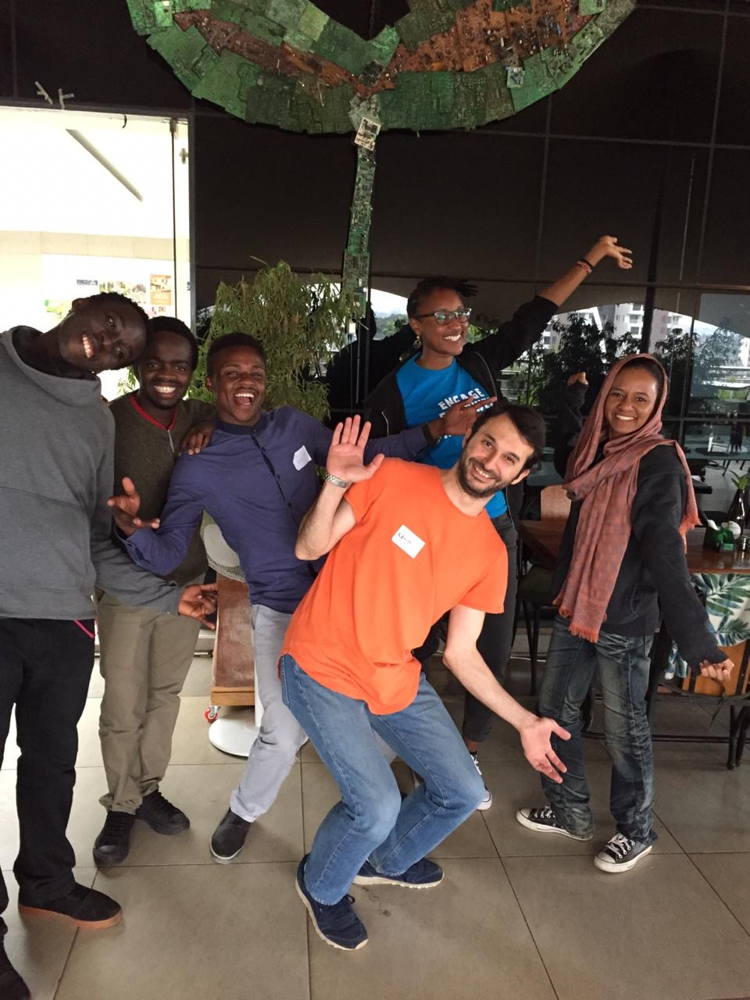
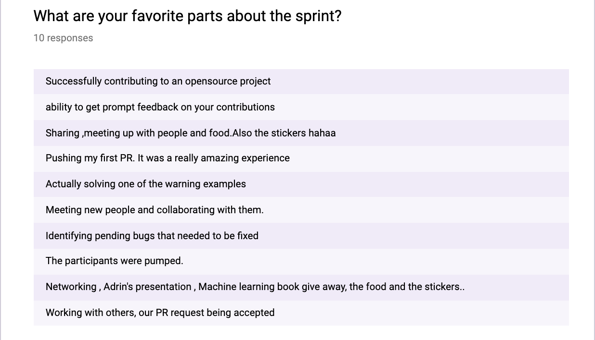
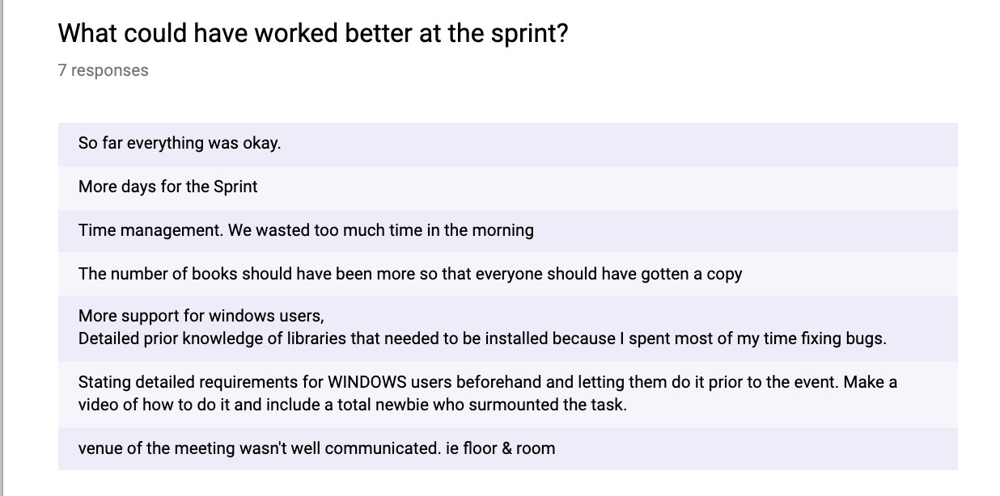
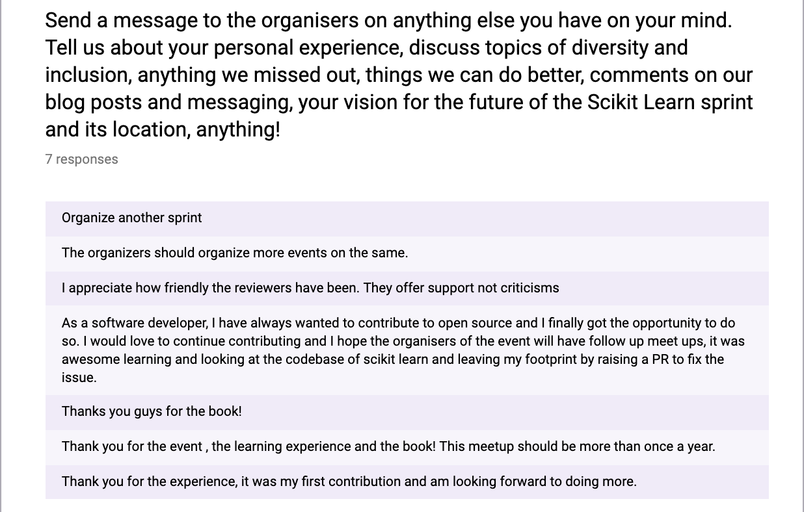
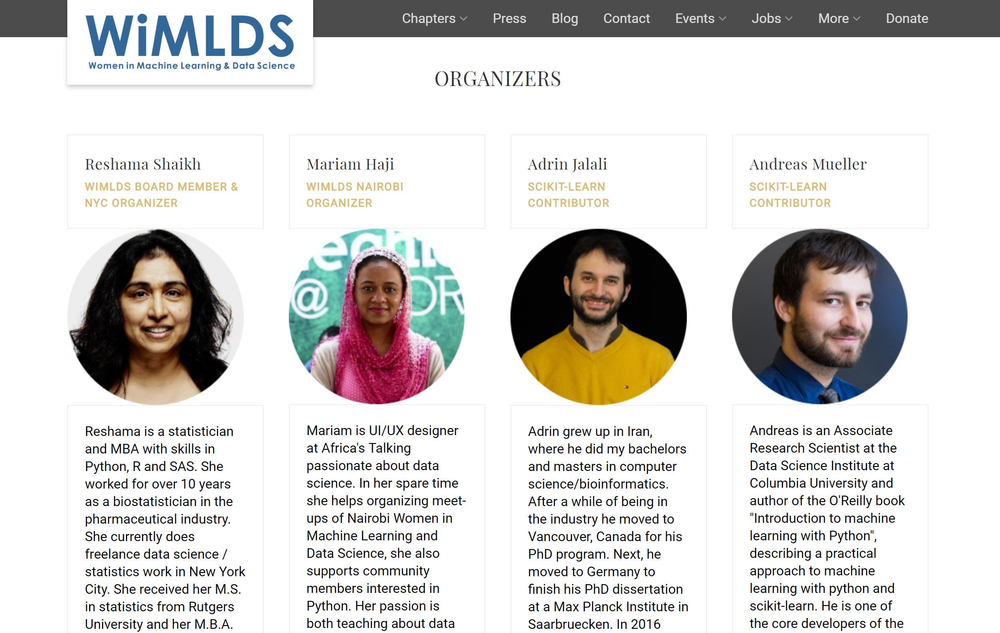

  

## Sprint Background

This report focuses on the impact of the Nairobi WiMLDS scikit-learn sprint.  More background information is available in the following articles:
- [About the WiMLDS scikit-learn sprints](https://reshamas.github.io/the-wimlds-scikit-learn-open-source-sprints)
- [WiMLDS Open Source Sprint Events](http://wimlds.org/opensourcesprints-2/) (website)
- [Sprint Preparation](http://wimlds.org/sprint-prep/)
- [Impact Report for 2017-2018 NYC WiMLDS scikit-learn Sprints](https://reshamas.github.io/impact-report-for-wimlds-scikit-learn-sprints/)
- [Interview with Andreas Mueller](http://mlconf.com/blog/interview-andreas-muller-lecturer-columbia-university-core-contributor-scikit-learn-reshama-shaikh/)
- [List of Scikit-learn Sprints](https://reshamas.github.io/resources/scikit_learn_sprints/)

## Sprint Participants' Background

Most attendees at these sprints were new to open source.  The scikit-learn facilitator, [Adrin Jalali](https://www.linkedin.com/in/adrinjalali/), identified issues that were [labeled](https://github.com/scikit-learn/scikit-learn/labels) "easy" or "good first issue" prior to the event so participants could review and become familiar with them.  Prep work for the event included reviewing the [Contributing](https://scikit-learn.org/stable/developers/contributing.html) documentation.  

About 40 people attended the sprint.  The group was evenly split by gender: 50% women and 50% men.

## Impact Report for WiMLDS Scikit-learn Sprint

|                                       | Sprint 2019    |   
|---------------------------------------|----------------|
| Report date                           | 03-Aug-2019    |   
| Sprint date                           | 22-Jun-2019    |   
| Location                              | Nairobi, Kenya |   
| Open source library                   | [scikit-learn](https://github.com/scikit-learn/scikit-learn) |  
| GitHub repository link                | [nairobi-2019-scikit-sprint](https://github.com/WiMLDS/nairobi-2019-scikit-sprint)| |
| List of Issues                        | [project list](https://github.com/WiMLDS/nairobi-2019-scikit-sprint/projects/1)  |
|                                       |               |          
| Facilitator    | [Adrin Jalali](https://twitter.com/adrinjalali)  |      
| Organizer(s)   | [Reshama Shaikh](https://twitter.com/reshamas) / [Mariam Haji](https://twitter.com/MamuAhmed) / [Andreas Mueller](https://twitter.com/amuellerml)      |
| Teaching Assistants                   | [Cate Gitau](https://twitter.com/categitau_) / [Ben Mainye](https://www.linkedin.com/in/bensonmainye/) / [Muoki Caleb](https://www.linkedin.com/in/muokicaleb/) / [Isaac Mutie](https://www.linkedin.com/in/isaac-mutie-113833147/)|
| Sponsor:  venue                      | [iHub](https://twitter.com/iHub)           |   
| Sponsor:  food                       | [Microsoft 4Afrika](https://twitter.com/4Afrika)           |   
| Sponsor:  books                      | [O'Reilly Media](https://twitter.com/OReillyMedia)           |   

|                                           |          |          
| [PULL REQUESTS](https://docs.google.com/spreadsheets/d/1hG_jmvib6zy3exdLUF_grb4ix5YaFpcwuKtRRYaoBPM/edit?usp=sharing) **(PRs)**                 |          |    
| PRs [MRG] at sprint (a)                   | 2        |    
| PRs [MRG] post-sprint (w/o follow-up) (b) | 15       |     
| PRs [MRG] post-sprint (w/follow-up) (c)   | 2        |                                                                       
| <a style="color:red"><b>TOTAL PRs MERGED</b> </a>  (d)   |  <a style="color:red"><b>19</b> </a> | 
|                                           |          |           
| PRs open  (e)                             | 0        |    
| PRs closed (by merged PRs) (f)            | 7        |      
| PRs returned to issue pool (g)            | 1        |      
|                                           |          |       
| Attendees:  Initial Registrations         | 102       |    
| Attendees:  Participated                  | ~ 40     |    
| Attendee List                          | [2019](https://www.meetup.com/Nairobi-Women-in-Machine-Learning-Data-Science/events/261044839/attendees/)     |   
|                                       |               |    
| Event posting                          | [2019 meetup event](https://www.meetup.com/Nairobi-Women-in-Machine-Learning-Data-Science/events/261044839/) | |
| Sprint Application                     | [application form](https://forms.gle/X2rprgTDgfCN4yGcA) (closed)
| Post-sprint Feedback Survey            | [survey form](https://forms.gle/XGCqNpzw5u4tzfJB7) (closed)
|                                       |               |  
| Cost of Sprint                        | ~ $3500 (space + books not included; they were donated)             | 
|                                       |               | 
| Blog 1: by Mariam Haji                 | [Highlights From The 2019 Nairobi Wimlds Scikit Sprint](https://medium.com/@mariamhaji01/highlights-from-the-2019-nairobi-wimlds-scikit-sprint-889de3b20215) | 
| Blog 2: by Adrin Jalali                | [scikit-learn sprint at Nairobi, Kenya](https://adrin.info/scikit-learn-sprint-at-nairobi-kenya.html) | 
| Blog 3: by Reshama Shaikh              | [Why Not Nairobi?] () | 
| Twitter Moment                         | [WiMLDS Nairobi 2019 Scikit-Learn Sprint](https://twitter.com/i/moments/1142418211914309632)

#### Notes
- (a)  this represents the number of pull requests which were merged during the sprint day.
- (b)  this represents the number of pull requests that were merged after the sprint by participants.  These participants submitted their PRs by their own initiative.
- (c)  these PRs were merged post-sprint, and which were followed up by the sprint organizer.   
- (d)  this represents the **total PRs that were merged in** which provides one dimension of the impact of the sprint.
- (e)  this number represents the number of PRs from the sprint which are still open.
- (f)  this number represents PRs that were opened, but then closed by the successful merge of another PR.  
- (g)  this represents issues that were deemed advanced for beginner participants and returned to the issue pool.

## Impact Summary for 2019
A total of <a style="color:blue"><b> **19** PRs were merged in: </b> </a>  
- **2** PRs were merged at the sprint
- **15** PR was merged post-sprint without any follow-up
- **2** Prs were merged in *with* follow-up 

All outstanding PRs from the sprint were merged in after 5 weeks, well before the 60 day suggested deadline. 

One attendee drove 8 hours from [xxx] just to attend the sprint.  

Microsoft 4Afrika has been supportive of Nairobi WiMLDS and scikit-learn and would like to continue supporting the sprint events in the future.  

## Contributor Travel 
Adrin Jalali is a core contributor to the scikit-learn library, and is based in Berlin, Germany.  Because there are no core contributors nearby Nairobi or in Africa at all, it was necessary for someone to travel to Nairobi to facilitate the sprint.

## Non-measureable Impact
Aside from the number of PRs that were merged, there is non-quantifiable impact of the open source sprint. Some examples include:
- learning to set up virtual environment
- using Git (fork, clone, branch, fetching another's PR)
- introduction to tests such as:  flake8 (linting, formatting), pytest, "continuous integration"
- navigating through the codebase structure of scikit-learn
- digging into functions, learning about errors
- learning about unit tests
- interacting with contributors on GitHub
- learning, in general
- networking
- building confidence (making a dent in "imposter syndrome")
- having fun

## The Nairobi Sprint 
I had a video call with Mariam Haji (Nairobi organizer) to discuss how the sprint went the Monday after the Saturday event.  She shared that the attendees **loved** the event and wanted to have regular sprints.  She also shared that the attendees stayed until the very end, at 6pm on Saturday.  The attendees had a great time, as well as the organizers and contributor.

  

## Lessons Learned
- **prep session due to slow wifi**
- **possibly have a 2 day sprint**  challenges with work and church on Sunday
- **Conda setup**

## [Sprint Feedback Form](https://forms.gle/dE3aUUvREN8zHQnW6)
Mariam Haji, Nairobi WiMLDS organizer, created a Sprint Feedback Form.  Of the approximately 40 attendees, 13 returned the form.  This is a summary:
- all respondents rated the sprint experience favorably
- all respondents were highly likely to attend a future sprint
- almost all respondents learned of the sprint via Meetup platform
- all respondents indicated they would continue to contribute to scikit-learn

These were the respondents **favorite** parts of the sprint:

  

 

These are areas for **improvement**:  

  

Here is additional feedback:

  

Quote from Adrin Jalali:
>It’s so gratifying to see the joy in people’s face when they open their first PR and receive feedback from the core developers. I always love to see their faces when they start touching the files of the package, which they’ve used till then as a user. I still remember the feeling of sending a patch for an open source project for the first time (before git was invented), and when I see those same feelings in new contributors faces, it pushes all the exhaustion out of my being.

>I’d say it was a very successful sprint, specially since quite a few of the contributors we had there, are still contributing and opening new PRs even afterwards. To me, that’s what a sprint for new contributors is for, to enable them and break all the barriers they feel having in front of them, and have them motivated enough that they continue contributing afterwards.

>found a minor issue in the documentation, and fixed it and submitted a corresponding PR, while sharing my screen. Immediately after that it felt like the room now knows much better what they’re doing. I would have one of those ready next time, and have kind of a hands on tutorial on contributing, git, and GitHub instead.

>Another thing which I think we should improve in `sklearn` documentation, is the guide for people to setup their environments. There were people who were still trying to setup their environment and get the package to compile still at the end of the day, and that to me is a strong hint that something could be improved.

>Another point is that it was a weekend, and most core developers were either sleeping or not at their PCs. Being the sole person trying to review the PRs as they come and at the same time to answer the questions on-site, is almost not manageable. I’d try to coordinate with at least one other core developer to be online during the sprint, before the sprint this time.

## An International Collaboration
There were four of us who were involved in organizing the sprint, across three different countries.  

  

## Lessons Learned
- would have been nice to have more contributors

## Future Plans
- **Remote participation:** There were numerous requests to join remotely.  Our plan is to have Andreas Mueller record the first couple of hours of the Auugust 2019 sprint and share the recording.

<blockquote class="twitter-tweet">
software to record voice + screen: OBS (Open Broadcaster Software): <a href="https://t.co/pCPuTyPmeL">https://t.co/pCPuTyPmeL</a>  • Free and <a href="https://twitter.com/hashtag/opensource?src=hash&amp;ref_src=twsrc%5Etfw">#opensource</a> software for video recording &amp; live streaming • Download and start streaming quickly and easily on Windows, Mac or Linux  via <a href="https://twitter.com/amuellerml?ref_src=twsrc%5Etfw">@amuellerml</a> <a href="https://t.co/GWKMmCzGSq">pic.twitter.com/GWKMmCzGSq</a>
&mdash; Reshama Shaikh (@reshamas) <a href="https://twitter.com/reshamas/status/1156646503391408128?ref_src=twsrc%5Etfw">July 31, 2019</a></blockquote> 

## Planning for 2020
This dinner is from the Friday night kick-off meeting, prior to the Saturday sprint.  People were excitedly discussing plans for the 2020 sprint! 

<blockquote class="twitter-tweet">
This is last night&#39;s (Friday) pre-sprint dinner kick-off meeting. <a href="https://twitter.com/scikit_learn?ref_src=twsrc%5Etfw">@scikit_learn</a> core contributor <a href="https://twitter.com/adrinjalali?ref_src=twsrc%5Etfw">@adrinjalali</a> flew from Berlin to Nairobi to run this sprint. 👍🏽  The crew started planning the <a href="https://twitter.com/WiMLDS_Nairobi?ref_src=twsrc%5Etfw">@WiMLDS_Nairobi</a> 2020 sprint already! 😁<a href="https://twitter.com/adrinjalali?ref_src=twsrc%5Etfw">@adrinjalali</a> brought stickers too!<a href="https://twitter.com/NumFOCUS?ref_src=twsrc%5Etfw">@NumFOCUS</a> <a href="https://t.co/Z9I5dRmwVM">pic.twitter.com/Z9I5dRmwVM</a>
&mdash; Reshama Shaikh (@reshamas) <a href="https://twitter.com/reshamas/status/1142412889149583361?ref_src=twsrc%5Etfw">June 22, 2019</a></blockquote> 

## Sprint Expenses

The total cost of the sprint was approximately $3500 USD.  It includes the cost of food which was covered by Microsoft 4Afrika.  Otehr costs included shipping the books from the USA to Nairobi and travel for the contributor from Europe to Nairobi.  

This cost does not include space which was provided by iHub and 2 dozen copies of books which were provided by O'Reilly Media.  

## Call for Action

We are looking for sponsorship for 2020 WiMLDS scikit-learn sprints in various countries.  Please contact info at wimlds dot org, Attention:  Reshama Shaikh.

## Acknowledgments

Special thanks to the following reviewers for their speedy review, assistance and patience:  
- [Guillaume LeMaitre](https://twitter.com/glemaitre58)
- [Roman Yurchak](https://twitter.com/RomanYurchak)
- [Thomas J. Fan](https://twitter.com/thomasjpfan)
- [Hanmin Qin](https://twitter.com/Hanmin_Qin)
- [Nicolas Hug](https://www.linkedin.com/in/nicolas-hug/)
- [Joel Nothman](https://www.linkedin.com/in/joel-nothman-03a6ab97/)

---
## References
- [Why Microsoft is committing $100m over 4 years to hiring 500 engineers resident in Africa](https://techpoint.africa/2019/05/21/microsoft-africa-development-centre/)

<blockquote class="twitter-tweet">
.<a href="https://twitter.com/Microsoft?ref_src=twsrc%5Etfw">@Microsoft</a> Pumps $100M into African AI Centres • sites to open: Nairobi, Kenya &amp; Lagos, Nigeria in 2019 • goal: 100 developers for AI, ML, mixed reality (500 by 2023)  • Africa has the biggest potential for revenue growth • MSF 1st mover in region<a href="https://t.co/WLuT7tk75n">https://t.co/WLuT7tk75n</a>
&mdash; Reshama Shaikh (@reshamas) <a href="https://twitter.com/reshamas/status/1142804430749949952?ref_src=twsrc%5Etfw">June 23, 2019</a></blockquote> 

---
## Addendum
- [no addendums or updates at the time of publication] 

  
   

