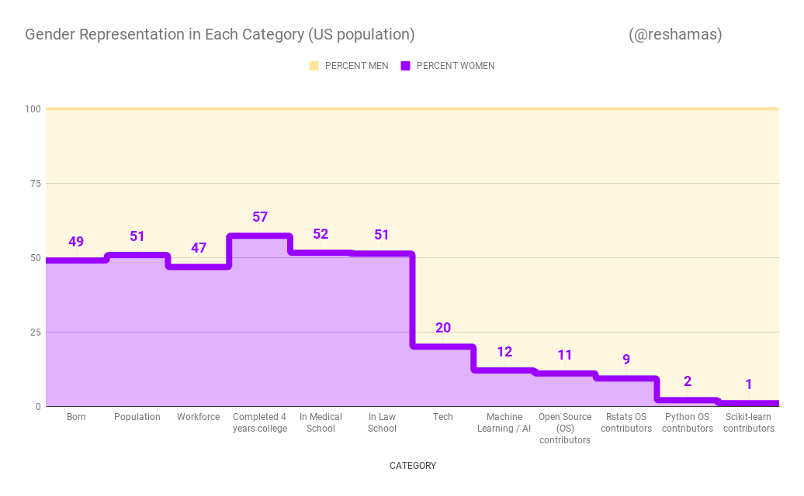
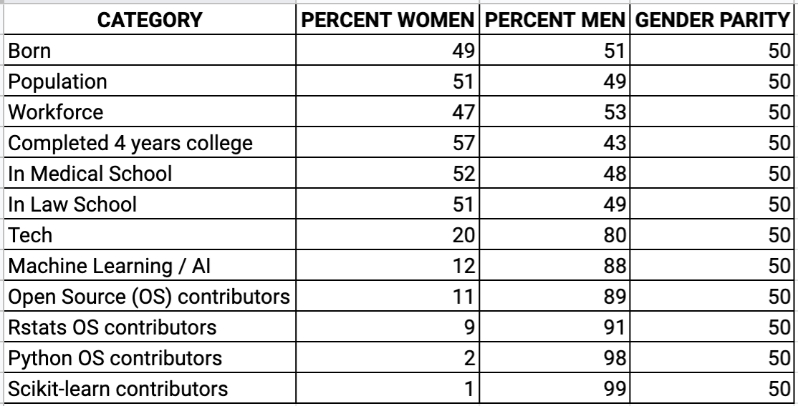

 

## Background

The above visualization was inspired by a table that I had presented to a company to obtain sponsorship for supporting open source sprints for scikit-learn for the Women in Machine Learning & Data Science meetup chapters in May 2019.  I was unsucessful in obtaining that sponsorship, and considered that a visualization may convey the message more poignantly than numbers in a table.  

## Data Table

## Data Collection, Availability and Sharing
Some organizations collect and share data by gender.  The collecting and sharing of key demographic data indicates a commitment to understanding and improving diversity.  It is unsurprising that there is greater data transparency with organizations that have more balanced gender breakdown.  Examples include:  American Statistical Association, American Medical Association and American Bar Association. 

### American Statistical Association (ASA) 
- 2016 ASA Activities:  involvement is by **34.6% women** and **65.4% men**  
- 2017:  membership is **53.7% women** and **45.4% men**
- Source:  [Gender Balance in ASA Activities Update](https://magazine.amstat.org/blog/2016/02/01/genderupdate16/)
- Source:  [ASA Membership by Gender](https://www.asanet.org/research-and-publications/research-sociology/trends/asa-membership-gender)

### American Bar Association (ABA)
- 2019:  **38% women** and **62% men** 
- Source:  [A Current Glance at Women in the Law](https://www.americanbar.org/content/dam/aba/administrative/women/current_glance_2019.pdf)
  
### American Medical Association (AMA)
- Practicing Physicians   
  - 2017:  Ages 55 to 64:   **30.5% women** and **69.5%** men
  - 2017:  Under age of 35:  **60.6% women** and **39.4%** men
- Source:  [Athena Health](https://www.athenahealth.com/insight/healthcare-future-female)

### Association for Computing Machinery (ACM)
  - does not publish numbers for membership by gender
  - It is estimated that ACM membership is:  **15% women** and **85% men**

## References

- [Ratio of Male/Female births, 1983 to 2008, in the United States](https://www.infoplease.com/us/births/births-sex-and-sex-ratio)
  - for year 2008: ratio is 1.05 for Male/Female ==> **49% female** and **51% male**
  - Source:  Infoplease
- [Population Distribution by Gender in the United States](https://www.kff.org/other/state-indicator/distribution-by-gender/?currentTimeframe=0&sortModel=%7B%22colId%22:%22Location%22,%22sort%22:%22asc%22%7D)
  - for year 2017: **51% female** and **49% male**
  - Source:  Kaiser Family Foundation
- [Women in the US Labor Force in 2010](https://www.dol.gov/wb/factsheets/qf-laborforce-10.htm)
  - for year 2010:  Women comprised 47 percent of the total U.S. labor force
    - Source:  US Department of Labor
  - for year 2018: **46.9% female** and **53.1% male** 
    - >In 2018, there were 75,978,000 women aged 16 and over in the labor force, representing 46.9% of the total labor force
    - >In 1999, Women’s labor force participation rate peaked at 60.0%
    - >2024 to 2060:  It is projected to be 55.4% in 2024 and 51.9% in 2060
    - >Men’s labor force participation rate has decreased since the 1940s. It is projected to be 66.1% in 2024 and 62.3% in 2060
    - Source:  [Catalyst](https://www.catalyst.org/research/women-in-the-workforce-united-states/) and BLS (Bureau of Labor Statistics)

- [Completion Rates for College](https://www.catalyst.org/research/women-in-the-workforce-united-states/)
  - for year 2017:  women earned **57.3%** of bachelor's degrees
    - Source:  [Catalyst](https://www.catalyst.org/research/women-in-the-workforce-united-states/) and BLS (Bureau of Labor Statistics)
- [Percentage of the U.S. population who have completed four years of college or more from 1940 to 2018, by gender](https://www.statista.com/statistics/184272/educational-attainment-of-college-diploma-or-higher-by-gender/)
  - 2018 Female vs Male:  35.3% vs 34.6%
  - Source:  Statistica via US Census Bureau
- [Women Were Majority of U.S. Medical School Applicants in 2018](https://news.aamc.org/press-releases/article/applicant-data-2018/)
  - 2018:  women matriculants were **51.6%**; men matriculants **48.4%**
  - Source:  AAMC (Association of American Medical Colleges)
- [Women Now Outnumber Men in Law Schools](https://www.bestlawyers.com/article/women-now-outnumber-men-in-law-school/2029)
  - 2018:  **51.3% women** enrolled in law school
  - Source:  ABA (American Bar Association)
- [Women in Tech](https://www.evia.events/info-women-in-technology)
  - 2015:  **25% women**  ( [NCWIT](https://www.ncwit.org/sites/default/files/resources/womenintech_facts_fullreport_05132016.pdf))
  - 2016-2017 (?):  **20% women**  (Source:  Evia)
- Artificial Intelligence (AI) / Machine Learning (ML)
  - 2017:  **12% women**
  - Source:  Wired worked with Montreal startup Element AI
  - Source:   [AI is the Future But Where are the Women?](https://www.wired.com/story/artificial-intelligence-researchers-gender-imbalance/)
- Open Source
  - 2013:  **11% women** (Source:  [And Now, an Infuriating Statistic about Women and Coding](https://www.newamerica.org/weekly/111/and-now-an-infuriating-statistic-about-women-and-coding/) )
  - 2017:  **5% women** (Source:  [GitHub](https://www.wired.com/2017/06/diversity-open-source-even-worse-tech-overall/))
  - Source:  [Is Open Source Open to Women?](https://www.toptal.com/open-source/is-open-source-open-to-women)

- Rstats
  - 2010:  **9% women** 
  - 2016:  **9.3% women**
  - Source:  [Why Women Are Flourishing In R Community But Lagging In Python](https://reshamas.github.io/why-women-are-flourishing-in-r-community-but-lagging-in-python/)
- Python
  - 2016:  **2% women**
  - Source:  [Why Women Are Flourishing In R Community But Lagging In Python](https://reshamas.github.io/why-women-are-flourishing-in-r-community-but-lagging-in-python/)  
- Scikit-learn (machine learning library of Python)
  - 2017:  **1% women**  (Source:  [Interview with Andreas Mueller](https://mlconf.com/blog/interview-andreas-muller-lecturer-columbia-university-core-contributor-scikit-learn-reshama-shaikh/))
  - 2019:  **1 or 19 active contributors = 5%** (Source: [Current Core Contributors to Scikit-learn](https://scikit-learn.org/stable/about.html#people))

## Tools
Data was entered into a spreadsheet and the graphic was created using Google spreadsheet.

## Update
The below visualization and tweet were posted on 11-Aug-2019 to obtain feedback for an upcoming blog on the Nairobi sprint.  This article was written due to requests by readers to provide sources for the data and clarification of data as well as updating some numbers from the intial presentation.  

<blockquote class="twitter-tweet">
Women in Tech Statistics: the Gender Imbalance<a href="https://twitter.com/hashtag/womenintech?src=hash&amp;ref_src=twsrc%5Etfw">#womenintech</a> <a href="https://twitter.com/hashtag/womeninstem?src=hash&amp;ref_src=twsrc%5Etfw">#womeninstem</a> <a href="https://twitter.com/hashtag/python?src=hash&amp;ref_src=twsrc%5Etfw">#python</a> <a href="https://twitter.com/hashtag/rstats?src=hash&amp;ref_src=twsrc%5Etfw">#rstats</a> <a href="https://twitter.com/hashtag/machinelearning?src=hash&amp;ref_src=twsrc%5Etfw">#machinelearning</a> <a href="https://twitter.com/hashtag/ArtificialIntelligence?src=hash&amp;ref_src=twsrc%5Etfw">#ArtificialIntelligence</a> <a href="https://twitter.com/hashtag/opensource?src=hash&amp;ref_src=twsrc%5Etfw">#opensource</a> <a href="https://twitter.com/hashtag/DiversityandInclusion?src=hash&amp;ref_src=twsrc%5Etfw">#DiversityandInclusion</a> <a href="https://twitter.com/hashtag/MindTheGap?src=hash&amp;ref_src=twsrc%5Etfw">#MindTheGap</a> <a href="https://t.co/fEZvoCv4S5">pic.twitter.com/fEZvoCv4S5</a>
&mdash; Reshama Shaikh (@reshamas) <a href="https://twitter.com/reshamas/status/1160615953316663296?ref_src=twsrc%5Etfw">August 11, 2019</a></blockquote> 

## Contact
My email is reshama at wimlds dot org.

