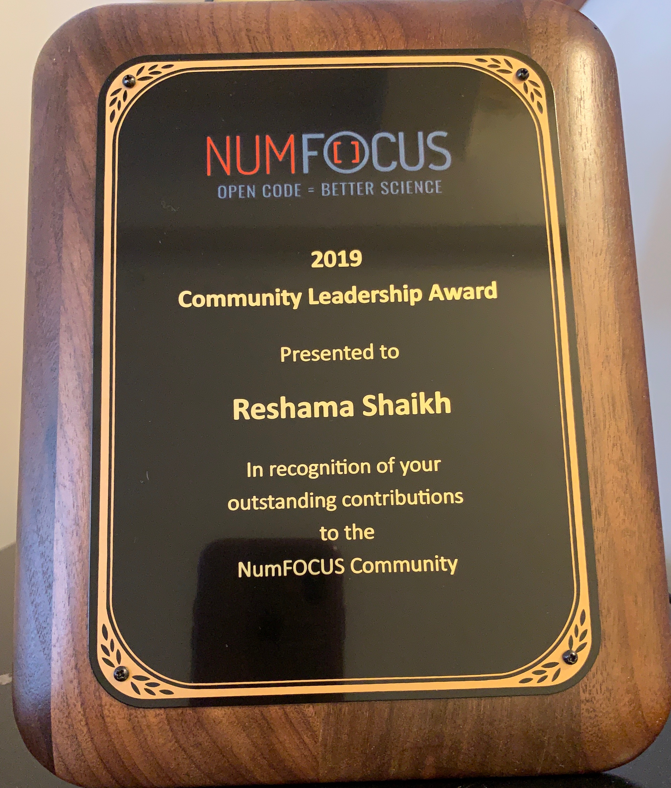

 

The Annual NumFOCUS Summit for 2019 took place the first weekend in November.  I am honored to receive the Community Leadership Award for my contributions in promoting diversity in the community.  Coincidentally, that is the same weekend that I was running the 3rd scikit-learn open source sprint of the year, this one in San Francisco:  
[https://tinyurl.com/sf2019-sprint](https://tinyurl.com/sf2019-sprint).  

It’s wonderful that both these events happened, even if both were the same weekend.  

The SF chapter of WiMLDS (Women in Machine Learning & Data Science) was founded 6 years ago.  I’ve organized the sprint 3 years in a row in NYC (2017-2019), and after numerous emails, phone calls and calendar checks, and I was excited to bring the scikit sprint to the Bay Area WiMLDS for the first time.

Receiving this award and running the sprint on the same day:  it was a good scheduling conflict to have.  I will take it. For those looking for simple smile 🙂 (:simple_smile: on Slack for example), it is :slightly_smiling_face:

## Achievements

2019 has been a productive year for me in promoting diversity.  These are my proudest accomplishments:
- 3 scikit sprints, including the VERY FIRST scikit sprint on the continent of Africa, held in Nairobi, Kenya in June 22.   I was able to arrange a contributor to fly from Berlin to Nairobi, successfully navigating sponsorship, legal review, time zone differences and more.  Over 40 people attended, they were delighted and thankful for the experience of contributing to open source for the first time.  
- A podcast interview, [Women in Data Science](https://www.r-bloggers.com/reshama-shaikh-discusses-women-in-machine-learning-and-data-science/) which was heard in many corners of the planet and which brought opportunities for building the WiMLDS community to more cities in US and Europe and also, more globally, to the Middle East, Africa and India and to other regions of the world.  
- Mentoring new organizers for both NYC WiMLDS and PyLadies; both are the second largest chapters world-wide in their respective communities.  It’s been vital and gratifying to set up the chapters with the leadership pipeline to continue building an inclusive community and providing quality programming in data science and open source.  (See [WiMLDS list of contributions](https://reshamas.github.io/about/wimlds_volunteer/).)
- Given free Git workshops to the community.  Git skills make open source and coding accessible. Naturally, my [Git curriculum](https://github.com/reshamas/git-intro-workshop) is open source. 
- My articles on diversity, inclusivity and building community:  [articles](https://reshamas.github.io)

## Community Acknowledgments

Whenever I think about achieving any goals, my first thought is “It takes a village.”   There are so many people to acknowledge, it would be a very long list.  For the sake of brevity, I would like to thank my meetup co-organizers in New York:  Melissa Ferrari, Noemi Derzsy and Prithvi Gandhi.  I want to thank the scikit-learn core contributors, located all around the world for their support, particularly Andreas Mueller, Adrin Jalali, Thomas Fan and Nicolas Hug.  I would also like to thank the WiMLDS team of organizers around the world for their contributions in building community.  

There are so many dedicated individuals world-wide whose participation and contributions enrich diversity in the open source and data science communities.  The network is dense. I collaborate with some people and organizations, I learn from them and their presence in the global network, whether I directly interact with them or not, all contribute to increasing diversity in the community.  

## Lessons Learned in Diversity

Finally, I want to share some key takeaways I have learned from my work in diversity:  
- Thinking globally is important, imperative and *achievable*.
- Intersectional (or covariance diversity) (meaning considering more than gender in terms of diversity) is essential and focusing on multiple dimensions of diversity will accordingly move diversity initiatives forward.
- Welcoming and including allies is crucial in moving the needle on diversity outcomes
