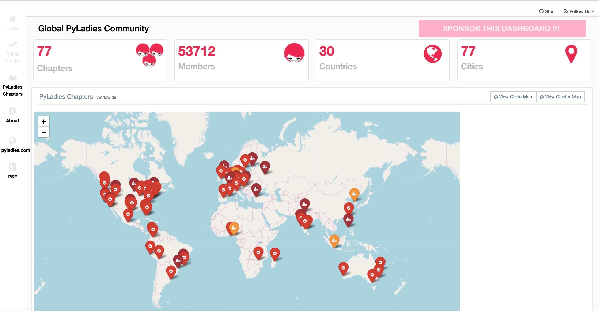

The [PyLadies dashboard](https://nyc-pyladies.github.io/pyladies-dashboard/pyladies.html) was created in February 2020 and will be officially released on March 2, 2020.  

 

## Purpose
- To provide informative, real-time statistics on the PyLadies chapters around the world 
- To identify inactive chapters
- To highlight under-represented regions
- To provide a portal for potential members to find a local community to join and for current members to track chapter activity
- To provide data visually to potential sponsors that communicates the reach of PyLadies organization
- To provide Python-focused organizations like the PSF and NumFOCUS insight into the community

## The Dashboard

The dashboard is hosted on GitHub, using GitHub Pages, and is available at the following link: [pyladies-dashboard](https://nyc-pyladies.github.io/pyladies-dashboard/pyladies.html)

## Audience
- PyLadies organizers
- PyLadies members
- Companies who may be potential sponsors and supporters of PyLadies
- Event organizers / employers who need data-driven information about the global distribution of women in the Python community
- Women who are interested in learning Python
- The PSF and general Python Community

## Team
- Developer: Ben Ubah
- Project Manager:  Reshama Shaikh

## Tools
- **Front-end:** Pure HTML / JavaScript, D3.js, Echarts.js, Leaflet.js, Gentellala dashboard template
- **Back-end:** A small ETL infrastructure based on R, Bash and Travis CI that daily retrieves data from Meetup API. The use of this tool is based on previous work for a similar R-Ladies dashboard. This infrastructure provides a way to work with Meetup's OAUTH 2.0 authentication system automatically. The back-end is completely separated from the front-end. 

## Sponsors
We are looking for sponsors to fiscally support this project and maintenance of this project in exchange for displaying your organization’s name in the Sponsor section of the dashboard page.  Email us for more information.  

## The Long Term Goal
The goal of this dashboard fits into a bigger picture of exploring and visualizing the R, Python and data science communities. This permits data-driven assessments and decisions.  These are the projects that Ben Ubah is embarking on, contingent on sponsorship support.  

### R Community Explorer
- [R User Groups](https://benubah.github.io/r-community-explorer/rugs.html)
- [R Ladies](https://benubah.github.io/r-community-explorer/rladies.html)
- Events and trends (coming soon); contact Ben to sponsor an events/trends R dashboard (ubah.ben22 [at] gmail com)

### Python Community Explorer
- [PyLadies](https://nyc-pyladies.github.io/pyladies-dashboard/pyladies.html)
- PyData / Python groups
- Events and trends (coming soon); contact Ben to sponsor a python project dashboard (ubah.ben22 [at] gmail com)

### Data Science Community Explorer
- [Data Science groups](https://datascience-community.github.io/user-groups/datascience.html) (developing)
- Any other data science / software community (please reach out to Ben Ubah if you need a dashboard/explorer for your community)

## Contact
If you have any questions, feedback or suggestions for the PyLadies dashboard, please open an [issue on GitHub](https://github.com/nyc-pyladies/pyladies-dashboard/issues) or email:  reshama.stat@gmail.com

