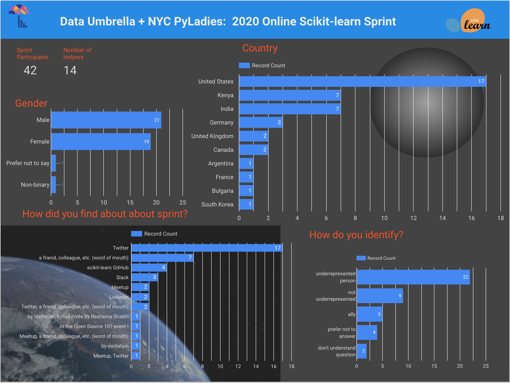

  

 

## Sprint Background

This sprint was organized by [Reshama Shaikh](https://reshamas.github.io) of [Data Umbrella](https://www.dataumbrella.org) and [NYC PyLadies](http://nyc.pyladies.com/) to increase the participation of underrepresented persons in data science.  All organization of this sprint was by volunteer time.  

The sprint was originally scheduled to be an in-person event in New York City.  It would have been the fourth year in a row that I (Reshama Shaikh) would have organized a sprint in NYC.  Due to the coronavirus pandemic, it was pivoted to become a virtual event.  

This report focuses on the summary, impact and lessons learned of the **first online** scikit-learn sprint.  More background information is available here:
- [Data Umbrella + NYC PyLadies Sklearn Sprint](https://sites.google.com/view/nyc-2020-scikit-sprint)
- [Sprints Organized by Reshama Shaikh](https://www.dataumbrella.org/open-source/sprints)

## Demographics

 

To ensure that attendees had some knowledge of Python and scikit-learn, a brief application form was used.  Attendees did not have to be experienced Git users, but some experience was helpful.  

About 25% of the attendees had participated in a scikit-learn open source sprint before.  The attendees were evenly split by gender.  Participants from ten different countries joined. Over half the participants identified as "underrepresented."

Most attendees learned of the event via Twitter and word-of-mouth, followed by scikit-learn GitHub repo and then through other social media and community platforms (e.g. Slack, Meetup, LinkedIn, etc.)

## Impact Report for Data Umbrella Scikit-learn Sprint

|                                       | Sprint 2020    |
|---------------------------------------|----------------|
| Report date                           | 10-Jun-2020    |
| Sprint date                           | 06-Jun-2019    |
| Location                              | online         |
| Sprint website | [2020 Online Sprint](https://sites.google.com/view/nyc-2020-scikit-sprint) | 
| Open source library                   | [scikit-learn](https://github.com/scikit-learn/scikit-learn) |  
| GitHub repository link                | [data-umbrella/2020-sklearn-sprint](https://github.com/data-umbrella/2020-sklearn-sprint)| 
| List of Issues                        | [project list](https://github.com/data-umbrella/2020-sklearn-sprint/projects/1)  |
|                                       |               |
| Organizer      | [Reshama Shaikh](https://twitter.com/reshamas)    |
| Lead Facilitator    | [Andreas Mueller](https://twitter.com/amuellerml) |
| Scikit-learn Experts    | Adrin Jalali, Thomas Fan, Nicolas Hug, Tom Dupre la Tour  |  
| Teaching Assistants                   | [Mark Hannel](https://twitter.com/benchmarkhannel) & Shashank Singh |
| Platforms                             | Discord & Zoom |
| Sponsor:  venue                       | Not applicable |
| Sponsor:  food                        | Not applicable |
|                                       |                |
| [PULL REQUESTS](https://docs.google.com/spreadsheets/d/1hG_jmvib6zy3exdLUF_grb4ix5YaFpcwuKtRRYaoBPM/edit?usp=sharing) **(PRs)**                 |          |
| PRs [MRG] at sprint            | 27             |
| PRs [MRG] post-sprint            | 10?             |
| PRs open from sprint                       | ?        |
| PRs returned to issue pool (g)     | ?        |
| <a style="color:red"><b>TOTAL PRs MERGED</b> </a>  (d)   |  <a style="color:red"><b>19</b> </a> |
|                                    |          |
|                                    |          |
| Attendees:  Initial Registrations  | 51       |
| Attendees:  Participated           | ~ 42     |
| Attendee List                      | [2020](https://sites.google.com/view/nyc-2020-scikit-sprint/contributors)   |
|                                    |          |
| Post-sprint Survey                 | [survey form](https://forms.gle/XGCqNpzw5u4tzfJB7) (closed)
|                                    |          |  
| Cost of Sprint                     | volunteer time to organize event |
|                                    |          |
| Blog 1: by Joe Lucas               | [Scikit-learn Sprint: My Open Source Adventure](http://joetl.com/posts/sklearn_sprint/) |
| Blog 2: by Jake Tae                | [A Reflection on My First Open Source Contribution Sprint](https://jaketae.github.io/development/sklearn-sprint/)  |
| Blog 3: by C Thinwa                | [Why you should contribute to open-source as a data scientist](https://medium.com/@ceethinwa/why-you-should-contribute-to-open-source-as-a-data-scientist-7375ec5bc628) |
| Blog 4: by Maren Westerman         | [ ] ( ) |

#### Notes
- (a)  this represents the number of pull requests which were merged during the sprint day.
- (b)  this represents the number of pull requests that were merged after the sprint by participants.  These participants submitted their PRs by their own initiative.
- (c)  these PRs were merged post-sprint, and which were followed up by the sprint organizer.   
- (d)  this represents the **total PRs that were merged in** which provides one dimension of the impact of the sprint.
- (e)  this number represents the number of PRs from the sprint which are still open.
- (f)  this number represents PRs that were opened, but then closed by the successful merge of another PR.  
- (g)  this represents issues that were deemed advanced for beginner participants and returned to the issue pool.

## Impact Summary for 2020

<blockquote class="twitter-tweet">
Some stats on today&#39;s ONLINE <a href="https://twitter.com/DataUmbrella?ref_src=twsrc%5Etfw">@DataUmbrella</a> <a href="https://twitter.com/hashtag/ScikitLearnSprint?src=hash&amp;ref_src=twsrc%5Etfw">#ScikitLearnSprint</a>: • 27 PRs MERGED! • 27 PRs still *open* (TBC) (⚖️) • 42 new &amp; returning contributors • 13 helpers • ➕➕❤️ the contributors emojis!  Thanks to all for spending this Saturday across 16 different time zones with us! <a href="https://t.co/MhrjtkMsui">pic.twitter.com/MhrjtkMsui</a>
&mdash; Reshama Shaikh (@reshamas) <a href="https://twitter.com/reshamas/status/1269410508270157832?ref_src=twsrc%5Etfw">June 6, 2020</a></blockquote> 

Statistics on PRs:    
- **27** PRs were merged at the sprint
- **28** PRs were open at end of sprint
- **xx* were merged post-sprint without any follow-up
- **xx** PRs were merged *with* follow-up 

## An International Collaboration
Scikit-learn core contributors joined from San Francisco (CA), New York (NY) and Berlin (Germany).

Sprint participants hailed from ten different countries.

## Preparation Work
Because this was an online event and the idea of having an 8-hour sprint was not appealing to me, I reduced the time in half and increased the preparation work that attendees could do. 

  

## Challenges for Me, as an Organizer
Participants can use a variety of different names for email, Discord, GitHub, etc.  It is difficult to get to know participants and connect their different profiles and assist them.  

## Challenges

### Technology Platforms
For a typical in-person sprint, interaction is in person and some communication the scikit-learn sprint Gitter channel.

For the virtual event, the following platforms were utilized:
1.  **Zoom:** for presentation: being online from 11:45 am EDT to about 12:15 pm EDT (because Discord has max of only 25 people in any one channel, and we have about 50 people joining)
2.  **Discord:** during sprint time
3.  **Gitter:**  use after sprint (Typically our sprints are in person, so sprint participants would ask in person or on Gitter.)  There are more core scikit-learn contributors on Gitter than on this Discord.  But, typically, if the question is related to a specific pull request (PR), the conversation is on the GitHub PR.

 
### Pair Programming
About 8 people were no-shows, and their pairs needed to be reassigned at the start of the event. 

### Discord
Discord is a platform which is unfamiliar to some people and there was a learning curve in navigating it.  

### Applicant Responsivity 
Over 80 applicants were sent acceptances and half did not RSVP. Partial reasons is that the sprint emails were going to spam folders.

### Virtual Environment Setup for Windows
A number of Windows users experienced challenges in setting up their virtual environment.

## Pair Programming
This was an entirely online event.  Particpants were assigned their partner prior to sprint start.  Where possible, a new contributor was matched with a returning contributor.

## Non-measurable Impact
Aside from the number of PRs that were merged, there is non-quantifiable impact of the open source sprint. Some examples include:
- learning to set up virtual environment
- using Git (fork, clone, branch, fetching another's PR)
- introduction to tests such as:  flake8 (linting, formatting), pytest, "continuous integration"
- navigating through the codebase structure of scikit-learn
- digging into functions, learning about errors
- learning about unit tests
- interacting with contributors on GitHub
- learning, in general
- networking
- building confidence (making a dent in "imposter syndrome")
- having fun

## Sprint Feedback

Feedback has been shared a number of ways:  
1.  Twitter (Moment)
2.  Blogs
3.  Sprint survey
4.  Casually, in conversation during the sprint

These were the respondents **favorite** parts of the sprint:

  

These are areas for **improvement**:  

  

Here is additional feedback:

  

## Lessons Learned

## Future Plans
- **2 day event:** Because the contributor has traveled far and PRs take some time to work through, it is worth considering having a 2 day sprint. 
- **Remote participation:** There were numerous requests to join remotely.  Our plan is to have Andreas Mueller record the first couple of hours of the August 2019 sprint and share the recording.
- **Hold pre-sprint evening workshop:** one week prior so participants can set up their virtual environments and save time during the sprint day.

---
## References

- [List of Scikit-learn Sprints](https://reshamas.github.io/resources/scikit_learn_sprints/)

### Query for PR:
- [Open PRs](https://github.com/scikit-learn/scikit-learn/pulls?q=is%3Apr+is%3Aopen+created%3A>%3D2020-06-04+%23DataUmbrella+): 17  (Query:  `is:pr is:open created:>=2020-06-04 #DataUmbrella`)
- [Merged PRs](https://github.com/scikit-learn/scikit-learn/pulls?q=is%3Apr+is%3Amerged+created%3A>%3D2020-06-04+%23DataUmbrella): 38   (Query: `is:pr is:merged created:>=2020-06-04 #DataUmbrella`)

---
## Addendum
- [no addendums or updates at the time of publication] 

 

