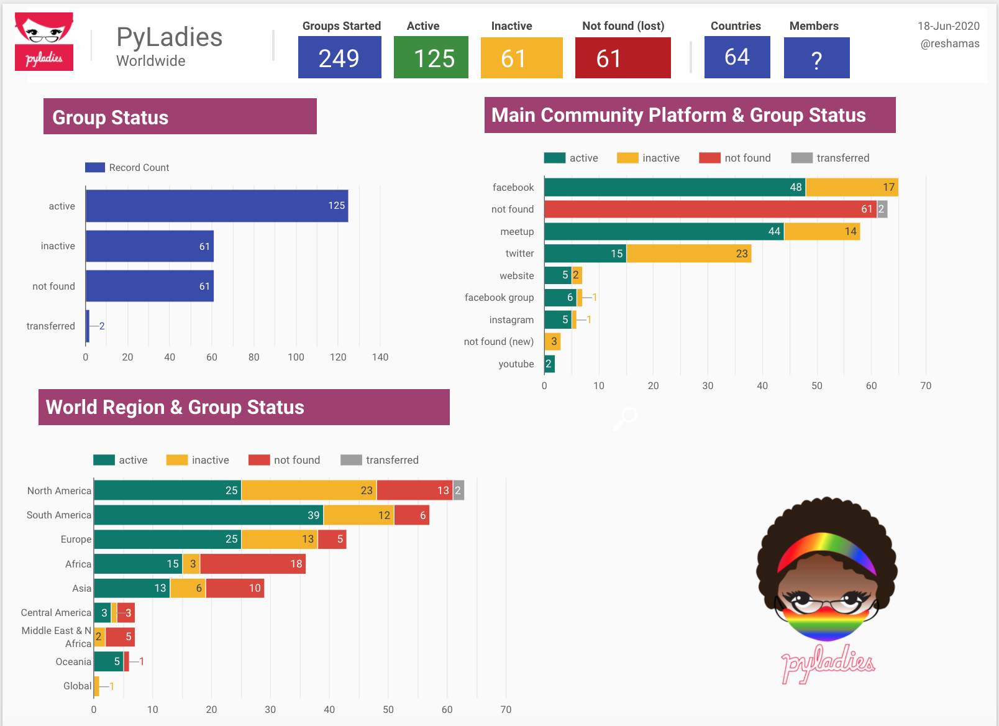

 

 

## Background
[PyLadies](https://www.pyladies.com/) is a global group that was created to involve more women in the Python open-source community. PyLadies was founded in 2011, with the first chapter being established in Los Angeles in April of that year. There is more background available in the [PyLadies Wikipedia page](https://en.wikipedia.org/wiki/PyLadies).

The last [Overview of PyLadies Chapters](https://prith13.github.io/posts/2018/11/pyladies-overview/) was published on November 24, 2018.  

This summary provides an abbreviated update:  
- to identify which chapters are active
- to identify which platforms are used to connect with the local communities of that chapter

## Summary
There are 249 chapters identified across 64 countries.  Fifty-percent of the chapters were identified as "active", the rest are "inactive."  The chapter was categorized as "active" if there was any activity on one of the social media platforms within the past 12 months.  

## Resources to Identify Chapters
The following platforms were researched to discover existence of PyLadies chapters:  
- [Meetup Dashboard](https://nyc-pyladies.github.io/pyladies-dashboard/pyladies.html)
- PyLadies homepage of [locations](https://www.pyladies.com/locations/)
- [Twitter list of PyLadies chapters](https://twitter.com/i/lists/218154359)
- [Brazil chapter list](http://brasil.pyladies.com/locations/)
- [Czechia chapter list](https://pyladies.cz)
- [PyLadies Slack](http://slackin.pyladies.com): announcements of new chapters
- Search "pyladies" on Facebook
- Search "pyladies" on Twitter
- Search "pyladies" on Instagram
- Search "pyladies" on LinkedIn
- Search "pyladies" on YouTube
- Indirect searches for one chapter led to findings of other chapters

## Platforms
PyLadies groups around the world use various platforms to organize and communicate.  These are some of the platforms:  
- Meetup
- Facebook
- PyLadies website
- non-PyLadies website
- Twitter
- Instagram
- Slack
- WhatsApp
- YouTube
- LinkedIn
- Google Groups

## Country-level Chapters
The following countries have opened a chapter at the "country-level":  
Argentina, Australia, Brazil, Czechia, Ghana, India, Indonesia, Morocco, Nigeria, Peru, Poland, Sierra Leone, Spain, Turkey.

## Chapters by Country
This visualization shows number of chapters by country for the 20 countries with most chapters.  

 

## Disclosure
It was a fairly manual process and it would be preferable if could be automated.  I tried using Facebook Graph API, but was not successful obtaining an API key.

## PyLadies History of Growth  
PyLadies communities has opened more chapters than other community in that space, and they are most broadly represented in the world.  There are also many chapters which are non-active.  

Some chapters were dissolved, or rolled into other communities such as:  Django Girls, Girl Develop It, general Python meetup groups, PyData meetup groups.

 

## Number of Members
As this was a rather manual process, the first step was identifying how many chapters there were.  Next steps would be to determine the membership in the "main platform" to ascertain how many members are in the community.

## References
- [PyLadies Handbook Documentation](https://buildmedia.readthedocs.org/media/pdf/pyladies-kit/latest/pyladies-kit.pdf)
- [pyladies/global-organizing](https://github.com/pyladies/global-organizing)
- [Why Women Are Flourishing In R Community But Lagging In Python](https://reshamas.github.io/why-women-are-flourishing-in-r-community-but-lagging-in-python/)