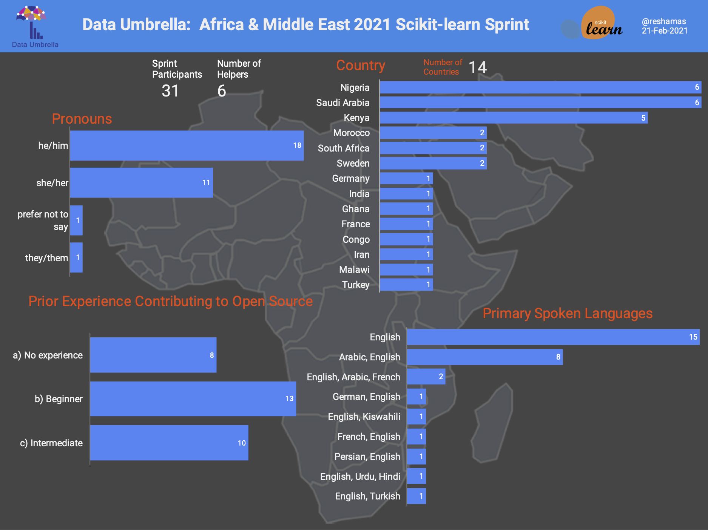

  
   

  

# Reminders

- submit draft report to core contributors for review
- add screenshot of checklist and link to it.
- 

## Sprint Background
A "sprint" is a hands-on hackathon where participants learn to contribute to scikit-learn, a well-known Python open source, machine learning library.

This sprint was organized by [Data Umbrella](https://www.dataumbrella.org) to increase the participation of underrepresented persons in data science, with a focus on the geographic regions of Africa and the Middle East (AFME).  

This report focuses on the summary, impact and lessons learned of the AFME scikit-learn sprint.  

## Event Sponsor
This event was funded in part by a grant from Code for Science & Society, made possible by grant number [GBMF8449](https://www.moore.org/grant-detail?grantId=GBMF8449) from the Gordon and Betty Moore Foundation.

## Continued Contribution to Open Source
This sprint was a 4-hour block of time with pre- and post-sprint work required. 

Participants are encouraged to keep contributing to scikit-learn or other Python libraries, using the skills learned in this event. 

## Sprint Agenda
- 30-Jan-2021:  pre-sprint Kickoff  (10am to 11am EAT)  [a]
- 06-Feb-2021:  Sprint  (10am to 2pm EAT)  [b]
- 20-Feb-2021:  Sprint Follow-up Office Hours (10am to 11am EAT)

[a] EAT = East Africa Time
[b] Even though the event ended at 2pm EAT, participants continued to work on their sprint PRs (pull requests) throughout the day and weekend. Also, many scikit-learn core contributors were online to review the PRs.  

### Sprint Day
Even though the sprint ran 4 hours (10am to 2pm EAT),, participants continued to work on their sprint PRs (pull requests) throughout the day and weekend. Also, many scikit-learn core contributors were online to review the PRs.  

### Follow-up Office Hours
Office hours were set up 2 weeks after the sprint where some of the scikit-learn core contributors were available to answer questions on open PRs.  

## Number of Attendees
- Pre-sprint event: 15
- Sprint day: 31
- Post-sprint office hours:  7

---

## Demographics

 

A total of 31 contributors attended the sprint. 12 of 31 (39%) identified at female or non-binary.  18 of 31 (58%) identified as male.  

Contributors joined from 14 different countries.  Country information was provided based on where participants were joining from. Saudi Arabia, Kenya and Nigeria had the most participants, for a total of 16 of 31, almost 55%.

 Other countries represented include Morocco, South Africa, Ghana, Iran, Congo, Malawi, as well as Sweden and France.

Given the migration in the region, these other countries were also represented in terms of contributor background:  Sudan, Turkey, Syria. 

There were two invited contributors, joining from India and Germany.  Invited contributors were those who participated in a prior sprint and have continued contributing to scikit-learn.  They were paired with a new contributor.  

### Applications Received
The countries in the AFME region with the most applicants are:  
- Nigeria:  20
- Kenya:  12
- Saudi Arabia:  8
- South Africa:  5
- Sweden: 4
- Morocco:  4

### Spoken Languages
All communication was in English. All participants felt comfortable conversing in English. Languages spoken by participants included:  English, Arabic, French, Kishwahli, Persian, Hindi, Urdu, Turkish and German.

### Open Source Background
Two-thirds of participants identified as having "none" or "beginner" level experience in contributing to open source.

### Number of Participants
- About 15 participants joined the pre-sprint event
- 31 participants joined the sprint
- 7 participants joined the post-sprint event

Post-sprint event well.  Programming partners disappeared.  They have been contributing after the sprint.  
Maren: pair programming connection issues Isaac

## Impact Report for Data Umbrella Scikit-learn Sprint

|                                       | Sprint 2020    |
|---------------------------------------|----------------|
| Report date                           | 28-Feb-2021    |
| Sprint date                           | 06-Feb-2021    |
| Location                              | Online; Africa & Middle East (AFME)         |
| Sprint website | [afme2021.dataumbrella.org](https://afme2021.dataumbrella.org) |
|                | Twitter [Moment](https://twitter.com/reshamas/status/1358409282006450178) |
| Open source library                   | [scikit-learn](https://github.com/scikit-learn/scikit-learn) |  
| GitHub repository link                | [data-umbrella/data-umbrella-scikit-learn-sprint](https://github.com/data-umbrella/data-umbrella-scikit-learn-sprint)| 
|                                       |               |
| Organizers      | [Reshama Shaikh](https://twitter.com/reshamas) & [Mariam Haji](https://www.linkedin.com/in/mariamhaji/)    |
| Lead Facilitator    | [Andreas Mueller](https://twitter.com/amuellerml) |
| Scikit-learn core contributors    | Adrin Jalali, Olivier Grisel, Guillaume LeMaitre  |  
| Invited Contributors | Amanda D'Souza & Maren Westerman |
| Teaching Assistants                   | None |
| Platforms                          | Discord & Zoom |
|                                    |                |
| Sponsor: | Grant [GBMF8449](https://www.moore.org/grant-detail?grantId=GBMF8449) from [Gordon and Betty Moore Foundation](https://www.moore.org) & [Code for Science and Society](https://eventfund.codeforscience.org)   |
|            |                |
| [PULL REQUESTS] ( ) **(PRs)**                 |          |
| PRs [MRG] at sprint            | xx             |
| PRs [MRG] post-sprint            | xx             |
| PRs open                    | xx        |
| PRs returned to issue pool      | ?        |
| <a style="color:red"><b>TOTAL PRs MERGED</b> </a>    |  <a style="color:red"><b>57</b> </a> |
| PRs [merged](https://github.com/scikit-learn/scikit-learn/pulls?q=is%3Apr+is%3Amerged++%23DataUmbrella+)          |      |
| PRs [open](https://github.com/scikit-learn/scikit-learn/pulls?q=is%3Apr+is%3Aopen++%23DataUmbrella+)              |      |
|                                    |          |
| Attendees:  Initial Registrations  | 45       |
| Attendees:  Participated           | ~ 31     |
| Attendee List                      | [Sprint Contributors](https://afme2021.dataumbrella.org/contributors)   |
|                                    |          |
| Post-sprint Survey                 | [survey form] (closed)
|                                    |          |  
| Blog 1: by Fortune Uwha               | [First Time Contributor to Open Source — Data Umbrella Scikit-learn Virtual Sprint February 2021](https://fortune-uwha.medium.com/first-time-contributor-to-open-source-data-umbrella-scikit-learn-virtual-sprint-february-2021-362208ba0710) |
|              |  |

## Preparation Work
Because this was a virtual event and the idea of having an 8-hour online sprint was not appealing (to me), I reduced the time in half and increased the preparation work that attendees could do.

There are two videos for newcomers to [Get Started with Contributing to Scikit-learn](https://www.dataumbrella.org/open-source/contributing-to-scikit-learn):  
- Andreas Mueller: [Crash Course in Contributing to Scikit-learn](https://www.youtube.com/watch?v=5OL8XoMMOfA)
- Reshama Shaikh: [Contributing to Scikit-Learn: An Example Pull Request](https://youtu.be/PU1WyDPGePI)

## Resources for Contributing to scikit-learn (outside of a sprint)

Checklist

Discord video / slides
[c] https://youtu.be/w2A8SknM-68

[d] https://github.com/data-umbrella/data-umbrella-scikit-learn-sprint/blob/master/intro-to-discord.pdf

## Sprint Feedback

Feedback has been shared a number of ways:  
- Twitter [Moment](https://twitter.com/i/events/1358408128753238017)
- Blogs
- Sprint survey
- Social media (LinkedIn)
- Casually, in conversation during the sprint, pre-sprint and post-sprint events

## Data Umbrella Feedback Survey
Data Umbrella received 19 responses to our internal sprint survey. (19/31 = 61% response rate).

Respondents rated their overall sprint experience highly favorably and had a positive experience working with their pair programming partner.  

In response to the question "*What are your favorite parts about the sprint?*"  
>- Pair programming
>- Getting to directly interact with sklearn's core contributors.
>- Working on issues and collaborating with my partner.
>- The amazing feeling of being part of a large community that cares.
>- Meeting people from different countries
>- Overall good arrangement + the presence of core-contributors to support through the whole process from setting the development environment to submitting and merging a PR
>- Meeting new people and getting to know core team 
>- Getting to meet the core contributors to sckit-learn. So helpful and friendly!
>- Pair programming, an Excellent sprint strategy
>- The communication with my pair programming partner
>- The community is great and friendly 
>- The pair programming and the feedback session with the core developers
>- There was ample knowledge to start working on things. It was very easy to get going with the shared information.
>- Working on an issue with a partner alongside a contributor. I got a better perspective on working on issues.
>- Getting help from the core contributors/developers and learning from my programming partner*

Some general feedback in the survey:  

>- I had a very good pair programming partner from a different country and profession. The sprint was planned very well. I definitely would love to participate in more of such sprints.
>- The experience was amazing and worth it I really learnt a lot and hopefully to keep up on working on more OS. Love the diversity and networking that comes along with am proud to have collaborated with my pair and contribution on the OS thank you for the great platform.

One suggestion for improvement:  
>- *Have single comprehensive source of information for preparing the environment.*

### Social Media

<blockquote class="twitter-tweet">
Congrats <a href="https://twitter.com/fortune_uwha?ref_src=twsrc%5Etfw">@fortune_uwha</a>! 🌟🌟  &gt; LGTM. Adding tests as a first time contributor, respect! <a href="https://t.co/wE6qdHHkHb">pic.twitter.com/wE6qdHHkHb</a>
&mdash; Data Umbrella (@DataUmbrella) <a href="https://twitter.com/DataUmbrella/status/1358148474739560448?ref_src=twsrc%5Etfw">February 6, 2021</a></blockquote> 

#### Fortune

<blockquote class="twitter-tweet">
First time contributor to open source/scikit learn 🎉🎉. The <a href="https://twitter.com/hashtag/ScikitLearnSprint?src=hash&amp;ref_src=twsrc%5Etfw">#ScikitLearnSprint</a> session was so much fun! We got a chance to meet the core contributors. Super grateful to <a href="https://twitter.com/codeforsociety?ref_src=twsrc%5Etfw">@codeforsociety</a> and <a href="https://twitter.com/MooreFound?ref_src=twsrc%5Etfw">@MooreFound</a> for supporting <a href="https://twitter.com/DataUmbrellaAFR?ref_src=twsrc%5Etfw">@DataUmbrellaAFR</a>   Submitted PR. 🤞on getting merged.<a href="https://twitter.com/reshamas?ref_src=twsrc%5Etfw">@reshamas</a>
&mdash; Fortune Uwha🦋 (@fortune_uwha) <a href="https://twitter.com/fortune_uwha/status/1358075788457889792?ref_src=twsrc%5Etfw">February 6, 2021</a></blockquote> 

#### Amanda

<blockquote class="twitter-tweet">
As always, a great time at <a href="https://twitter.com/DataUmbrella?ref_src=twsrc%5Etfw">@DataUmbrella</a>&#39;s <a href="https://twitter.com/hashtag/ScikitLearnSprint?src=hash&amp;ref_src=twsrc%5Etfw">#ScikitLearnSprint</a>. Pair programming works! <a href="https://t.co/k6uVQsffL5">https://t.co/k6uVQsffL5</a>
&mdash; amanda dsouza (@amanda_dsouza) <a href="https://twitter.com/amanda_dsouza/status/1358079552518381572?ref_src=twsrc%5Etfw">February 6, 2021</a></blockquote> 

#### Clifford

<blockquote class="twitter-tweet">
First time wrangling through the sklearn code base. The <a href="https://twitter.com/hashtag/ScikitLearnSprint?src=hash&amp;ref_src=twsrc%5Etfw">#ScikitLearnSprint</a> session was enlightening. We met the core developers too. And my programming partner was ❤️❤️  Thank you <a href="https://twitter.com/DataUmbrellaAFR?ref_src=twsrc%5Etfw">@DataUmbrellaAFR</a>.  ✌️ on the PR review though😅<a href="https://twitter.com/hashtag/opensource?src=hash&amp;ref_src=twsrc%5Etfw">#opensource</a> <a href="https://twitter.com/hashtag/python?src=hash&amp;ref_src=twsrc%5Etfw">#python</a> <a href="https://twitter.com/hashtag/datascience?src=hash&amp;ref_src=twsrc%5Etfw">#datascience</a> <a href="https://twitter.com/hashtag/MachineLearning?src=hash&amp;ref_src=twsrc%5Etfw">#MachineLearning</a>
&mdash; Clifford Emmanuel Akai-Nettey (@ce_akainettey) <a href="https://twitter.com/ce_akainettey/status/1358028354537091073?ref_src=twsrc%5Etfw">February 6, 2021</a></blockquote> 

#### Maren

<blockquote class="twitter-tweet">
I&#39;m very grateful for having been invited as a returning contributor to assist a first time contributor with getting a pull request submitted. My pair programming partner and I successfully made a PR. Fingers crossed our changes pass the tests and get merged. 🤞🏾 <a href="https://t.co/Lga4eIA67L">https://t.co/Lga4eIA67L</a>
&mdash; Maren Westermann (@MarenWestermann) <a href="https://twitter.com/MarenWestermann/status/1358020745788616704?ref_src=twsrc%5Etfw">February 6, 2021</a></blockquote> 

#### Ogbonna

<blockquote class="twitter-tweet">
Special thanks to the sponsors, core contributors <a href="https://twitter.com/reshamas?ref_src=twsrc%5Etfw">@reshamas</a> <a href="https://twitter.com/glemaitre58?ref_src=twsrc%5Etfw">@glemaitre58</a> <a href="https://twitter.com/xlorentzen?ref_src=twsrc%5Etfw">@xlorentzen</a> <a href="https://twitter.com/ogrisel?ref_src=twsrc%5Etfw">@ogrisel</a> for their guidance, assistance and enabling me to learn and contribute, and to my pair programmer, Rukuyat Amzat. <a href="https://twitter.com/hashtag/opensource?src=hash&amp;ref_src=twsrc%5Etfw">#opensource</a> <a href="https://twitter.com/hashtag/python?src=hash&amp;ref_src=twsrc%5Etfw">#python</a> <a href="https://twitter.com/hashtag/MachineLearning?src=hash&amp;ref_src=twsrc%5Etfw">#MachineLearning</a>
&mdash; Ogbonna Chibuike (@OgbonnaChibuiks) <a href="https://twitter.com/OgbonnaChibuiks/status/1359539381586042881?ref_src=twsrc%5Etfw">February 10, 2021</a></blockquote> 

#### Muhammad

<blockquote class="twitter-tweet">
Made my first open-source contribution last week, with 2 pull requests merged into the <a href="https://twitter.com/scikit_learn?ref_src=twsrc%5Etfw">@scikit_learn</a> project! 🥳🥳  Huge thanks to <a href="https://twitter.com/DataUmbrella?ref_src=twsrc%5Etfw">@DataUmbrella</a> and <a href="https://twitter.com/reshamas?ref_src=twsrc%5Etfw">@reshamas</a> for organising the event and to <a href="https://twitter.com/glemaitre58?ref_src=twsrc%5Etfw">@glemaitre58</a> and <a href="https://twitter.com/ogrisel?ref_src=twsrc%5Etfw">@ogrisel</a> for guiding me through it!
&mdash; Muhammed Jarir Kanji (@mjkanji) <a href="https://twitter.com/mjkanji/status/1360000590550601732?ref_src=twsrc%5Etfw">February 11, 2021</a></blockquote> 

#### Fortune

<blockquote class="twitter-tweet">
Two issues. Two PR approved and merged üéâüéâ. This sure feels good. Me and my pair programming partner(Cee thinwa) rocküòÅ. Thanks to <a href="https://twitter.com/ogrisel?ref_src=twsrc%5Etfw">@ogrisel</a> <a href="https://twitter.com/reshamas?ref_src=twsrc%5Etfw">@reshamas</a> <a href="https://twitter.com/DataUmbrella?ref_src=twsrc%5Etfw">@DataUmbrella</a> for making this possible.  Meanwhile, I wrote an article about my experience on medium. üëá <a href="https://t.co/RoHLSSmM7S">https://t.co/RoHLSSmM7S</a> <a href="https://t.co/kKQn3ItDkb">pic.twitter.com/kKQn3ItDkb</a>
&mdash; Fortune Uwha🦋 (@fortune_uwha) <a href="https://twitter.com/fortune_uwha/status/1360271175293763586?ref_src=twsrc%5Etfw">February 12, 2021</a></blockquote> 

<blockquote class="twitter-tweet">
Congrats <a href="https://twitter.com/fortune_uwha?ref_src=twsrc%5Etfw">@fortune_uwha</a>! 🌟🌟  &gt; LGTM. Adding tests as a first time contributor, respect! <a href="https://t.co/wE6qdHHkHb">pic.twitter.com/wE6qdHHkHb</a>
&mdash; Data Umbrella (@DataUmbrella) <a href="https://twitter.com/DataUmbrella/status/1358148474739560448?ref_src=twsrc%5Etfw">February 6, 2021</a></blockquote> 

#### Feras

<blockquote class="twitter-tweet">
Thank you <a href="https://twitter.com/DataUmbrella?ref_src=twsrc%5Etfw">@DataUmbrella</a> <a href="https://twitter.com/codeforsociety?ref_src=twsrc%5Etfw">@codeforsociety</a> <a href="https://twitter.com/MooreFound?ref_src=twsrc%5Etfw">@MooreFound</a> for organizing <a href="https://twitter.com/hashtag/ScikitLearnSprint?src=hash&amp;ref_src=twsrc%5Etfw">#ScikitLearnSprint</a> It was a pleasure meeting you <a href="https://twitter.com/reshamas?ref_src=twsrc%5Etfw">@reshamas</a> and the great team!
&mdash; Feras O (@Feras_Oughali) <a href="https://twitter.com/Feras_Oughali/status/1358012520322203649?ref_src=twsrc%5Etfw">February 6, 2021</a></blockquote> 

#### Cindy

<blockquote class="twitter-tweet">
Thank you <a href="https://twitter.com/DataUmbrella?ref_src=twsrc%5Etfw">@DataUmbrella</a> for organising a great sprint and to all the <a href="https://twitter.com/scikit_learn?ref_src=twsrc%5Etfw">@scikit_learn</a> contributors for supporting! <a href="https://twitter.com/hashtag/ScikitLearnSprint?src=hash&amp;ref_src=twsrc%5Etfw">#ScikitLearnSprint</a>
&mdash; Cindy Bezuidehout (@CBezuidehout) <a href="https://twitter.com/CBezuidehout/status/1358379866836631552?ref_src=twsrc%5Etfw">February 7, 2021</a></blockquote> 

#### [Sohayb Elmraoui](https://www.linkedin.com/in/sohayb-elamraoui/) (Paris, France)

>Thank you Reshama Shaikh, Data Umbrella, Andreas Mueller, and Scikit-Learn team for organizing this event. It was a great opportunity meeting you all and contributing to the library. [LI post](https://www.linkedin.com/posts/sohayb-elamraoui_scikitlearnsprint-opensource-datascience-activity-6764528402184646657-5QmY)

#### [Feras](ww.linkedin.com/in/ferasoughali/) 

>Thank you Reshama Shaikh, Data Umbrella, Andreas Mueller, and Scikit-Learn team for organizing this event. It was a great opportunity meeting you all and contributing to the library. [LI post](https://www.linkedin.com/posts/ferasoughali_scikitlearnsprint-opensource-datascience-activity-6763776157331574784-IJAc)

## Non-measurable Impact
Aside from the number of PRs that were merged, there is non-quantifiable impact of the open source sprint. Some examples include:
- learning to set up virtual environment
- using Git (fork, clone, branch, fetching another's PR)
- introduction to tests such as:  flake8 (linting, formatting), pytest, "continuous integration"
- navigating through the codebase structure of scikit-learn
- digging into functions, learning about errors
- learning about unit tests
- interacting with contributors on GitHub
- learning, in general
- networking
- building confidence (making a dent in "imposter syndrome")
- having fun

## Adjustments for Next Sprint

### Reviewing Pull Requests
Reviewing PRs will also be added on the list of issues that the sprint participants can work on. 

For sprint attendees who have submitted a PR, then can review other contributor's PRs and provide feedback.  

### scikit-learn branch: "master" to "main"
Include a note that scikit-learn has changed their default branch name from "master" to "main".  Currently all the videos and documentation refer to "master."

### Applicant Attrition
We typically observe 10% no-show rates for this type of online event.  For this event it was much higher.  For future sprints, we will do more outreach, aim for more applications so that overall turnout is about 40 attendees.

---

## Acknowledgments
- All the [scikit-learn core contributors](https://scikit-learn.org/stable/about.html) who mentored at the sprint and those who were online during the weekend afterwards to promptly review the submitted pull requests.

## Pull Request Statistics

- [Open PRs](https://github.com/scikit-learn/scikit-learn/pulls?q=is%3Apr+is%3Aopen+pr%3Acreated%3A>%3D2021-02-06+pr%3Acreated%3A<%3D2021-03-01+%23DataUmbrella+): 9 (from AFME sprint)
    -  Query:  `is:pr is:open pr:created:>=2021-02-06 pr:created:<=2021-03-01 #DataUmbrella `
- [Open](https://github.com/scikit-learn/scikit-learn/pulls?q=is%3Apr+is%3Aopen++%23DataUmbrella+) (w/o date range): 10
    - Query: `is:pr is:open  #DataUmbrella`
- [Merged PRs](https://github.com/scikit-learn/scikit-learn/pulls?q=is%3Apr+is%3Amerged+created%3A>%3D2021-02-06+%23DataUmbrella+): 19 (>= 2021-02-06)
    - Query: `is:pr is:merged created:>=2021-02-06 #DataUmbrella`
- [Merged](https://github.com/scikit-learn/scikit-learn/pulls?q=is%3Apr+is%3Amerged+created%3A>%3D2021-02-06+%23DataUmbrella) (w/o date range): 79
    - Query: `is:pr is:merged #DataUmbrella`

---

## References

- [List of Scikit-learn Sprints](https://reshamas.github.io/resources/scikit_learn_sprints/)
- [Sprints Organized by Reshama Shaikh](https://www.dataumbrella.org/open-source/sprints)

---
## Addendum
- [no addendums or updates at the time of publication]
