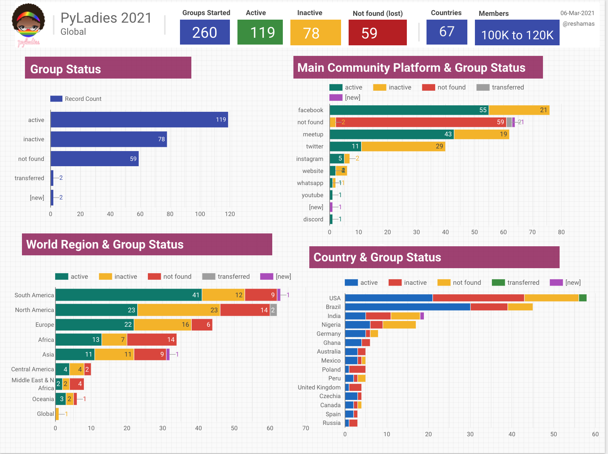
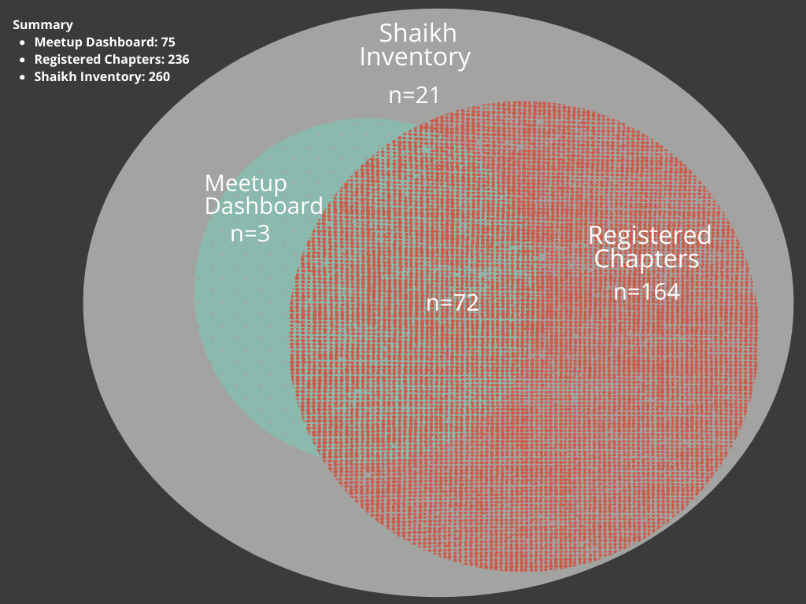

 

## Background
[PyLadies](https://www.pyladies.com/) is a global group that was created to involve more women in the Python open-source community. PyLadies was founded in 2011, with the first chapter being established in Los Angeles in April of that year. There is more background available in the [PyLadies Wikipedia page](https://en.wikipedia.org/wiki/PyLadies).

PyLadies is a trademark and falls under the legal administration of the [Python Software Foundation](https://www.python.org/psf-landing/) (PSF).

2021 is the **10-YEAR Anniversary** of PyLadies!

This article explores the current state of PyLadies, specifically data around chapters, locations and members.  

## Summary
Here is a summary of various platforms in use by PyLadies and the related numbers of followers, updated 06-Mar-2021.

| Platform                                                                                      | Followers |
|-----------------------------------------------------------------------------------------------|-----------|
| Slack: [slackin.pyladies.com](https://slackin.pyladies.com)                                   | 6473      |
| Twitter: [@pyladies](https://twitter.com/pyladies?lang=en)                                    | 14.4K     |
| YouTube: [pyladies](https://www.youtube.com/channel/UCs0-1JQdb1YkVxN4hnNKsNQ)                 | 245       |
| Facebook: [PyLadies](https://www.facebook.com/pyladies/)                                      | 3995      |
| LinkedIn page: [PyLadies Global](https://www.linkedin.com/company/pyladies-global/)           | 486       |
| LinkedIn group: [PyLadies](https://www.linkedin.com/groups/3984711/)                          | 1050      |
| Instagram: [@pyladies_global](https://www.instagram.com/pyladies_global/?hl=en)               | 742       |
| Meetup Dashboard: [Chapters](https://nyc-pyladies.github.io/pyladies-dashboard/pyladies.html) | 77        |
| GitHub:  [@pyladies](https://github.com/pyladies)                                             | NA        |
| Website:  [pyladies.com](https://pyladies.com/)                                               | NA        |
| [linktree](https://linktr.ee/pyladies)                                          | NA        |

## Data Sources
The analysis in this article uses three primary sources of data:  
1. [PyLadies Meetup Dashboard](https://nyc-pyladies.github.io/pyladies-dashboard/pyladies.html)
1. PyLadies Registered Chapters Email List:  this is an official list provided by PyLadies of all chapters ever registered. 
1. PyLadies Inventory:  this is a list compiled by Reshama Shaikh using internet searches of various social media platforms.  This is a manual method.

| Source                       | Records | [-remove duplicates] | Result | Members |
|------------------------------|---------|----------------------|--------|---------|
| [PyLadies Meetup Dashboard](https://nyc-pyladies.github.io/pyladies-dashboard/pyladies.html)            | 77      | -2                   | 75     | ~58,300
| PyLadies Registered Chapters | 243     |  -7                   | 236    | ?
| Reshama Shaikh Inventory     | 260     |                      | 260    | ~100,000 to 120,000
|     |    |                      |    |

A total of **260 chapters** have been identified. 

This Venn diagram shows how many records are in each data source.   

 

[Note a] These groups are in the Meetup Dashboard, but not registered with PyLadies:  
1. Perth, Australia (inactive)
1. Arlington, Texas (inactive)
1. Sunnyvale, California (active)

[Note b] There are 21 other chapters that have a social media presence (such as Facebook groups or Twitter accounts), but are not registered with PyLadies.

## Overall Chapter Summary
| Metric            | Count                          |
|-------------------|--------------------------------|
| Chapters Total    | 260                            |
| Chapters Active   | 119                            |
| Chapters Inactive/Other | 141                            |
| Members           | 100,000 to 120,000 (estimated) |
| | |

### What is the status of these chapters?
Chapters are considered "active" if they have some activity on one of their social media platforms in the past year.  
This is the breakdown of status:  
- active:    119
- inactive:   78
- not found:  59
- "new":       2
- transferred: 2

<iframe id="igraph" scrolling="no" style="border:none;" seamless="seamless" src="https://reshamas.github.io/assets/images/pyladies2021/1_status.html" height="500" width="1000">
</iframe>

## What is the breakdown by region?
Summary:  
- South America has the most active chapters (n=41)
- North America and Europe have similar number of active chapters (n=23, n=22)
- North America has the most number of inactive chapters (n=23)
- 

<iframe id="igraph" scrolling="no" style="border:none;" seamless="seamless" src="https://reshamas.github.io/assets/images/pyladies2021/2_region.html" height="500" width="1000">
</iframe>

## How many countries are represented and What is the breakdown by country?
62 countries have a PyLadies chapter.  The top 5 countries with the most active chapters are:  
1. Brazil: 30
1. United States: 21
1. Nigeria: 6
1. India: 5
1. Germany: 5

<iframe id="igraph" scrolling="no" style="border:none;" seamless="seamless" src="https://reshamas.github.io/assets/images/pyladies2021/3_country.html" height="500" width="1000">
</iframe>

## What are the main platforms used for community building?
The majority of chapters use:  
1. Facebook (preferred by Brazil)
1. Meetup (preferred by USA)

<iframe id="igraph" scrolling="no" style="border:none;" seamless="seamless" src="https://reshamas.github.io/assets/images/pyladies2021/4_platform.html" height="500" width="1000">
</iframe>

## What is the estimated membership, by country?
Note:  While Brazil has the highest count, these statistic include the country-level chapter of "Brazil" which has almost 10000 members.  They would be double-counted with the Brazil city-level chapters. The total count of meetup members and social media followers is 117,000. Because of the country-level chapters and possible double-counting, the total number of PyLadies is estimated to be between 100,000 and 120,000.  

<iframe id="igraph" scrolling="no" style="border:none;" seamless="seamless" src="https://reshamas.github.io/assets/images/pyladies2021/6_members.html" height="500" width="1000">
</iframe>

## Resources to Identify Chapters
The following platforms were researched to discover existence of PyLadies chapters:  
- [Meetup Dashboard](https://nyc-pyladies.github.io/pyladies-dashboard/pyladies.html)
- PyLadies homepage of [locations](https://www.pyladies.com/locations/)
- [Twitter list of PyLadies chapters](https://twitter.com/i/lists/218154359)
- [Brazil chapter list](http://brasil.pyladies.com/locations/)
- [Czechia chapter list](https://pyladies.cz)
- [PyLadies Slack](http://slackin.pyladies.com): announcements of new chapters
- Search "pyladies" on Facebook
- Search "pyladies" on Twitter
- Search "pyladies" on Instagram
- Search "pyladies" on LinkedIn
- Search "pyladies" on YouTube
- Search pyladies chapters on Google
- Indirect searches for one chapter led to findings of other chapters

## Platforms
PyLadies groups around the world use various platforms to organize and communicate.  These are some of the platforms:  
- Meetup
- Facebook
- PyLadies website
- non-PyLadies website
- Twitter
- Instagram
- PyLadies Global Slack
- individual chapter Slack
- WhatsApp
- YouTube
- LinkedIn
- Google Groups
- Telegram
- Eventbrite
- GitHub
- Discord

## Country-level Chapters
The following countries have opened a chapter at the "country-level":  
Argentina, Australia, Brazil, Czechia, Ghana, India, Indonesia, Morocco, Nigeria, Peru, Poland, Sierra Leone, Spain, Turkey.

## PyLadies History of Growth  
PyLadies communities has opened more chapters than other community in that space, and they are most broadly represented in the world.  There are also many chapters which are non-active.  

Some chapters were dissolved, or rolled into other communities such as:  Django Girls, Girl Develop It, general Python meetup groups, PyData meetup groups.

## Observations
A number of meetup groups closed this year.  For that reason, members in those chapters are no longer counted as PyLadies members.

## Start a New PyLadies Chapter
To start a new chapter:  
1. Join the [PyLadies Global Slack](http://slackin.pyladies.com)  
2. Read through the [PyLadies Kit](http://kit.pyladies.com/en/latest/)

If you have any questions, you can inquire on the PyLadies Slack.  

## About the Author
Reshama Shaikh has been an organizer for the New York City chapter for the past 4 years.  She is a statistician who enjoys exploring data, creating data visualizations, and working with Python and plotly.  

## Tools
- Data was analyzed from csv files using Python and pandas 
- Plots were created using Python plotly
- Some plots were created using Google Data Studio
- [Markdown tables generator](https://www.tablesgenerator.com/markdown_tables)

## References
- [The Hidden Depth of PyLadies](https://reshamas.github.io/the-hidden-depth-of-pyladies/), July 2020
- [Overview of PyLadies Chapters](https://prith13.github.io/posts/2018/11/pyladies-overview/), November 2018 
- [PyLadies Handbook Documentation](https://buildmedia.readthedocs.org/media/pdf/pyladies-kit/latest/pyladies-kit.pdf)
- [pyladies/global-organizing](https://github.com/pyladies/global-organizing)
- [Why Women Are Flourishing In R Community But Lagging In Python](https://reshamas.github.io/why-women-are-flourishing-in-r-community-but-lagging-in-python/)
- [Presenting PyLadies Dashboard](https://reshamas.github.io/presenting-pyladies-dashboard/)
- [List of Brazil Chapters](https://brasil.pyladies.com/)
