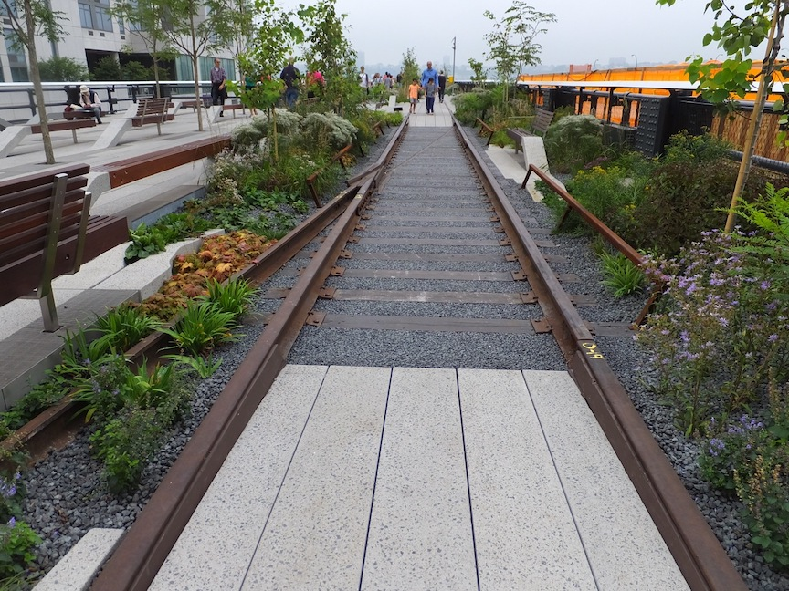
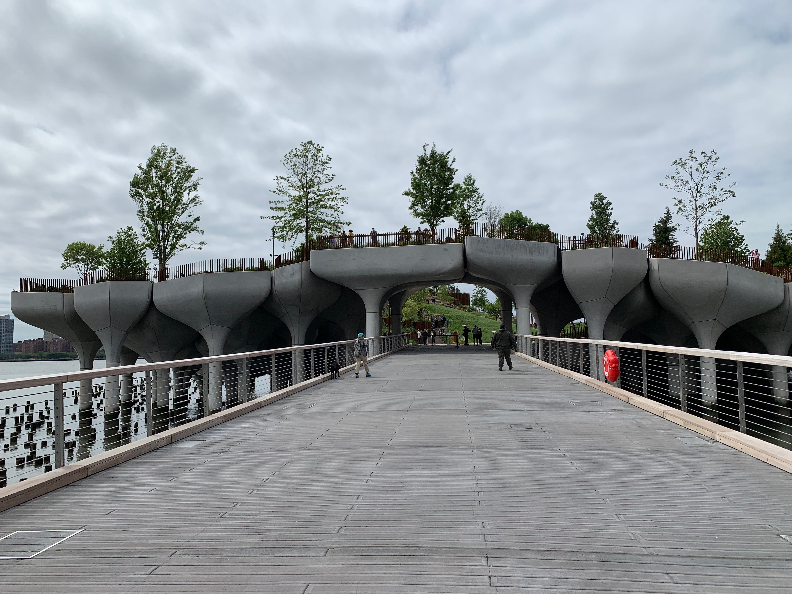

 

# Where To Go When Visiting New York City
As a resident of New York City, I am often asked what places I would recommend to visitors. Here is a list of my favorites.

There are the well-known tourist attractions which I will not delve into too deeply, as they are available in most tour guides. Examples include: Times Square, Empire State Building, Central Park, etc. 

Coming up is a list of favorite places in NYC of mine and my friends.

## Outdoors

### [The High Line](https://www.thehighline.org/)
<figure>
  
 <figcaption>
 Photo credit: <a href="https://twitter.com/reshamas">@reshamas</a>
 </figcaption>
</figure>

- park, ~1.5 miles (2.5km)
- free
- the park runs from Gansevoort Street – three blocks below 14th Street – through Chelsea to the northern edge of the West Side Yard on 34th Street near the Javits Center.

#### [About the High Line](https://en.wikipedia.org/wiki/High_Line)
The High Line is an elevated linear park, greenway and rail trail created on a former New York Central Railroad spur on the west side of Manhattan in New York City. Since opening in June 2009, the High Line has become an icon of contemporary landscape architecture.

### [The High Bridge Acqueduct](https://aqueduct.org/high-bridge)
<figure>
  
 <figcaption>
 Photo credit: <a href="https://twitter.com/reshamas">@reshamas</a>
 </figcaption>
</figure>

- park
- free
- Location:  Bronx, Entry to the bridge is at street level from Bronx Highbridge Park, located at W. 170th St. and University Ave. (Martin Luther King, Jr. Blvd.) and nearby streets. The Aqueduct lies beneath this small park.

 
#### About the High Bridge
The High Bridge, famed centerpiece of the Old Croton Aqueduct, carried Croton water across the Harlem River from the mainland to Manhattan in pipes still beneath its deck. A civic destination and public space and now New York City’s oldest bridge, it has never had vehicular traffic and never will.

### [The Vessel](https://www.hudsonyardsnewyork.com/discover/vessel)

<figure>
  
 <figcaption>
 Photo credit: <a href="https://twitter.com/reshamas">@reshamas</a>
 </figcaption>
</figure>

- free with reservations
- at Hudson Yards

#### About the [Vessel](https://www.hudsonyardsnewyork.com/discover/vessel)
The extraordinary centerpiece of Hudson Yards is its spiral staircase, a soaring new landmark. This interactive artwork was imagined by Thomas Heatherwick and Heatherwick Studio as a focal point where people can enjoy new perspectives of the city and one another from different heights, angles and vantage points.

Comprised of 154 intricately interconnecting flights of stairs -- almost 2,500 individual steps and 80 landings -- the vertical climb offers remarkable views of the city, the river and beyond.

### [The Edge](https://www.edgenyc.com/en)
>Edge is the highest outdoor sky deck in the Western Hemisphere located at 30 Hudson Yards, with a one-of-a-kind design. It’s suspended in mid-air, giving you the feeling of floating in the sky with 360-degree views you can’t get anywhere else.

### [Central Park Conservatory Garden](https://www.centralpark.com/things-to-do/attractions/conservatory-garden/)
- 5th Ave, 105th St
- Free

---

## The Water

### [Staten Island Ferry](https://www.siferry.com)

### [Architecture Boat Tour Around Manhattan](https://fareharbor.com/embeds/book/sail-nyc/items/25950/calendar/2019/06/?asn=aia&full-items=yes)

### [Roosevelt Island](http://rioc.ny.gov/339/Transportation)

### [Statue of Liberty & Ellis Island](https://www.statueofliberty.org/ellis-island/)

### [Governor's Island](https://www.govisland.com)
- free entrance
- take ferry, cost is subway ride

### [Brooklyn Bridge](https://www1.nyc.gov/html/dot/html/infrastructure/brooklyn-bridge.shtml)

<figure>
  
 <figcaption>
 Photo credit: <a href="https://twitter.com/reshamas">@reshamas</a>
 </figcaption>
</figure>

### [Little Island](https://littleisland.org/) 

<figure>
  
 <figcaption>
 Photo credit: <a href="https://twitter.com/reshamas">@reshamas</a>
 </figcaption>
</figure>

- free
- Pier55 in Hudson River Park @ West 13th Street, New York NY 10014

---

## Performing Arts

### Lincoln Center

### Carnegie Hall

### Comedy Cellar

---

## Food Shopping

### [Sahadi's](https://sahadis.com/)
<figure>
  
 <figcaption>
 Photo credit: <a href="https://twitter.com/reshamas">@reshamas</a>
 </figcaption>
</figure>

- Brooklyn
 
#### About Sahadi's
Originally from Lebanon, the family first established Sahadi’s in Manhattan’s “Little Syria” in 1895.  Sahadi’s is an old-world place where you can discover new tastes. The fridge cases offers specialty cheeses from around the world, smoked fish, pâtés & more. The deli and bakery are where to find prepared foods, like our legendary hummus, tabbouleh, kibbeh, kebabs — around 30 dishes are prepared daily and change seasonally.

---

## Museums

### [The Cloisters](https://www.metmuseum.org/visit/plan-your-visit/met-cloisters)
By Subway/Bus
Take the A train to 190th Street and exit the station by elevator. Walk north along Margaret Corbin Drive for approximately ten minutes or transfer to the M4 bus and ride north one stop. If you are coming from the Museum's Main Building, you may also take the M4 bus directly from Madison Avenue/83rd Street to the last stop. (Please allow more time for this option.)

### [Guggenheim Museum](https://www.guggenheim.org/)
- 5th Ave, 89th St

### [Basilica of St. Patrick’s Old Cathedral: historic cemetery and underground catacombs](https://oldcathedral.org/cemetery)

>For over 200 years, the grounds of the Basilica of St. Patrick’s Old Cathedral have been used as thefinal resting place for the faithful departed. The Basilica’s historic cemetery and underground catacombs have been a silent witness to the many struggles and accomplishments of prominent New York Catholics. It is where bishops rest beside noteworthy New Yorkers who have played important roles in New York, American, and Catholic history. Due to the lack of space, this practice was suspended. 

### [The Morgan Library and Museum](https://www.themorgan.org)

<figure>
  
 <figcaption>
 Photo credit: <a href="https://twitter.com/NoemiDerzsy">@NoemiDerzsy</a>
 </figcaption>
</figure>

- The [Morgan Library & Museum](https://www.newyorkjourney.com/attractions-the-morgan-library-museum.htm) was established in New York City by J.P. Morgan, a prominent businessman and philanthropist. This complex includes an extensive permanent collection of rare books, drawings and printed materials dating back to ancient times. Most of the items on display are derived from Morgan's private collection that was acquired through auctions and other exclusive transactions.

### [The Frick Collection](https://www.newyorkjourney.com/attractions-the-morgan-library-museum.htm)

### [The Neue Galerie](https://www.neuegalerie.org)

### [Trinity Place](https://www.trinityplacenyc.com)
>A Restaurant & Bar built inside a turn of the century wall street Bank vault commissioned by none other than Andrew Carnegie, advertised as the worlds largest and strongest bank vault in the world in 1904 now a place for social gatherings where a modern American restaurant meets old world splendor.

### NY Stock Exchange: [The Wall Street Experience](https://www.thewallstreetexperience.com/blog/experience-the-nyse/#0)
>Despite the new security measures, there are still many ways to experience the New York Stock Exchange without going inside. So there is no need to feel left out!

### [Federal Reserve](https://www.newyorkfed.org/aboutthefed/visiting)

## Queens

### Flushing Main Street: The Other Chinatown

### [Queens Night Market](http://queensnightmarket.com)
- 7 train to 111 St.
- Every Saturday at 4pm

---
## Food

<blockquote class="twitter-tweet">
A running list of new restaurants that opened in NYC, June 2021.  🍔🌮🍤🍜🥙<a href="https://t.co/r9HBWwr0e7">https://t.co/r9HBWwr0e7</a>
&mdash; Reshama Shaikh (@reshamas) <a href="https://twitter.com/reshamas/status/1403519783023349760?ref_src=twsrc%5Etfw">June 12, 2021</a></blockquote> 

## Recommendations

<blockquote class="twitter-tweet">
See our guide to exploring three Lower Manhattan neighborhoods this summer, before the tourists and Wall Streeters return. <a href="https://t.co/sguMSbSEOL">https://t.co/sguMSbSEOL</a>
&mdash; The New York Times (@nytimes) <a href="https://twitter.com/nytimes/status/1418934082629734403?ref_src=twsrc%5Etfw">July 24, 2021</a></blockquote> 

---

## Closed

### [Upright Citizen's Brigade](https://newyork.ucbtrainingcenter.com)

- [Comedy Community Mourns The 'End Of An Era' As UCB Closes New York Locations](https://www.npr.org/2020/04/27/845081522/comedy-community-mourns-the-end-of-an-era-as-ucb-closes-new-york-locations) (April 20202)

---

## Acknowledgments
- [Noemy Derzsy](https://twitter.com/NoemiDerzsy)

