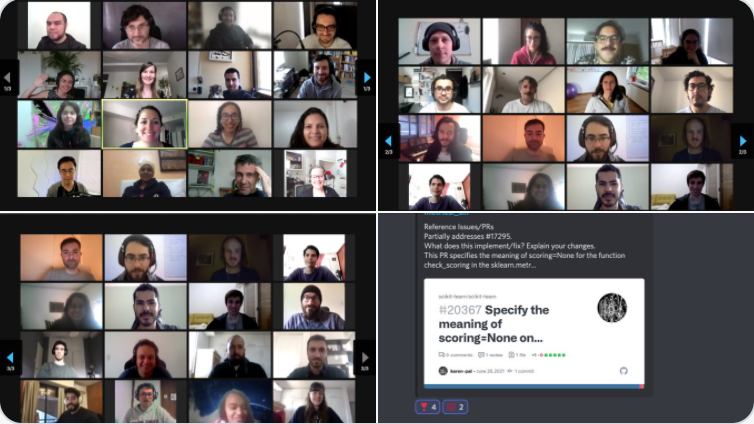
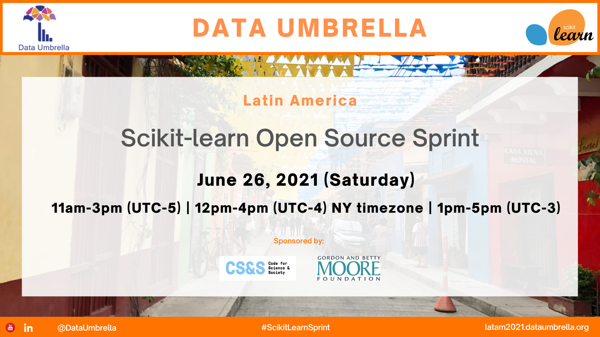
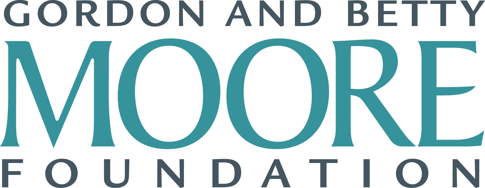
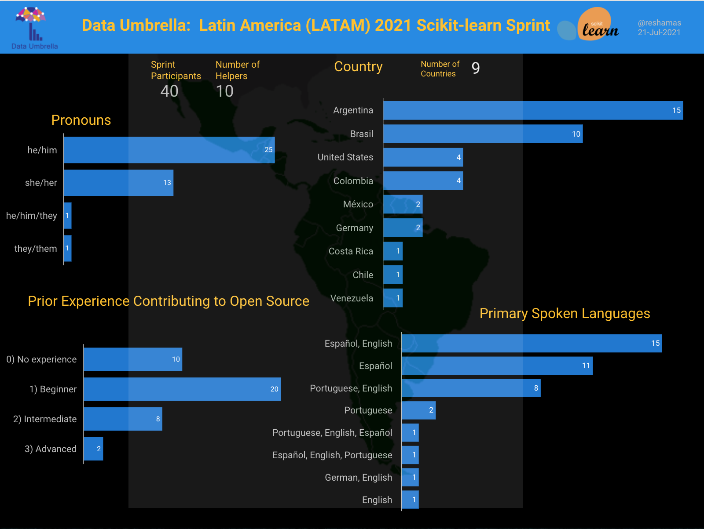
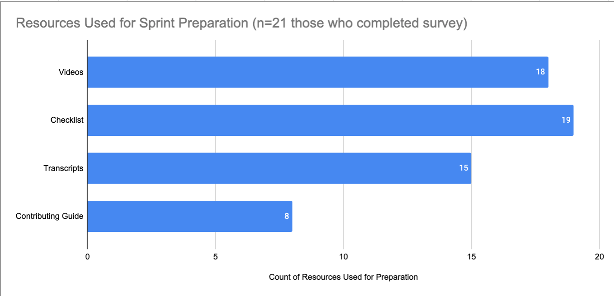
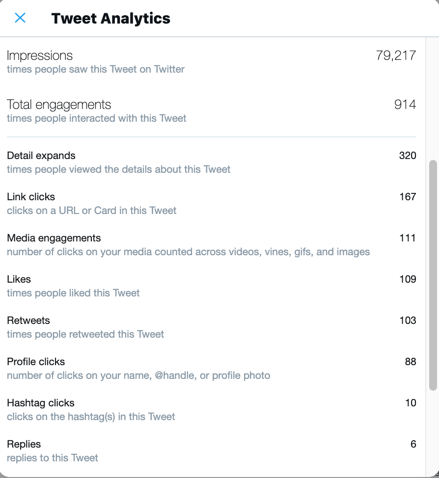
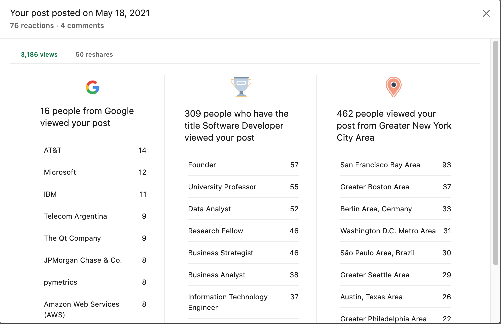
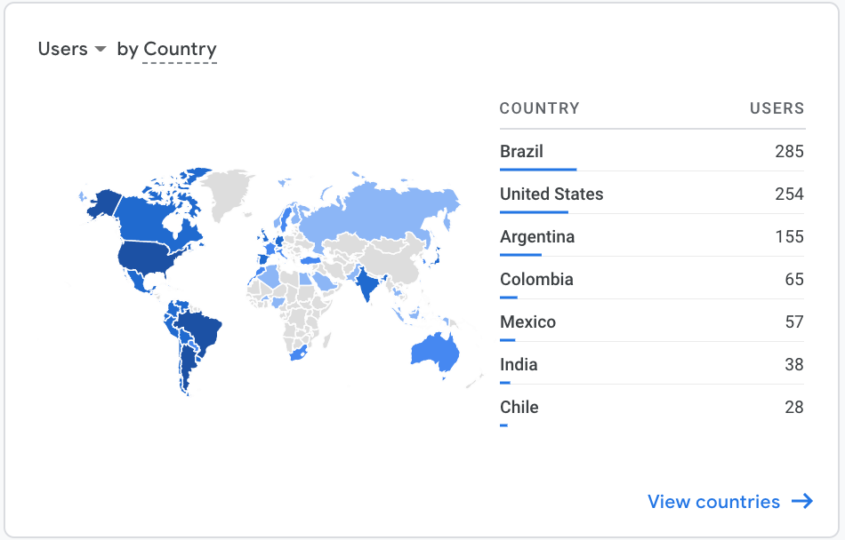
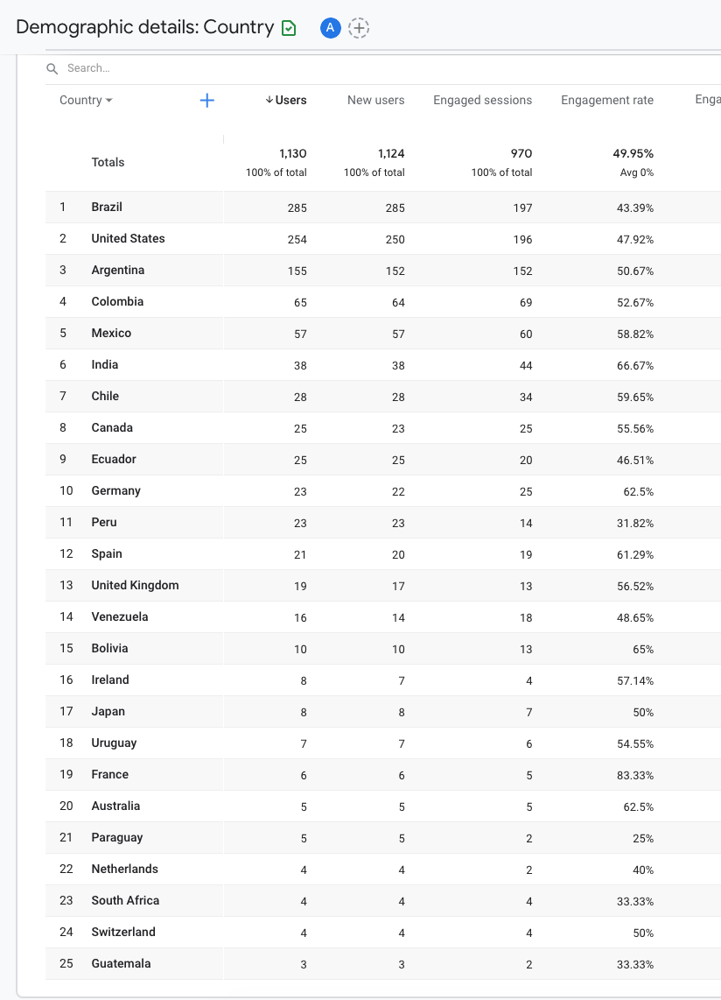
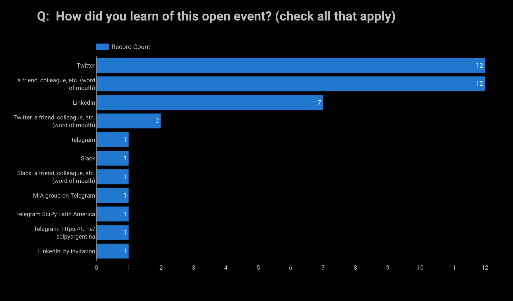

   

## Sprint Background
This "sprint" is a hands-on hackathon where participants learn to contribute to scikit-learn, a widely-used Python open source, machine learning library.

This sprint was organized by [Data Umbrella](https://www.dataumbrella.org) to increase the participation of underrepresented persons in data science, with a focus on the geographic region of Latin America (LATAM).  

This report focuses on the summary, impact and lessons learned of the Data Umbrella LATAM scikit-learn sprint.  

## Event Sponsor
This event was funded in part by a grant from [Code for Science & Society](https://eventfund.codeforscience.org/), made possible by grant number [GBMF8449](https://www.moore.org/grant-detail?grantId=GBMF8449) from the [Gordon and Betty Moore Foundation](https://www.moore.org/).

   
  
   
   

## Continued Contribution to Open Source
This sprint was a 4-hour block of time with pre- and post-sprint work required.

Participants were encouraged to keep contributing to scikit-learn or other Python libraries, using the skills learned in this event.

## Sprint Agenda
- 19-Jun-2021:  Pre-sprint Kickoff (11am - 1pm) (UTC-5)
- 26-Jun-2021:  Sprint  (11am to 3pm) (UTC-5) 
- 10-Jul-2021:  Sprint Follow-up Office Hours (11am to 12pm) (UTC-5)

Note: UTC-5 = São Paulo, Brazil Time  

### Sprint Day
The sprint officially ran 4 hours, which is limited time to submit a PR.  The participants continued to work on their sprint PRs throughout the weekend.

### Follow-up Office Hours
Office hours were set up 2 weeks after the sprint where some of the scikit-learn core contributors were available to answer questions on open PRs.  

## Demographics

 

A total of 40 contributors attended the sprint. 13 of 40 (32.5%) identified as she/her.  25 of 40 (62.5%) identified as he/him. 2 of 40 (5%) identified as "they".

Contributors joined from 9 different countries.  Country information was provided based on where participants were joining from. Argentina and Brasil had the most participants, for a total of 25 of 40, almost 63%.

Other Latin American countries represented include: Colombia, México, Costa Rica, Chile and Venezuela.

These other countries were also represented in terms of contributor background: United States and Germany.  

There was one invited contributor who joined from Germany.  Invited contributors were those who participated in a prior sprint and have continued contributing to scikit-learn.  

There were two returning contributors, participants who had previously participated in a scikit-learn open source sprint.  The invited and returning contributors were paired with a new contributor.  

### Applications Received
The countries in the Latin America region with the most *applicants* are:  
- Brasil: 36
- Argentina: 26
- Colombia: 11
- Venezuela:  9
- México:  5
- Péru: 3
- Ecuador: 3
- Chile: 2
- Bolivia: 1
- Costa Rica: 1
- Guatemala: 1

Applications from regions outside of Latin America include:  
- United States: 10
- India: 7
- Canada: 2
- Germany: 2 
- Spain: 2

Other countries with one application each: Australia, Greece, Poland, Romania, Saudi Arabia, United Kingdom.

### Spoken Languages
The sprint was in English with translators available to translate into Spanish and Portuguese.  Languages spoken by participants included:  Spanish, Portuguese, English, and German. 

### Open Source Background
75% of participants identified as having "none" or "beginner" level experience in contributing to open source.

### Number of Participants
- Pre-sprint event:  ~ 29
- Sprint:  ~ 40
- Post-sprint event:  12

## Impact Report for Data Umbrella Scikit-learn Sprint

|                                       | Sprint 2021    |
|---------------------------------------|----------------|
| Report date                           | 20-Jul-2021    |
| Report author                          | Reshama Shaikh   |
| Sprint date                           | 26-Jun-2021    |
| Location                              | Online; Latin America (LATAM)         |
| Sprint website | [latam2021.dataumbrella.org](https://latam2021.dataumbrella.org) |
| Twitter | [Moment](https://twitter.com/i/events/1409666048144596996) |
| Open source library                   | [scikit-learn](https://github.com/scikit-learn/scikit-learn) |  
| GitHub repository link                | [data-umbrella/data-umbrella-scikit-learn-sprint](https://github.com/data-umbrella/data-umbrella-scikit-learn-sprint)| |
| Lead Organizer      | [Reshama Shaikh](https://twitter.com/reshamas)     |
| Assistant Organizers      | Mariam Haji, Cristina Mulas Lopez, Sara El-Ateif |
| Lead Facilitator    | [Andreas Mueller](https://twitter.com/amuellerml) |
| Mentors / Translations | Melissa Weber Mendonça, Cristián Maureira-Fredes, Michael Eickenberg, Bruno Goncalves  |  
| Scikit-learn core contributors    | Thomas Fan, Adrin Jalali, Guillaume LeMaitre  |  
| Teaching Assistants  | None |
| Platforms            | Discord & Zoom |
| Sponsor: | Grant [GBMF8449](https://www.moore.org/grant-detail?grantId=GBMF8449) from [Gordon and Betty Moore Foundation](https://www.moore.org) & [Code for Science and Society](https://eventfund.codeforscience.org)   |
|            |                |
| PULL REQUESTS **(PRs)**                 |          |
| PRs [MRG] at sprint            | 10             |
| PRs [MRG] post-sprint            | 50+             |
| PRs open                    | 10+        |
|                                    |          |
| Attendees:  Initial Registrations  | ~55       |
| Attendees:  Participated           | ~40     |
| Attendee List                      | [Sprint Contributors](https://latam2021.dataumbrella.org/contributors)   |
|                                    |          |
| Post-sprint Survey                 | [survey form] (closed) 
| Blog 1: English              | [Data Umbrella Sprint - My Experience](https://sebastiandres.github.io/blog/sprint-data-umbrella-eng/) Sebastian Andres |
| Blog 2: Spanish              | [Experiencias del Sprint de Data Umbrella](https://sebastiandres.github.io/blog/sprint-data-umbrella/) Sebastian Andres |

## Resources for Contributing to scikit-learn 
Because this was a virtual event and there is a limited capacity for being online for a full 8-hour day, a checklist was provided so folks could do preparation work at their own pace prior to the sprint.  [Resources for Prep Work](https://latam2021.dataumbrella.org/about/prep-work) are available on the sprint website.

A [Checklist](https://docs.google.com/document/d/1QknhXDJ4qtP8Co2SfqaPGaZ8J5grsMq08onxTXVvAFU/edit?usp=sharing) with highlighted notes to indicate updates from videos was also included.

This visualization shows which resources were used for sprint preparation.  Note that n=21, which represents those participants who completed the feedback survey.

  

      

## Impact

### Non-measurable Impact
Aside from the number of PRs that were merged, there is non-quantifiable impact of the open source sprint. Some examples include:
- learning to set up virtual environment
- using Git (fork, clone, branch, fetching another's PR)
- introduction to tests such as:  flake8 (linting, formatting), pytest, "continuous integration"
- navigating through the codebase structure of scikit-learn
- digging into functions, learning about errors
- learning about unit tests
- interacting with contributors on GitHub
- learning, in general
- networking
- building confidence (making a dent in "imposter syndrome")
- having fun

## Event Outreach
Sprint outreach can be considered an impact.  Even if folks do not attend or apply, the sprint outreach brings more visibility and interest to the project.

This [LATAM sprint tweet](https://twitter.com/DataUmbrella/status/1394661734275821573)
 had ~80K+ impressions and 160+ link clicks:

  

  

This [LATAM LinkedIn post](https://www.linkedin.com/feed/update/urn:li:activity:6800434144624070656/)
 had 3200 impressions and 50 reshares:

  

Google Analytics shows the reach of our marketing efforts:  

  

  

  

## Challenges

### Outreach
Outreach was resource intensive. The communities exist, and it takes intensive networking and meetings to find communities, the community leaders and the platforms to reach potential sprint participants.

For those who attended the sprint, this is how they learned of the event. The main avenues were Twitter, LinkedIn and their network ("word of mouth").

  

### Videos
The videos that were created can be quickly outdated compared to static print. Videos are more accessible, but also take more effort to create.

Some of the video content created is outdated.  A few of the following items need to be updated:  
- branch on GitHub repo changed from `master` to `main` in January 2021
- instructions for setting up virtual environment has been updated in the past year

### Language Translations
Responses to the sprint outreach were initially low.  The website and social media announcements were translated into Spanish and Portuguese.  Also, a number of other resources were translated, including video transcripts and feedback surveys.

We had translators at all 3 events: pre-sprint, sprint, post-sprint.

It's challenging and resource intensive to provide translations in 3 different languages.

## Adjustments for Next Sprint

### Collecting Names
Important to have an optional field for "Middle Name" in addition to "First Name" and "Last Name" in the application form for Latin America region.

### Visual Studio Code
Explore live pair programming tools.

### #DataUmbrella Hashtag 
Reminder to sprint participants to include this hashtag #DataUmbrella on their pull requests so we can track them.

### Videos    
Videos are outdated. Consider if it is helpful to include them in the pre-work.

## Sprint Feedback

Feedback has been shared a number of ways:  
- Twitter [Moment](https://twitter.com/i/events/1409666048144596996)
- Blogs (* none yet* )
- Sprint survey
- Social media (LinkedIn)
- Casually, in conversation during the sprint, pre-sprint and post-sprint events

## Data Umbrella Feedback Survey
Data Umbrella received 21 responses to our internal sprint survey. (21/40 = 52.5% response rate).

Respondents rated their overall sprint experience highly favorably and had a positive experience working with their pair programming partner.  

### Language
The survey was translated from English to both Spanish and Portuguese.  This is the breakdown in responses received, by language:  
- English: 16
- Spanish: 4
- Portuguese: 1

In response to the question "*What are your favorite parts about the sprint?*"  
- Pull request (PR)
- The pre sprint was very helpful 
- Everything! I was nervous but I could enjoy and learn all the event, was really good to meet everyone in Zoom and working with a partner.
- All, was ok!
- Working on the PR!
- I could work on two issues and meet some interesting people.
- Meeting new people and working in an open source project.
- The mentors that were ready to answer our questions, made me feel really secure about contributing
- Support from organizers and contributors. Engangement of the newbies. Overall networking.
- I liked the whole process,  I can see the effort in the organization.
- Being able to be in touch with an open source project and realizing how I can contribute to it, even with limited coding skills.
- Discord time
- Nothing to comment about it, all was fine.

#### Some general feedback in the survey:  

>"I think the difficulty of contributing to open source is two-fold: 
(1) the tools: are not straightforward - `git`, `pytest`, etc. 
(2) the knowledge: is very specific.

>Maybe the preparation for the sprint could split the preparation into this steps. With github actions, learning the tools can be even easier."

>I loved that. It has been my first experience in contributing with open source.

>Overall the sprint was a good experience, the one slight "issue" I had was with the prework. I stressed a bit trying to get it all done before the deadline, but that didn't end up being important. It definitely was useful, though, I just happened to have a very busy week at work while preparing.

>I was a bit shy to talk at the end of the event. I am really thankful to all the organizers. I am a great fan of sklearn so being able to participate was fantastic. Also, a great opportunity to learn in general and to learn how to contribute. Now I will continue contributing, but this was not something I thought I could do before, the Sprint and the mentors really help me to change my mind. The videos and documentation we had to read before the sprint were very useful. 

>It was a really nice experience. I felt supported by the mentors and my partner, the code was appropriate. It's a great place to begin on contribute on open source.

#### Suggestions for Improvement
- A more step-by-step explanation for the "beginner PR" would have speed up things.
- If I had installed all required packages previously. I just installed the development and not the documentation ones.
- Maybe having two shorter separate sessions
- Issue selection and categorization. 
- Probably the way to inform the time of the event, there were some misunderstandings with the time zones
- I didn't have this problem, but I saw many people were waiting on an issue to be merged (that made them loose the momentum) and then they had a few merge conflicts. I think the attendees with the problem should have immeditaly banded together as a team with a few mentors that could guide them and explain them the process, because some confessed to me that they were scared of the merge conflicts and that more advanced git stuff.
- Instructions to test before submitting. For instance: to run `black`, besides `flake8`.
- Having the videos updated
- It would be nice to have an article about free pair programming tools.

### Social Media

## Sprint:  Social Media

<blockquote class="twitter-tweet">
The <a href="https://twitter.com/DataUmbrella?ref_src=twsrc%5Etfw">@DataUmbrella</a> Latin America (LATAM) <a href="https://twitter.com/hashtag/ScikitLearnSprint?src=hash&amp;ref_src=twsrc%5Etfw">#ScikitLearnSprint</a> has kicked off!<a href="https://twitter.com/hashtag/python?src=hash&amp;ref_src=twsrc%5Etfw">#python</a> <a href="https://twitter.com/hashtag/datascience?src=hash&amp;ref_src=twsrc%5Etfw">#datascience</a> <a href="https://twitter.com/hashtag/oss?src=hash&amp;ref_src=twsrc%5Etfw">#oss</a> <a href="https://twitter.com/hashtag/machinelearning?src=hash&amp;ref_src=twsrc%5Etfw">#machinelearning</a>  With a great turnout.  First PR (#20367) has been submitted! <a href="https://t.co/opJdHtLXT7">pic.twitter.com/opJdHtLXT7</a>
&mdash; Reshama Shaikh (@reshamas) <a href="https://twitter.com/reshamas/status/1408841488482590721?ref_src=twsrc%5Etfw">June 26, 2021</a></blockquote> 

### Sofi 
<blockquote class="twitter-tweet">
Yeey tengo commits en el repo de sklearn!! ❤️  Acaban de mergear el PR que hicimos con <a href="https://twitter.com/DrGleeks?ref_src=twsrc%5Etfw">@DrGleeks</a> en el <a href="https://twitter.com/hashtag/ScikitLearnSprint?src=hash&amp;ref_src=twsrc%5Etfw">#ScikitLearnSprint</a>  🙌🏼   Mil gracias <a href="https://twitter.com/DataUmbrella?ref_src=twsrc%5Etfw">@DataUmbrella</a> por organizar el evento, estuvo muy bueno! <a href="https://t.co/WM7hvnMkqE">pic.twitter.com/WM7hvnMkqE</a>
&mdash; Sofi Denner (@sofide_) <a href="https://twitter.com/sofide_/status/1409594659429662720?ref_src=twsrc%5Etfw">June 28, 2021</a></blockquote> 

### Anavelyz
<blockquote class="twitter-tweet">
Alguien: Y... ¿qué es el open source?  Yo: Es la posibilidad de sumar y convertir pequeñas líneas de código en un proyecto fuerte que cambia constantemente para mejor...  ¡Gracias <a href="https://twitter.com/DataUmbrella?ref_src=twsrc%5Etfw">@DataUmbrella</a> y <a href="https://twitter.com/scikit_learn?ref_src=twsrc%5Etfw">@scikit_learn</a> por hacer posible nuestro primer Pull requests!<a href="https://twitter.com/hashtag/ScikitLearnSprint?src=hash&amp;ref_src=twsrc%5Etfw">#ScikitLearnSprint</a> <a href="https://t.co/mf8XDURzP5">pic.twitter.com/mf8XDURzP5</a>
&mdash; Anavelyz Perez (@AnavelyzJPR) <a href="https://twitter.com/AnavelyzJPR/status/1408969933149585408?ref_src=twsrc%5Etfw">June 27, 2021</a></blockquote> 

### Cristina 
<blockquote class="twitter-tweet">
Second <a href="https://twitter.com/hashtag/ScikitLearnSprint?src=hash&amp;ref_src=twsrc%5Etfw">#ScikitLearnSprint</a> done. Happy to be part of this family! <a href="https://twitter.com/hashtag/dataumbrella?src=hash&amp;ref_src=twsrc%5Etfw">#dataumbrella</a> <a href="https://twitter.com/hashtag/opensource?src=hash&amp;ref_src=twsrc%5Etfw">#opensource</a> <a href="https://t.co/rePO07cSSK">https://t.co/rePO07cSSK</a>
&mdash; CristinaMulas (@MulasCristina) <a href="https://twitter.com/MulasCristina/status/1408925138448535557?ref_src=twsrc%5Etfw">June 26, 2021</a></blockquote> 

### Jenn
<blockquote class="twitter-tweet">
Learning with <a href="https://twitter.com/DataUmbrella?ref_src=twsrc%5Etfw">@DataUmbrella</a> and <a href="https://twitter.com/hashtag/ScikitLearn?src=hash&amp;ref_src=twsrc%5Etfw">#ScikitLearn</a> about <a href="https://twitter.com/hashtag/machine?src=hash&amp;ref_src=twsrc%5Etfw">#machine</a> <a href="https://twitter.com/hashtag/learning?src=hash&amp;ref_src=twsrc%5Etfw">#learning</a> <a href="https://twitter.com/hashtag/OpenSource?src=hash&amp;ref_src=twsrc%5Etfw">#OpenSource</a> was a great experience! <a href="https://t.co/98wdS2ykgN">https://t.co/98wdS2ykgN</a>
&mdash; Jenn (@j3nnn1) <a href="https://twitter.com/j3nnn1/status/1408903045870665730?ref_src=twsrc%5Etfw">June 26, 2021</a></blockquote> 

### Maren
<blockquote class="twitter-tweet">
So happy to be part of another scikit-learn sprint. I&#39;m having a great time and am learning lots. 🙂👩🏼‍🎓 <a href="https://t.co/581dGmG7jk">https://t.co/581dGmG7jk</a>
&mdash; Maren Westermann (@MarenWestermann) <a href="https://twitter.com/MarenWestermann/status/1408884511195140096?ref_src=twsrc%5Etfw">June 26, 2021</a></blockquote> 

### Kardaver
<blockquote class="twitter-tweet">
yay! 🥳 my first PR merged to <a href="https://twitter.com/scikit_learn?ref_src=twsrc%5Etfw">@scikit_learn</a> , all thanks to <a href="https://twitter.com/hashtag/ScikitLearnSprint?src=hash&amp;ref_src=twsrc%5Etfw">#ScikitLearnSprint</a> organized by <a href="https://twitter.com/DataUmbrella?ref_src=twsrc%5Etfw">@DataUmbrella</a>  Go team LATAM!!!<a href="https://twitter.com/hashtag/python?src=hash&amp;ref_src=twsrc%5Etfw">#python</a> <a href="https://twitter.com/hashtag/datascience?src=hash&amp;ref_src=twsrc%5Etfw">#datascience</a> <a href="https://twitter.com/hashtag/oss?src=hash&amp;ref_src=twsrc%5Etfw">#oss</a> <a href="https://twitter.com/hashtag/machinelearning?src=hash&amp;ref_src=twsrc%5Etfw">#machinelearning</a> <a href="https://t.co/HV9JrA5C6B">pic.twitter.com/HV9JrA5C6B</a>
&mdash; kardaver (@kardaver2) <a href="https://twitter.com/kardaver2/status/1408849671959744514?ref_src=twsrc%5Etfw">June 26, 2021</a></blockquote> 

<blockquote class="twitter-tweet">
and a second PR merged! congrats for such a great event <a href="https://twitter.com/DataUmbrella?ref_src=twsrc%5Etfw">@DataUmbrella</a> Everyone was really helpful and welcoming at <a href="https://twitter.com/hashtag/ScikitLearnSprint?src=hash&amp;ref_src=twsrc%5Etfw">#ScikitLearnSprint</a>. I can totally see myself continuing to contribute to sklearn 🤩 love the community!<a href="https://twitter.com/hashtag/python?src=hash&amp;ref_src=twsrc%5Etfw">#python</a> <a href="https://twitter.com/hashtag/datascience?src=hash&amp;ref_src=twsrc%5Etfw">#datascience</a> <a href="https://twitter.com/hashtag/oss?src=hash&amp;ref_src=twsrc%5Etfw">#oss</a> <a href="https://twitter.com/hashtag/machinelearning?src=hash&amp;ref_src=twsrc%5Etfw">#machinelearning</a> <a href="https://t.co/xWpgReJT2T">pic.twitter.com/xWpgReJT2T</a>
&mdash; kardaver (@kardaver2) <a href="https://twitter.com/kardaver2/status/1408878315675525124?ref_src=twsrc%5Etfw">June 26, 2021</a></blockquote> 

### Andres
<blockquote class="twitter-tweet">
Learning how to <a href="https://twitter.com/hashtag/GivingBack?src=hash&amp;ref_src=twsrc%5Etfw">#GivingBack</a> to <a href="https://twitter.com/hashtag/opensource?src=hash&amp;ref_src=twsrc%5Etfw">#opensource</a> in <a href="https://twitter.com/hashtag/latam?src=hash&amp;ref_src=twsrc%5Etfw">#latam</a> whit <a href="https://twitter.com/DataUmbrella?ref_src=twsrc%5Etfw">@DataUmbrella</a> and <a href="https://twitter.com/scikit_learn?ref_src=twsrc%5Etfw">@scikit_learn</a>  🤓🐍❤<a href="https://twitter.com/hashtag/python?src=hash&amp;ref_src=twsrc%5Etfw">#python</a> <a href="https://twitter.com/hashtag/datascience?src=hash&amp;ref_src=twsrc%5Etfw">#datascience</a> <a href="https://twitter.com/hashtag/oss?src=hash&amp;ref_src=twsrc%5Etfw">#oss</a> <a href="https://twitter.com/hashtag/machinelearning?src=hash&amp;ref_src=twsrc%5Etfw">#machinelearning</a> <a href="https://t.co/FQFORF5zog">https://t.co/FQFORF5zog</a>
&mdash; Andres Rios (@ariosramirez) <a href="https://twitter.com/ariosramirez/status/1408875364701589504?ref_src=twsrc%5Etfw">June 26, 2021</a></blockquote> 

### Sebastian

<blockquote class="twitter-tweet">
¡Llegó el día! Comienza el <a href="https://twitter.com/hashtag/ScikitLearnSprint?src=hash&amp;ref_src=twsrc%5Etfw">#ScikitLearnSprint</a> de <a href="https://twitter.com/DataUmbrella?ref_src=twsrc%5Etfw">@DataUmbrella</a> con foco en Latinoamérica.
&mdash; Sebastian Flores (@sebastiandres) <a href="https://twitter.com/sebastiandres/status/1408817665137905667?ref_src=twsrc%5Etfw">June 26, 2021</a></blockquote> 

<blockquote class="twitter-tweet">
My first PR submitted to <a href="https://twitter.com/scikit_learn?ref_src=twsrc%5Etfw">@scikit_learn</a> during <a href="https://twitter.com/hashtag/ScikitLearnSprint?src=hash&amp;ref_src=twsrc%5Etfw">#ScikitLearnSprint</a> <a href="https://twitter.com/DataUmbrella?ref_src=twsrc%5Etfw">@DataUmbrella</a> :<a href="https://t.co/jdsTRUmCgI">https://t.co/jdsTRUmCgI</a>
&mdash; Sebastian Flores (@sebastiandres) <a href="https://twitter.com/sebastiandres/status/1408860077319196678?ref_src=twsrc%5Etfw">June 26, 2021</a></blockquote> 

### Pablo
<blockquote class="twitter-tweet">
First time at the <a href="https://twitter.com/DataUmbrella?ref_src=twsrc%5Etfw">@DataUmbrella</a> LatAm <a href="https://twitter.com/hashtag/ScikitLearnSprint?src=hash&amp;ref_src=twsrc%5Etfw">#ScikitLearnSprint</a>. <a href="https://t.co/S3hh8uH51B">https://t.co/S3hh8uH51B</a>
&mdash; Pablo Ibieta (@pabloibieta) <a href="https://twitter.com/pabloibieta/status/1408859492058603521?ref_src=twsrc%5Etfw">June 26, 2021</a></blockquote> 

### Mariela

<blockquote class="twitter-tweet">
Empezando el Latin America (LATAM) <a href="https://twitter.com/hashtag/ScikitLearnSprint?src=hash&amp;ref_src=twsrc%5Etfw">#ScikitLearnSprint</a> !!!!  🤓🥳🤓<a href="https://twitter.com/hashtag/Python?src=hash&amp;ref_src=twsrc%5Etfw">#Python</a> <a href="https://twitter.com/hashtag/MachineLearning?src=hash&amp;ref_src=twsrc%5Etfw">#MachineLearning</a> <a href="https://t.co/ZWQgaNyYXm">https://t.co/ZWQgaNyYXm</a>
&mdash; )*.*( (@mariela_rajng) <a href="https://twitter.com/mariela_rajng/status/1408842643736600585?ref_src=twsrc%5Etfw">June 26, 2021</a></blockquote> 

### Ludimila

<blockquote class="twitter-tweet">
Today is my first time contributing to open-source projects and starting contributing to sklearn makes me so happy cause it&#39;s a lib that changed everything in ML, thanks <a href="https://twitter.com/DataUmbrella?ref_src=twsrc%5Etfw">@DataUmbrella</a> for the opportunity <a href="https://twitter.com/hashtag/ScikitLearnSprint?src=hash&amp;ref_src=twsrc%5Etfw">#ScikitLearnSprint</a>
&mdash; Ludimila Carvalho (@ludigoncalves) <a href="https://twitter.com/ludigoncalves/status/1408815690111492099?ref_src=twsrc%5Etfw">June 26, 2021</a></blockquote> 

### JM

<blockquote class="twitter-tweet">
Last time I had some issues with my laptop during the The <a href="https://twitter.com/DataUmbrella?ref_src=twsrc%5Etfw">@DataUmbrella</a> Latin America (LATAM) <a href="https://twitter.com/hashtag/ScikitLearnSprint?src=hash&amp;ref_src=twsrc%5Etfw">#ScikitLearnSprint</a>, but today I&#39;m on about to do my first PR to <a href="https://twitter.com/scikit_learn?ref_src=twsrc%5Etfw">@scikit_learn</a> 🤞but first I&#39;ve to fix all the failing test :P <a href="https://t.co/LE6kpJKqFu">pic.twitter.com/LE6kpJKqFu</a>
&mdash; J. M. Nápoles (@napoles3D) <a href="https://twitter.com/napoles3D/status/1413933539750412288?ref_src=twsrc%5Etfw">July 10, 2021</a></blockquote> 

### Gloria

<iframe src="https://www.linkedin.com/embed/feed/update/urn:li:share:6819656217850347520" height="775" width="504" frameborder="0" allowfullscreen="" title="Embedded post"></iframe>

### Karen

   

---

## Social Media Promotion

### Twitter (English)

<blockquote class="twitter-tweet">
🧵 📣Join us for our <a href="https://twitter.com/hashtag/ScikitLearnSprint?src=hash&amp;ref_src=twsrc%5Etfw">#ScikitLearnSprint</a>  👉🏽with a focus on Latin America (LATAM) 🗓️26-Jun-2021 🕙11am-3pm UTC-5 (CDMX) 12-4pm EDT (NYC) 1-5pm UTC-3 (Sao Paolo) 🏢 Online  Thank you to our sponsors: <a href="https://twitter.com/codeforsociety?ref_src=twsrc%5Etfw">@codeforsociety</a> &amp; <a href="https://twitter.com/MooreFound?ref_src=twsrc%5Etfw">@MooreFound</a>   Details on application: <a href="https://t.co/XkO2ytLKcH">https://t.co/XkO2ytLKcH</a> <a href="https://t.co/M1AWgXupPr">pic.twitter.com/M1AWgXupPr</a>
&mdash; Data Umbrella (@DataUmbrella) <a href="https://twitter.com/DataUmbrella/status/1394661734275821573?ref_src=twsrc%5Etfw">May 18, 2021</a></blockquote> 

### Twitter (Spanish)

<blockquote class="twitter-tweet">
🎉Únete a <a href="https://twitter.com/hashtag/ScikitLearnSprint?src=hash&amp;ref_src=twsrc%5Etfw">#ScikitLearnSprint</a>  👉América Latina (LATAM) 📆26-Jun-2021 ⏰11am-3pm UTC-5 (CDMX) 12-4pm EDT (NYC) 1-5pm UTC-3 (Sao Paolo) 🏢Online  Patrocinadores: <a href="https://twitter.com/codeforsociety?ref_src=twsrc%5Etfw">@codeforsociety</a> &amp; <a href="https://twitter.com/MooreFound?ref_src=twsrc%5Etfw">@MooreFound</a>   Aplicación: <a href="https://t.co/wLNX2uhugf">https://t.co/wLNX2uhugf</a> No te olvides de enviar la aplicación<a href="https://twitter.com/hashtag/Python?src=hash&amp;ref_src=twsrc%5Etfw">#Python</a> <a href="https://t.co/RoiPrUuXHP">pic.twitter.com/RoiPrUuXHP</a>
&mdash; Data Umbrella (@DataUmbrella) <a href="https://twitter.com/DataUmbrella/status/1397952184541716484?ref_src=twsrc%5Etfw">May 27, 2021</a></blockquote> 

### Twitter (Portuguese)

<blockquote class="twitter-tweet">
pt_br (Brazilian Portuguese) 🇧🇷 📣Junte-se ao <a href="https://twitter.com/hashtag/ScikitLearnSprint?src=hash&amp;ref_src=twsrc%5Etfw">#ScikitLearnSprint</a> 👉🏽América Latina (LATAM) 🗓️26-Jun-2021 • 11am-3pm UTC-5 (CDMX) • 12-4pm EDT (NYC) • 1-5pm UTC-3 (São Paulo) Inscrição: <a href="https://t.co/wLNX2uhugf">https://t.co/wLNX2uhugf</a> Não esqueça de se inscrever <a href="https://t.co/EP23Sqrnog">pic.twitter.com/EP23Sqrnog</a>
&mdash; Data Umbrella (@DataUmbrella) <a href="https://twitter.com/DataUmbrella/status/1400168178903404544?ref_src=twsrc%5Etfw">June 2, 2021</a></blockquote> 

### LinkedIn (English)

<iframe src="https://www.linkedin.com/embed/feed/update/urn:li:share:6800434143978156032" height="670" width="504" frameborder="0" allowfullscreen="" title="Embedded post"></iframe>

### LinkedIn (Spanish)
<iframe src="https://www.linkedin.com/embed/feed/update/urn:li:share:6804481435530002432" height="857" width="504" frameborder="0" allowfullscreen="" title="Embedded post"></iframe>

### LinkedIn (Portuguese)

<iframe src="https://www.linkedin.com/embed/feed/update/urn:li:share:6808768331861118976" height="854" width="504" frameborder="0" allowfullscreen="" title="Embedded post"></iframe>

---

## Acknowledgments
- All the [scikit-learn core contributors](https://scikit-learn.org/stable/about.html) who mentored at the sprint and those who were online during the weekend afterwards to promptly review the submitted pull requests.

---

## References
### Upcoming Sprints
- [List of Upcoming scikit-learn Sprints](https://github.com/scikit-learn/scikit-learn/wiki/Upcoming-events)

### Past Sprints
- [List of Past scikit-learn Sprints](https://github.com/scikit-learn/scikit-learn/wiki/Past-sprints) (scikit-learn wiki)
- [List of scikit-learn Sprints](https://reshamas.github.io/resources/scikit_learn_sprints/) (compiled by Reshama Shaikh)
- [scikit-learn Sprints Organized by Reshama Shaikh](https://www.dataumbrella.org/open-source/sprints)

---
## Addendum
- [no addendums or updates at the time of publication]
