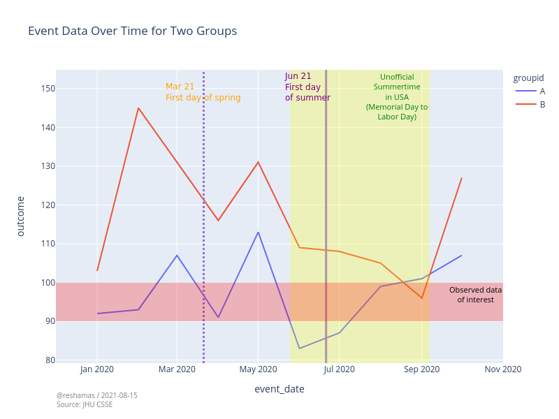

 

## Enriching Data Visualizations with Annotations in Plotly using Python

With the advances in programming and computing, data scientists can now do state-of-the-art visualizations without requiring in-depth knowledge of D3 or Javascript. We can accomplish this using the python library plotly!

Read the  full article here:  
[Enriching Data Visualizations with Annotations in Plotly using Python](https://medium.com/nerd-for-tech/enriching-data-visualizations-with-annotations-in-plotly-using-python-6127ff6e0f80)
