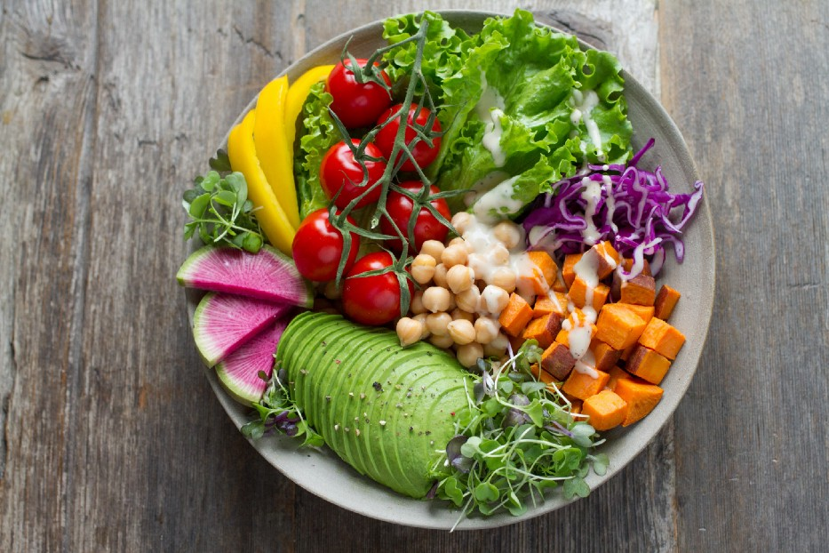

<figure>
  
 <figcaption>
 Photo credit: <a href="https://unsplash.com/@annapelzer">Anna Pelzer on Unsplash</a>
 </figcaption>
</figure>

## Deploying A Deep Learning Model on Mobile Using TensorFlow and React

This article was co-authored with Nidhin Pattaniyil.

We cover how to build a cross-platform mobile app (for both iOS and Android) using React Native and TensorFlowJS React Native adaptor.

As mobile phones have become more accessible, consequently, mobile use has been increasing. Users are utilizing mobile devices over desktop more frequently, and apps on mobile are in high demand. These internet-connected devices provide an opportunity to bring the inference models closer to the user.

### Outline
- About the Data: Food-101
- PART 1: Training an Image Classifier Using TensorFlow
- PART 2: Converting the Model
- PART 3: Considerations for Inference: Running on Server vs. Client
- PART 4: Deploying the Web App
- PART 5: Deploying the Mobile App

Read the  full article here:  
[Deploying A Deep Learning Model on Mobile Using TensorFlow and React](https://medium.com/towards-data-science/deploying-a-deep-learning-model-on-mobile-using-tensorflow-and-react-4b594fe04ab)
