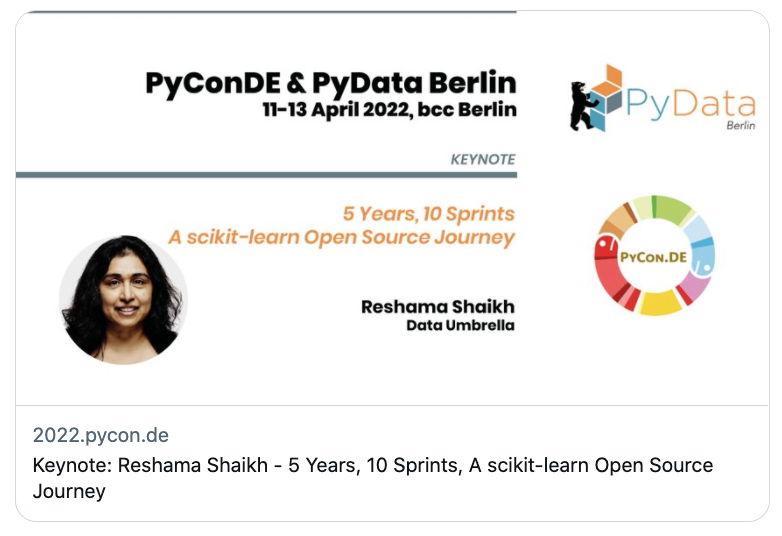

<figure>
  
 <figcaption>
 Image credit: <a href="https://reshamas.github.io">PyCon DE and PyData Berlin</a>
 </figcaption>
</figure>

## Video
<iframe width="560" height="315" src="https://www.youtube.com/embed/ZUqJaCWPvmk" title="YouTube video player" frameborder="0" allow="accelerometer; autoplay; clipboard-write; encrypted-media; gyroscope; picture-in-picture" allowfullscreen></iframe>

## About

We all use open source tools in various capacities, yet knowing how to contribute to open source is not as well known or accessible. The limited knowledge and education surrounding contributing to open source could be one explanation of the low participation rates by underrepresented persons in open source. Open source sprints are hands-on "workshops" or "hackathons" where contributors collaborate to resolve coding and documentation issues posted on a GitHub repository.

Reshama shares how she organized her first open source sprint in 2017, which was in-person and held in New York City. Over the next 5 years, she organized in-person sprints from San Francisco, USA to Nairobi, Kenya, as well as pivoting to online sprints due to the global pandemic. In this keynote, Reshama shares highlights, challenges and lessons learned from the [sprints](https://www.dataumbrella.org/sprints).

PyConDE Blog: [Keynote: Reshama Shaikh - 5 Years, 10 Sprints, A scikit-learn Open Source Journey](https://2022.pycon.de/blog/keynote-2-reshama-shaikh/)

## About Reshama Shaikh
Reshama is a statistician/data scientist based in New York City. She earned her M.S. in statistics from Rutgers University. She earned her M.B.A. from NYU Stern School of Business where she studied strategy, business analytics and technology management.

Reshama Shaikh is the Director of Data Umbrella. She is also on the Contributing Teams for scikit-learn and PyMC.

## Connecting
- LinkedIn: [@reshamas](https://www.linkedin.com/in/reshamas/)
- Twitter: [@reshamas](https://twitter.com/reshamas)
- GitHub: [@reshamas](https://github.com/reshamas)
- Medium: [@reshamas](https://medium.com/@reshamas) 
- Join the Data Umbrella [Meetup Group](https://www.meetup.com/data-umbrella/)

<iframe src="https://docs.google.com/presentation/d/e/2PACX-1vSc293BLAC9SUrlYV2famYyXREOdz2uHMmUF3KNXTLenVj1gDllxf5wRlVFwI-l8MIzttP6T9_GZu1f/embed?start=false&loop=false&delayms=3000" frameborder="0" width="960" height="569" allowfullscreen="true" mozallowfullscreen="true" webkitallowfullscreen="true"></iframe>

### Keynote Day

<blockquote class="twitter-tweet">
<a href="https://twitter.com/hashtag/PyConDE?src=hash&amp;ref_src=twsrc%5Etfw">#PyConDE</a> <a href="https://twitter.com/hashtag/PyDataBerlin?src=hash&amp;ref_src=twsrc%5Etfw">#PyDataBerlin</a>  I will be delivering my keynote &quot;5 Years, 10 Sprints, a <a href="https://twitter.com/scikit_learn?ref_src=twsrc%5Etfw">@scikit_learn</a> Open Source Journey&quot; 🗓️ Tuesday, Apr 12, 2022 🕙 10:30-11:15 am ET (16:30 Berlin)<a href="https://twitter.com/hashtag/opensource?src=hash&amp;ref_src=twsrc%5Etfw">#opensource</a> <a href="https://twitter.com/hashtag/MachineLearning?src=hash&amp;ref_src=twsrc%5Etfw">#MachineLearning</a> You can still purchase tickets for *online* here:<a href="https://t.co/dzqekTRc9o">https://t.co/dzqekTRc9o</a>
&mdash; Reshama Shaikh (@reshamas) <a href="https://twitter.com/reshamas/status/1513501454606209028?ref_src=twsrc%5Etfw">April 11, 2022</a></blockquote> 

### Keynote Announcement

<blockquote class="twitter-tweet">
We are proud to announce <a href="https://twitter.com/reshamas?ref_src=twsrc%5Etfw">@reshamas</a> as keynote speaker for the conference 🥳<a href="https://twitter.com/scikit_learn?ref_src=twsrc%5Etfw">@scikit_learn</a> <a href="https://twitter.com/DataUmbrella?ref_src=twsrc%5Etfw">@DataUmbrella</a> <a href="https://t.co/OnAKESqqX7">https://t.co/OnAKESqqX7</a>
&mdash; PyConDE &amp; PyData Berlin (@PyConDE) <a href="https://twitter.com/PyConDE/status/1508409170457944068?ref_src=twsrc%5Etfw">March 28, 2022</a></blockquote> 

