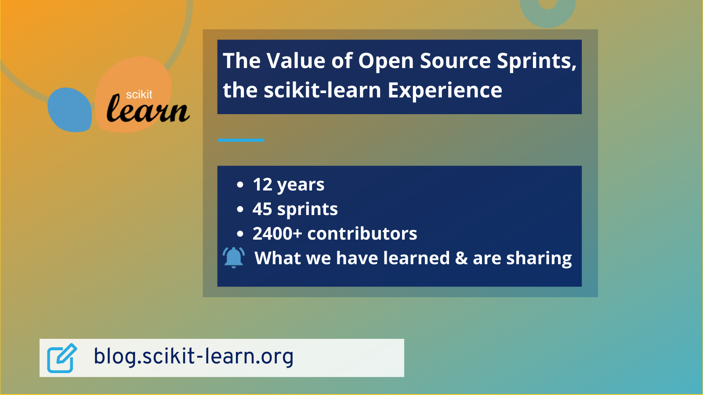

<figure>
  
 <figcaption>
 Image credit: <a href="https://blog.scikit-learn.org/events/sprints-value/">The Value of Open Source Sprints: the scikit-learn Experience</a>
 </figcaption>
</figure>

## Top Line Summary

Sprints are **working sessions to contribute to an open source library**. The goals and achievements differ between Developer and Community sprints.  The long-term impact of open source sprints, particularly community events, is not easily quantifiable or measurable.  Positive outcomes of sprints have slowly been emerging, and for that reason, to realize the value of open source sprints requires playing the “long game”.

Read the full article on the scikit-learn blog: [The Value of Open Source Sprints: the scikit-learn Experience](https://blog.scikit-learn.org/events/sprints-value/)

## About Reshama Shaikh
Reshama is a statistician/data scientist based in New York City. She earned her M.S. in statistics from Rutgers University. She earned her M.B.A. from NYU Stern School of Business where she studied strategy, business analytics and technology management.

Reshama Shaikh is the Director of Data Umbrella. She is also on the contributing teams for scikit-learn and PyMC.

## Connecting
- LinkedIn: [@reshamas](https://www.linkedin.com/in/reshamas/)
- YouTube: [@reshamas](https://youtube.com/@reshamas)
- GitHub: [@reshamas](https://github.com/reshamas)
- Medium: [@reshamas](https://medium.com/@reshamas) 
- Join the Data Umbrella [Meetup Group](https://www.meetup.com/data-umbrella/)
