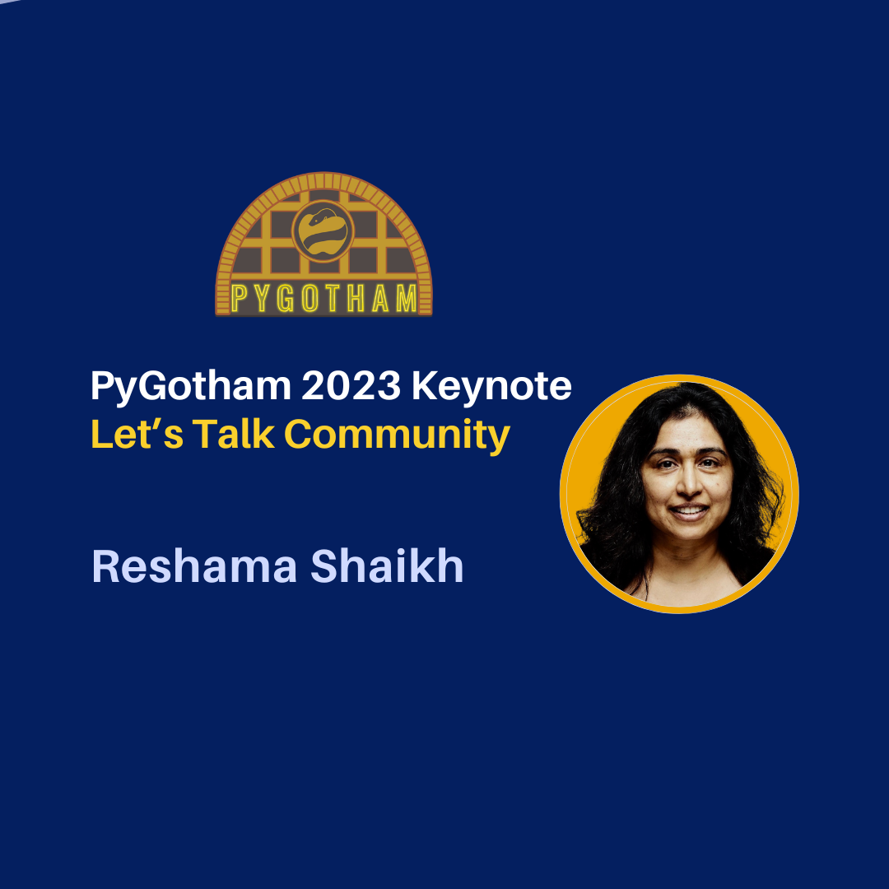

<figure>
  
 <figcaption>
 Image credit: <a href="https://reshamas.github.io">PyGotham 2023 Keynote on Community</a>
 </figcaption>
</figure>

## Video
<iframe width="560" height="315" src="https://www.youtube.com/embed/kmS2MRLicKc" title="Shaikh: PyGotham 2023 Keynote" frameborder="0" allow="accelerometer; autoplay; clipboard-write; encrypted-media; gyroscope; picture-in-picture" allowfullscreen></iframe>

 

Reshama Shaikh was invited to be a keynote speaker at [PyGotham 2023](https://2023.pygotham.tv/talks/a-look-at-the-community-life-cycle-in-the-open-source-space/). 

## About

In 2023, the US Surgeon General issued a report on the [Our Epidemic of Loneliness & Isolation: Healing Effects of Social Connection and Community](https://www.hhs.gov/sites/default/files/surgeon-general-social-connection-advisory.pdf). In this talk, we examine the importance of community and the experiences of a few community organizers in the open source space. We explore getting started, staying involved and leaving communities.

Reshama talks about Python and open source communities: the good parts (motivations of joining and contributing), and the bad (things that cause people to leave). She shared examples of communities that did great work but are now no longer operating.

## Community Chats
- [Videos](https://www.youtube.com/playlist?list=PLBKcU7Ik-ir80szrIxzhEsHzQl-18QNHv) of community chats with Beryl Kanali, Mariatta Wijaya, Yanina Bellini Saibene
- Transcript chat with [Beryl Kanali](https://blog.dataumbrella.org/beryl-community)
- Transcript chat with [Mariatta Wijaya](https://blog.dataumbrella.org/mariatta-community)
- Transcript chat with [Yanina Bellini Saibene](https://blog.dataumbrella.org/yanina-community)

<iframe width="560" height="315" src="https://www.youtube.com/embed/WOVSA9yrd0g" title="YouTube video player" frameborder="0" allow="accelerometer; autoplay; clipboard-write; encrypted-media; gyroscope; picture-in-picture" allowfullscreen></iframe>

 
<iframe width="560" height="315" src="https://www.youtube.com/embed/L2vIaurMrGA" title="YouTube video player" frameborder="0" allow="accelerometer; autoplay; clipboard-write; encrypted-media; gyroscope; picture-in-picture" allowfullscreen></iframe>

 
<iframe width="560" height="315" src="https://www.youtube.com/embed/oDXp6GIScOI" title="YouTube video player" frameborder="0" allow="accelerometer; autoplay; clipboard-write; encrypted-media; gyroscope; picture-in-picture" allowfullscreen></iframe>

 

## About Reshama Shaikh
Reshama is a statistician/data scientist based in New York City. She earned her M.S. in statistics from Rutgers University. She earned her M.B.A. from NYU Stern School of Business where she studied strategy, business analytics and technology management.

Reshama Shaikh is the Director of Data Umbrella. She is also on the contributing teams for scikit-learn and PyMC.

## Connecting
- LinkedIn: [@reshamas](https://www.linkedin.com/in/reshamas/)
- YouTube: [@reshamas](https://youtube.com/@reshamas)
- GitHub: [@reshamas](https://github.com/reshamas)
- Medium: [@reshamas](https://medium.com/@reshamas) 
- Join the Data Umbrella [Meetup Group](https://www.meetup.com/data-umbrella/)
