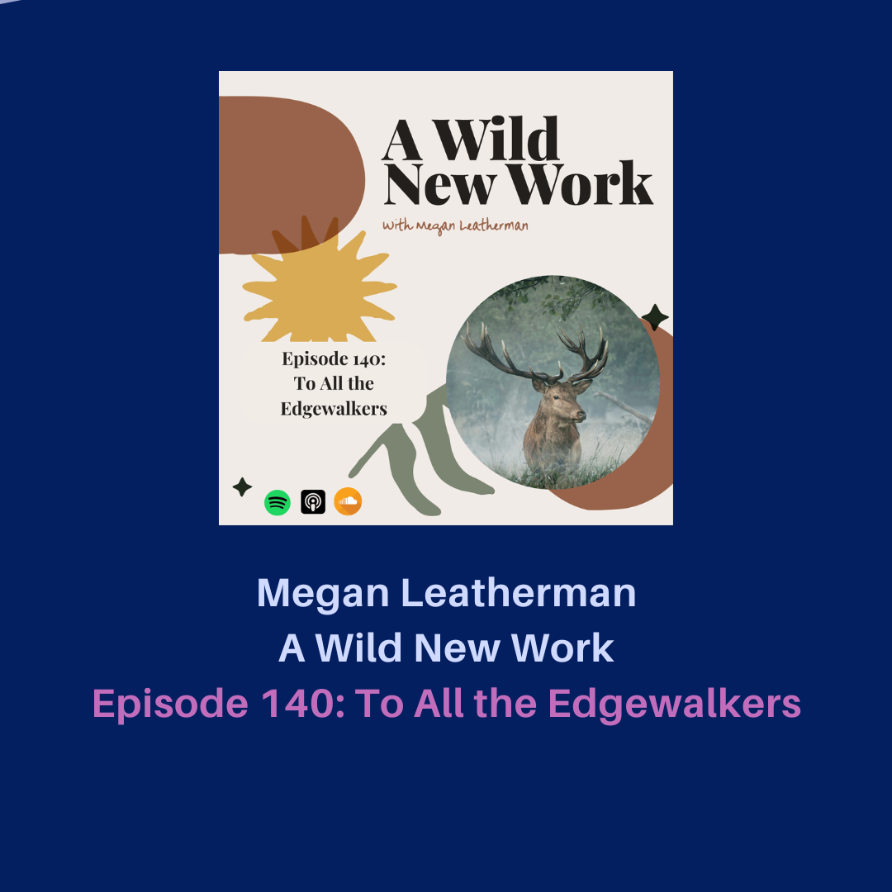

<figure>
  
 <figcaption>
 Image credit: <a href="https://awildnewwork.com/">Megan Leatherman</a>
 </figcaption>
</figure>

## Background
I wanted to share an excerpt from one of my favorite podcast hosts, Megan Leatherman. The words in the episode [To All the Edgewalkers](https://podcasts.apple.com/us/podcast/140-to-all-the-edgewalkers/id1437555777?i=1000693455840) really resonated with me and are inspiring.

## Podcast
<iframe width="100%" height="166" scrolling="no" frameborder="no" allow="autoplay" src="https://w.soundcloud.com/player/?url=https%3A//api.soundcloud.com/tracks/2036039600&color=8e7361"></iframe>
<a href="https://soundcloud.com/user-979951385" title="A Wild New Work" target="_blank" style="color: #cccccc; text-decoration: none;">A Wild New Work</a> · <a href="https://soundcloud.com/user-979951385/140-to-all-the-edgewalkers" title="140. To All the Edgewalkers" target="_blank" style="color: #cccccc; text-decoration: none;">140. To All the Edgewalkers</a>

### Podcast Details
* Show: A Wild New Work
* Host: Megan Leatherman
* Podcast episode website: [To All the Edgewalkers](https://awildnewwork.com/blog/2025/to-all-the-edgewalkers)
* Date: 2025-02-17
* [Episode 140: To all the edgewalkers](https://podcasts.apple.com/us/podcast/140-to-all-the-edgewalkers/id1437555777?i=1000693455840)
* Timestamp: 18:00

## Transcript

So much support right here in the little web, the little ecological niche that we're in. But we have to invite in that help. We have to invite our ancestors in and we have to be clear about the help that we're asking for. As edgewalkers, especially in these times, it is our mandate to live each day holding the threads of both worlds at once. 

Living with the awareness that we are part of a vast web that is mysterious, that cannot fully be known, that has implications in our day-to-day, mundane, material life, as well as in our spirit, dreamtime, other world life. We are here in precious bodies and we are also spirit and those two things cannot be separated. 

We are invited to remember that our choices have ripple effects that we cannot always see and that this life is worth living to its fullest edge, that these edges are gifts. We're meant to meet new edges and grow and change. 

**And a lot of us have bought into this idea that nothing really matters** or that, you know, even if we're like spiritual or we identify as spiritual, we sort of live under this haze like our, **this belief that our words don't really have consequences or that promises can be broken or that relationships can be sort of set aside or don't really matter.** 

And I think in previous times throughout human history, of course, there can be a lot of like unhelpful superstition or things that just get kind of wild. **But among our indigenous ancestors, let's say like my indigenous ancestors in Europe, I think there was a much deeper profound level of etiquette and support and awareness that the choices we made mattered.** 

The way we approached each thing in our day to day life mattered. **The words that we spoke mattered that these things have echoes in this world and in the next.**

And sometimes as I'm doing my own ancestralization work, I'm realizing this more and more and it has given me a new perspective just on how I spend my time and my life. I talked about in a newsletter recently that between M-Bulk on February 1st and the Spring Equinox, I decided not to watch TV by myself. Like I was just in a really not helpful pattern of watching a lot of TV at night. I was so tired. ....

